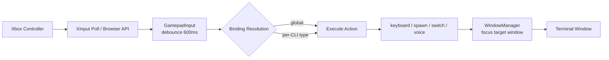
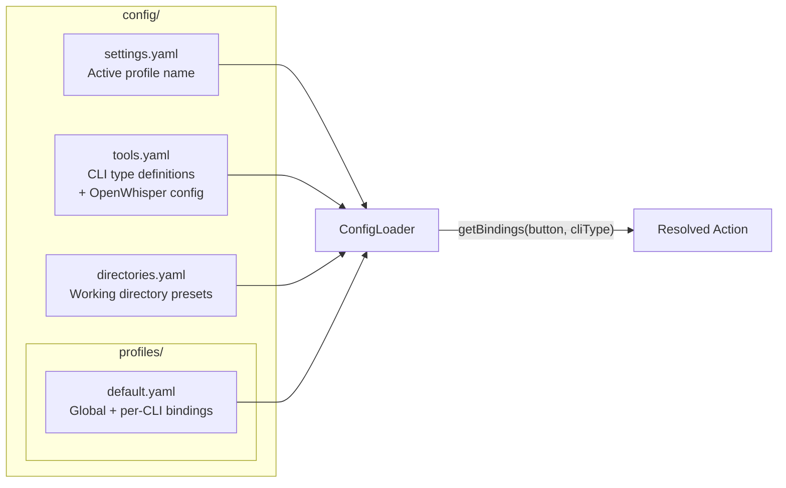

# gamepad-cli-hub — Copilot Instructions

## Project Purpose

A DIY Xbox controller → CLI session manager. Controls multiple CLI instances (Claude Code, Copilot CLI, etc.) from a single game controller. Built as an Electron 41 desktop app on Windows.

The controller acts as a universal remote: switch between terminal windows, spawn new CLI sessions, send keystrokes, and trigger voice input — all without touching the keyboard.

---

## System Overview

```mermaid
graph TB
    subgraph Hardware
        XC[Xbox Controller<br/>USB/Bluetooth]
    end

    subgraph "Electron App"
        subgraph "Renderer Process"
            UI[UI Screens<br/>Sessions / Settings / Status]
            BGA[Browser Gamepad API<br/>Bluetooth controllers]
        end

        subgraph "Main Process"
            IPC[IPC Handlers<br/>gamepad, session, config,<br/>profile, tools, window,<br/>spawn, keyboard, app, system]
            GI[GamepadInput<br/>XInput via PowerShell<br/>600ms debounce]
            SM[SessionManager<br/>EventEmitter pattern]
            PS[ProcessSpawner<br/>Detached CLI processes]
            KS[KeyboardSimulator<br/>@jitsi/robotjs]
            WM[WindowManager<br/>Win32 via PowerShell]
            CL[ConfigLoader<br/>Split YAML + CRUD]
            OW[OpenWhisper<br/>whisper.cpp transcription]
        end

        UI <-->|contextBridge<br/>preload.ts| IPC
        BGA -->|gamepad:event| IPC
    end

    XC --> GI
    XC --> BGA
    GI -->|button-press events| IPC
    IPC --> SM
    IPC --> PS
    IPC --> KS
    IPC --> WM
    IPC --> CL
    IPC --> OW
    SM --> WM
    PS --> SM
    KS --> TW
    WM --> TW

    subgraph "External"
        TW[Terminal Windows<br/>Claude Code / Copilot CLI / etc.]
    end
```

### Data Flow Pipeline



**Detailed flow:**
1. PowerShell polls XInput at 16ms intervals (or Browser Gamepad API for BT)
2. `GamepadInput.processEvent()` parses JSON events, applies 600ms debounce
3. Emits `button-press` event to subscribers
4. Binding resolution: check global bindings first, then per-CLI-type bindings for A/B/X/Y
5. Execute resolved action (keyboard, spawn, session-switch, voice, etc.)
6. WindowManager ensures correct terminal window is focused

---

## Key Controls

| Input | Action |
|-------|--------|
| D-Pad Up/Down | Switch between active CLI sessions |
| Left Stick | D-pad replacement (same actions as D-pad) |
| Left/Right Bumper | Switch sessions (previous/next) |
| Left Trigger | Spawn new Claude Code instance |
| Right Trigger | Spawn new Copilot CLI instance |
| A | Clear screen (per CLI type) |
| B | OpenWhisper voice input or Escape (per CLI type) |
| X/Y | Custom commands per CLI type |
| Back/Start | Switch profile (previous/next) |
| Guide | Bring hub window to foreground |

---

## Module Reference

| Module | File | Responsibility |
|--------|------|---------------|
| **GamepadInput** | `src/input/gamepad.ts` | XInput polling via PowerShell P/Invoke to xinput1_4.dll. Detects A/B/X/Y, D-Pad, bumpers, triggers, sticks. 600ms debounce per button. Emits `button-press` and `connection-change` events. |
| **KeyboardSimulator** | `src/output/keyboard.ts` | Wraps @jitsi/robotjs. Supports `sendKey()`, `sendKeys()`, `sendKeyCombo()`, `longPress()`, `typeString()`. Normalises key aliases. |
| **WindowManager** | `src/output/windows.ts` | Win32 window enumeration/focus via PowerShell. Methods: `enumerateWindows()`, `findWindowsByTitle()`, `focusWindow()`, `findTerminalWindows()`. |
| **SessionManager** | `src/session/manager.ts` | EventEmitter tracking active/inactive sessions. Emits `session:added`, `session:removed`, `session:changed`. Supports `nextSession()`, `previousSession()`. |
| **ProcessSpawner** | `src/session/spawner.ts` | Spawns detached CLI processes from tool config. Tracks by PID. Auto-registers with SessionManager. |
| **ConfigLoader** | `src/config/loader.ts` | Loads split YAML config. Full CRUD for profiles, tools, and directories. Resolves per-CLI vs global bindings. |
| **OpenWhisper** | `src/voice/openwhisper.ts` | Records audio (FFmpeg→WAV 16kHz), calls whisper.exe for transcription, returns text. Fallbacks: FFmpeg→Sox→PowerShell→silent WAV. |
| **IPC Handlers** | `src/electron/ipc/*.ts` | Orchestrator (handlers.ts) + 10 domain handler files with dependency injection. Domains: gamepad, session, config, profile, tools, window, spawn, keyboard, system, app. |
| **Preload** | `src/electron/preload.ts` | Context bridge exposing typed IPC API to renderer. Must be .cjs when package.json has "type":"module". |
| **Renderer** | `renderer/*.ts` | Modular vanilla TypeScript UI. Entry point (main.ts) + state, utils, bindings, navigation, screens (sessions/settings/status), modals (dir-picker/binding-editor). Browser Gamepad API for BT controllers. Gamepad-navigable with D-pad. |
| **XInput Script** | `src/input/xinput-poll.ps1` | External PowerShell XInput P/Invoke polling script. Loaded at runtime by gamepad.ts. |
| **Logger** | `src/utils/logger.ts` | Winston logger with daily file rotation + console. Used across all src/ modules (not in renderer/preload). |
| **CLI Entry** | `src/index.ts` | Standalone CLI orchestrator (GamepadCliHub class). Same binding resolution as Electron mode. |

---

## Configuration System



### Binding Resolution Order
1. Check **CLI-specific** bindings for the active session's CLI type
2. If no match, check **global** bindings
3. This allows the same button to behave differently per CLI type

### Binding Action Types
| Action | Description |
|--------|-------------|
| `keyboard` | Send key sequence to focused window |
| `voice` | Long-press space for voice input |
| `openwhisper` | Record audio → transcribe → type text |
| `session-switch` | Switch active session (next/previous) |
| `spawn` | Spawn new CLI instance |
| `list-sessions` | Show session status |
| `profile-switch` | Switch config profile (next/previous) |

### Settings UI (5 tabs)
Profiles | Global Bindings | Per-CLI Bindings | Tools | Directories

All config supports CRUD via IPC handlers and the Settings UI.

---

## File Structure

```
src/
├── index.ts                    # CLI entry point (GamepadCliHub orchestrator)
├── electron/
│   ├── main.ts                 # Electron main: window creation, IPC setup, lifecycle
│   ├── preload.ts              # Context bridge (renderer ↔ main IPC)
│   └── ipc/
│       ├── handlers.ts         # Orchestrator — imports + wires 10 domain handlers
│       ├── gamepad-handlers.ts
│       ├── session-handlers.ts
│       ├── config-handlers.ts
│       ├── profile-handlers.ts
│       ├── tools-handlers.ts
│       ├── window-handlers.ts
│       ├── spawn-handlers.ts
│       ├── keyboard-handlers.ts
│       ├── system-handlers.ts
│       └── app-handlers.ts
├── input/
│   ├── gamepad.ts              # XInput polling + debounce + event emission
│   └── xinput-poll.ps1         # PowerShell XInput P/Invoke script (external)
├── output/
│   ├── keyboard.ts             # Keystroke simulation (robotjs)
│   └── windows.ts              # Window enumeration/focus (PowerShell Win32)
├── session/
│   ├── manager.ts              # Session tracking (EventEmitter)
│   ├── spawner.ts              # CLI process spawning
│   └── index.ts
├── config/
│   └── loader.ts               # Split YAML config + CRUD operations
├── voice/
│   ├── openwhisper.ts          # Audio recording + whisper.cpp transcription
│   └── index.ts
├── types/
│   └── session.ts              # SessionInfo, SessionChangeEvent types
└── utils/
    ├── logger.ts               # Winston logger (daily rotation, used everywhere)
    └── index.ts

renderer/
├── index.html                  # Main UI template
├── main.ts                     # Entry point — init, wiring, DOMContentLoaded
├── state.ts                    # Shared AppState type + singleton
├── utils.ts                    # DOM helpers, logEvent, showScreen, footer rendering
├── bindings.ts                 # Config cache, binding dispatch (CLI → global fallback)
├── navigation.ts               # Gamepad navigation setup, event routing
├── gamepad.ts                  # Browser Gamepad API wrapper
├── screens/
│   ├── sessions.ts             # Session list, spawn, focus
│   ├── settings.ts             # 5-tab settings (profiles, bindings, tools, dirs)
│   └── status.ts               # Status screen handler
├── modals/
│   ├── dir-picker.ts           # Directory picker modal
│   └── binding-editor.ts       # Binding editor modal
└── styles/
    └── main.css

config/
├── settings.yaml
├── tools.yaml
├── directories.yaml
└── profiles/
    └── default.yaml

tests/
├── gamepad.test.ts             # 30 tests
├── keyboard.test.ts            # 16 tests
├── session.test.ts             # 30 tests
└── config.test.ts              # 47 tests
```

---

## Tech Stack

| Component | Technology |
|-----------|-----------|
| Desktop shell | Electron 41 |
| Language | TypeScript (ESM modules) |
| Bundler | esbuild |
| Test framework | Vitest |
| Gamepad input | PowerShell XInput scripts + Browser Gamepad API |
| Keyboard simulation | @jitsi/robotjs |
| Window management | PowerShell scripts (Win32 API) |
| Voice | OpenWhisper (whisper.cpp) |
| Config format | YAML (`yaml` package) |
| Logging | Winston |

---

## Key Design Decisions

### Dual Gamepad Detection
Two parallel input paths:
1. **PowerShell XInput** — P/Invoke to xinput1_4.dll for wired Xbox controllers
2. **Browser Gamepad API** — Electron renderer's `navigator.getGamepads()` for Bluetooth

Both feed the same event pipeline. See `docs/BT_CONTROLLER_FIX.md` for rationale.

### External Terminal Windows
CLI sessions run in **real terminal windows** (Windows Terminal, cmd, etc.), not embedded. Managed by:
- `spawner.ts` → launch detached processes
- `windows.ts` → enumerate/focus via Win32 APIs
- `keyboard.ts` → send keystrokes to focused window

### IPC Bridge Pattern
Electron context isolation enforced. `preload.ts` exposes typed API via `contextBridge`. IPC handlers are split into 10 domain files (`src/electron/ipc/*-handlers.ts`) with dependency injection — the orchestrator (`handlers.ts`) creates singletons and wires them. Renderer never directly accesses Node.js APIs.

### Split YAML Config & Profiles
Four separate concerns: tools (spawn definitions), directories (workspaces), settings (active profile), and profiles (button bindings). Each profile defines per-CLI-type + global bindings. Full CRUD via IPC + Settings UI.

### Per-CLI Button Bindings
Same button can do different things depending on active CLI type. Global bindings are fallback. D-Pad/bumpers/triggers are typically global; A/B/X/Y are typically per-CLI.

### Debouncing
600ms default in the input layer prevents accidental rapid re-presses. Per-button timestamp tracking.

---

## Build & Test Commands

```bash
npm run build    # Build electron + renderer via esbuild
npm run start    # Build and launch the app
npm test         # Run Vitest test suite
```

---

## Coding Conventions

### Principles
- **DRY, YAGNI, KISS** — no premature abstraction or optimisation
- **TDD** — write tests first, then implement
- **Event-driven** — non-blocking, reactive architecture
- **Composition over inheritance** — use dependency injection
- **Clean separation** — input → processing → output pipeline

### Code Style
- ESM modules throughout (`"type": "module"` in package.json)
- Short methods (<20 lines preferred, 40 hard limit)
- Document **why**, not **how**
- Use mermaid diagrams in documentation

### Testing
- Vitest with behaviour-focused tests (test what, not how)
- Test edge cases implied by the spec
- Never skip broken tests — fix them immediately

---

## When Working on This Project

1. **Run tests before and after changes** — `npm test`
2. **Follow the input → processing → output pipeline** — don't mix concerns
3. **Windows-only** — PowerShell scripts are integral, not optional
4. **Electron security model** — never bypass the preload/IPC bridge
5. **Check config files** before adding hardcoded button mappings or CLI types
6. **Dual-mode operation** — changes should work in both Electron and standalone CLI modes
