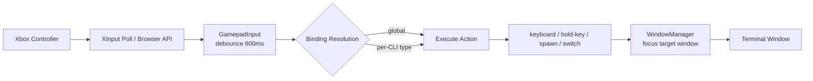
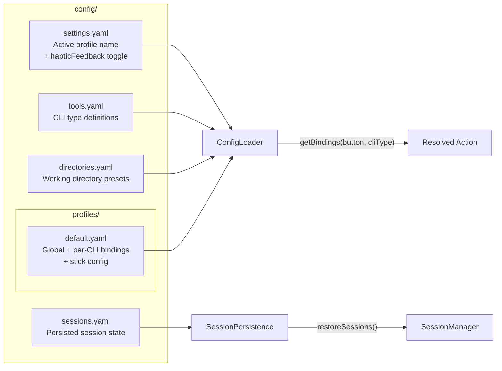

# gamepad-cli-hub — Copilot Instructions

## Project Purpose

A DIY Xbox controller → CLI session manager. Controls multiple CLI instances (Claude Code, Copilot CLI, etc.) from a single game controller. Built as an Electron 41 desktop app on Windows.

The controller acts as a universal remote: switch between terminal windows, spawn new CLI sessions, send keystrokes, and hold keys for voice passthrough — all without touching the keyboard.

---

## System Overview

```mermaid
graph TB
    subgraph Hardware
        XC[Xbox Controller<br/>USB/Bluetooth]
    end

    subgraph "Electron App"
        subgraph "Renderer Process"
            UI[UI Screens<br/>Sessions / Settings / Status]
            HUD[Session Launcher HUD<br/>3-panel session management]
            BGA[Browser Gamepad API<br/>Bluetooth controllers]
        end

        subgraph "Main Process"
            IPC[IPC Handlers<br/>gamepad, session, config,<br/>profile, tools, window,<br/>spawn, keyboard, app, system]
            GI[GamepadInput<br/>XInput via PowerShell<br/>600ms debounce<br/>Buttons + Analog Sticks]
            SM[SessionManager<br/>EventEmitter pattern]
            SP[SessionPersistence<br/>YAML save/load/health check]
            PS[ProcessSpawner<br/>Detached CLI processes]
            KS[KeyboardSimulator<br/>@jitsi/robotjs<br/>+ hold-key support]
            WM[WindowManager<br/>Win32 via PowerShell]
            CL[ConfigLoader<br/>Split YAML + CRUD]
        end

        UI <-->|contextBridge<br/>preload.ts| IPC
        HUD <-->|contextBridge<br/>preload.ts| IPC
        BGA -->|gamepad:event| IPC
    end

    XC --> GI
    XC --> BGA
    GI -->|button-press + analog events| IPC
    IPC --> SM
    IPC --> SP
    IPC --> PS
    IPC --> KS
    IPC --> WM
    IPC --> CL
    SM --> SP
    SM --> WM
    PS --> SM
    KS --> TW
    WM --> TW

    subgraph "External"
        TW[Terminal Windows<br/>Claude Code / Copilot CLI / etc.]
    end
```

### Data Flow Pipeline



**Detailed flow:**
1. PowerShell polls XInput at 16ms intervals (or Browser Gamepad API for BT)
2. `GamepadInput.processEvent()` parses JSON events, applies 600ms debounce
3. Emits `button-press` event to subscribers; analog sticks emit `analog` events
4. Binding resolution: check global bindings first, then per-CLI-type bindings for A/B/X/Y
5. Execute resolved action (keyboard, hold-key, spawn, session-switch, etc.)
6. WindowManager ensures correct terminal window is focused
7. Haptic pulse fires (when enabled) after hold-key activation and session switch

---

## Key Controls

| Input | Action |
|-------|--------|
| Sandwich | Open Session Launcher (switch/spawn/delete sessions) |
| D-Pad / Left Stick | Navigate within Session Launcher panels |
| A (in launcher) | Select / Confirm |
| B (in launcher) | Back / Cancel |
| X (in launcher) | Delete session |
| Y (in launcher) | Refresh |
| A/B/X/Y (outside launcher) | Per-CLI bindings (keyboard shortcuts) |
| Left Stick | D-pad emulation + cursor mode (arrow keys) |
| Right Stick | Scroll mode (PageUp/PageDown), throttled by repeatRate |
| Back/Start | Switch profile (previous/next) |
| Xbox | Bring hub window to foreground |

---

## Module Reference

| Module | File | Responsibility |
|--------|------|---------------|
| **GamepadInput** | `src/input/gamepad.ts` | XInput polling via PowerShell P/Invoke to xinput1_4.dll. Detects A/B/X/Y, D-Pad, bumpers, triggers, sticks. 600ms debounce per button. Emits `button-press`, `connection-change`, and `analog` events. Sends haptic vibration commands. |
| **KeyboardSimulator** | `src/output/keyboard.ts` | Wraps @jitsi/robotjs. Supports `sendKey()`, `sendKeys()`, `sendKeyCombo()`, `longPress()`, `typeString()`, `keyDown()`, `keyUp()`, `comboDown()`, `comboUp()`. Normalises key aliases. Hold-key support via `keyToggle`. |
| **WindowManager** | `src/output/windows.ts` | Win32 window enumeration/focus via PowerShell. Methods: `enumerateWindows()`, `findWindowsByTitle()`, `focusWindow()`, `findTerminalWindows()`. |
| **SessionManager** | `src/session/manager.ts` | EventEmitter tracking active/inactive sessions. Emits `session:added`, `session:removed`, `session:changed`. Supports `nextSession()`, `previousSession()`. Calls `persistSessions()` after every state change. |
| **SessionPersistence** | `src/session/persistence.ts` | `saveSessions()`, `loadSessions()`, `clearPersistedSessions()` to `config/sessions.yaml`. `restoreSessions()` on startup loads saved sessions, skips duplicates. `startHealthCheck(intervalMs)` periodically removes dead PIDs. |
| **ProcessSpawner** | `src/session/spawner.ts` | Spawns detached CLI processes from tool config. Tracks by PID. Auto-registers with SessionManager. Accepts optional `onExit` callback. |
| **ConfigLoader** | `src/config/loader.ts` | Loads split YAML config. Full CRUD for profiles, tools, and directories. Resolves per-CLI vs global bindings. `StickConfig` types (`mode: 'cursor' | 'scroll' | 'disabled'`, `deadzone`, `repeatRate`). `getStickConfig()`, `getHapticFeedback()`, `setHapticFeedback()`. |
| **IPC Handlers** | `src/electron/ipc/*.ts` | Orchestrator (handlers.ts) + 10 domain handler files with dependency injection. Domains: gamepad, session, config, profile, tools, window, spawn, keyboard, system, app. Includes `gamepad:vibrate`, `config:getHapticFeedback`, `config:setHapticFeedback`. |
| **Preload** | `src/electron/preload.ts` | Context bridge exposing typed IPC API to renderer. Must be .cjs when package.json has "type":"module". |
| **Renderer** | `renderer/*.ts` | Modular vanilla TypeScript UI. Entry point (main.ts) + state, utils, bindings, navigation, screens (sessions/settings/status), modals (dir-picker/binding-editor/session-hud). Browser Gamepad API for BT controllers. Session Launcher HUD for unified session management. |
| **Session Launcher HUD** | `renderer/modals/session-hud.ts` | Session Launcher HUD (3-panel). `toggleHud()`, `renderHudSessions()`, `handleHudButton()`. Triggered by Sandwich button from any screen. 3-panel layout: existing sessions (top), CLI types (bottom-left), directories (bottom-right). Navigation state machine: sessions → cli → directory → confirm. A=Select, B=Back, X=Delete, Y=Refresh. Keyboard fallback (arrow keys, Enter, Escape). Auto-dismisses on action; cancel with B or Sandwich. `.hud-overlay` styles with backdrop blur, z-index 1000. |
| **XInput Script** | `src/input/xinput-poll.ps1` | External PowerShell XInput P/Invoke polling script. Emits button + left/right analog stick events (above deadzone 8000). Left stick also emulates D-pad. `XInputSetState` P/Invoke for haptic vibration, reads JSON vibration commands from stdin. |
| **Logger** | `src/utils/logger.ts` | Winston logger with daily file rotation + console. Used across all src/ modules (not in renderer/preload). |
| **CLI Entry** | `src/index.ts` | Standalone CLI orchestrator (GamepadCliHub class). Same binding resolution as Electron mode. Left stick → arrow keys (cursor mode), right stick → PageUp/PageDown (scroll mode), throttled by repeatRate. |

---

## Configuration System



### Binding Resolution Order
1. Check **CLI-specific** bindings for the active session's CLI type
2. If no match, check **global** bindings
3. This allows the same button to behave differently per CLI type

### Binding Action Types
| Action | Description |
|--------|-------------|
| `keyboard` | Send key sequence to focused window |
| `hold-key` | Hold a key combo while button is held. Format: `{ action: 'hold-key', keys: ['space'], delay: 200 }`. Sends key DOWN via robotjs `keyToggle` after delay, releases on button up. The target CLI app handles the held key (e.g. Claude Code listens for Space to start voice input). |
| `session-switch` | Switch active session (next/previous) |
| `spawn` | Spawn new CLI instance |
| `list-sessions` | Show session status |
| `profile-switch` | Switch config profile (next/previous) |

### Stick Configuration (per profile)
```yaml
sticks:
  left:
    mode: cursor    # cursor | scroll | disabled
    deadzone: 8000
    repeatRate: 100
  right:
    mode: scroll
    deadzone: 8000
    repeatRate: 150
```

### Settings UI (5 tabs)
Profiles | Global Bindings | Per-CLI Bindings | Tools | Directories

All config supports CRUD via IPC handlers and the Settings UI.

---

## File Structure

```
src/
├── index.ts                    # CLI entry point (GamepadCliHub orchestrator)
├── electron/
│   ├── main.ts                 # Electron main: window creation, IPC setup, lifecycle
│   ├── preload.ts              # Context bridge (renderer ↔ main IPC)
│   └── ipc/
│       ├── handlers.ts         # Orchestrator — imports + wires 10 domain handlers
│       ├── gamepad-handlers.ts
│       ├── session-handlers.ts
│       ├── config-handlers.ts
│       ├── profile-handlers.ts
│       ├── tools-handlers.ts
│       ├── window-handlers.ts
│       ├── spawn-handlers.ts
│       ├── keyboard-handlers.ts
│       ├── system-handlers.ts
│       └── app-handlers.ts
├── input/
│   ├── gamepad.ts              # XInput polling + debounce + button/analog events + haptic commands
│   └── xinput-poll.ps1         # PowerShell XInput P/Invoke + XInputSetState for haptics
├── output/
│   ├── keyboard.ts             # Keystroke simulation (robotjs) + hold-key support (keyDown/keyUp/comboDown/comboUp)
│   └── windows.ts              # Window enumeration/focus (PowerShell Win32)
├── session/
│   ├── manager.ts              # Session tracking (EventEmitter), calls persistence on changes
│   ├── persistence.ts          # Save/load/clear sessions to config/sessions.yaml + health check
│   ├── spawner.ts              # CLI process spawning (optional onExit callback)
│   └── index.ts
├── config/
│   └── loader.ts               # Split YAML config + CRUD + StickConfig + haptic settings
├── types/
│   └── session.ts              # SessionInfo, SessionChangeEvent, AnalogEvent types
└── utils/
    ├── logger.ts               # Winston logger (daily rotation, used everywhere)
    └── index.ts

renderer/
├── index.html                  # Main UI template
├── main.ts                     # Entry point — init, wiring, DOMContentLoaded
├── state.ts                    # Shared AppState type + singleton
├── utils.ts                    # DOM helpers, logEvent, showScreen, footer rendering
├── bindings.ts                 # Config cache, binding dispatch (CLI → global fallback)
├── navigation.ts               # Gamepad navigation setup, event routing
├── gamepad.ts                  # Browser Gamepad API wrapper
├── screens/
│   ├── sessions.ts             # Session list, spawn, focus
│   ├── settings.ts             # 5-tab settings (profiles, bindings, tools, dirs)
│   └── status.ts               # Status screen handler
├── modals/
│   ├── dir-picker.ts           # Directory picker modal
│   ├── binding-editor.ts       # Binding editor modal
│   └── session-hud.ts          # Session Launcher HUD (3-panel: sessions/cli-types/directories)
└── styles/
    └── main.css

config/
├── settings.yaml               # Active profile + hapticFeedback toggle
├── tools.yaml                  # CLI type definitions (spawn commands)
├── directories.yaml            # Working directory presets
├── sessions.yaml               # Persisted session state (auto-managed)
└── profiles/
    └── default.yaml            # Button bindings + stick config

tests/
├── gamepad.test.ts             # 45 tests (buttons + analog + vibration)
├── keyboard.test.ts            # 16 tests
├── session.test.ts             # 30 tests
├── spawner.test.ts             # 22 tests
├── persistence.test.ts         # 19 tests
├── config.test.ts              # 61 tests (base + stick config + haptic)
└── index.test.ts               # hold-key action tests
```

---

## Tech Stack

| Component | Technology |
|-----------|-----------|
| Desktop shell | Electron 41 |
| Language | TypeScript (ESM modules) |
| Bundler | esbuild |
| Test framework | Vitest |
| Gamepad input | PowerShell XInput scripts + Browser Gamepad API |
| Keyboard simulation | @jitsi/robotjs |
| Window management | PowerShell scripts (Win32 API) |
| Haptic feedback | PowerShell XInputSetState P/Invoke |
| Config format | YAML (`yaml` package) |
| Logging | Winston |

---

## Key Design Decisions

### Dual Gamepad Detection
Two parallel input paths:
1. **PowerShell XInput** — P/Invoke to xinput1_4.dll for wired Xbox controllers
2. **Browser Gamepad API** — Electron renderer's `navigator.getGamepads()` for Bluetooth

Both feed the same event pipeline. See `docs/BT_CONTROLLER_FIX.md` for rationale.

### External Terminal Windows
CLI sessions run in **real terminal windows** (Windows Terminal, cmd, etc.), not embedded. Managed by:
- `spawner.ts` → launch detached processes
- `windows.ts` → enumerate/focus via Win32 APIs
- `keyboard.ts` → send keystrokes to focused window

### Hold-Key Passthrough
Instead of embedding audio processing, the controller holds a configurable key combo (via robotjs `keyToggle`) and lets the target CLI app handle voice natively. Format: `{ action: 'hold-key', keys: ['space'], delay: 200 }`. When the button is held past the delay, the key combo is sent DOWN; released on button up. Zero external dependencies — the controller just holds a key, the CLI does the rest (e.g. Claude Code listens for Space to start voice input).

### Session Persistence
Sessions saved to `config/sessions.yaml` (as YAML) after every add/remove/change. On startup, `restoreSessions()` reloads saved sessions (skips duplicates). `startHealthCheck(intervalMs)` periodically removes dead PIDs via `process.kill(pid, 0)`. Survives app crashes and restarts.

### Session Launcher HUD
Sandwich button opens a unified Session Launcher (`renderer/modals/session-hud.ts`) with 3-panel layout: existing sessions (top), CLI types (bottom-left), directories (bottom-right). Navigation follows a state machine: sessions → cli → directory → confirm. Controls: A=Select, B=Back, X=Delete, Y=Refresh. Keyboard fallback with arrow keys, Enter, Escape. Auto-dismisses on action; cancel with B or Sandwich. D-pad Up/Down and triggers are now free for custom bindings since session management is consolidated here.

### Analog Stick Modes
Left stick emulates D-pad plus cursor-mode arrow keys. Right stick provides scroll mode (PageUp/PageDown). Both configurable per-profile via `StickConfig` (`mode: 'cursor' | 'scroll' | 'disabled'`, `deadzone`, `repeatRate`). XInput PS script emits both left and right stick events when above deadzone (8000).

### Haptic Feedback
`XInputSetState` P/Invoke in xinput-poll.ps1. PowerShell stdin listener reads JSON vibration commands. Methods: `vibrate(leftMotor, rightMotor, durationMs)`, `pulse(durationMs, intensity)`, `doublePulse()`. Enabled/disabled via `hapticFeedback: true/false` in settings.yaml. Fires haptic pulse after hold-key activation and session switch.

### IPC Bridge Pattern
Electron context isolation enforced. `preload.ts` exposes typed API via `contextBridge`. IPC handlers are split into 10 domain files (`src/electron/ipc/*-handlers.ts`) with dependency injection — the orchestrator (`handlers.ts`) creates singletons and wires them. Renderer never directly accesses Node.js APIs.

### Split YAML Config & Profiles
Four separate concerns: tools (spawn definitions), directories (workspaces), settings (active profile), and profiles (button bindings). Each profile defines per-CLI-type + global bindings. Full CRUD via IPC + Settings UI.

### Per-CLI Button Bindings
Same button can do different things depending on active CLI type. Global bindings are fallback. D-Pad Up/Down, bumpers, and triggers are available for custom bindings since session management is consolidated in the Session Launcher. A/B/X/Y are typically per-CLI outside the launcher.

### Debouncing
600ms default in the input layer prevents accidental rapid re-presses. Per-button timestamp tracking.

---

## Build & Test Commands

```bash
npm run build    # Build electron + renderer via esbuild
npm run start    # Build and launch the app
npm test         # Run Vitest test suite
```

---

## Coding Conventions

### Principles
- **DRY, YAGNI, KISS** — no premature abstraction or optimisation
- **TDD** — write tests first, then implement
- **Event-driven** — non-blocking, reactive architecture
- **Composition over inheritance** — use dependency injection
- **Clean separation** — input → processing → output pipeline

### Code Style
- ESM modules throughout (`"type": "module"` in package.json)
- Short methods (<20 lines preferred, 40 hard limit)
- Document **why**, not **how**
- Use mermaid diagrams in documentation

### Testing
- Vitest with behaviour-focused tests (test what, not how)
- Test edge cases implied by the spec
- Never skip broken tests — fix them immediately

---

## When Working on This Project

1. **Run tests before and after changes** — `npm test`
2. **Follow the input → processing → output pipeline** — don't mix concerns
3. **Windows-only** — PowerShell scripts are integral, not optional
4. **Electron security model** — never bypass the preload/IPC bridge
5. **Check config files** before adding hardcoded button mappings or CLI types
6. **Dual-mode operation** — changes should work in both Electron and standalone CLI modes
