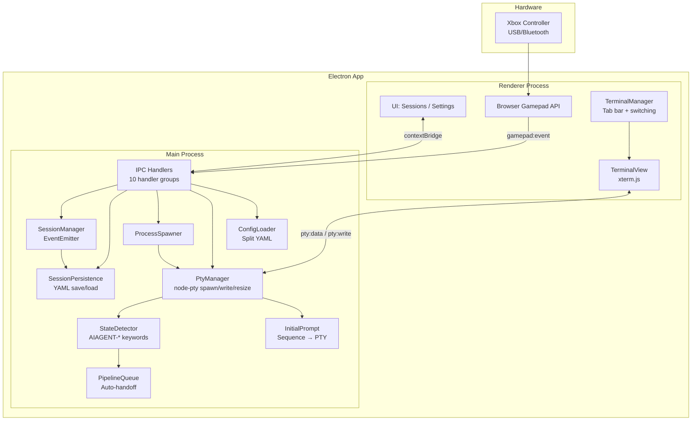
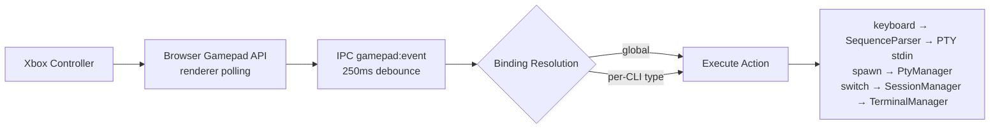
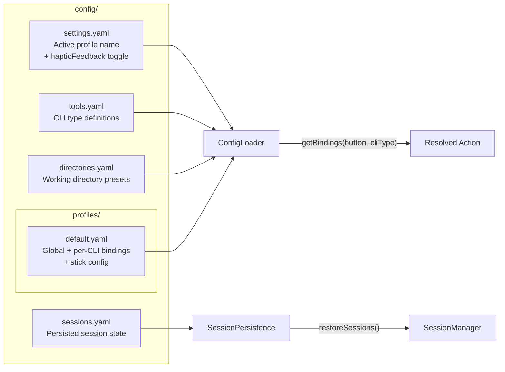

# gamepad-cli-hub — Copilot Instructions

## Project Purpose

DIY Xbox controller → CLI session manager. Control multiple AI coding CLIs (Claude Code, Copilot CLI, etc.) from a single game controller. Embedded terminals via node-pty + xterm.js — no external windows. Built as an Electron 41 desktop app on Windows.

---

## System Overview



### Data Flow Pipeline



**Detailed flow:**
1. Browser Gamepad API polls at 16ms in the renderer process
2. Button presses debounced at 250ms, sent via IPC `gamepad:event`
3. Emits `button-press` event to subscribers; analog sticks emit virtual button events
4. Binding resolution: check global bindings first, then per-CLI-type bindings
5. Execute resolved action (keyboard sequence → PTY stdin, spawn → PTY, session-switch, etc.)
6. Analog sticks: explicit binding found → execute action; no binding → fall back to stick mode (left=cursor arrows via PTY, right=scroll terminal buffer)
7. D-pad / left stick navigates sessions and auto-selects the terminal
8. Keyboard input always routes to the active terminal (PTY stdin)

---

## Key Controls

| Input | Action |
|-------|--------|
| D-Pad Up/Down | Switch sessions (auto-selects terminal) |
| Left Stick | Same as D-pad |
| Right Stick | Scroll terminal buffer |
| A | Activate spawn action / configurable per-CLI binding |
| B | Back to sessions zone / configurable per-CLI binding |
| X | Close terminal |
| Y | Configurable per-CLI binding |
| Left Trigger | Spawn Claude Code |
| Right Bumper | Spawn Copilot CLI |
| Back/Start | Switch profile (previous/next) |
| Sandwich/Guide | Focus hub window + show sessions screen |
| Ctrl+Tab | Next terminal tab |
| Ctrl+Shift+Tab | Previous terminal tab |

---

## Module Reference

| Module | File | Responsibility |
|--------|------|---------------|
| **BrowserGamepad** | `renderer/gamepad.ts` | Browser Gamepad API polling (250ms debounce), button-press events via IPC, analog stick events. Sole gamepad input source — works with both USB and Bluetooth Xbox controllers. |
| **SequenceParser** | `src/input/sequence-parser.ts` | Parses sequence format strings (`{Enter}`, `{Ctrl+C}`, `{Wait 500}`, `{Mod Down/Up}`, `{{`/`}}` escapes, plain text) into typed SequenceAction arrays. Used by both button bindings and initial prompts. |
| **SessionManager** | `src/session/manager.ts` | EventEmitter tracking active/inactive sessions. Emits `session:added`, `session:removed`, `session:changed`. Supports `nextSession()`, `previousSession()`. Calls `persistSessions()` after every state change. |
| **SessionPersistence** | `src/session/persistence.ts` | `saveSessions()`, `loadSessions()`, `clearPersistedSessions()` to `config/sessions.yaml`. `restoreSessions()` on startup loads saved sessions, skips duplicates. `startHealthCheck(intervalMs)` periodically removes dead PIDs. |
| **ProcessSpawner** | `src/session/spawner.ts` | Spawn detached CLI processes from config, register with SessionManager. Accepts optional `onExit` callback. |
| **PtyManager** | `src/session/pty-manager.ts` | PTY process lifecycle — spawn via node-pty (cmd.exe on Windows, bash on Unix), write to stdin, resize, kill. One PTY per embedded terminal session. |
| **StateDetector** | `src/session/state-detector.ts` | Scans PTY output for AIAGENT-* keywords to detect CLI state (waiting, implementing, etc.). |
| **PipelineQueue** | `src/session/pipeline-queue.ts` | Auto-handoff queue — routes tasks to waiting sessions based on state detection. |
| **InitialPrompt** | `src/session/initial-prompt.ts` | Per-CLI prompt pre-loading — converts sequence parser syntax to PTY escape codes, sends to newly spawned PTY after configurable delay. |
| **ConfigLoader** | `src/config/loader.ts` | Split YAML config loading + profile/tools/directory CRUD. `StickConfig` types, `StickVirtualButton`, `getStickConfig()`, `getStickDirectionBinding()`, `getHapticFeedback()`, `setHapticFeedback()`, `SidebarPrefs`, `getSidebarPrefs()`, `setSidebarPrefs()`. |
| **IPC Handlers** | `src/electron/ipc/*.ts` | Orchestrator + 10 domain handler files (session, config, profile, tools, window, spawn, keyboard, pty, system, app). Dependencies injected via function parameters. |
| **Preload** | `src/electron/preload.ts` | Context bridge exposing typed IPC API to renderer. Must be .cjs when package.json has "type":"module". |
| **Renderer** | `renderer/*.ts` | Modular vanilla TypeScript UI. Entry point (main.ts) + state, utils (includes `toDirection()` for directional button normalization), bindings (PTY-aware routing), navigation, screens (sessions/settings), modals (dir-picker/binding-editor). Browser Gamepad API. Session list shows embedded terminals only. D-pad navigation auto-selects terminals. |
| **TerminalView** | `renderer/terminal/terminal-view.ts` | xterm.js wrapper — one Terminal instance per session with fit/search/weblinks addons. Forwards user input + resize events via callbacks. |
| **TerminalManager** | `renderer/terminal/terminal-manager.ts` | Multi-terminal orchestrator — create, switch, resize, PTY IPC data routing, cleanup. Renders horizontal tab bar with colored state dots (green=implementing, orange=waiting, blue=planning, grey=idle). Exposes onSwitch/onEmpty callbacks. |
| ⚠️ **KeyboardSimulator** | `src/output/keyboard.ts` | **DEPRECATED** — robotjs keystroke simulation. Legacy fallback only; not used in PTY-based architecture. |
| ⚠️ **WindowManager** | `src/output/windows.ts` | **DEPRECATED** — Win32 window enumeration/focus via PowerShell. No longer used (all terminals are embedded). |
| **Logger** | `src/utils/logger.ts` | Winston logger with daily rotation. Used across all src/ modules. |

---

## Configuration System



### Binding Resolution Order
1. Check **CLI-specific** bindings for the active session's CLI type
2. If no match, check **global** bindings
3. This allows the same button to behave differently per CLI type

### Binding Action Types
| Action | Description |
|--------|-------------|
| `keyboard` | Send sequence to PTY stdin. Format: `{ action: 'keyboard', sequence: '{Wait 500}some text{Enter}{Ctrl+C}' }` — sequence parser syntax converted to PTY escape codes. |
| `session-switch` | Switch active session (next/previous) |
| `spawn` | Spawn new CLI instance |
| `list-sessions` | Show session status |
| `profile-switch` | Switch config profile (next/previous) |
| `close-session` | Close the active terminal session |
| `hub-focus` | Bring hub window to foreground |

### Stick Configuration (per profile)
```yaml
sticks:
  left:
    mode: cursor    # cursor | scroll | disabled
    deadzone: 8000
    repeatRate: 100
  right:
    mode: scroll
    deadzone: 8000
    repeatRate: 150
```

### Settings UI (5 tabs)
Profiles | Global Bindings | Per-CLI Bindings | Tools | Directories | Status

All config supports CRUD via IPC handlers and the Settings UI.

### CLI Type Config (in `tools.yaml`)
```yaml
claude-code:
  name: Claude Code
  command: claude
  args: []
  initialPrompt: ""           # Sequence parser string pre-loaded into PTY after spawn
  initialPromptDelay: 2000    # ms to wait before sending initialPrompt (default 2000 for AI CLIs, 0 for generic)
```

No `terminal` field — all CLIs run as embedded PTY sessions (no external window config).

### Sequence Parser Syntax (used by `sequence` bindings and `initialPrompt`)
| Token | Effect |
|-------|--------|
| Plain text | Sent as literal characters |
| `{Enter}` | Newline / carriage return |
| `{Tab}`, `{Escape}`, `{Delete}`, etc. | Named keys |
| `{Ctrl+C}`, `{Ctrl+Z}`, etc. | Modifier + key combos |
| `{Wait 500}` | Pause N ms (max 30000) |
| `{Ctrl Down}`, `{Ctrl Up}` | Hold/release modifier |
| `{{`, `}}` | Literal `{` and `}` |

---

## File Structure

```
src/
├── electron/
│   ├── main.ts                 # Electron main: window creation, IPC setup, lifecycle
│   ├── preload.ts              # Context bridge (renderer ↔ main IPC)
│   └── ipc/
│       ├── handlers.ts         # Orchestrator — imports + wires 10 domain handlers
│       ├── session-handlers.ts
│       ├── config-handlers.ts
│       ├── profile-handlers.ts
│       ├── tools-handlers.ts
│       ├── window-handlers.ts
│       ├── spawn-handlers.ts
│       ├── keyboard-handlers.ts
│       ├── pty-handlers.ts
│       ├── system-handlers.ts
│       └── app-handlers.ts
├── input/
│   └── sequence-parser.ts      # {Enter}, {Ctrl+C}, {Wait 500}, {Mod Down/Up}, {{/}} — used by bindings + initialPrompt
├── output/
│   ├── keyboard.ts             # ⚠️ DEPRECATED: robotjs keystroke simulation (legacy fallback only)
│   └── windows.ts              # ⚠️ DEPRECATED: Win32 window enumeration/focus (no longer used)
├── session/
│   ├── manager.ts              # Session tracking (EventEmitter), calls persistence on changes
│   ├── persistence.ts          # Save/load/clear sessions to config/sessions.yaml + health check
│   ├── spawner.ts              # CLI process spawning (optional onExit callback)
│   ├── pty-manager.ts          # PTY process management (node-pty: cmd.exe on Windows, bash on Unix)
│   ├── state-detector.ts       # AIAGENT-* keyword scanning for CLI state detection
│   ├── pipeline-queue.ts       # Waiting→implementing auto-handoff queue (FIFO)
│   ├── initial-prompt.ts       # Sequence syntax → PTY escape codes, configurable delay
│   └── index.ts
├── config/
│   └── loader.ts               # Split YAML config + CRUD + StickConfig + haptic settings
├── types/
│   └── session.ts              # SessionInfo, SessionChangeEvent, AnalogEvent types
└── utils/
    ├── logger.ts               # Winston logger (daily rotation, used everywhere)
    └── index.ts

renderer/
├── index.html                  # Main UI template
├── main.ts                     # Entry point — init, wiring, DOMContentLoaded, terminal manager
├── state.ts                    # Shared AppState type + singleton (currentScreen, sessions, activeSessionId, etc.)
├── utils.ts                    # DOM helpers, logEvent, showScreen, toDirection
├── bindings.ts                 # Config cache, binding dispatch (PTY-aware routing, sequence parser)
├── navigation.ts               # Gamepad navigation setup, event routing, terminal focus/scroll
├── gamepad.ts                  # Browser Gamepad API wrapper
├── terminal/
│   ├── terminal-view.ts        # xterm.js wrapper (fit/search/weblinks addons)
│   └── terminal-manager.ts     # Multi-terminal orchestration (create/switch/resize/destroy + tab bar)
├── screens/
│   ├── sessions.ts             # Vertical session cards + spawn grid + dir picker modal
│   ├── sessions-state.ts       # Sessions screen navigation state (sessions/spawn zones)
│   ├── settings.ts             # Slide-over settings (profiles, bindings, tools, dirs, status tab)
│   └── status.ts               # DEPRECATED stub (status merged into settings)
├── modals/
│   ├── dir-picker.ts           # Directory picker modal
│   └── binding-editor.ts       # Binding editor modal
└── styles/
    └── main.css

config/
├── settings.yaml               # Active profile + hapticFeedback toggle
├── tools.yaml                  # CLI type definitions (spawn commands)
├── directories.yaml            # Working directory presets
├── sessions.yaml               # Persisted session state (auto-managed)
└── profiles/
    └── default.yaml            # Button bindings + stick config

tests/
├── config.test.ts              # 80 tests (base + stick config + haptic + virtual buttons)
├── session.test.ts             # 30 tests
├── spawner.test.ts             # 18 tests
├── persistence.test.ts         # 19 tests
├── keyboard.test.ts            # 14 tests
├── windows.test.ts             # 34 tests
├── sessions-screen.test.ts     # Session cards + spawn grid navigation + directional buttons
├── sequence-parser.test.ts     # Sequence format parser tests
├── pty-manager.test.ts         # PTY process management tests
├── terminal-manager.test.ts    # Embedded terminal lifecycle tests
├── bindings-pty.test.ts        # PTY escape helpers + routing tests
├── state-detector.test.ts      # AIAGENT-* keyword detection tests
├── pipeline-queue.test.ts      # Auto-handoff queue tests
├── initial-prompt.test.ts      # Initial prompt delivery tests
├── modal-base.test.ts          # Modal UI base tests
├── utils.test.ts               # Utility function tests
└── ...
```

---

## Tech Stack

| Component | Technology |
|-----------|-----------|
| Desktop shell | Electron 41 |
| Language | TypeScript (ESM) |
| Bundler | esbuild |
| Tests | Vitest |
| Gamepad input | Browser Gamepad API (sole input source) |
| Embedded terminals | node-pty (PTY) + @xterm/xterm (xterm.js) |
| PTY shell | cmd.exe (Windows), bash (Unix) |
| Haptic feedback | Config setting (implementation pending — PowerShell XInput path removed) |
| Config | YAML (yaml package) |
| Logging | Winston |

---

## Key Design Decisions

### Browser Gamepad API Only
Single input path via Chromium's Gamepad API. Works with both USB and Bluetooth Xbox controllers. XInput/PowerShell path was removed for simplicity.

### Embedded Terminals via PTY
CLIs run inside the Electron app using node-pty + xterm.js. No external terminal windows. PTY spawns cmd.exe on Windows, bash on Unix. All keyboard/sequence input routes through PTY stdin.

### D-pad Auto-Selection
D-pad navigation automatically selects and activates the terminal for the focused session. No separate focus/unfocus toggle — keyboard always types into the active terminal, D-pad always navigates sessions.

### Tab Bar with State Dots
Horizontal tab strip above terminal area. Each tab shows session name + colored dot (green=implementing, orange=waiting, blue=planning, grey=idle). Ctrl+Tab / Ctrl+Shift+Tab for keyboard switching, D-pad for gamepad switching.

### Button Pass-Through
Non-navigation buttons (XYAB, bumpers, triggers) return false from session navigation, allowing them to fall through to per-CLI configurable bindings.

### Session Persistence
Sessions saved to `config/sessions.yaml` (as YAML) after every add/remove/change. On startup, `restoreSessions()` reloads saved sessions (skips duplicates). `startHealthCheck(intervalMs)` periodically removes dead PIDs via `process.kill(pid, 0)`. Survives app crashes and restarts.

### Analog Stick Modes
Left stick emulates D-pad plus cursor-mode arrow keys (sent as PTY escape codes). Right stick provides scroll mode (terminal buffer scroll). Both configurable per-profile via `StickConfig` (`mode: 'cursor' | 'scroll' | 'disabled'`, `deadzone`, `repeatRate`). Each stick emits distinct virtual button names (e.g. `LeftStickUp`, `RightStickDown`) that can be bound like physical buttons. If no explicit binding exists, falls back to stick mode.

### Haptic Feedback
Haptic feedback is a config setting (`hapticFeedback: true/false` in settings.yaml) but the PowerShell XInput implementation was removed. The setting remains for future reimplementation.

### IPC Bridge Pattern
Electron context isolation enforced. `preload.ts` exposes typed API via `contextBridge`. IPC handlers are split into 10 domain files (`src/electron/ipc/*-handlers.ts`) with dependency injection — the orchestrator (`handlers.ts`) wires dependencies. Renderer never directly accesses Node.js APIs.

### Split YAML Config & Profiles
Four separate concerns: tools (spawn definitions), directories (workspaces), settings (active profile), and profiles (button bindings). Each profile defines per-CLI-type + global bindings. Full CRUD via IPC + Settings UI.

### Per-CLI Button Bindings
Same button can do different things depending on active CLI type. Global bindings are fallback. A/B/X/Y are typically per-CLI outside navigation.

### Sequence Parser for Input
Instead of direct key simulation, the `keyboard` action uses a sequence parser syntax (`{Enter}`, `{Ctrl+C}`, `{Wait 500}`, plain text) that converts to PTY escape codes. Same syntax used for button `sequence` bindings and `initialPrompt` config.

### Debouncing
250ms default in the input layer prevents accidental rapid re-presses while staying responsive. Per-button timestamp tracking.

### Sidebar Layout
App runs as a 320px frameless always-on-top sidebar (left or right edge). Sessions screen shows vertical session cards (top) and a spawn grid (bottom) with a directory picker modal. Settings is a slide-over panel with status merged as a tab. Sandwich button focuses the hub and returns to the sessions screen.

---

## Build & Test Commands

```bash
npm run build    # esbuild: electron (dist-electron/main.js) + renderer (dist/renderer/main.js)
npm run start    # Build and launch the app
npm test         # Vitest suite
```

**Build notes:**
- Renderer output: `dist/renderer/main.js` (not `renderer/main.js`)
- node-pty is `--external` in the electron esbuild (native addon, not bundled)
- No `--allow-overwrite` flag

---

## Coding Conventions

### Principles
- **DRY, YAGNI, KISS** — no premature abstraction or optimisation
- **TDD** — write tests first, then implement
- **Event-driven** — non-blocking, reactive architecture
- **Composition over inheritance** — use dependency injection
- **Clean separation** — input → processing → output pipeline
- **Document why, not how**

### Code Style
- ESM modules throughout (`"type": "module"` in package.json)
- Short methods (<20 lines preferred, 40 hard limit)
- Use mermaid diagrams in documentation

### Testing
- Vitest with behaviour-focused tests (test what, not how)
- Test edge cases implied by the spec
- Never skip broken tests — fix them immediately

---

## When Working on This Project

1. **Run tests before and after changes** — `npm test`
2. **Follow the input → processing → output pipeline** — don't mix concerns
3. **Windows-primary** — app targets Windows (cmd.exe PTY shell) but avoids Windows-specific hacks where possible
4. **Electron security model** — never bypass the preload/IPC bridge
5. **Check config files** before adding hardcoded button mappings or CLI types
6. **Embedded terminals only** — all CLIs run inside the Electron app via PTY, no external windows
