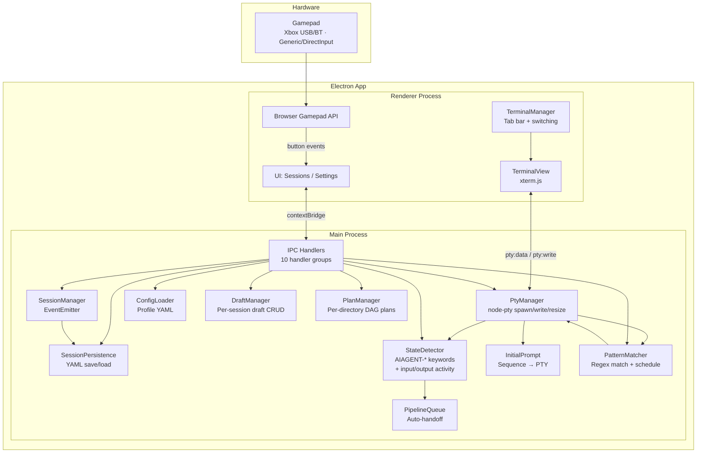

# gamepad-cli-hub

## Mission

DIY Xbox controller → CLI session manager. Control multiple AI coding CLIs (Claude Code, Copilot CLI, etc.) from a single game controller. Embedded terminals via node-pty + xterm.js — no external windows. Built as an Electron 41 desktop app on Windows.

## System Overview



## Data Flow

```
Gamepad (Xbox or generic)
  → Browser Gamepad API (renderer polling, 16ms)
    → IPC gamepad:event → debounce (250ms)
      → Resolve binding (per-CLI type)
        → Execute action (keyboard/voice/spawn/switch/sequence-list)
        → Analog sticks: virtual buttons → explicit binding or stick mode fallback
        → D-pad auto-repeats when held (400ms delay, 120ms rate)

D-pad / Left stick navigates sessions and auto-selects the terminal.
Keyboard input routes to the active terminal (PTY stdin) — blocked when a selection-mode modal overlay is visible (context-menu, close-confirm, sequence-picker, quick-spawn, dir-picker, draft-submenu, plan-screen). Tab/Shift+Tab cycles buttons within selection-mode modals (alongside arrow keys).
Ctrl+V paste routes clipboard text to active PTY (regardless of DOM focus, blocked during modal overlays, draft editor, and plan screen).
Ctrl+G opens external editor (notepad with temp .md file) — on close, content is sent to active PTY via `editor:openExternal` IPC.
```

## Design Decisions

1. **Browser Gamepad API only** — Single input path via Chromium's Gamepad API. Works with Xbox controllers (USB/Bluetooth, standard mapping → buttons 12-15 for D-pad) and generic/DirectInput gamepads (axes-based D-pad detection: dual-axis pairs then hat switch fallback). XInput/PowerShell path was removed for simplicity.
2. **Embedded terminals via PTY** — CLIs run inside the Electron app using node-pty + xterm.js. No external terminal windows. PTY spawns cmd.exe on Windows, bash on Unix. All keyboard/sequence input routes through PTY stdin.
3. **Voice binding OS-default routing** — Voice bindings default to OS-level robotjs simulation. Only route through PTY when `target === 'terminal'` is explicitly set: converts key to terminal escape sequence via `keyToPtyEscape()` → `ptyWrite()`. Falls back to robotjs when no terminal or `target` is not `'terminal'`. Hold mode sends escape sequence once on press (PTY has no key-up). Supports F1-F12 (VT220), navigation keys, combos.
4. **Clipboard paste via PTY** — Document-level Ctrl+V interceptor (`renderer/paste-handler.ts`) reads clipboard and writes to active PTY via `ptyWrite()`, regardless of DOM focus. Blocked when any modal overlay is visible (`.modal-overlay.modal--visible` guard). Solves paste not reaching terminal when gamepad navigation focuses the sidebar.
5. **D-pad auto-selection** — D-pad navigation automatically selects and activates the terminal for the focused session. No separate focus/unfocus toggle — keyboard always types into the active terminal, D-pad always navigates sessions.
6. **Activity dots (not state dots)** — Session cards and overview cards show colored activity dots based on PTY I/O timing: 🟢 active (green `#44cc44` — producing output or receiving user input) · 🔵 inactive (blue `#4488ff` — >10s silence) · ⚪ idle (grey `#555555` — >5min silence). Colors centralized in `renderer/state-colors.ts` via `getActivityColor()`. Input tracking: `pty:write` IPC handler calls `StateDetector.markActive()` — green dot appears immediately on user typing, not just on shell echo. Scroll input routes through `pty:scrollInput` → `StateDetector.markScrolling()` instead, which suppresses keyword scanning for 2s to prevent false AIAGENT state changes from screen redraws. Resize input routes through `pty:resize` → `StateDetector.markResizing()`, which suppresses activity promotion for 1s to prevent false green dots from tab-switch redraws. Terminal switching routes through `pty:markSwitching` → `StateDetector.markResizing()` (called before fit()) to suppress false activity promotion during Ctrl+Tab switching. Session restore uses `StateDetector.markRestored()` with a 3s grace period that prevents shell startup output from promoting restored sessions to green — ensures they start as grey (idle) dots.
7. **IPC bridge pattern** — Electron context isolation enforced. `preload.ts` exposes typed API via `contextBridge`. IPC handlers split into 10 domain files + 1 orchestrator (`handlers.ts`) with dependency injection. Renderer never directly accesses Node.js APIs.
8. **Self-contained profile YAML** — Each profile is a single YAML file containing tools, working directories, bindings, stick config, dpad config, and per-CLI pattern rules. Switching profiles changes everything. Settings stored separately. Auto-migration merges legacy `tools.yaml`/`directories.yaml` into profiles on first load.
9. **Per-CLI bindings** — Same button does different things depending on active CLI type.
10. **Button pass-through** — Non-navigation buttons (XYAB, bumpers, triggers) return false from session navigation, allowing them to fall through to per-CLI configurable bindings.
11. **Debouncing in input layer** — 250ms default prevents accidental rapid re-presses while staying responsive.
12. **Sequence parser for input** — Instead of direct key simulation, the `keyboard` action uses a sequence parser syntax (`{Enter}`, `{Ctrl+C}`, `{Wait 500}`, plain text) that converts to PTY escape codes. Same syntax used for button `sequence` bindings and `initialPrompt` config.
13. **Session persistence & resume** — Sessions saved to `config/sessions.yaml` after every add/remove/change. On startup, `restoreSessions()` reloads saved sessions. Dead processes are cleaned up via PTY exit events (no periodic health check). `cliSessionName` is a UUID v4 mapping 1:1 between hub sessions and CLI-internal sessions. Fresh spawn chain: `spawnCommand` → `command`. Resume chain: `resumeCommand` → `continueCommand` → `command`. Commands use `{cliSessionName}` placeholder, written to shell stdin via `rawCommand` (no escaping).
14. **Hibernate resilience** — Renderer crash recovery via `render-process-gone` auto-reload. Safe because session state lives in `SessionManager` (main process). `setupPowerMonitor()` logs detailed session/PTY diagnostics on suspend/resume/shutdown. All PTY operations wrapped in try-catch — errors logged but PTY processes NOT killed (may still be alive). GPU sandbox disabled. Electron crashReporter enabled.
15. **Desktop window layout** — Maximized desktop window (1280×800 default, 640×400 minimum). Window bounds persist via `getSidebarPrefs()`/`setSidebarPrefs()`. Sessions screen: vertical cards (top) + spawn grid (bottom). Session cards show elapsed timer since last CLI output (`formatElapsed()`, driven by `lastOutputAt` from `pty:activity-change`, refreshed every 10s) and a ⏰ `HH:mm [×]` chip when a `wait-until` pattern schedule is pending for that session (cancellable). Settings: slide-over panel.
16. **Analog stick virtual buttons** — Each stick emits distinct virtual button names (e.g. `LeftStickUp`, `RightStickDown`) bindable like physical buttons. No binding → fall back to stick mode (cursor or scroll). D-pad and sticks auto-repeat when held. Sticks use displacement-proportional rate.
17. **Session groups by working directory** — Sessions grouped by working directory with collapsible headers. Group order + collapse state persist in `settings.yaml`. Navigation uses a flat `navList` of group headers + session cards. Sorting applies within each group. Bookmarked directories (auto-bookmarked when a `cliSessionName` session is removed) persist as visible group headers even with 0 active sessions, showing a "No active sessions" placeholder with a × dismiss button.
18. **Group Overview (session preview grid)** — D-pad Right from a group header opens a scrollable single-column grid showing all sessions in that directory group. Max-height constraint limits visible area to ~5 cards before scrolling. Each card shows session name, terminal title subtitle (when set), activity dot, and last 10 lines of ANSI-stripped PTY output in fixed-height cards. Scrollable via mouse wheel and gamepad scroll bindings. Pre-selects the currently active session on entry. See [docs/group-overview.md](docs/group-overview.md) for full documentation.
19. **Activity-gated Telegram mirror** — `TerminalMirror` buffers PTY output during active periods (green dot) and flushes to Telegram on multiple triggers: activity-change to inactive (blue, >10s silence) or idle (grey, >5min), state-change to idle/completed (immediate + 3s follow-up flush to capture trailing content), question-detected (2s delayed flush), and safety flush at 50KB. Each flush sends a NEW message (no edit-in-place). Content is ANSI-stripped, noise-filtered (spinners, progress bars, AIAGENT tags, CLI hint lines like "esc to cancel"), and HTML-escaped in `<code>` blocks. Truncation keeps head+tail when exceeding 3500 chars. Prompt echo (`📝 text`) sends user input to Telegram on Enter — skips empty/control-only input and Telegram-originated commands (which bypass renderer IPC).
20. **Draft prompts** — Per-session draft memos for composing prompts while a CLI is busy. Drafts are managed by `DraftManager` (EventEmitter, CRUD, emits `draft:changed`), persisted to `config/drafts.yaml` (separate from sessions.yaml), and exposed via 5 IPC channels (`draft:create/update/delete/list/count`). UI: draft strip (horizontal 📝 pills above terminal), slide-down editor panel (title + content), Drafts submenu in context menu (New Draft + per-draft Apply/Edit/Delete), 📝 badge count on session cards, close-confirm warns about unsent drafts. `new-draft` action type opens the editor for the active session. Draft editor has 4 buttons: Save, Apply (send to PTY + delete), Delete, Cancel. Gamepad D-pad Up/Down cycles Title → Content → Save → Apply → Delete → Cancel, A activates, B cancels. Clicking a pill opens the draft editor directly.
21. **Directory Plans** — Per-directory acyclic directed graph of work items with dependency arrows and a 4-state lifecycle: pending (grey `#555` — blocked by dependencies), startable (blue `#4488ff` — all deps done), doing (green `#44cc44` — actively worked on), done (grey + strikethrough). Managed by `PlanManager` (EventEmitter, CRUD, DAG validation via DFS cycle prevention, startable computation). Persisted to `config/plans.yaml` (folder-level, not per-profile). Exposed via 12 IPC channels (`plan:list/create/update/delete/addDep/removeDep/apply/complete/startableForDir/doingForSession/deps/getItem`). UI: SVG canvas overlay inside `#mainArea` with Sugiyama-style left-to-right layered auto-layout, pan/zoom (viewBox-based), quadratic bezier dependency arrows with arrowhead markers, click-to-select nodes, bottom editor panel (title + description + Delete + conditional Done). Entry: 🗺️ Plans button on group headers (column 1, click only). Exit: B button or ← Back. Session cards show plan badges (doing + startable counts). Draft strips show plan chips (generation-counter dedup for async renders; startable click → send description to PTY + transition to doing; doing click → re-send description to PTY without status change).

22. **Vue 3 migration (in progress)** — Renderer migrating from manual DOM manipulation to Vue 3 Composition API + Pinia. Incremental: Vue components coexist with legacy TS modules during transition. Vite builds the renderer (replaces esbuild for renderer only). Key patterns: `reactive()` wraps state singletons (Pinia stores are thin wrappers on top), `useModalStack` composable replaces the 11-deep if-chain, `<Teleport>` for modals, `useNavigation` composable for input routing. xterm.js stays imperative (TerminalManager class). Main process (`src/`) and preload are unchanged.

23. **Pattern Matcher** — `PatternMatcher` (`src/session/pattern-matcher.ts`) scans every PTY stdout chunk against per-CLI regex rules loaded from the profile YAML `patterns` array. Two action types: `send-text` (fires a sequence to PTY immediately) and `wait-until` (parses a scheduled time from the matched capture group via `TimeParser`, then fires `onResume` at that time). Cooldown is tracked per-session per-rule — after a rule fires, it is suppressed for `cooldownMs` ms for that session only, preventing rapid re-triggering. Pending schedules are cancellable via `pattern:cancelSchedule(sessionId)` IPC. Session cards render a ⏰ chip while a schedule is pending. Rule CRUD: `tools:addPattern`, `tools:updatePattern`, `tools:removePattern`, `tools:getPatterns` IPC channels.

24. **Plan Backup & Restore** — Per-directory rolling-window snapshots of plan data, managed by `PlanBackupManager` (EventEmitter, CRUD, rolling window pruning). Snapshots are timestamped JSON files in `config/plan-backups/`. Automatic scheduling on `plan:changed` events with per-directory interval debounce. Configurable via `config/plan-backups.yaml` or Settings → 💾 Backups tab. Restore workflow: plan screen → R key / 💾 Backups button → select snapshot → restore. IPC: 8 channels (`plan:listBackups/getBackupSummary/restoreBackup/deleteBackup/createBackupNow/getBackupConfig/setBackupConfig/deleteAllBackups`). See [docs/plan-backup-restore.md](docs/plan-backup-restore.md).

25. **Config boundary — repo ships defaults only, runtime lives in %APPDATA%/Helm/** — Writable config, logs, and temp files are always resolved to `%APPDATA%/Helm/{config,logs,tmp}` regardless of dev or packaged mode. The repo `config/` directory was removed from git tracking; only seed stubs remain in `src/config/` (settings.yaml, sessions.yaml, drafts.yaml, profiles/default.yaml, scheduled-tasks.yaml). On first launch, `seedConfigIfNeeded` copies these seeds to the user data dir if the target does not yet exist. This prevents dev builds from accidentally writing to the repo working tree and ensures packaged and dev behavior are identical.

    ```mermaid
    graph LR
        subgraph "Repo (read-only)"
            SEED[src/config/ seeds]
        end
        subgraph "User machine (writable)"
            CONF[%APPDATA%/Helm/config]
            LOGS[%APPDATA%/Helm/logs]
            TMP[%APPDATA%/Helm/tmp]
        end
        SEED --"first launch\ncopy if absent"--> CONF
    ```

## Architecture Principles

- DRY, YAGNI, KISS
- TDD — tests first, then implement
- Event-driven, non-blocking
- Composition over inheritance
- Clean separation: input → processing → output
- Document **why**, not **how**

## Build & Test

```bash
npm run build    # Vite: renderer (dist/renderer/) + esbuild: electron (dist-electron/main.js) + preload
npm run start    # Build and launch
npm run package  # Build + package portable Windows EXE to release/
npm test         # Vitest suite
```

### Release Workflow (two-step)

```bash
python prepareDeploy.py patch   # Bump version, strip configs, build, package EXE → release/YYYYMMDD-vX.Y.Z/
# ... validate the EXE manually ...
python sendDeploy.py            # Commit, tag, push, upload installer via gh CLI
```

| Script | Purpose |
|--------|---------|
| `runApp.py` | Dev workflow — install deps, build, launch |
| `runTests.py` | Run Vitest suite |
| `prepareDeploy.py` | Release step 1 — bump version, strip configs for deploy, build, package EXE |
| `sendDeploy.py` | Release step 2 — commit, tag, push, upload installer to GitHub Releases via `gh` CLI |

## Tech Stack

| Component | Technology |
|-----------|-----------|
| Desktop shell | Electron 41 |
| Language | TypeScript (ESM) |
| UI framework | Vue 3 (Composition API) + Pinia stores |
| Bundler | Vite (renderer) + esbuild (electron main/preload) |
| Tests | Vitest + @vue/test-utils |
| Gamepad input | Browser Gamepad API (sole input source) |
| Embedded terminals | node-pty (PTY) + @xterm/xterm (xterm.js) |
| PTY shell | cmd.exe (Windows), bash (Unix) |
| Config | YAML (yaml package) |
| Logging | Winston |

## Reference Documentation

Detailed reference docs are in `docs/`:

| Document | Content |
|----------|---------|
| [docs/modules.md](docs/modules.md) | Module reference table — all modules including Vue stores, composables, and SFC components |
| [docs/config-system.md](docs/config-system.md) | Profile YAML, binding types, sequence parser syntax, stick/dpad config |
| [docs/controls.md](docs/controls.md) | Gamepad button + keyboard mappings, navigation priority chain |
| [docs/terminal-architecture.md](docs/terminal-architecture.md) | PTY stack, input/output routing, activity dots, key modules |
| [docs/build-and-test.md](docs/build-and-test.md) | Build commands, output paths, build notes, tech stack details |
| [docs/file-structure.md](docs/file-structure.md) | Complete directory tree with per-file descriptions |
| [docs/group-overview.md](docs/group-overview.md) | Group overview grid — entry/exit, navigation, live previews, architecture |
| [docs/directory-plans.md](docs/directory-plans.md) | Directory Plans — DAG work items, lifecycle, canvas, layout, badges |

## graphify

This project has a graphify knowledge graph at graphify-out/.

Rules:
- Before answering architecture or codebase questions, read graphify-out/GRAPH_REPORT.md for god nodes and community structure
- If graphify-out/wiki/index.md exists, navigate it instead of reading raw files
- For cross-module "how does X relate to Y" questions, prefer `graphify query "<question>"`, `graphify path "<A>" "<B>"`, or `graphify explain "<concept>"` over grep — these traverse the graph's EXTRACTED + INFERRED edges instead of scanning files
- After modifying code files in this session, run `graphify update .` to keep the graph current (AST-only, no API cost)
