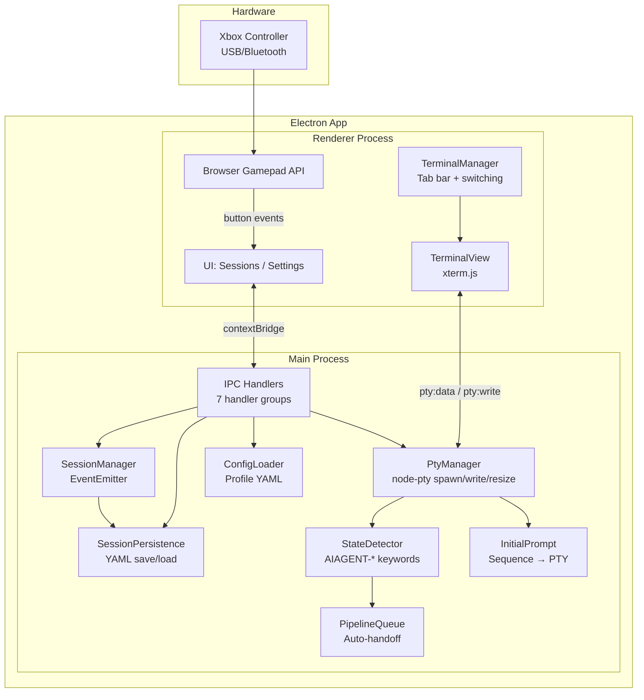

# gamepad-cli-hub

## Mission

DIY Xbox controller → CLI session manager. Control multiple AI coding CLIs (Claude Code, Copilot CLI, etc.) from a single game controller. Embedded terminals via node-pty + xterm.js — no external windows. Built as an Electron 41 desktop app on Windows.

## System Overview



## Data Flow

```
Xbox Controller
  → Browser Gamepad API (renderer polling, 16ms)
    → IPC gamepad:event → debounce (250ms)
      → emit('button-press') / emit('analog') for stick events
        → Resolve binding (per-CLI type)
          → Execute action:
              keyboard       → SequenceParser.parse() → pty:write (escape sequences to PTY stdin)
              voice          → OS-default (robotjs), PTY when target: 'terminal' (see Input Routing below)
              spawn          → pty:spawn IPC → PtyManager.spawn() → SessionManager.addSession()
              switch         → SessionManager.next/previous() → TerminalManager.switchTo()
              sequence-list  → SequencePicker overlay → user picks item → SequenceParser.parse() → pty:write
            → Haptic pulse (when enabled)
        → Analog sticks:
              Each stick emits virtual buttons (LeftStickUp, RightStickDown, etc.)
                → Explicit binding found → execute bound action
                → No binding → fall back to stick mode:
                    left stick  → cursor mode (arrow keys via PTY)
                    right stick → configurable per-CLI bindings (default: scroll)
              D-pad auto-repeats when held (400ms delay, 120ms rate). Sticks repeat proportional to deflection.

D-pad / Left stick navigates sessions and auto-selects the terminal.
Keyboard input always routes to the active terminal (PTY stdin).
Ctrl+V paste routes clipboard text to active PTY (regardless of DOM focus).
```

## Modules

| Module | File | Responsibility |
|--------|------|---------------|
| **BrowserGamepad** | `renderer/gamepad.ts` | Browser Gamepad API polling (250ms debounce), button-press events via IPC, analog stick events, **D-pad and stick auto-repeat engine**. Sole gamepad input source. |
| **SessionManager** | `src/session/manager.ts` | Track sessions, switch active, rename sessions, emit session:added/removed/changed. Calls persistence after every state change. `restoreSessions()` reloads saved sessions at startup (skipping duplicates). `startHealthCheck(30000)` prunes dead PIDs every 30s via `process.kill(pid, 0)`. Both called from `handlers.ts` at startup. |
| **SessionPersistence** | `src/session/persistence.ts` | `saveSessions()`, `loadSessions()`, `clearPersistedSessions()` to `config/sessions.yaml`. File-level I/O used by SessionManager for persist/restore operations. |
| **PtyManager** | `src/session/pty-manager.ts` | PTY process lifecycle — spawn via node-pty (cmd.exe on Windows, bash on Unix), write to stdin, resize, kill. One PTY per embedded terminal session. |
| **StateDetector** | `src/session/state-detector.ts` | Scans PTY output for AIAGENT-* keywords to detect CLI state (implementing, planning, completed, idle). |
| **PipelineQueue** | `src/session/pipeline-queue.ts` | Auto-handoff queue — routes tasks to waiting sessions. Handoff triggers when a session enters completed or idle state. |
| **InitialPrompt** | `src/session/initial-prompt.ts` | Per-CLI prompt pre-loading — converts sequence parser syntax to PTY escape codes, sends to newly spawned PTY after configurable delay. Optional `onComplete` callback fires after all prompt items execute (used by pty-handlers to write context text after prompt finishes). |
| **SequenceParser** | `src/input/sequence-parser.ts` | Parses sequence format strings (`{Enter}`, `{Ctrl+C}`, `{Wait 500}`, `{Mod Down/Up}`, `{{`/`}}` escapes, plain text) into typed SequenceAction arrays. Used by both button bindings and initial prompts. |
| **ConfigLoader** | `src/config/loader.ts` | Self-contained profile YAML loading + profile/tools/directory/bindings CRUD. Auto-migration from legacy `tools.yaml`/`directories.yaml`. `StickConfig` types, `StickVirtualButton`, `getStickConfig()`, `getHapticFeedback()`, `setHapticFeedback()`, `SidebarPrefs`, `getSidebarPrefs()`, `setSidebarPrefs()`, `SessionGroupPrefs`, `getSessionGroupPrefs()`, `setSessionGroupPrefs()`. `ActionType = 'keyboard' \| 'voice' \| 'scroll' \| 'context-menu' \| 'sequence-list'`. `Binding` union includes `ContextMenuBinding`, `SequenceListBinding`. Exports `SequenceListItem { label, sequence }`. `CliTypeConfig` includes optional `handoffCommand` for auto-handoff pipeline, plus optional `renameCommand`, `resumeCommand`, `continueCommand` for session resume. |
| **ElectronMain** | `src/electron/main.ts` | Window creation, IPC setup, app lifecycle. Renderer crash recovery (auto-reloads on `render-process-gone` — safe because session state lives in main process). Delegates power monitoring to `setupPowerMonitor()`. |
| **PowerMonitor** | `src/session/power-monitor.ts` | Logs detailed session/PTY diagnostics on `suspend`/`resume`/`shutdown` via Electron `powerMonitor`. Reports session counts, PTY IDs, and PTY survival status on resume. Called from main.ts with sessionManager + ptyManager. |
| **IPC Handlers** | `src/electron/ipc/*.ts` | Orchestrator + 7 domain handler files (session, config, profile, tools, keyboard, pty, system). `registerIPCHandlers()` returns `{ cleanup, sessionManager, ptyManager }` for use by main.ts callers. Dependencies injected via function parameters. Config handlers include `dialog:openFolder` for native OS folder picker. `pty:spawn` accepts optional `contextText` — written to PTY after the initial prompt completes (via `onComplete` callback) rather than on a fixed timer. `pty:spawn` also accepts optional `resumeSessionName` for `--resume <name>` spawning. System handlers: `system:openLogsFolder`. |
| **Renderer** | `renderer/*.ts` | Modular UI: entry point (main.ts) + state, utils (includes `toDirection()` for directional button normalization, `showFormModal` with `FormField` types: text/select/textarea + `browse?: boolean` for native folder picker), bindings (PTY-aware routing with voice OS-default + PTY opt-in via `target: 'terminal'`, context-menu action centers overlay in gamepad mode, sequence-list action opens picker overlay), paste-handler (Ctrl+V → PTY), navigation, screens (sessions/settings), modals (dir-picker/binding-editor/context-menu/close-confirm/sequence-picker/quick-spawn). Browser Gamepad API. Session list shows embedded terminals only. D-pad navigation auto-selects terminals. |
| **TerminalView** | `renderer/terminal/terminal-view.ts` | xterm.js wrapper — one Terminal instance per session with fit/search/weblinks addons (scrollback: 10,000 lines). Forwards user input + resize events via callbacks. Selection API: `getSelection()`, `hasSelection()`, `clearSelection()`. |
| **TerminalManager** | `renderer/terminal/terminal-manager.ts` | Multi-terminal orchestrator — create, switch, resize, rename, PTY IPC data routing, cleanup. Renders horizontal tab bar with colored state dots (green=implementing, orange=waiting, blue=planning, gold=completed, grey=idle). Exposes onSwitch/onEmpty callbacks. `getActiveView()` returns current TerminalView. `renameSession()` updates the display name persisted across UI reloads. Right-click `contextmenu` listener on terminal area shows context menu overlay. `createTerminal()` accepts optional `contextText` forwarded through `ptySpawn()` to the main process. `writeToTerminal()` runs PTY output through `stripMouseTracking()` before writing to xterm.js. |
| **PtyFilter** | `renderer/terminal/pty-filter.ts` | Strips mouse-tracking ANSI escape sequences (DEC modes 1000–1006, 1015–1016) from PTY output so xterm.js never enters mouse-reporting mode and native text selection always works. |
| **SessionGroups** | `renderer/session-groups.ts` | Pure grouping logic — groups sessions by working directory. Types (`SessionGroup`, `NavItem`, `SessionGroupPrefs`) and functions (`groupSessionsByDirectory`, `buildFlatNavList`, `moveGroupUp/Down`, `toggleCollapse`, `findNavIndexBySessionId`). Group order + collapse state persisted in settings.yaml. |
| **SortLogic** | `renderer/sort-logic.ts` | Pure sort functions for sessions (by state priority + alphabetical) and bindings. No side effects — easy to test. |
| **TabCycling** | `renderer/tab-cycling.ts` | Resolves next/previous terminal for Ctrl+Tab cycling using sorted display order so tab switching matches what the user sees. |
| **SortControl** | `renderer/components/sort-control.ts` | Reusable sort control widget — dropdown for field selection + direction toggle button. |
| **Logger** | `src/utils/logger.ts` | Winston logger with daily rotation. Used across all src/ modules. |
## Config System

```
config/
├── settings.yaml               # Active profile name, hapticFeedback toggle, sidebar prefs, sorting, sessionGroups (order + collapsed)
├── sessions.yaml               # Persisted session state (auto-managed)
└── profiles/
    └── default.yaml            # Self-contained: tools + workingDirectories + bindings + sticks + dpad
```

**Profiles are self-contained** — each profile YAML includes tools (CLI definitions), working directories, button bindings, stick config, and dpad config. Switching profiles changes everything. Profile switch shows a confirmation dialog when terminals are open (keep sessions / close all). `createProfile(name)` creates an empty profile; `createProfile(name, copyFrom)` clones from an existing profile.

**Auto-migration:** On first load, if legacy `config/tools.yaml` and `config/directories.yaml` exist, their contents are merged into all profiles and the old files are deleted.

**Binding resolution:** CLI-specific bindings are used. Each profile defines different button behaviours per CLI type.

**Binding action types:** `keyboard`, `voice`, `scroll`, `context-menu`, `sequence-list`

**keyboard binding:** `{ action: 'keyboard', sequence: '{Wait 500}some text{Enter}{Ctrl+C}' }` — sequence parser syntax string sent to PTY stdin as escape codes. The sequence format is the only input mode for keyboard bindings.

**voice binding:** `{ action: 'voice', key: 'F1', mode: 'tap', target?: 'terminal' }` — key simulation for voice activation triggers. **OS-default routing:** voice bindings default to OS-level robotjs simulation (for external apps like OpenWhisper). Only routes through PTY when `target: 'terminal'` is explicitly set — converts key to terminal escape sequence via `keyToPtyEscape()` and writes to PTY via `ptyWrite()`. Falls back to OS-level robotjs when no terminal is active or `target` is not `'terminal'`. `mode: 'tap'` sends a single key event; `mode: 'hold'` sends the escape sequence once on press (PTY has no key-up concept) or holds/releases via robotjs for OS-targeted bindings. Key supports single keys (`F1`, `Space`) and combos (`Ctrl+Alt`). Supports F1-F12 (VT220 escape sequences), navigation keys, and modifier combos.

**scroll binding:** `{ action: 'scroll', direction: 'up'|'down', lines?: 5 }` — Scroll active terminal buffer. Format: `{ action: 'scroll', direction: 'up'|'down', lines?: 5 }`

**context-menu binding:** `{ action: 'context-menu' }` — Opens the context menu overlay. Gamepad binding centers the menu in the viewport (mode: 'gamepad'). Right-click on any terminal pane shows at mouse position (mode: 'mouse'). Menu items: Copy, Paste, New Session, New Session with Selection, Clear Scrollback, Cancel. Copy and "New Session with Selection" are disabled when no text is selected. "Clear Scrollback" clears the active terminal's scrollback buffer. "New Session" / "New Session with Selection" open a quick-spawn CLI type picker (pre-selects active session's type), then the directory picker (pre-selects active session's working directory), then spawns.

**sequence-list binding:** `{ action: 'sequence-list', items: [{ label: 'Clear', sequence: '/clear{Enter}' }, ...] }` — Opens a picker overlay listing named sequences. User selects an item (D-pad/gamepad or click), and its `sequence` string is parsed and sent to the active PTY. Each item has a `label` (display name) and `sequence` (sequence parser syntax). The binding editor supports CRUD of items via `showFormModal`.

**Tool config** (in profile YAML `tools` section):
```yaml
claude-code:
  name: Claude Code
  command: claude
  renameCommand: "/rename {cliSessionName}"   # Optional: rename CLI-internal session (sent to PTY stdin)
  resumeCommand: "claude --resume {cliSessionName}"  # Optional: resume a named session
  continueCommand: "claude --continue"        # Optional: continue last session (fallback before fresh)
  initialPrompt:              # Array of sequence items sent to PTY sequentially after spawn
    - sequence: "/init{Enter}"
  initialPromptDelay: 2000    # ms to wait before sending first item (default 2000 for AI CLIs, 0 for generic)
```

No `terminal` field — all CLIs run as embedded PTY sessions (no external window config). `initialPrompt` items are sent in order; use `{Wait N}` within sequences for inter-item timing.

**Sequence parser syntax** (used by both `sequence` bindings and `initialPrompt`):
| Token | Effect |
|-------|--------|
| Plain text | Sent as literal characters |
| `{Enter}` | Newline / carriage return |
| `{Tab}`, `{Escape}`, `{Delete}`, etc. | Named keys |
| `{Ctrl+C}`, `{Ctrl+Z}`, etc. | Modifier + key combos |
| `{Wait 500}` | Pause N ms (max 30000) |
| `{Ctrl Down}`, `{Ctrl Up}` | Hold/release modifier |
| `{{`, `}}` | Literal `{` and `}` |

**Stick config** (in profile YAML):
```yaml
sticks:
  left:
    mode: cursor    # cursor | scroll | disabled
    deadzone: 0.25
    repeatRate: 60
  right:
    mode: scroll
    deadzone: 0.25
    repeatRate: 60
dpad:
  initialDelay: 400
  repeatRate: 120
```

## Key Controls

| Input | Action |
|-------|--------|
| D-Pad Up/Down | Switch sessions (auto-selects terminal) |
| Left Stick | Same as D-pad |
| Right Stick | Configurable (default: scroll terminal buffer) |
| A | Configurable per-CLI binding |
| B | Back to sessions zone / configurable per-CLI binding |
| X | Configurable per-CLI binding |
| Y | (planned: cycle terminal state) |
| Left Trigger | Spawn Claude Code |
| Right Bumper | Spawn Copilot CLI |
| Back/Start | Switch profile (previous/next) |
| Sandwich/Guide | Focus hub window + show sessions screen |
| Ctrl+Tab | Next terminal tab |
| Ctrl+Shift+Tab | Previous terminal tab |

## Tech Stack

| Component | Technology |
|-----------|-----------|
| Desktop shell | Electron 41 |
| Language | TypeScript (ESM) |
| Bundler | esbuild |
| Tests | Vitest |
| Gamepad input | Browser Gamepad API (sole input source) |
| Embedded terminals | node-pty (PTY) + @xterm/xterm (xterm.js) |
| PTY shell | cmd.exe (Windows), bash (Unix) |
| Haptic feedback | Config setting (implementation pending — PowerShell XInput path removed) |
| Config | YAML (yaml package) |
| Logging | Winston |

## Design Decisions

1. **Browser Gamepad API only** — Single input path via Chromium's Gamepad API. Works with both USB and Bluetooth Xbox controllers. XInput/PowerShell path was removed for simplicity.
2. **Embedded terminals via PTY** — CLIs run inside the Electron app using node-pty + xterm.js. No external terminal windows. PTY spawns cmd.exe on Windows, bash on Unix. All keyboard/sequence input routes through PTY stdin.
3. **Voice binding OS-default routing** — Voice bindings default to OS-level robotjs simulation. Only route through PTY when `target === 'terminal'` is explicitly set: converts key to terminal escape sequence via `keyToPtyEscape()` → `ptyWrite()`. Falls back to robotjs when no terminal or `target` is not `'terminal'`. Hold mode sends escape sequence once on press (PTY has no key-up). Supports F1-F12 (VT220), navigation keys, combos.
4. **Clipboard paste via PTY** — Document-level Ctrl+V interceptor (`renderer/paste-handler.ts`) reads clipboard and writes to active PTY via `ptyWrite()`, regardless of DOM focus. Solves paste not reaching terminal when gamepad navigation focuses the sidebar.
5. **D-pad auto-selection** — D-pad navigation automatically selects and activates the terminal for the focused session. No separate focus/unfocus toggle — keyboard always types into the active terminal, D-pad always navigates sessions.
6. **Tab bar with state dots** — Horizontal tab strip above terminal area. Each tab shows session name + colored dot (green=implementing, orange=waiting, blue=planning, gold=completed, grey=idle). Ctrl+Tab / Ctrl+Shift+Tab for keyboard switching, D-pad for gamepad switching.
7. **IPC bridge pattern** — Electron context isolation enforced. `preload.ts` exposes typed API via `contextBridge`. IPC handlers split into 7 domain files + 1 orchestrator (`handlers.ts`) with dependency injection. Renderer never directly accesses Node.js APIs.
8. **Self-contained profile YAML** — Each profile is a single YAML file containing tools, working directories, bindings, stick config, and dpad config. Switching profiles changes everything. Settings stored separately. Auto-migration merges legacy `tools.yaml`/`directories.yaml` into profiles on first load.
9. **Per-CLI bindings** — Same button does different things depending on active CLI type
10. **Button pass-through** — Non-navigation buttons (XYAB, bumpers, triggers) return false from session navigation, allowing them to fall through to per-CLI configurable bindings
11. **Debouncing in input layer** — 250ms default prevents accidental rapid re-presses while staying responsive
12. **Sequence parser for input** — Instead of direct key simulation, the `keyboard` action uses a sequence parser syntax (`{Enter}`, `{Ctrl+C}`, `{Wait 500}`, plain text) that converts to PTY escape codes. Same syntax used for button `sequence` bindings and `initialPrompt` config.
13. **Session persistence & resume** — Sessions saved to `config/sessions.yaml` after every add/remove/change. On startup, `restoreSessions()` reloads saved sessions (skipping duplicates) and `startHealthCheck(30000)` prunes dead PIDs every 30s via `process.kill(pid, 0)`. Survives crashes and restarts. `cliSessionName` tracks the CLI-internal session name (e.g., Claude Code's `--resume <name>`) for session resume. `pty:spawn` accepts `resumeSessionName` to respawn a CLI with its prior session context. Fallback chain for spawn command: `resumeCommand` → `continueCommand` → `command` (fresh start).
14. **Hibernate resilience** — Renderer crash recovery via `render-process-gone` auto-reload (Chromium GPU process often crashes on hibernate resume). Safe because session state lives in `SessionManager` (main process), so terminals reconnect after reload. `setupPowerMonitor()` (in `power-monitor.ts`) logs detailed session/PTY diagnostics on `suspend`/`resume`/`shutdown` — reports session counts, PTY IDs, and PTY survival status on resume. All PTY operations (write, resize, kill) are wrapped in try-catch blocks in both `PtyManager` and IPC handlers. On error, operations are logged but PTY processes are NOT killed — they may still be alive (e.g., after hibernate/resume with stale ConPTY handles). The app also registers error handlers on node-pty's internal pipe Sockets to catch unhandled pipe errors. GPU sandbox is disabled to prevent Chromium GPU crashes on resume. Electron crashReporter is enabled to capture native crash dumps at `app.getPath('crashDumps')`.
15. **Desktop window layout** — App runs as a maximized desktop window (1280×800 default, 640×400 minimum). Sessions screen shows vertical session cards (top) and a spawn grid (bottom) with a directory picker modal. Settings is a slide-over panel. Sandwich button focuses the hub and returns to the sessions screen. Window bounds (width, height, x, y) persist across restarts via `getSidebarPrefs()`/`setSidebarPrefs()`.
16. **Analog stick virtual buttons** — Each stick emits distinct virtual button names (e.g. `LeftStickUp`, `RightStickDown`) that can be bound like physical buttons. If no explicit binding exists, the stick falls back to its configured mode (cursor or scroll). Right stick scroll is a configurable per-CLI binding (default: `scroll` action), not hardcoded. D-pad buttons are separate (`DPadUp`, `DPadDown`, etc.). All directional inputs are normalized to cardinal directions via `toDirection()` for UI navigation. D-pad and sticks auto-repeat when held. D-pad uses keyboard-like delay (initialDelay) then constant rate. Sticks use displacement-proportional rate — gentle tilt = slow, full deflection = fast.
17. **Session groups by working directory** — Sessions are grouped by their working directory. Each group has a collapsible header showing the directory name, session count, and ▲▼ reorder buttons. Group order and collapse state persist in `settings.yaml` via `SessionGroupPrefs`. Navigation uses a flat `navList` of group headers + session cards — D-pad traverses all items, A on a group header toggles collapse, A on a session card falls through to per-CLI bindings. Sorting (via sort control) applies within each group. New directories appear at the bottom of the group order.

## Embedded Terminal Architecture

All CLIs run inside the Electron app as embedded PTY terminals. No external windows.

**Stack:** node-pty (PTY process management, cmd.exe on Windows) + xterm.js (terminal rendering)

```
Gamepad Button Press / Keyboard Input
  → D-pad/stick: navigate sessions (auto-select terminal)
  → Keyboard: routes to active terminal (PTY stdin)
  → Ctrl+V: paste-handler intercepts → clipboard text → ptyWrite() (any DOM focus)
  → Non-nav buttons: per-CLI configurable bindings

Input Routing (voice + keyboard bindings):
  Active terminal + target = 'terminal' → keyToPtyEscape() → ptyWrite() (PTY opt-in)
  No active terminal OR target ≠ 'terminal' → robotjs (OS-level key simulation, default)
  Hold mode (PTY path): escape sequence sent once on press (no key-up in PTY)
  Hold mode (OS path): keyboardComboDown() on press, keyboardComboUp() on release

PTY Data Flow:
  Main Process                           Renderer Process
  ┌─────────────┐   IPC: pty:data       ┌──────────────────┐
  │ PtyManager   │ ────────────────────→ │ TerminalManager   │
  │ (node-pty)   │                       │  → PtyFilter      │
  │              │ ←──────────────────── │  → TerminalView   │
  └─────────────┘   IPC: pty:write       │    (xterm.js)     │
                     ↑                    └──────────────────┘
  voice/paste ───────┘                    ┌──────────────────┐
  StateDetector  ←── PTY stdout ──────── │ [●Claude][●Copilot]│
  PipelineQueue  ←── state changes ───── └──────────────────┘
```

**Tab bar:** Horizontal strip above the terminal area. Each tab shows session name + colored state dot. Ctrl+Tab / Ctrl+Shift+Tab (keyboard) or D-pad (gamepad terminal mode) switches tabs.

**State dots:** 🟢 implementing (green `#44cc44`) · 🟠 waiting (orange `#ffaa00`) · 🔵 planning (blue `#4488ff`) · 🟡 completed (gold `#ffd700`) · ⚪ idle (grey `#555555`)

**Key modules:**
- `src/session/pty-manager.ts` — Spawns node-pty processes (cmd.exe), routes stdin/stdout, handles resize/kill
- `src/session/state-detector.ts` — Scans PTY output for `AIAGENT-*` keywords to detect CLI state
- `src/session/pipeline-queue.ts` — Auto-handoff: routes queued tasks to waiting sessions. Handoff triggers on completed or idle state transitions
- `src/session/initial-prompt.ts` — Converts sequence parser syntax to PTY escape codes, sends after configurable delay. `onComplete` callback signals when all items are done.
- `src/input/sequence-parser.ts` — Parses `{Enter}`, `{Ctrl+C}`, `{Wait 500}` etc. into typed actions
- `renderer/terminal/terminal-view.ts` — xterm.js wrapper with fit/search addons
- `renderer/terminal/terminal-manager.ts` — Multi-terminal switching, tab bar rendering, lifecycle. Accepts `contextText` forwarded to main process via `ptySpawn()`.
- `renderer/terminal/pty-filter.ts` — Strips mouse-tracking escape sequences from PTY output so native text selection works
- `renderer/bindings.ts` — PTY-aware input routing: voice OS-default (robotjs) with PTY opt-in via `target: 'terminal'` + `keyToPtyEscape()` (F1-F12 VT220 sequences)
- `renderer/paste-handler.ts` — Document-level Ctrl+V interceptor: reads clipboard, writes to active PTY via `ptyWrite()` regardless of DOM focus

## Build & Test

```bash
npm run build    # esbuild: electron (dist-electron/main.js) + renderer (dist/renderer/main.js)
npm run start    # Build and launch
npm test         # Vitest suite
```

**Build notes:**
- Renderer output: `dist/renderer/main.js` (not `renderer/main.js`)
- node-pty is `--external` in the electron esbuild (native addon, not bundled)
- No `--allow-overwrite` flag

## Architecture Principles

- DRY, YAGNI, KISS
- TDD — tests first, then implement
- Event-driven, non-blocking
- Composition over inheritance
- Clean separation: input → processing → output
- Document **why**, not **how**

## File Structure

```
src/
├── electron/
│   ├── main.ts                 # Electron main: window creation, IPC setup, lifecycle, renderer crash recovery, delegates power monitoring to setupPowerMonitor()
│   ├── preload.ts              # Context bridge (renderer ↔ main IPC)
│   └── ipc/
│       ├── handlers.ts         # Orchestrator — imports + wires 7 domain handlers, returns { cleanup, sessionManager, ptyManager }
│       ├── session-handlers.ts
│       ├── config-handlers.ts
│       ├── profile-handlers.ts
│       ├── tools-handlers.ts
│       ├── keyboard-handlers.ts
│       ├── pty-handlers.ts
│       └── system-handlers.ts  # system:openLogsFolder
├── input/
│   └── sequence-parser.ts      # {Enter}, {Ctrl+C}, {Wait 500}, {Mod Down/Up}, {{/}} — used by bindings + initialPrompt
├── output/
│   └── keyboard.ts             # ⚠️ DEPRECATED: robotjs keystroke simulation (legacy fallback only)
├── session/
│   ├── manager.ts              # Session tracking (EventEmitter), calls persistence on changes
│   ├── persistence.ts          # Save/load/clear sessions to config/sessions.yaml + health check
│   ├── pty-manager.ts          # PTY process management (node-pty: cmd.exe on Windows, bash on Unix)
│   ├── state-detector.ts       # AIAGENT-* keyword scanning for CLI state detection
│   ├── pipeline-queue.ts       # Waiting→implementing auto-handoff queue (FIFO)
│   ├── initial-prompt.ts       # Sequence syntax → PTY escape codes, configurable delay, onComplete callback
│   └── power-monitor.ts        # Suspend/resume/shutdown diagnostics — session counts, PTY IDs, survival status
├── config/
│   └── loader.ts               # Self-contained profile YAML config + CRUD + StickConfig + haptic settings + auto-migration
├── types/
│   └── session.ts              # SessionInfo (includes cliSessionName for resume), SessionChangeEvent, AnalogEvent types
└── utils/
    └── logger.ts               # Winston logger (daily rotation, used everywhere)

renderer/
├── index.html                  # Main UI template — sidebar header has ⚙ (settings) and 🐛 (open logs folder) buttons
├── main.ts                     # Entry point — init, wiring, DOMContentLoaded, terminal manager, auto-resume (queries sessionGetAll, removes stale sessions, spawns with resumeSessionName via doSpawn)
├── state.ts                    # Shared AppState type + singleton (currentScreen, sessions, activeSessionId, etc.)
├── utils.ts                    # DOM helpers, logEvent, showScreen, toDirection
├── bindings.ts                 # Config cache, binding dispatch (PTY-aware routing, voice OS-default + PTY via target: 'terminal', F1-F12 VT220 escape sequences)
├── paste-handler.ts            # Document-level Ctrl+V interceptor → clipboard text → active PTY
├── navigation.ts               # Gamepad navigation setup, event routing. Priority chain: sandwich → dirPicker → bindingEditor → formModal → closeConfirm → contextMenu → sequencePicker → screen routing → configBinding fallback
├── gamepad.ts                  # Browser Gamepad API wrapper + repeat engine
├── session-groups.ts           # Pure session grouping logic (by working directory) — types, grouping, nav list, reorder
├── sort-logic.ts               # Pure sort functions for sessions + bindings
├── tab-cycling.ts              # Ctrl+Tab / Ctrl+Shift+Tab terminal cycling resolver
├── components/
│   └── sort-control.ts         # Reusable sort dropdown + direction toggle widget
├── terminal/
│   ├── terminal-view.ts        # xterm.js wrapper (fit/search/weblinks addons)
│   ├── terminal-manager.ts     # Multi-terminal orchestration (create/switch/rename/resize/destroy + tab bar)
│   └── pty-filter.ts           # Strips mouse-tracking escape sequences from PTY output
├── screens/
│   ├── sessions.ts             # Sessions screen orchestrator: group init, collapse/reorder actions, navigation, public API. Re-exports from sessions-render + sessions-spawn.
│   ├── sessions-render.ts      # Session card rendering, group header rendering, spawn grid UI, sort control, rename flow
│   ├── sessions-spawn.ts       # doSpawn(), PTY creation, terminal area visibility, spawn zone navigation
│   ├── sessions-state.ts       # Sessions screen navigation state (sessions/spawn zones)
│   ├── settings.ts             # Settings slide-over orchestrator: tab bar, directories tab, public API
│   ├── settings-bindings.ts    # Bindings display, sort state, add-binding picker
│   ├── settings-profiles.ts    # Profiles panel, create profile prompt
│   └── settings-tools.ts       # Tools panel, CLI type CRUD
├── modals/
│   ├── modal-base.ts           # Shared modal foundation (show/hide, backdrop, gamepad focus management)
│   ├── dir-picker.ts           # Directory picker modal (supports pre-selection via preselectedPath)
│   ├── binding-editor.ts       # Binding editor modal
│   ├── context-menu.ts         # Context menu overlay — Copy/Paste/New Session/New Session with Selection/Clear Scrollback/Cancel. Selection-aware items, gamepad D-pad navigation, mouse + right-click support. New Session opens quick-spawn picker.
│   ├── close-confirm.ts        # Close session confirmation popup — centered modal with Close/Cancel, gamepad + keyboard support
│   ├── sequence-picker.ts      # Sequence picker overlay — shows list of named sequences for user selection, gamepad + click support
│   └── quick-spawn.ts          # Quick-spawn CLI type picker — centred modal listing available CLI types with pre-selection, gamepad + click support
└── styles/
    └── main.css

config/
├── settings.yaml               # Active profile + hapticFeedback toggle + sessionGroups prefs
├── sessions.yaml               # Persisted session state (auto-managed)
└── profiles/
    └── default.yaml            # Self-contained: tools + workingDirectories + bindings + sticks + dpad

tests/                                  # 861 tests across 31 files
├── config.test.ts              # Config loading, stick config, haptic, virtual buttons, sequence-list binding persistence
├── session.test.ts             # Session management
├── persistence.test.ts         # Session persistence
├── keyboard.test.ts            # Keyboard simulation
├── sessions-screen.test.ts     # Session cards + group headers + spawn grid navigation + directional buttons
├── sequence-parser.test.ts     # Sequence format parser tests
├── pty-manager.test.ts         # PTY process management tests
├── terminal-manager.test.ts    # Embedded terminal lifecycle tests
├── bindings-pty.test.ts        # PTY escape helpers + routing tests
├── bindings-target.test.ts     # Voice binding target routing (PTY vs OS)
├── paste-routing.test.ts       # Ctrl+V paste → PTY routing tests
├── state-detector.test.ts      # AIAGENT-* keyword detection tests
├── pipeline-queue.test.ts      # Auto-handoff queue tests
├── initial-prompt.test.ts      # Initial prompt delivery tests (including onComplete callback)
├── pty-filter.test.ts          # Mouse-tracking escape sequence stripping tests
├── modal-base.test.ts          # Modal UI base tests
├── gamepad-repeat.test.ts      # D-pad/stick key repeat engine tests
├── context-menu.test.ts        # Context menu overlay tests (show/hide, selection-aware items, Clear Scrollback, gamepad navigation, click handlers, quick-spawn integration)
├── close-confirm.test.ts       # Close confirmation modal tests (show/hide, confirm/cancel, gamepad + keyboard navigation)
├── sequence-picker.test.ts     # Sequence picker overlay tests (show/hide, item selection, gamepad navigation, PTY dispatch)
├── quick-spawn.test.ts         # Quick-spawn CLI type picker tests (show/hide, pre-selection, gamepad navigation, click handlers)
├── sort-logic.test.ts          # Session sort order tests (state priority, alphabetical tiebreaker)
├── tab-cycling.test.ts         # Ctrl+Tab / Ctrl+Shift+Tab terminal tab cycling tests
├── session-handlers.test.ts    # session:close → PtyManager routing tests
├── handoff-command.test.ts     # Configurable handoff command tests (per-CLI type, skip when undefined)
├── navigation.test.ts         # Navigation priority chain tests (modal intercept order, screen routing, config fallback)
├── power-monitor.test.ts      # Power monitor suspend/resume/shutdown diagnostics tests (8 tests)
├── session-groups.test.ts     # Session grouping logic tests (groupByDir, navList, reorder, collapse, display names)
├── handlers-restore.test.ts   # Session restore on startup + health check wiring tests
├── resume-spawn.test.ts       # CLI session resume spawning tests (resumeCommand/continueCommand fallback chain)
└── utils.test.ts               # Utility function tests
```
