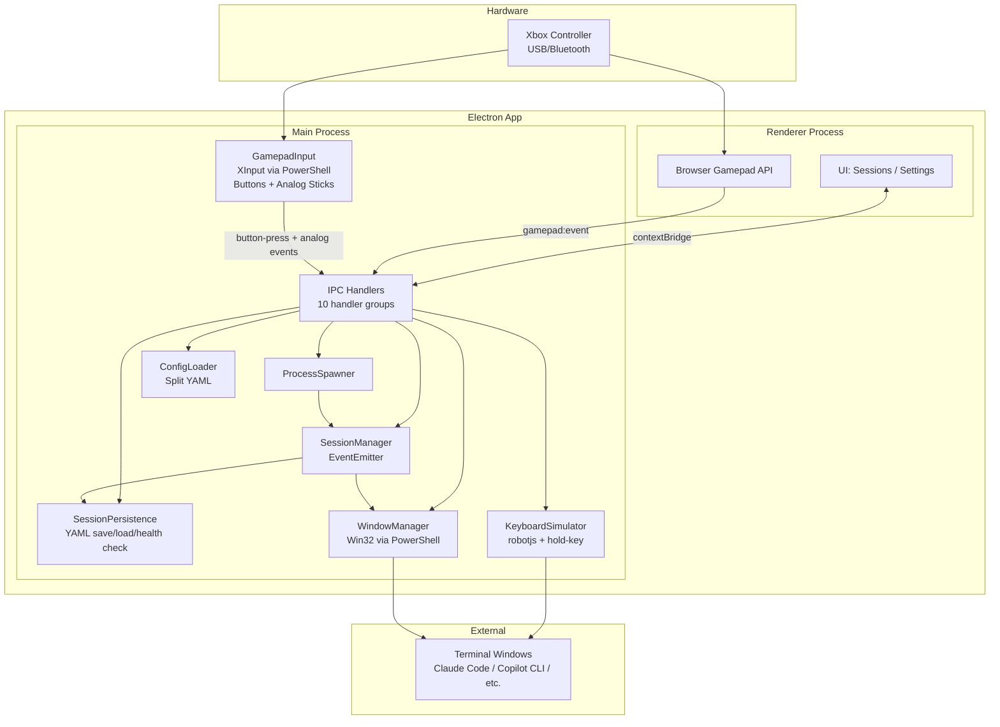

# gamepad-cli-hub

## Mission

DIY Xbox controller → CLI session manager. Control multiple CLI instances (Claude Code, Copilot CLI, etc.) from a single game controller. Built as an Electron 41 desktop app on Windows.

## System Overview



## Data Flow

```
Xbox Controller
  → XInput polling (PowerShell, 16ms) OR Browser Gamepad API
    → GamepadInput.processEvent() → debounce (600ms)
      → emit('button-press') / emit('analog') for stick events
        → Resolve binding (global first, then per-CLI type)
          → Execute action:
              keyboard  → KeyboardSimulator.sendKeys() (hold: true → keyDown/keyUp)
              spawn     → ProcessSpawner.spawn() → SessionManager.addSession()
              switch    → SessionManager.next/previous() → WindowManager.focusWindow()
            → WindowManager.focusWindow() (ensure correct window focused)
            → Haptic pulse (when enabled)
        → Analog sticks:
              Each stick emits virtual buttons (LeftStickUp, RightStickDown, etc.)
                → Explicit binding found → execute bound action
                → No binding → fall back to stick mode:
                    left stick  → cursor mode (arrow keys)
                    right stick → scroll mode (PageUp/PageDown), throttled by repeatRate
```

## Modules

| Module | File | Responsibility |
|--------|------|---------------|
| **GamepadInput** | `src/input/gamepad.ts` | XInput polling via PowerShell P/Invoke, debouncing, button-press events, analog stick events (`onAnalog()`), haptic vibration commands |
| **KeyboardSimulator** | `src/output/keyboard.ts` | Keystroke simulation via @jitsi/robotjs. `sendKey()`, `sendKeys()`, `sendKeyCombo()`, `longPress()`, `typeString()`, `keyDown()`, `keyUp()`, `comboDown()`, `comboUp()` for hold-key support |
| **WindowManager** | `src/output/windows.ts` | Win32 window enumeration/focus via PowerShell |
| **SessionManager** | `src/session/manager.ts` | Track sessions, switch active, emit session:added/removed/changed. Calls persistence after every state change. |
| **SessionPersistence** | `src/session/persistence.ts` | `saveSessions()`, `loadSessions()`, `clearPersistedSessions()` to `config/sessions.yaml`. Health check removes dead PIDs. |
| **ProcessSpawner** | `src/session/spawner.ts` | Spawn detached CLI processes from config, register with SessionManager. Accepts optional `onExit` callback. |
| **ConfigLoader** | `src/config/loader.ts` | Split YAML config loading + profile/tools/directory CRUD. `StickConfig` types, `StickVirtualButton`, `getStickConfig()`, `getStickDirectionBinding()`, `getHapticFeedback()`, `setHapticFeedback()`, `SidebarPrefs`, `getSidebarPrefs()`, `setSidebarPrefs()`. |
| **IPC Handlers** | `src/electron/ipc/*.ts` | Orchestrator + 10 domain handler files (gamepad, session, config, profile, tools, window, spawn, keyboard, system, app). Dependencies injected via function parameters. |
| **Renderer** | `renderer/*.ts` | Modular UI: entry point (main.ts) + state, utils (includes `toDirection()` for directional button normalization), bindings, navigation, screens (sessions/settings, status stub), modals (dir-picker/binding-editor). Browser Gamepad API. Vertical session cards + spawn grid with inline spawn wizard. Slide-over settings with status tab (merged from old status screen). |
| **XInput Script** | `src/input/xinput-poll.ps1` | External PowerShell XInput P/Invoke polling script. Emits button events (DPadUp/DPadDown/DPadLeft/DPadRight, face buttons, etc.) + raw analog stick values. Supports `XInputSetState` for haptic vibration. Stick virtual buttons are generated in the renderer, not here. |
| **Logger** | `src/utils/logger.ts` | Winston logger with daily rotation. Used across all src/ modules. |
| **CLI Entry** | `src/index.ts` | Standalone CLI orchestrator (GamepadCliHub class). Handles all action types including `close-session` and `hub-focus`. Resolves stick direction bindings before falling back to stick mode. |

## Config System

```
config/
├── settings.yaml       # Active profile name, hapticFeedback toggle
├── tools.yaml          # CLI type definitions (spawn commands)
├── directories.yaml    # Working directory presets
├── sessions.yaml       # Persisted session state (auto-managed)
└── profiles/
    └── default.yaml    # Button bindings (global + per CLI type) + stick config
```

**Binding resolution:** CLI-specific bindings checked first → fall back to global bindings. Each profile defines different button behaviours per CLI type.

**Binding action types:** `keyboard`, `session-switch`, `spawn`, `list-sessions`, `profile-switch`, `close-session`, `hub-focus`

**keyboard hold binding format:** `{ action: 'keyboard', keys: ['space'], hold: true }` — when the gamepad button is pressed, holds the configured keys DOWN via robotjs `keyToggle`; releases on button up. The OS / target CLI app handles the actual action (e.g. Claude Code listens for Space to start voice input).

**Stick config** (in profile YAML):
```yaml
sticks:
  left:
    mode: cursor    # cursor | scroll | disabled
    deadzone: 8000
    repeatRate: 100
  right:
    mode: scroll
    deadzone: 8000
    repeatRate: 150
```

## Key Controls

| Input | Action |
|-------|--------|
| Sandwich | Focus hub window + show sessions screen — hardcoded, not context-dependent |
| D-Pad (DPadUp/DPadDown/DPadLeft/DPadRight) | Navigate session cards / spawn grid; bindable outside sessions screen |
| Left Stick (LeftStickUp/Down/Left/Right) | Navigate session cards / spawn grid; bindable via virtual buttons, cursor mode fallback |
| A (in sessions) | Select / Confirm |
| B (in sessions) | Back / Cancel |
| X (in sessions) | Delete session |
| Y (in sessions) | Refresh |
| A/B/X/Y (outside sessions) | Per-CLI bindings (keyboard shortcuts) |
| Right Stick (RightStickUp/Down/Left/Right) | Bindable via virtual buttons, scroll mode (PageUp/PageDown) fallback |
| Back/Start | Switch profile (previous/next) |
| Xbox | Bring hub window to foreground |

## Tech Stack

| Component | Technology |
|-----------|-----------|
| Desktop shell | Electron 41 |
| Language | TypeScript (ESM) |
| Bundler | esbuild |
| Tests | Vitest |
| Gamepad input | PowerShell XInput + Browser Gamepad API |
| Keyboard sim | @jitsi/robotjs |
| Window mgmt | PowerShell Win32 API |
| Haptic feedback | PowerShell XInputSetState P/Invoke |
| Config | YAML (yaml package) |
| Logging | Winston |

## Design Decisions

1. **Dual gamepad detection** — XInput (PowerShell) for wired + Browser Gamepad API for Bluetooth
2. **External terminal windows** — CLIs run in real terminal windows, not embedded; managed via Win32 focus/enumeration
3. **IPC bridge pattern** — Electron context isolation enforced. `preload.ts` exposes typed API via `contextBridge`. IPC handlers are split into 10 domain files with dependency injection — the orchestrator (`handlers.ts`) wires dependencies. Renderer never directly accesses Node.js APIs.
4. **Split YAML config** — Separate concerns: tools, directories, settings, profiles (each with CRUD)
5. **Per-CLI bindings** — Same button does different things depending on active CLI type
6. **PowerShell for native APIs** — No native DLLs needed; spawn PS process, parse JSON stdout
7. **Debouncing in input layer** — 600ms default prevents accidental rapid re-presses
8. **Hold-key passthrough** — Instead of embedding audio processing, the `keyboard` action with `hold: true` holds a configurable key combo (via robotjs `keyToggle`) and lets the target app handle voice natively. Zero external dependencies — the controller just holds a key, the CLI does the rest.
9. **Session persistence** — Sessions saved to `config/sessions.yaml` after every add/remove/change. On startup, `restoreSessions()` reloads saved sessions (skipping duplicates). A health check (`startHealthCheck()`) periodically removes dead PIDs via `process.kill(pid, 0)`. Survives crashes and restarts.
10. **Sidebar session UI** — App runs as a 320px frameless always-on-top sidebar (left or right edge). Sessions screen shows vertical session cards (top) and a spawn grid (bottom) with an inline directory wizard. Settings is a slide-over panel with status merged as a tab. Sandwich button focuses the hub and returns to the sessions screen. Old 3-panel Session Launcher HUD removed.
11. **Analog stick virtual buttons** — Each stick emits distinct virtual button names (e.g. `LeftStickUp`, `RightStickDown`) that can be bound like physical buttons. If no explicit binding exists, the stick falls back to its configured mode (cursor or scroll). D-pad buttons are separate (`DPadUp`, `DPadDown`, etc.). All directional inputs are normalized to cardinal directions via `toDirection()` for UI navigation. All inputs are context-dependent except Sandwich (hardcoded hub focus).

## Build & Test

```bash
npm run build    # esbuild: electron + renderer
npm run start    # Build and launch
npm test         # Vitest suite
```

## Architecture Principles

- DRY, YAGNI, KISS
- TDD — tests first, then implement
- Event-driven, non-blocking
- Composition over inheritance
- Clean separation: input → processing → output
- Document **why**, not **how**

## File Structure

```
src/
├── index.ts                    # CLI entry point (GamepadCliHub orchestrator)
├── electron/
│   ├── main.ts                 # Electron main: window creation, IPC setup, lifecycle
│   ├── preload.ts              # Context bridge (renderer ↔ main IPC)
│   └── ipc/
│       ├── handlers.ts         # Orchestrator — imports + wires 10 domain handlers
│       ├── gamepad-handlers.ts
│       ├── session-handlers.ts
│       ├── config-handlers.ts
│       ├── profile-handlers.ts
│       ├── tools-handlers.ts
│       ├── window-handlers.ts
│       ├── spawn-handlers.ts
│       ├── keyboard-handlers.ts
│       ├── system-handlers.ts
│       └── app-handlers.ts
├── input/
│   ├── gamepad.ts              # XInput polling + debounce + button/analog events + haptic commands
│   └── xinput-poll.ps1         # PowerShell XInput P/Invoke + XInputSetState for haptics
├── output/
│   ├── keyboard.ts             # Keystroke simulation (robotjs) + hold-key support (keyDown/keyUp/comboDown/comboUp)
│   └── windows.ts              # Window enumeration/focus (PowerShell Win32)
├── session/
│   ├── manager.ts              # Session tracking (EventEmitter), calls persistence on changes
│   ├── persistence.ts          # Save/load/clear sessions to config/sessions.yaml + health check
│   ├── spawner.ts              # CLI process spawning (optional onExit callback)
│   └── index.ts
├── config/
│   └── loader.ts               # Split YAML config + CRUD + StickConfig + haptic settings
├── types/
│   └── session.ts              # SessionInfo, SessionChangeEvent, AnalogEvent types
└── utils/
    ├── logger.ts               # Winston logger (daily rotation, used everywhere)
    └── index.ts

renderer/
├── index.html                  # Main UI template
├── main.ts                     # Entry point — init, wiring, DOMContentLoaded
├── state.ts                    # Shared AppState type + singleton
├── utils.ts                    # DOM helpers, logEvent, showScreen, toDirection
├── bindings.ts                 # Config cache, binding dispatch (CLI → global fallback)
├── navigation.ts               # Gamepad navigation setup, event routing
├── gamepad.ts                  # Browser Gamepad API wrapper
├── screens/
│   ├── sessions.ts             # Vertical session cards + spawn grid + inline wizard
│   ├── sessions-state.ts       # Sessions screen navigation state (sessions/spawn/wizard zones)
│   ├── settings.ts             # Slide-over settings (profiles, bindings, tools, dirs, status tab)
│   └── status.ts               # DEPRECATED stub (status merged into settings)
├── modals/
│   ├── dir-picker.ts           # Directory picker modal
│   └── binding-editor.ts       # Binding editor modal
└── styles/
    └── main.css

config/
├── settings.yaml               # Active profile + hapticFeedback toggle
├── tools.yaml                  # CLI type definitions (spawn commands)
├── directories.yaml            # Working directory presets
├── sessions.yaml               # Persisted session state (auto-managed)
└── profiles/
    └── default.yaml            # Button bindings + stick config

tests/
├── gamepad.test.ts             # 45 tests (buttons + analog + vibration)
├── keyboard.test.ts            # 14 tests
├── session.test.ts             # 30 tests
├── spawner.test.ts             # 18 tests
├── persistence.test.ts         # 19 tests
├── windows.test.ts             # 34 tests
├── config.test.ts              # 80 tests (base + stick config + haptic + virtual buttons)
├── index.test.ts               # 44 tests (action dispatch + hold-key + close-session + stick bindings)
└── sessions-screen.test.ts     # 67 tests (session cards + spawn grid navigation + directional buttons)
```
