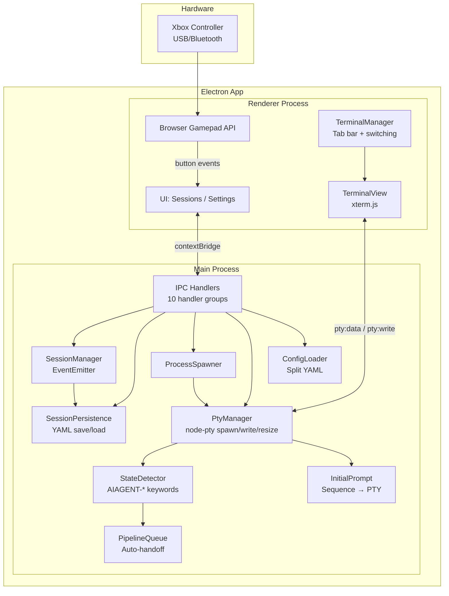

# gamepad-cli-hub

## Mission

DIY Xbox controller → CLI session manager. Control multiple AI coding CLIs (Claude Code, Copilot CLI, etc.) from a single game controller. Embedded terminals via node-pty + xterm.js — no external windows. Built as an Electron 41 desktop app on Windows.

## System Overview



## Data Flow

```
Xbox Controller
  → Browser Gamepad API (renderer polling, 16ms)
    → IPC gamepad:event → debounce (250ms)
      → emit('button-press') / emit('analog') for stick events
        → Resolve binding (per-CLI type)
          → Execute action:
              keyboard  → SequenceParser.parse() → pty:write (escape sequences to PTY stdin)
              voice     → OS-default (robotjs), PTY when target: 'terminal' (see Input Routing below)
              spawn     → ProcessSpawner.spawn() → PtyManager.spawn() → SessionManager.addSession()
              switch    → SessionManager.next/previous() → TerminalManager.switchTo()
            → Haptic pulse (when enabled)
        → Analog sticks:
              Each stick emits virtual buttons (LeftStickUp, RightStickDown, etc.)
                → Explicit binding found → execute bound action
                → No binding → fall back to stick mode:
                    left stick  → cursor mode (arrow keys via PTY)
                    right stick → configurable per-CLI bindings (default: scroll)
              D-pad auto-repeats when held (400ms delay, 120ms rate). Sticks repeat proportional to deflection.

D-pad / Left stick navigates sessions and auto-selects the terminal.
Keyboard input always routes to the active terminal (PTY stdin).
Ctrl+V paste routes clipboard text to active PTY (regardless of DOM focus).
```

## Modules

| Module | File | Responsibility |
|--------|------|---------------|
| **BrowserGamepad** | `renderer/gamepad.ts` | Browser Gamepad API polling (250ms debounce), button-press events via IPC, analog stick events, **D-pad and stick auto-repeat engine**. Sole gamepad input source. |
| **SessionManager** | `src/session/manager.ts` | Track sessions, switch active, emit session:added/removed/changed. Calls persistence after every state change. |
| **SessionPersistence** | `src/session/persistence.ts` | `saveSessions()`, `loadSessions()`, `clearPersistedSessions()` to `config/sessions.yaml`. Health check removes dead PIDs. |
| **ProcessSpawner** | `src/session/process-spawner.ts` | Spawn CLI processes via PtyManager, register with SessionManager. Supports initial prompt delay. |
| **PtyManager** | `src/session/pty-manager.ts` | PTY process lifecycle — spawn via node-pty (cmd.exe on Windows, bash on Unix), write to stdin, resize, kill. One PTY per embedded terminal session. |
| **StateDetector** | `src/session/state-detector.ts` | Scans PTY output for AIAGENT-* keywords to detect CLI state (waiting, implementing, etc.). |
| **PipelineQueue** | `src/session/pipeline-queue.ts` | Auto-handoff queue — routes tasks to waiting sessions based on state detection. |
| **InitialPrompt** | `src/session/initial-prompt.ts` | Per-CLI prompt pre-loading — converts sequence parser syntax to PTY escape codes, sends to newly spawned PTY after configurable delay. |
| **SequenceParser** | `src/input/sequence-parser.ts` | Parses sequence format strings (`{Enter}`, `{Ctrl+C}`, `{Wait 500}`, `{Mod Down/Up}`, `{{`/`}}` escapes, plain text) into typed SequenceAction arrays. Used by both button bindings and initial prompts. |
| **ConfigLoader** | `src/config/loader.ts` | Split YAML config loading + profile/tools/directory CRUD. `StickConfig` types, `StickVirtualButton`, `getStickConfig()`, `getHapticFeedback()`, `setHapticFeedback()`, `SidebarPrefs`, `getSidebarPrefs()`, `setSidebarPrefs()`. |
| **IPC Handlers** | `src/electron/ipc/*.ts` | Orchestrator + 7 domain handler files (session, config, profile, tools, keyboard, pty, system). Dependencies injected via function parameters. |
| **Renderer** | `renderer/*.ts` | Modular UI: entry point (main.ts) + state, utils (includes `toDirection()` for directional button normalization), bindings (PTY-aware routing with voice OS-default + PTY opt-in via `target: 'terminal'`), paste-handler (Ctrl+V → PTY), navigation, screens (sessions/settings, status stub), modals (dir-picker/binding-editor). Browser Gamepad API. Session list shows embedded terminals only. D-pad navigation auto-selects terminals. |
| **TerminalView** | `renderer/terminal/terminal-view.ts` | xterm.js wrapper — one Terminal instance per session with fit/search/weblinks addons. Forwards user input + resize events via callbacks. |
| **TerminalManager** | `renderer/terminal/terminal-manager.ts` | Multi-terminal orchestrator — create, switch, resize, PTY IPC data routing, cleanup. Renders horizontal tab bar with colored state dots (green=implementing, orange=waiting, blue=planning, grey=idle). Exposes onSwitch/onEmpty callbacks. |
| **Logger** | `src/utils/logger.ts` | Winston logger with daily rotation. Used across all src/ modules. |
## Config System

```
config/
├── settings.yaml       # Active profile name, hapticFeedback toggle
├── tools.yaml          # CLI type definitions (spawn commands)
├── directories.yaml    # Working directory presets
├── sessions.yaml       # Persisted session state (auto-managed)
└── profiles/
    └── default.yaml    # Button bindings (per CLI type) + stick config
```

**Binding resolution:** CLI-specific bindings are used. Each profile defines different button behaviours per CLI type.

**Binding action types:** `keyboard`, `voice`, `scroll`

**keyboard binding:** `{ action: 'keyboard', sequence: '{Wait 500}some text{Enter}{Ctrl+C}' }` — sequence parser syntax string sent to PTY stdin as escape codes. The sequence format is the only input mode for keyboard bindings.

**voice binding:** `{ action: 'voice', key: 'F1', mode: 'tap', target?: 'terminal' }` — key simulation for voice activation triggers. **OS-default routing:** voice bindings default to OS-level robotjs simulation (for external apps like OpenWhisper). Only routes through PTY when `target: 'terminal'` is explicitly set — converts key to terminal escape sequence via `keyToPtyEscape()` and writes to PTY via `ptyWrite()`. Falls back to OS-level robotjs when no terminal is active or `target` is not `'terminal'`. `mode: 'tap'` sends a single key event; `mode: 'hold'` sends the escape sequence once on press (PTY has no key-up concept) or holds/releases via robotjs for OS-targeted bindings. Key supports single keys (`F1`, `Space`) and combos (`Ctrl+Alt`). Supports F1-F12 (VT220 escape sequences), navigation keys, and modifier combos.

**scroll binding:** `{ action: 'scroll', direction: 'up'|'down', lines?: 5 }` — Scroll active terminal buffer. Format: `{ action: 'scroll', direction: 'up'|'down', lines?: 5 }`

**CLI type config** (in `tools.yaml`):
```yaml
claude-code:
  name: Claude Code
  command: claude
  args: []
  initialPrompt: ""           # Sequence parser string pre-loaded into PTY after spawn
  initialPromptDelay: 2000    # ms to wait before sending initialPrompt (default 2000 for AI CLIs, 0 for generic)
```

No `terminal` field — all CLIs run as embedded PTY sessions (no external window config).

**Sequence parser syntax** (used by both `sequence` bindings and `initialPrompt`):
| Token | Effect |
|-------|--------|
| Plain text | Sent as literal characters |
| `{Enter}` | Newline / carriage return |
| `{Tab}`, `{Escape}`, `{Delete}`, etc. | Named keys |
| `{Ctrl+C}`, `{Ctrl+Z}`, etc. | Modifier + key combos |
| `{Wait 500}` | Pause N ms (max 30000) |
| `{Ctrl Down}`, `{Ctrl Up}` | Hold/release modifier |
| `{{`, `}}` | Literal `{` and `}` |

**Stick config** (in profile YAML):
```yaml
sticks:
  left:
    mode: cursor    # cursor | scroll | disabled
    deadzone: 0.25
    repeatRate: 100
  right:
    mode: scroll
    deadzone: 0.25
    repeatRate: 150
dpad:
  initialDelay: 400
  repeatRate: 120
```

## Key Controls

| Input | Action |
|-------|--------|
| D-Pad Up/Down | Switch sessions (auto-selects terminal) |
| Left Stick | Same as D-pad |
| Right Stick | Configurable (default: scroll terminal buffer) |
| A | Configurable per-CLI binding |
| B | Back to sessions zone / configurable per-CLI binding |
| X | Configurable per-CLI binding |
| Y | (planned: cycle terminal state) |
| Left Trigger | Spawn Claude Code |
| Right Bumper | Spawn Copilot CLI |
| Back/Start | Switch profile (previous/next) |
| Sandwich/Guide | Focus hub window + show sessions screen |
| Ctrl+Tab | Next terminal tab |
| Ctrl+Shift+Tab | Previous terminal tab |

## Tech Stack

| Component | Technology |
|-----------|-----------|
| Desktop shell | Electron 41 |
| Language | TypeScript (ESM) |
| Bundler | esbuild |
| Tests | Vitest |
| Gamepad input | Browser Gamepad API (sole input source) |
| Embedded terminals | node-pty (PTY) + @xterm/xterm (xterm.js) |
| PTY shell | cmd.exe (Windows), bash (Unix) |
| Haptic feedback | Config setting (implementation pending — PowerShell XInput path removed) |
| Config | YAML (yaml package) |
| Logging | Winston |

## Design Decisions

1. **Browser Gamepad API only** — Single input path via Chromium's Gamepad API. Works with both USB and Bluetooth Xbox controllers. XInput/PowerShell path was removed for simplicity.
2. **Embedded terminals via PTY** — CLIs run inside the Electron app using node-pty + xterm.js. No external terminal windows. PTY spawns cmd.exe on Windows, bash on Unix. All keyboard/sequence input routes through PTY stdin.
3. **Voice binding OS-default routing** — Voice bindings default to OS-level robotjs simulation. Only route through PTY when `target === 'terminal'` is explicitly set: converts key to terminal escape sequence via `keyToPtyEscape()` → `ptyWrite()`. Falls back to robotjs when no terminal or `target` is not `'terminal'`. Hold mode sends escape sequence once on press (PTY has no key-up). Supports F1-F12 (VT220), navigation keys, combos.
4. **Clipboard paste via PTY** — Document-level Ctrl+V interceptor (`renderer/paste-handler.ts`) reads clipboard and writes to active PTY via `ptyWrite()`, regardless of DOM focus. Solves paste not reaching terminal when gamepad navigation focuses the sidebar.
5. **D-pad auto-selection** — D-pad navigation automatically selects and activates the terminal for the focused session. No separate focus/unfocus toggle — keyboard always types into the active terminal, D-pad always navigates sessions.
6. **Tab bar with state dots** — Horizontal tab strip above terminal area. Each tab shows session name + colored dot (green=implementing, orange=waiting, blue=planning, grey=idle). Ctrl+Tab / Ctrl+Shift+Tab for keyboard switching, D-pad for gamepad switching.
7. **IPC bridge pattern** — Electron context isolation enforced. `preload.ts` exposes typed API via `contextBridge`. IPC handlers are split into 8 domain files with dependency injection — the orchestrator (`handlers.ts`) wires dependencies. Renderer never directly accesses Node.js APIs.
8. **Split YAML config** — Separate concerns: tools, directories, settings, profiles (each with CRUD)
9. **Per-CLI bindings** — Same button does different things depending on active CLI type
10. **Button pass-through** — Non-navigation buttons (XYAB, bumpers, triggers) return false from session navigation, allowing them to fall through to per-CLI configurable bindings
11. **Debouncing in input layer** — 250ms default prevents accidental rapid re-presses while staying responsive
12. **Sequence parser for input** — Instead of direct key simulation, the `keyboard` action uses a sequence parser syntax (`{Enter}`, `{Ctrl+C}`, `{Wait 500}`, plain text) that converts to PTY escape codes. Same syntax used for button `sequence` bindings and `initialPrompt` config.
13. **Session persistence** — Sessions saved to `config/sessions.yaml` after every add/remove/change. On startup, `restoreSessions()` reloads saved sessions (skipping duplicates). A health check (`startHealthCheck()`) periodically removes dead PIDs via `process.kill(pid, 0)`. Survives crashes and restarts.
14. **Sidebar session UI** — App runs as a 320px frameless always-on-top sidebar (left or right edge). Sessions screen shows vertical session cards (top) and a spawn grid (bottom) with a directory picker modal. Settings is a slide-over panel with status merged as a tab. Sandwich button focuses the hub and returns to the sessions screen.
15. **Analog stick virtual buttons** — Each stick emits distinct virtual button names (e.g. `LeftStickUp`, `RightStickDown`) that can be bound like physical buttons. If no explicit binding exists, the stick falls back to its configured mode (cursor or scroll). Right stick scroll is a configurable per-CLI binding (default: `scroll` action), not hardcoded. D-pad buttons are separate (`DPadUp`, `DPadDown`, etc.). All directional inputs are normalized to cardinal directions via `toDirection()` for UI navigation. D-pad and sticks auto-repeat when held. D-pad uses keyboard-like delay (initialDelay) then constant rate. Sticks use displacement-proportional rate — gentle tilt = slow, full deflection = fast.

## Embedded Terminal Architecture

All CLIs run inside the Electron app as embedded PTY terminals. No external windows.

**Stack:** node-pty (PTY process management, cmd.exe on Windows) + xterm.js (terminal rendering)

```
Gamepad Button Press / Keyboard Input
  → D-pad/stick: navigate sessions (auto-select terminal)
  → Keyboard: routes to active terminal (PTY stdin)
  → Ctrl+V: paste-handler intercepts → clipboard text → ptyWrite() (any DOM focus)
  → Non-nav buttons: per-CLI configurable bindings

Input Routing (voice + keyboard bindings):
  Active terminal + target = 'terminal' → keyToPtyEscape() → ptyWrite() (PTY opt-in)
  No active terminal OR target ≠ 'terminal' → robotjs (OS-level key simulation, default)
  Hold mode (PTY path): escape sequence sent once on press (no key-up in PTY)
  Hold mode (OS path): keyboardComboDown() on press, keyboardComboUp() on release

PTY Data Flow:
  Main Process                           Renderer Process
  ┌─────────────┐   IPC: pty:data       ┌──────────────────┐
  │ PtyManager   │ ────────────────────→ │ TerminalManager   │
  │ (node-pty)   │                       │  → TerminalView   │
  │              │ ←──────────────────── │    (xterm.js)     │
  └─────────────┘   IPC: pty:write       └──────────────────┘
                     ↑                    ┌──────────────────┐
  voice/paste ───────┘                    │ Tab Bar           │
  StateDetector  ←── PTY stdout ──────── │ [●Claude][●Copilot]│
  PipelineQueue  ←── state changes ───── └──────────────────┘
```

**Tab bar:** Horizontal strip above the terminal area. Each tab shows session name + colored state dot. Ctrl+Tab / Ctrl+Shift+Tab (keyboard) or D-pad (gamepad terminal mode) switches tabs.

**State dots:** 🟢 implementing (green `#44cc44`) · 🟠 waiting (orange `#ffaa00`) · 🔵 planning (blue `#4488ff`) · ⚪ idle (grey `#555555`)

**Key modules:**
- `src/session/pty-manager.ts` — Spawns node-pty processes (cmd.exe), routes stdin/stdout, handles resize/kill
- `src/session/state-detector.ts` — Scans PTY output for `AIAGENT-*` keywords to detect CLI state
- `src/session/pipeline-queue.ts` — Auto-handoff: routes queued tasks to the first session in "waiting" state
- `src/session/initial-prompt.ts` — Converts sequence parser syntax to PTY escape codes, sends after configurable delay
- `src/input/sequence-parser.ts` — Parses `{Enter}`, `{Ctrl+C}`, `{Wait 500}` etc. into typed actions
- `renderer/terminal/terminal-view.ts` — xterm.js wrapper with fit/search addons
- `renderer/terminal/terminal-manager.ts` — Multi-terminal switching, tab bar rendering, lifecycle
- `renderer/bindings.ts` — PTY-aware input routing: voice OS-default (robotjs) with PTY opt-in via `target: 'terminal'` + `keyToPtyEscape()` (F1-F12 VT220 sequences)
- `renderer/paste-handler.ts` — Document-level Ctrl+V interceptor: reads clipboard, writes to active PTY via `ptyWrite()` regardless of DOM focus

## Build & Test

```bash
npm run build    # esbuild: electron (dist-electron/main.js) + renderer (dist/renderer/main.js)
npm run start    # Build and launch
npm test         # Vitest suite
```

**Build notes:**
- Renderer output: `dist/renderer/main.js` (not `renderer/main.js`)
- node-pty is `--external` in the electron esbuild (native addon, not bundled)
- No `--allow-overwrite` flag

## Architecture Principles

- DRY, YAGNI, KISS
- TDD — tests first, then implement
- Event-driven, non-blocking
- Composition over inheritance
- Clean separation: input → processing → output
- Document **why**, not **how**

## File Structure

```
src/
├── electron/
│   ├── main.ts                 # Electron main: window creation, IPC setup, lifecycle
│   ├── preload.ts              # Context bridge (renderer ↔ main IPC)
│   └── ipc/
│       ├── handlers.ts         # Orchestrator — imports + wires 8 domain handlers
│       ├── session-handlers.ts
│       ├── config-handlers.ts
│       ├── profile-handlers.ts
│       ├── tools-handlers.ts
│       ├── keyboard-handlers.ts
│       ├── pty-handlers.ts
│       └── system-handlers.ts
├── input/
│   └── sequence-parser.ts      # {Enter}, {Ctrl+C}, {Wait 500}, {Mod Down/Up}, {{/}} — used by bindings + initialPrompt
├── output/
│   ├── keyboard.ts             # ⚠️ DEPRECATED: robotjs keystroke simulation (legacy fallback only)
│   └── windows.ts              # ⚠️ DEPRECATED: Win32 window enumeration/focus (no longer used)
├── session/
│   ├── manager.ts              # Session tracking (EventEmitter), calls persistence on changes
│   ├── persistence.ts          # Save/load/clear sessions to config/sessions.yaml + health check
│   ├── spawner.ts              # CLI process spawning (optional onExit callback)
│   ├── pty-manager.ts          # PTY process management (node-pty: cmd.exe on Windows, bash on Unix)
│   ├── state-detector.ts       # AIAGENT-* keyword scanning for CLI state detection
│   ├── pipeline-queue.ts       # Waiting→implementing auto-handoff queue (FIFO)
│   └── initial-prompt.ts       # Sequence syntax → PTY escape codes, configurable delay
├── config/
│   └── loader.ts               # Split YAML config + CRUD + StickConfig + haptic settings
├── types/
│   └── session.ts              # SessionInfo, SessionChangeEvent, AnalogEvent types
└── utils/
    └── logger.ts               # Winston logger (daily rotation, used everywhere)

renderer/
├── index.html                  # Main UI template
├── main.ts                     # Entry point — init, wiring, DOMContentLoaded, terminal manager
├── state.ts                    # Shared AppState type + singleton (currentScreen, sessions, activeSessionId, etc.)
├── utils.ts                    # DOM helpers, logEvent, showScreen, toDirection
├── bindings.ts                 # Config cache, binding dispatch (PTY-aware routing, voice OS-default + PTY via target: 'terminal', F1-F12 VT220 escape sequences)
├── paste-handler.ts            # Document-level Ctrl+V interceptor → clipboard text → active PTY
├── navigation.ts               # Gamepad navigation setup, event routing
├── gamepad.ts                  # Browser Gamepad API wrapper + repeat engine
├── terminal/
│   ├── terminal-view.ts        # xterm.js wrapper (fit/search/weblinks addons)
│   └── terminal-manager.ts     # Multi-terminal orchestration (create/switch/resize/destroy + tab bar)
├── screens/
│   ├── sessions.ts             # Vertical session cards + spawn grid + dir picker modal
│   ├── sessions-state.ts       # Sessions screen navigation state (sessions/spawn zones)
│   ├── settings.ts             # Slide-over settings (profiles, bindings, tools, dirs, status tab)
│   └── status.ts               # DEPRECATED stub (status merged into settings)
├── modals/
│   ├── dir-picker.ts           # Directory picker modal
│   └── binding-editor.ts       # Binding editor modal
└── styles/
    └── main.css

config/
├── settings.yaml               # Active profile + hapticFeedback toggle
├── tools.yaml                  # CLI type definitions (spawn commands)
├── directories.yaml            # Working directory presets
├── sessions.yaml               # Persisted session state (auto-managed)
└── profiles/
    └── default.yaml            # Button bindings + stick config

tests/                                  # 595 tests across 18 files
├── config.test.ts              # Config loading, stick config, haptic, virtual buttons
├── session.test.ts             # Session management
├── persistence.test.ts         # Session persistence
├── keyboard.test.ts            # Keyboard simulation
├── sessions-screen.test.ts     # Session cards + spawn grid navigation + directional buttons
├── sequence-parser.test.ts     # Sequence format parser tests
├── pty-manager.test.ts         # PTY process management tests
├── terminal-manager.test.ts    # Embedded terminal lifecycle tests
├── bindings-pty.test.ts        # PTY escape helpers + routing tests
├── bindings-target.test.ts     # Voice binding target routing (PTY vs OS)
├── paste-routing.test.ts       # Ctrl+V paste → PTY routing tests
├── state-detector.test.ts      # AIAGENT-* keyword detection tests
├── pipeline-queue.test.ts      # Auto-handoff queue tests
├── initial-prompt.test.ts      # Initial prompt delivery tests
├── modal-base.test.ts          # Modal UI base tests
├── gamepad-repeat.test.ts      # D-pad/stick key repeat engine tests
└── utils.test.ts               # Utility function tests
```
