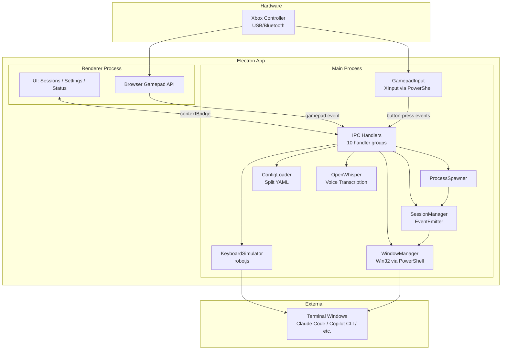

# gamepad-cli-hub

## Mission

DIY Xbox controller → CLI session manager. Control multiple CLI instances (Claude Code, Copilot CLI, etc.) from a single game controller. Built as an Electron 41 desktop app on Windows.

## System Overview



## Data Flow

```
Xbox Controller
  → XInput polling (PowerShell, 16ms) OR Browser Gamepad API
    → GamepadInput.processEvent() → debounce (600ms)
      → emit('button-press')
        → Resolve binding (global first, then per-CLI type)
          → Execute action:
              keyboard  → KeyboardSimulator.sendKeys()
              spawn     → ProcessSpawner.spawn() → SessionManager.addSession()
              switch    → SessionManager.next/previous() → WindowManager.focusWindow()
              voice     → OpenWhisper.recordAndTranscribe() → KeyboardSimulator.typeString()
            → WindowManager.focusWindow() (ensure correct window focused)
```

## Modules

| Module | File | Responsibility |
|--------|------|---------------|
| **GamepadInput** | `src/input/gamepad.ts` | XInput polling via PowerShell P/Invoke, debouncing, button-press events |
| **KeyboardSimulator** | `src/output/keyboard.ts` | Keystroke simulation via @jitsi/robotjs (sendKey, combo, typeString) |
| **WindowManager** | `src/output/windows.ts` | Win32 window enumeration/focus via PowerShell |
| **SessionManager** | `src/session/manager.ts` | Track sessions, switch active, emit session:added/removed/changed |
| **ProcessSpawner** | `src/session/spawner.ts` | Spawn detached CLI processes from config, register with SessionManager |
| **ConfigLoader** | `src/config/loader.ts` | Split YAML config loading + profile/tools/directory CRUD |
| **OpenWhisper** | `src/voice/openwhisper.ts` | Audio recording (FFmpeg) → whisper.cpp transcription |
| **IPC Handlers** | `src/electron/ipc/handlers.ts` | Bridge between renderer and main process (10 handler groups) |
| **Renderer** | `renderer/main.ts` | UI screens (Sessions, Settings, Status) + Browser Gamepad API |
| **CLI Entry** | `src/index.ts` | Standalone CLI orchestrator (GamepadCliHub class) |

## Config System

```
config/
├── settings.yaml       # Active profile name
├── tools.yaml          # CLI type definitions (spawn commands) + OpenWhisper config
├── directories.yaml    # Working directory presets
└── profiles/
    └── default.yaml    # Button bindings: global + per CLI type
```

**Binding resolution:** CLI-specific bindings checked first → fall back to global bindings. Each profile defines different button behaviours per CLI type.

**Binding action types:** `keyboard`, `voice`, `openwhisper`, `session-switch`, `spawn`, `list-sessions`, `profile-switch`

## Key Controls

| Input | Action |
|-------|--------|
| D-Pad Up/Down | Switch between active CLI sessions |
| Left Stick | D-pad replacement |
| Left Trigger | Spawn new Claude Code instance |
| Right Trigger | Spawn new Copilot CLI instance |
| Left/Right Bumper | Switch sessions (previous/next) |
| A | Clear screen (per CLI type) |
| B | OpenWhisper voice input or Escape |
| X/Y | Custom commands per CLI type |
| Back/Start | Switch profile (previous/next) |
| Guide | Bring hub window to foreground |

## Tech Stack

| Component | Technology |
|-----------|-----------|
| Desktop shell | Electron 41 |
| Language | TypeScript (ESM) |
| Bundler | esbuild |
| Tests | Vitest |
| Gamepad input | PowerShell XInput + Browser Gamepad API |
| Keyboard sim | @jitsi/robotjs |
| Window mgmt | PowerShell Win32 API |
| Voice | OpenWhisper (whisper.cpp) |
| Config | YAML (yaml package) |
| Logging | Winston |

## Design Decisions

1. **Dual gamepad detection** — XInput (PowerShell) for wired + Browser Gamepad API for Bluetooth
2. **External terminal windows** — CLIs run in real terminal windows, not embedded; managed via Win32 focus/enumeration
3. **IPC bridge pattern** — Electron context isolation; preload.ts exposes typed API via contextBridge
4. **Split YAML config** — Separate concerns: tools, directories, settings, profiles (each with CRUD)
5. **Per-CLI bindings** — Same button does different things depending on active CLI type
6. **PowerShell for native APIs** — No native DLLs needed; spawn PS process, parse JSON stdout
7. **Debouncing in input layer** — 600ms default prevents accidental rapid re-presses

## Build & Test

```bash
npm run build    # esbuild: electron + renderer
npm run start    # Build and launch
npm test         # Vitest suite
```

## Architecture Principles

- DRY, YAGNI, KISS
- TDD — tests first, then implement
- Event-driven, non-blocking
- Composition over inheritance
- Clean separation: input → processing → output
- Document **why**, not **how**
