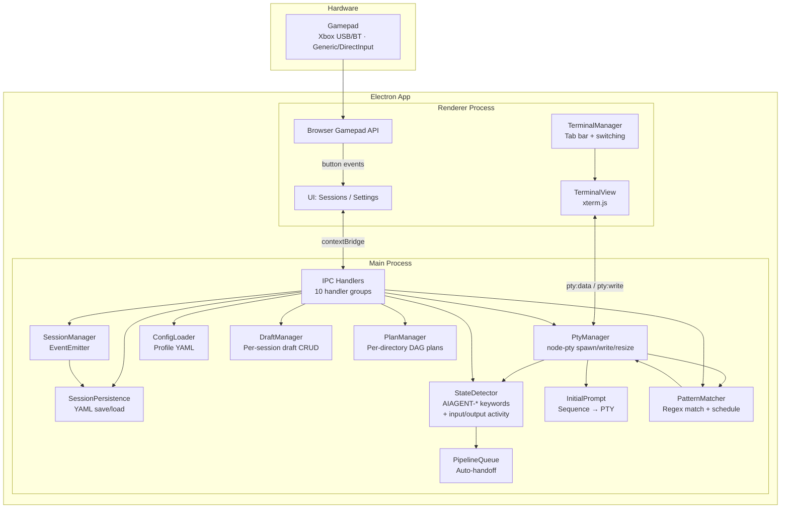

# gamepad-cli-hub

## Mission

DIY Xbox controller → CLI session manager. Control multiple AI coding CLIs (Claude Code, Copilot CLI, etc.) from a single game controller. Embedded terminals via node-pty + xterm.js — no external windows. Built as an Electron 41 desktop app on Windows.

## System Overview


```mermaid
graph TB
    subgraph Hardware
        XC[Gamepad<br/>Xbox USB/BT · Generic/DirectInput]
    end

    subgraph "Electron App"
        subgraph "Renderer Process"
            UI[UI: Sessions / Settings]
            BGA[Browser Gamepad API]
            TM[TerminalManager<br/>Tab bar + switching]
            TV[TerminalView<br/>xterm.js]
        end

        subgraph "Main Process"
            IPC[IPC Handlers<br/>10 handler groups]
            SM[SessionManager<br/>EventEmitter]
            SP[SessionPersistence<br/>YAML save/load]
            PTY[PtyManager<br/>node-pty spawn/write/resize]
            SD[StateDetector<br/>AIAGENT-* keywords<br/>+ input/output activity]
            PQ[PipelineQueue<br/>Auto-handoff]
            IP[InitialPrompt<br/>Sequence → PTY]
            CL[ConfigLoader<br/>Profile YAML]
            DM[DraftManager<br/>Per-session draft CRUD]
            PM[PlanManager<br/>Per-directory DAG plans]
            PMATCH[PatternMatcher<br/>Regex match + schedule]
        end

        UI <-->|contextBridge| IPC
        BGA -->|button events| UI
        TM --> TV
        TV <-->|pty:data / pty:write| PTY
    end

    XC --> BGA
    IPC --> SM
    IPC --> SP
    IPC --> PTY
    IPC --> CL
    IPC --> DM
    IPC --> PM
    SM --> SP
    PTY --> SD
    IPC --> SD
    SD --> PQ
    PTY --> IP
    PTY --> PMATCH
    IPC --> PMATCH
    PMATCH --> PTY
```

## Data Flow

```
Gamepad (Xbox or generic)
  → Browser Gamepad API (renderer polling, 16ms)
    → IPC gamepad:event → debounce (250ms)
      → Resolve binding (per-CLI type)
        → Execute action (keyboard/voice/spawn/switch/prompt-tree)
        → Analog sticks: virtual buttons → explicit binding or stick mode fallback
        → D-pad auto-repeats when held (400ms delay, 120ms rate)

D-pad / Left stick navigates sessions and auto-selects the terminal.
Keyboard input routes to the active terminal (PTY stdin) — blocked when a selection-mode modal overlay is visible (context-menu, close-confirm, prompt-tree picker, quick-spawn, dir-picker, draft-submenu, plan-screen). Tab/Shift+Tab cycles buttons within selection-mode modals (alongside arrow keys).
Ctrl+V paste routes clipboard text to active PTY (regardless of DOM focus, blocked during modal overlays, draft editor, and plan screen).
Ctrl+G opens the in-app Prompt Editor (`EditorPopup.vue`, bridged via `renderer/editor/editor-popup.ts`) — a multi-line textarea with a recent-prompts history list and a `PromptManagementTree` pane for the prompt-template library. Ctrl+Enter / Send delivers the composed text to the active PTY via `deliverPromptSequence()` (sequence syntax honored). Blocked during modal overlays, the draft editor, and the plan screen.
```

## Design Decisions

1. **Browser Gamepad API only** — Single input path via Chromium's Gamepad API. Works with Xbox controllers (USB/Bluetooth, standard mapping → buttons 12-15 for D-pad) and generic/DirectInput gamepads (axes-based D-pad detection: dual-axis pairs then hat switch fallback). XInput/PowerShell path was removed for simplicity.
2. **Embedded terminals via PTY** — CLIs run inside the Electron app using node-pty + xterm.js. No external terminal windows. PTY spawns cmd.exe on Windows, bash on Unix. All keyboard/sequence input routes through PTY stdin.
3. **Voice binding OS-default routing** — Voice bindings default to OS-level robotjs simulation. Only route through PTY when `target === 'terminal'` is explicitly set: converts key to terminal escape sequence via `keyToPtyEscape()` → `ptyWrite()`. Falls back to robotjs when no terminal or `target` is not `'terminal'`. Hold mode sends escape sequence once on press (PTY has no key-up). Supports F1-F12 (VT220), navigation keys, combos.
4. **Clipboard paste via PTY** — Document-level Ctrl+V interceptor (`renderer/paste-handler.ts`) reads clipboard and writes to active PTY via `ptyWrite()`, regardless of DOM focus. Blocked when any modal overlay is visible (`.modal-overlay.modal--visible` guard). Solves paste not reaching terminal when gamepad navigation focuses the sidebar.
5. **D-pad auto-selection** — D-pad navigation automatically selects and activates the terminal for the focused session. No separate focus/unfocus toggle — keyboard always types into the active terminal, D-pad always navigates sessions.
6. **Activity dots (not state dots)** — Session cards and overview cards show colored activity dots based on PTY I/O timing: 🟢 active (green `#44cc44` — producing output or receiving user input) · 🔵 inactive (blue `#4488ff` — >10s silence) · ⚪ idle (grey `#555555` — >5min silence). Colors centralized in `renderer/state-colors.ts` via `getActivityColor()`. Input tracking: `pty:write` IPC handler calls `StateDetector.markActive()` — green dot appears immediately on user typing, not just on shell echo. Scroll input routes through `pty:scrollInput` → `StateDetector.markScrolling()` instead, which suppresses keyword scanning for 2s to prevent false AIAGENT state changes from screen redraws. Resize input routes through `pty:resize` → `StateDetector.markResizing()`, which suppresses activity promotion for 1s to prevent false green dots from tab-switch redraws. Terminal switching routes through `pty:markSwitching` → `StateDetector.markResizing()` (called before fit()) to suppress false activity promotion during Ctrl+Tab switching. Session restore uses `StateDetector.markRestored()` with a 3s grace period that prevents shell startup output from promoting restored sessions to green — ensures they start as grey (idle) dots.
7. **IPC bridge pattern** — Electron context isolation enforced. `preload.ts` exposes typed API via `contextBridge`. IPC handlers split into 10 domain files + 1 orchestrator (`handlers.ts`) with dependency injection. Renderer never directly accesses Node.js APIs.
8. **Self-contained profile YAML** — Each profile is a single YAML file containing tools, working directories, bindings, stick config, dpad config, and per-CLI pattern rules. Switching profiles changes everything. Settings stored separately. Auto-migration merges legacy `tools.yaml`/`directories.yaml` into profiles on first load.
9. **Per-CLI bindings** — Same button does different things depending on active CLI type.
10. **Button pass-through** — Non-navigation buttons (XYAB, bumpers, triggers) return false from session navigation, allowing them to fall through to per-CLI configurable bindings.
11. **Debouncing in input layer** — 250ms default prevents accidental rapid re-presses while staying responsive.
12. **Sequence parser for input** — Instead of direct key simulation, the `keyboard` action uses a sequence parser syntax (`{Enter}`, `{Ctrl+C}`, `{Wait 500}`, plain text) that converts to PTY escape codes. Same syntax used for button `sequence` bindings and `initialPrompt` config.
13. **Session persistence & resume** — Sessions saved to `config/sessions.yaml` after every add/remove/change. On startup, `restoreSessions()` reloads saved sessions. Dead processes are cleaned up via PTY exit events (no periodic health check). `cliSessionName` is a UUID v4 mapping 1:1 between hub sessions and CLI-internal sessions. Fresh spawn chain: `spawnCommand` → `command`. Resume chain: `resumeCommand` → `continueCommand` → `command`. Commands use `{cliSessionName}` placeholder, written to shell stdin via `rawCommand` (no escaping).
14. **Hibernate resilience** — Renderer crash recovery via `render-process-gone` auto-reload. Safe because session state lives in `SessionManager` (main process). `setupPowerMonitor()` logs detailed session/PTY diagnostics on suspend/resume/shutdown. All PTY operations wrapped in try-catch — errors logged but PTY processes NOT killed (may still be alive). GPU sandbox disabled. Electron crashReporter enabled.
15. **Desktop window layout** — Maximized desktop window (1280×800 default, 640×400 minimum). Window bounds persist via `getSidebarPrefs()`/`setSidebarPrefs()`. Sessions screen: vertical cards (top) + spawn grid (bottom). Session cards show elapsed timer since last CLI output (`formatElapsed()`, driven by `lastOutputAt` from `pty:activity-change`, refreshed every 10s) and a ⏰ `HH:mm [×]` chip when a `wait-until` pattern schedule is pending for that session (cancellable). Settings: slide-over panel.
16. **Analog stick virtual buttons** — Each stick emits distinct virtual button names (e.g. `LeftStickUp`, `RightStickDown`) bindable like physical buttons. No binding → fall back to stick mode (cursor or scroll). D-pad and sticks auto-repeat when held. Sticks use displacement-proportional rate.
17. **Session groups by working directory** — Sessions grouped by working directory with collapsible headers. Group order + collapse state persist in `settings.yaml`. Navigation uses a flat `navList` of group headers + session cards. Sorting applies within each group. Bookmarked directories (auto-bookmarked when a `cliSessionName` session is removed) persist as visible group headers even with 0 active sessions, showing a "No active sessions" placeholder with a × dismiss button.
18. **Group Overview (session preview grid)** — D-pad Right from a group header opens a scrollable single-column grid showing all sessions in that directory group. Max-height constraint limits visible area to ~5 cards before scrolling. Each card shows session name, terminal title subtitle (when set), activity dot, and last 10 lines of ANSI-stripped PTY output in fixed-height cards. Scrollable via mouse wheel and gamepad scroll bindings. Pre-selects the currently active session on entry. See [docs/group-overview.md](docs/group-overview.md) for full documentation.
19. **Activity-gated Telegram mirror** — `TerminalMirror` buffers PTY output during active periods (green dot) and flushes to Telegram on multiple triggers: activity-change to inactive (blue, >10s silence) or idle (grey, >5min), state-change to idle/completed (immediate + 3s follow-up flush to capture trailing content), question-detected (2s delayed flush), and safety flush at 50KB. Each flush sends a NEW message (no edit-in-place). Content is ANSI-stripped, noise-filtered (spinners, progress bars, AIAGENT tags, CLI hint lines like "esc to cancel"), and HTML-escaped in `<code>` blocks. Truncation keeps head+tail when exceeding 3500 chars. Prompt echo (`📝 text`) sends user input to Telegram on Enter — skips empty/control-only input and Telegram-originated commands (which bypass renderer IPC).
20. **Draft prompts** — Per-session draft memos for composing prompts while a CLI is busy. Drafts are managed by `DraftManager` (EventEmitter, CRUD, emits `draft:changed`), persisted to `config/drafts.yaml` (separate from sessions.yaml), and exposed via 5 IPC channels (`draft:create/update/delete/list/count`). UI: draft strip (horizontal 📝 pills above terminal), slide-down editor panel (title + content), Drafts submenu in context menu (New Draft + per-draft Apply/Edit/Delete), 📝 badge count on session cards, close-confirm warns about unsent drafts. `new-draft` action type opens the editor for the active session. Draft editor has 4 buttons: Save, Apply (send to PTY + delete), Delete, Cancel. Gamepad D-pad Up/Down cycles Title → Content → Save → Apply → Delete → Cancel, A activates, B cancels. Clicking a pill opens the draft editor directly.
21. **Directory Plans** — Per-directory acyclic directed graph of work items with dependency arrows and a 6-state lifecycle: `planning` (not ready or still being shaped), `ready` (dependencies satisfied), `coding` (claimed by a session), `review` (awaiting review), `blocked` (requires `stateInfo`), and `done` (completed via `plan_complete`). Managed by `PlanManager` (EventEmitter, CRUD, DAG validation via DFS cycle prevention, ready-state recomputation). Persisted as individual item JSON files under `config/plans/` plus `config/plan-dependencies.json` (folder-level, not per-profile; old `config/plans.yaml` is migration input only). Plans are distinct from Drafts (per-session prompt memos) and Contexts (project knowledge nodes bindable to plans/sequences). UI: SVG canvas overlay inside `#mainArea` with Sugiyama-style left-to-right layered auto-layout, pan/zoom (viewBox-based), quadratic bezier dependency arrows with arrowhead markers, click-to-select nodes, bottom editor panel (title + description + Delete + conditional Done). Entry: 🗺️ Plans button on group headers (column 1, click only). Exit: B button or ← Back. Session cards show plan badges (coding + ready/blocked/review counts). Draft strips show plan chips (generation-counter dedup for async renders; ready click → send description to PTY + transition to coding; coding click → re-send description to PTY without status change).

22. **Vue 3 migration (in progress)** — Renderer migrating from manual DOM manipulation to Vue 3 Composition API + Pinia. Incremental: Vue components coexist with legacy TS modules during transition. Vite builds the renderer (replaces esbuild for renderer only). Key patterns: `reactive()` wraps state singletons (Pinia stores are thin wrappers on top), `useModalStack` composable replaces the 11-deep if-chain, `<Teleport>` for modals, `useNavigation` composable for input routing. xterm.js stays imperative (TerminalManager class). Main process (`src/`) and preload are unchanged.

23. **Pattern Matcher** — `PatternMatcher` (`src/session/pattern-matcher.ts`) scans every PTY stdout chunk against per-CLI regex rules loaded from the profile YAML `patterns` array. Two action types: `send-text` (fires a sequence to PTY immediately) and `wait-until` (parses a scheduled time from the matched capture group via `TimeParser`, then fires `onResume` at that time). Cooldown is tracked per-session per-rule — after a rule fires, it is suppressed for `cooldownMs` ms for that session only, preventing rapid re-triggering. Pending schedules are cancellable via `pattern:cancelSchedule(sessionId)` IPC. Session cards render a ⏰ chip while a schedule is pending. Rule CRUD: `tools:addPattern`, `tools:updatePattern`, `tools:removePattern`, `tools:getPatterns` IPC channels.

24. **Plan Backup & Restore** — Per-directory rolling-window snapshots of plan data, managed by `PlanBackupManager` (EventEmitter, CRUD, rolling window pruning). Snapshots are timestamped JSON files in `config/plan-backups/`. Automatic scheduling on `plan:changed` events with per-directory interval debounce. Configurable via `config/plan-backups.yaml` or Settings → 💾 Backups tab. Restore workflow: plan screen → R key / 💾 Backups button → select snapshot → restore. IPC: 8 channels (`plan:listBackups/getBackupSummary/restoreBackup/deleteBackup/createBackupNow/getBackupConfig/setBackupConfig/deleteAllBackups`). See [docs/plan-backup-restore.md](docs/plan-backup-restore.md).

25. **Config boundary — repo ships defaults only, runtime lives in %APPDATA%/Helm/** — Writable config, logs, and temp files are always resolved to `%APPDATA%/Helm/{config,logs,tmp}` regardless of dev or packaged mode. The repo `config/` directory was removed from git tracking; only seed stubs remain in `src/config/` (settings.yaml, sessions.yaml, drafts.yaml, profiles/default.yaml, scheduled-tasks.yaml). On first launch, `seedConfigIfNeeded` copies these seeds to the user data dir if the target does not yet exist. This prevents dev builds from accidentally writing to the repo working tree and ensures packaged and dev behavior are identical.

    ```mermaid
    graph LR
        subgraph "Repo (read-only)"
            SEED[src/config/ seeds]
        end
        subgraph "User machine (writable)"
            CONF[%APPDATA%/Helm/config]
            LOGS[%APPDATA%/Helm/logs]
            TMP[%APPDATA%/Helm/tmp]
        end
        SEED --"first launch\ncopy if absent"--> CONF
    ```

26. **Scheduled Task History (7-day rolling run log)** — Every scheduled-task execution appends an immutable setup-snapshot to `ScheduledTaskHistoryManager` (EventEmitter, mirrors the PlanBackupManager rolling-window pattern), persisted to `config/scheduled-task-history.yaml`. Each entry captures setup fields (title, description, prompt, cliType, params, dir, mode, schedule kind/interval/cron/endDate, planIds) + `ranAt` + `outcome` (`done`/`failed`/`cancelled`) + `error?` + `sessionId?` — intentionally NO stdout/PTY output. Snapshots are taken at fire time (independent of `completeOrReschedule`, which resets recurring tasks), so each recurring/interval/cron fire produces one entry. History is pruned to a rolling 7-day window on every append and defensively re-filtered on load. The sidebar "New Schedule" button is a split button — the 🕘 segment opens `ScheduledTaskHistoryModal.vue` (Past Schedules), which lists runs grouped by day (Today/Yesterday/date) with an outcome badge, ran-at time, setup chips, prompt preview, and error. "↻ Recreate as new" prefills the existing ScheduledTasksTab create popup from the snapshot (editingTaskId left null), defaulting the scheduled time to now+1h — nothing is created until the user confirms. IPC: `scheduled_task:listHistory`/`scheduled_task:clearHistory` + `scheduled-task-history:changed` event.

27. **Prompt Templates (global nested library)** — Replaces the old per-CLI `sequences` groups with a single GLOBAL tree of folders + template leaves. Managed by `PromptTemplateManager` (`src/session/prompt-template-manager.ts`, EventEmitter — arbitrary folder nesting, templates are always leaves, emits `prompt-template:changed`). Persisted to `%APPDATA%/Helm/config/prompt-templates.yaml` (global, not per-profile) by `PromptTemplatePersistence`, with a one-time migration that folds legacy per-profile `sequences` groups into the tree (`prompt-template-migration.ts`). Template bodies still use the sequence-parser syntax (`{Enter}`, `{Wait 500}`, `{Ctrl+C}`, plain text) and are delivered through the unchanged `deliverPromptSequence()` / `sequence-executor`. CRUD exposed via 9 IPC channels (`promptTemplateList/GetNode/CreateFolder/CreateTemplate/Update/Rename/Delete/Move/Reorder`).

    UI: `PromptTreeModal.vue` is the picker (progressive-disclosure tree; D-pad up/down cycles visible nodes, left/right expand/collapse, A picks, B cancels; keyboard accelerators index visible nodes `1-9,0` then `a-z`). The apply flow is centralized in the `usePromptApplyFlow` composable, shared by the main window and the snap-out (popout) window. Picking a template NEVER sends directly — it opens the in-app Prompt Editor (`EditorPopup.vue`, with the `PromptManagementTree` left pane + recent-prompts) PREFILLED with the body, caret at end, for the user to amend; only Ctrl+Enter / Send delivers via `deliverPromptSequence()`. Entry points: context-menu item "⚡ Prompts…", the `prompt-tree` gamepad action (renamed from `sequence-list`), and Ctrl+G (opens the editor directly). The legacy `SequencePicker` modal, `sequence-list` action, and per-CLI sequence settings UI were removed in PT-7.

    ```mermaid
    graph LR
        CM["Context menu<br/>⚡ Prompts…"] --> PICK
        GP["Gamepad<br/>prompt-tree action"] --> PICK
        PICK["PromptTreeModal<br/>(pick template)"] --> ED
        CG["Ctrl+G"] --> ED
        ED["Prompt Editor<br/>EditorPopup.vue<br/>(prefilled, caret@end)"] -->|"Ctrl+Enter / Send"| DEL
        DEL["deliverPromptSequence()<br/>sequence-executor"] --> PTY[(Active PTY)]
    ```

28. **Recycle Bin (closed recoverable sessions)** — When a session that carried a `cliSessionName` (resume UUID) is closed, it is snapshotted to a rolling 30-day bin instead of vanishing entirely. Managed by `RecycleBinManager` (`src/session/recycle-bin-manager.ts`, EventEmitter, mirrors the ScheduledTaskHistoryManager rolling-window pattern — prune on append + defensive re-filter on load, injectable clock), persisted to `%APPDATA%/Helm/config/recycle-bin.yaml`. The `session:removed` listener routes through `recordRemovedSession()`, which keeps the existing auto-bookmark side effect and adds the bin entry under the same condition (has `cliSessionName` + `workingDir`); ephemeral sessions are never recorded. Restore reuses the normal spawn-with-resume flow: `recycleBin:restore` returns the entry and removes it, then the renderer calls `doSpawn(cliType, workingDir, _, cliSessionName)` — identical to startup resume. IPC: 4 channels (`recycleBin:list/restore/forget/empty`) + `recycle-bin:changed` event (new `recycleBin` preload domain). UI: a 🗑️ Recycle Bin button with a live badge count sits in the Project Planner section (bottom-left), opening `RecycleBinModal.vue` — entries grouped by working directory, each row with relative close time, expiry countdown (rows fade near the 30-day edge), and Restore ↺ / Forget 🗑 actions plus an Empty bin control. Reactive state lives in the `useRecycleBin` composable (module-singleton refs shared by badge + modal).

29. **Flash Attention (grab-the-user MCP tool)** — The `flash_attention` Helm MCP tool lets an AI make a session visually beat for attention. Chain mirrors `notify_user`: dispatcher → `HelmControlService.flashAttention(ref)` resolves the session and delegates to `NotificationManager.flashAttention(id)`, which reads the Windows theme accent via `systemPreferences.getAccentColor()` (injectable reader; falls back to null → app `--accent`), derives a readable text colour by WCAG relative luminance (`src/session/color-contrast.ts`), and broadcasts `session:flashAttention` `{ sessionId, accentColor, textColor }` to every live renderer. Renderer state is owned by the `useFlashAttention` composable (module-singleton reactive Map): a **pulse** phase beats between the resting card background and the accent for 15s (`PULSE_DURATION_MS`), then flips to a **solid** accent hold until the user focuses the session (`MainWindowApp` clears the flash when it becomes `activeSessionId`). Rendering location is derived live from collapse state — an expanded session flashes its `SessionCard`; when its directory group is collapsed the `SessionGroup` header flashes instead (any flashing member). CSS `@keyframes flash-beat` animates background **and** text colour on one timeline so the label stays readable at every frame; `--flash-accent`/`--flash-text` are injected inline per target.

    ```mermaid
    graph LR
        AI["AI: flash_attention(sessionId)"] --> SVC["HelmControlService<br/>.flashAttention()"]
        SVC --> NM["NotificationManager<br/>getAccentColor + contrastText"]
        NM -->|"webContents.send<br/>session:flashAttention"| FA["useFlashAttention<br/>(pulse 15s → solid)"]
        FA --> CARD["SessionCard (expanded)"]
        FA --> GROUP["SessionGroup header (collapsed)"]
        FOCUS["session becomes active"] -->|clear| FA
    ```

30. **Runtime Session Groups (custom groups across directories)** — A parallel, user-created grouping that cuts across working directories, sitting in the SAME unified sidebar list as the default directory groups. A session belongs to **at most one** runtime group (exclusive membership); moving it into a group evicts it from any prior group and excludes it from its directory group. Groups persist independently of membership — an empty group stays visible (header + "No active sessions" placeholder) so closed sessions have a target to return to. Managed by `RuntimeGroupManager` (`src/session/runtime-group-manager.ts`, EventEmitter, injected `persist` + injectable clock, mirrors DraftManager) — `create/rename/setCollapsed/addSession` (one-group-max evict) `/removeSessionEverywhere/closeGroup/ensureGroup/groupForSession`; persisted to `%APPDATA%/Helm/config/runtime-groups.yaml` (`{ groups: RuntimeGroup[] }`, global, not per-profile). The renderer builds groups via `buildSessionGroups(sessions, getDir, prefs, runtimeGroups)` (runtime groups first, then directory groups with claimed sessions removed); `buildFlatNavList` keeps empty runtime-group headers. **Restore-to-group**: `RecycleBinEntry` gains optional `runtimeGroupId`/`runtimeGroupName`; on close the `session:removed` listener tags the bin entry with the session's group then strips it; on restore `reattachRestoredSession` re-adds the new session id to that group, **recreating the group by id+name if it was closed** — one rule covering restore-into-existing, restore-after-delete, and close-all. IPC: 8 channels (`runtimeGroup:list/create/rename/setCollapsed/addSession/removeSession/closeGroup/reattach`) + `runtime-group:changed` event (new `runtimeGroups` preload domain). **MCP surface (AI-driven):** a session is always made for its project (`dirPath`); the runtime group is an OPTIONAL overlay. `session_create` gains `runtimeGroupId?` — omitted inherits the *creator's* group (resolved from the MCP auth context, else project-only), `"<id>"` joins that group, `"none"` forces project-only; the pure resolver is `runtime-group-placement.ts` (`placeSessionInRuntimeGroup`). Six id-based management tools mirror the IPC CRUD (`session_group_list/create/add/remove/rename/close`) — runtime groups only, since directory/project grouping is already covered by `directory_list`/`project_list`/`session_list` (no duplication). Wired via `HelmControlService.setRuntimeGroupManager` → `HelmSessionService`. UI: unified list with runtime groups atop; a `[ ▦ Overview | ＋ New Group ]` split button (global overview of all sessions / create group, also a drop target); per-runtime-group header ▸ overview · ✎ rename · ✕ close; whole-card **drag** to move (no handle; `runtime-group-drop.ts` `dropVerdict` rules — into a runtime group = move, onto own folder = remove, onto a different folder = reject); context-menu "🗂️ Move to group ▸" + "↩ Remove from group"; a 3-way close-group dialog (Cancel / keep sessions → folders / close all — close-all closes members via the canonical `sessionClose` path FIRST so bin entries are tagged, then removes the group, per `close-group-plan.ts`). Reactive state lives in the `useRuntimeGroups` composable (module-singleton). See [docs/runtime-groups.md](docs/runtime-groups.md).

    ```mermaid
    graph TB
        subgraph Renderer
            RG["useRuntimeGroups<br/>(live groups)"] --> BSG["buildSessionGroups<br/>runtime-first, exclude claimed"]
            BSG --> LIST["Unified sidebar list<br/>SessionGroup (kind: runtime|directory)"]
            DRAG["Card drag → dropVerdict"] --> RGA["useRuntimeGroupActions"]
            MENU["Move to group ▸ / Close dialog"] --> RGA
        end
        RGA -->|"IPC runtimeGroup:*"| RGM["RuntimeGroupManager<br/>one-group-max"]
        RGM --> YAML[("runtime-groups.yaml")]
        RGM -. runtime-group:changed .-> RG
        SR["session:removed"] -->|"tag + strip"| RGM
        SR -->|"tag entry"| BIN["RecycleBin (runtimeGroupId)"]
        BIN -->|"restore → reattach<br/>(recreate if gone)"| RGM
    ```

31. **Artifact Manager + Viewer (ephemeral per-session reports)** — A per-session, **ephemeral** store of renderable outputs an AI produces for the user to *read* (explanations, reports, analyses, results — NOT code), shown in a dedicated in-app panel instead of the user opening a file. Managed by `ArtifactManager` (`src/session/artifact-manager.ts`, EventEmitter, injected `persist` + injectable clock, mirrors DraftManager) — `create` (always a new uuid; duplicate titles allowed) `/update(id)` (append version) `/reveal(id)` (bring forward, no mutation) `/get/getForSession/count/delete/deleteAllForSession/clearSession/exportAll/importAll`; emits `artifact:changed` (persist sink) and `artifact:reveal` (create/update/reveal). Persisted to `%APPDATA%/Helm/config/artifacts.yaml` (global, keyed by session). **Versioned**: each artifact holds an ordered `versions[]` stack; the AI writes only the head, the user reads any prior version. **Strictly ephemeral**: the `session:removed` listener calls `clearSession`; recycle-bin restore mints a fresh sessionId so a restored session has none; a crash's orphans are pruned on startup against live restored sessions. Content is **markdown or HTML**, always rendered through `renderArtifact()` (`renderer/artifacts/render-artifact.ts`) → synchronous `marked` → **`DOMPurify.sanitize`** before `v-html` (AI content is untrusted). **MCP surface (7 tools, session from auth context):** `artifact_create/update/show/delete/delete_all/list/get` — id-based tools additionally verify caller ownership (`requireOwnedArtifact`, uniform `Artifact not found` to avoid existence leaks); `session_info` advertises the viewer. IPC: `artifact:list/get/delete/deleteAll/reveal/export` (export = native save dialog) + `artifact:changed`/`artifact:reveal` events forwarded to the main and the session's own window. UI: `ArtifactViewer.vue` — a resizable right-hand **master/detail** panel (index rail with search/sort/Today-Earlier groups/unread dots/collapse; detail pane with version ‹›+dropdown, older-version banner, Export/Delete/Clear-all). Reactive state in the `useArtifactViewer` composable (module-singleton). Show/hide via a `📄 Artifacts` toolbar toggle (badge), `✕`, or `Ctrl+Shift+A`; collapsed = terminal full width + a pulsing right edge tab. **Snap-out follow**: the panel is bound to its session, so `SnapOutWindow` renders its own `ArtifactViewer` and the panel travels with a snapped-out terminal (never shown in two windows at once). See [docs/artifact-viewer.md](docs/artifact-viewer.md).

    ```mermaid
    graph LR
        AI["AI"] -->|"artifact_* (own session)"| MCP["MCP dispatcher<br/>caller-scoped + ownership"]
        MCP --> SVC["HelmControlService"] --> AM["ArtifactManager<br/>versioned · ephemeral"]
        AM -->|persist| YAML[("artifacts.yaml")]
        AM -. "artifact:changed / reveal" .-> COMP["useArtifactViewer"]
        COMP --> VIEW["ArtifactViewer.vue<br/>master/detail"]
        VIEW --> RENDER["renderArtifact<br/>marked → DOMPurify"]
        VIEW -->|list/delete/export| AM
        SR["session:removed"] -->|clearSession| AM
    ```

## Architecture Principles

- DRY, YAGNI, KISS
- TDD — tests first, then implement
- Event-driven, non-blocking
- Composition over inheritance
- Clean separation: input → processing → output
- Document **why**, not **how**

## Build & Test

```bash
npm run build    # Vite: renderer (dist/renderer/) + esbuild: electron (dist-electron/main.js) + preload
npm run start    # Build and launch
npm run package  # Build + package portable Windows EXE to release/
npm test         # Vitest suite
```

### Release Workflow (two-step)

```bash
python prepareDeploy.py patch   # Bump version, strip configs, build, package EXE → release/YYYYMMDD-vX.Y.Z/
# ... validate the EXE manually ...
python sendDeploy.py            # Commit, tag, push, upload installer via gh CLI
```

| Script | Purpose |
|--------|---------|
| `runApp.py` | Dev workflow — install deps, build, launch |
| `runTests.py` | Run Vitest suite |
| `prepareDeploy.py` | Release step 1 — bump version, strip configs for deploy, build, package EXE |
| `sendDeploy.py` | Release step 2 — commit, tag, push, upload installer to GitHub Releases via `gh` CLI |

## Tech Stack

| Component | Technology |
|-----------|-----------|
| Desktop shell | Electron 41 |
| Language | TypeScript (ESM) |
| UI framework | Vue 3 (Composition API) + Pinia stores |
| Bundler | Vite (renderer) + esbuild (electron main/preload) |
| Tests | Vitest + @vue/test-utils |
| Gamepad input | Browser Gamepad API (sole input source) |
| Embedded terminals | node-pty (PTY) + @xterm/xterm (xterm.js) |
| PTY shell | cmd.exe (Windows), bash (Unix) |
| Config | YAML (yaml package) |
| Logging | Winston |

## Reference Documentation

Detailed reference docs are in `docs/`:

| Document | Content |
|----------|---------|
| [docs/modules.md](docs/modules.md) | Module reference table — all modules including Vue stores, composables, and SFC components |
| [docs/config-system.md](docs/config-system.md) | Profile YAML, binding types, sequence parser syntax, stick/dpad config |
| [docs/controls.md](docs/controls.md) | Gamepad button + keyboard mappings, navigation priority chain |
| [docs/terminal-architecture.md](docs/terminal-architecture.md) | PTY stack, input/output routing, activity dots, key modules |
| [docs/build-and-test.md](docs/build-and-test.md) | Build commands, output paths, build notes, tech stack details |
| [docs/file-structure.md](docs/file-structure.md) | Complete directory tree with per-file descriptions |
| [docs/group-overview.md](docs/group-overview.md) | Group overview grid — entry/exit, navigation, live previews, architecture |
| [docs/directory-plans.md](docs/directory-plans.md) | Directory Plans — DAG work items, lifecycle, canvas, layout, badges |
| [docs/runtime-groups.md](docs/runtime-groups.md) | Runtime Session Groups — custom cross-directory groups, exclusive membership, restore-to-group, drag/close flows |
| [docs/artifact-viewer.md](docs/artifact-viewer.md) | Artifact Manager + Viewer — ephemeral per-session versioned md/html reports, MCP tools, sanitized render, master/detail panel |
