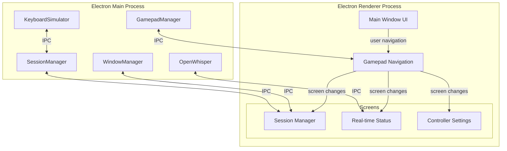

# Gamepad CLI Hub - GUI Rewrite Plan

## Overview
Transform from headless CLI to Electron desktop app with gamepad-first navigation.

## Architecture



## Screens

### 1. Session Manager (Main Screen)
```
+----------------------------------+
| Sessions          | Active: cc-1  |
+------------------+----------------+
| [cc-1] Claude    | ↑ D-Pad        |
| [cc-2] Claude    | ↓ D-Pad        |
| [gh-1] Copilot   | A: Focus       |
| [term] Generic   | B: Back        |
+------------------+----------------+
| [+] Spawn New    | X: Settings    |
+------------------+----------------+
```

### 2. Real-time Status (Overlay/Sidebar)
- Connected gamepads count
- Last button pressed
- Recent transcriptions
- Log messages

### 3. Controller Settings
- Visual Xbox controller SVG
- Click button to assign action
- Save/Load config

## Gamepad Navigation Scheme

| Button | Action |
|--------|--------|
| D-Pad Up/Down | Navigate list/menu |
| D-Pad Left/Right | Switch screens |
| A | Select/Activate |
| B | Back/Cancel |
| X | Open Settings |
| Y | Quick action (context-dependent) |
| Start | Pause/Resume |
| Select | Open Status overlay |

## Tech Stack

- **Electron** - Desktop app framework
- **Vanilla TypeScript** - No framework bloat
- **CSS Grid/Flexbox** - Layout
- **Sass/Less** (optional) - If needed for styling
- **Existing modules** - Reuse gamepad, keyboard, windows managers

## Implementation Steps

1. **Project Setup**
   - Install Electron
   - Create electron/main.ts entry point
   - Create electron/preload.ts for IPC bridge
   - Create renderer/index.html + CSS + TS

2. **IPC Layer**
   - Expose gamepad events to renderer
   - Expose session management to renderer
   - Expose config read/write to renderer

3. **Base UI Framework**
   - HTML structure for screens
   - CSS styling (dark theme by default)
   - Screen routing (hide/show sections)
   - Gamepad navigation system (focus management)

4. **Screen: Session Manager**
   - Render session list
   - Highlight active session
   - Spawn new session button
   - Focus session action

5. **Screen: Real-time Status**
   - Gamepad connection status
   - Button press log
   - Transcription display

6. **Screen: Controller Settings**
   - Xbox controller SVG
   - Binding editor
   - Config save/load

7. **Polish**
   - Animations/transitions
   - Keyboard shortcuts as backup
   - Error handling
   - Packaging

## File Structure

```
src/
├── electron/
│   ├── main.ts           # Electron main process
│   ├── preload.ts        # Context bridge for IPC
│   └── ipc-handlers.ts   # IPC event handlers
├── renderer/
│   ├── index.html
│   ├── styles.css
│   ├── main.ts
│   ├── screens/
│   │   ├── sessions.ts
│   │   ├── status.ts
│   │   └── settings.ts
│   └── navigation/
│       └── gamepad-nav.ts
├── input/
│   └── gamepad.ts        # Existing - reuse
├── session/
│   └── manager.ts        # Existing - reuse
└── output/
    └── keyboard.ts       # Existing - reuse
```

## Questions Before Implementation

1. Should the app be packaged as a single portable EXE?
2. Do you want voice input to always show a recording overlay?
3. Should sessions be automatically saved/restored on restart?
