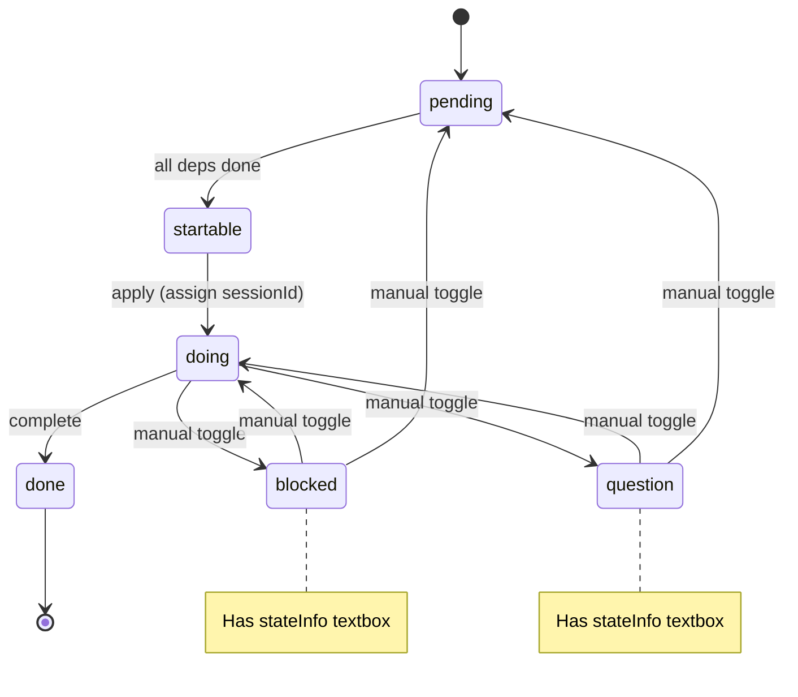

# Group 2: Plan State & Visibility System

**Priority:** MEDIUM-HIGH — architectural changes, new states
**Estimated complexity:** High (4 files, new IPC channels, state machine changes)

---

## Problems to Fix

- **#7 — Cross-session plan visibility:** Only the session working on a plan sees it; all sessions should see which plans are being worked on (by any session)
- **#7b — Show working plan on session card:** Session list item should display the current plan being worked on, right-aligned on the session title row (row 2)
- **#14 — Plan state toggle:** Need manual state toggle + new states: `blocked`, `question` + a state info textbox for context
- **#16 — Folder planner dots stale:** Folder group plan dots don't update when plans change

---

## Key Files

| File | Role | Key Lines |
|------|------|-----------|
| `src/session/plan-manager.ts` | Plan CRUD, DAG validation, state transitions, `recomputeStartable()` | Lines 116-142 (state transitions) |
| `src/types/plan.ts` | `PlanStatus` type definition | Line 7 (enum: pending/startable/doing/done) |
| `renderer/plans/plan-chips.ts` | Plan badge rendering on session cards | Lines 17-38 (badge creation) |
| `renderer/screens/sessions-plans.ts` | Folder plan buttons, dot updates | Lines 168-202 (`refreshPlanBadges()`) |
| `renderer/screens/sessions-render.ts` | Session card rendering | Lines 330-336 (badge insertion) |

---

## Root Causes

### #7 Cross-session visibility
- `planManager.getDoingForSession(sessionId)` returns only plans assigned to THAT session
- No method to get ALL doing plans across sessions for a directory
- Each session fetches independently via `planDoingForSession()` and `planStartableForDir()`
- **Fix:** Add `getAllDoingForDir(dirPath)` method to PlanManager; expose via IPC

### #7b Show working plan on session card
- Session cards show count badges (doing count + startable count) but not specific plan names
- Need to show the plan title being worked on, right-aligned on row 2 of the card
- **Fix:** Fetch `doing` plan title for active session, render as right-aligned text

### #14 State toggle + new states
- `PlanStatus` only has: `pending`, `startable`, `doing`, `done`
- Missing: `blocked` (waiting on external input), `question` (needs clarification)
- Need: state info textbox (reason for blocked/question)
- Need: manual state toggle (click to cycle or dropdown)
- `recomputeStartable()` only knows pending→startable based on deps; blocked/question need different handling
- **Fix:** Extend `PlanStatus` union type, add `stateInfo` field to plan items, update `recomputeStartable()` to skip blocked/question

### #16 Folder planner dots stale
- `refreshPlanBadges()` is called manually, not triggered by plan state changes
- No automatic update when plans change in other sessions
- **Fix:** Subscribe to `plan:changed` events in sessions-plans, trigger `refreshPlanBadges()` on change

---

## State Machine Changes

---

## New IPC Channels Needed

| Channel | Direction | Purpose |
|---------|-----------|---------|
| `plan:setState` | Renderer → Main | Manually set plan state + stateInfo |
| `plan:getAllDoingForDir` | Renderer → Main | Get all doing plans for a directory (cross-session) |

---

## Dependencies

- Depends on Group 1 (stable modal/plan screen interactions)
- Group 3's session card rendering will consume the new `getAllDoingForDir` data

---

## Tests to Write

- `plan-manager.test.ts` — Verify `getAllDoingForDir()` returns plans across sessions
- `plan-manager.test.ts` — Verify `blocked`/`question` states are preserved through `recomputeStartable()`
- `plan-manager.test.ts` — Verify state toggle validation (blocked→doing is valid, done→pending is not)
- `plan-chips.test.ts` — Verify badge rendering with new states
- `sessions-plans.test.ts` — Verify `refreshPlanBadges()` triggers on `plan:changed` event
