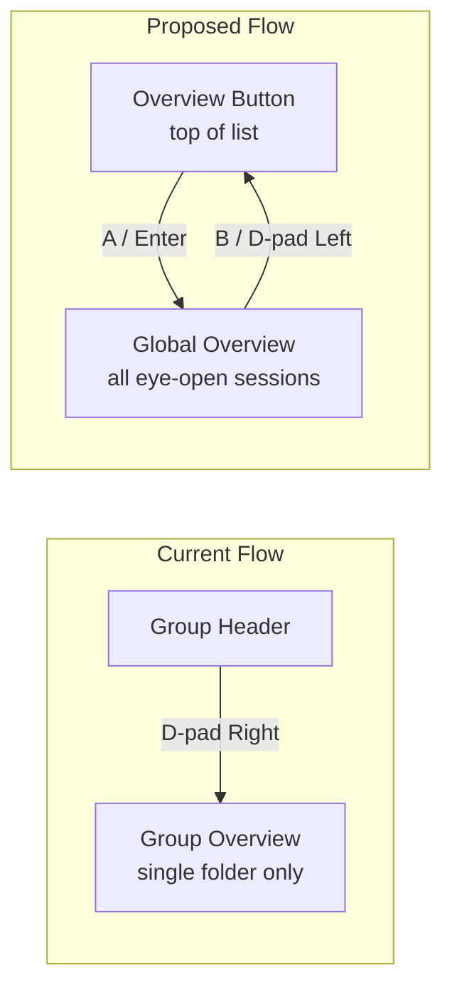

# Group 6: Overview Redesign — Top Button + Per-Session Eye Toggle

**Priority:** MEDIUM — UX improvement for multi-folder workflows
**Estimated complexity:** Medium-High (new navigation item, per-session persistence, overview rework)

---

## Problem

Current overview is activated by D-pad Right into a folder section. This is awkward with multiple folder groups — you must navigate to each folder header individually. There's no way to see all sessions across all folders at once, and no way to control which sessions appear in the overview.

---

## Proposed Design

### 1. Full-width "Overview" button at top of session listing

- New nav item at position 0 in the navList (above all folder groups)
- Full-width bar styled like group headers but visually distinct (e.g. subtle accent border)
- Shows text: "Overview" with a count badge of visible sessions (e.g. "5 sessions")
- Navigable with U/D d-pad like any other nav item
- A button / Enter activates overview mode
- B button exits overview mode back to session list

### 2. Eye toggle per session card

- New button inserted between rename (✎) and close (✕) buttons
- Icons: 👁 (eye-open = visible in overview) / 👁‍🗨 (eye-closed = hidden from overview)
- **Persists** per-session — stored in settings or session data
- Default state: eye-open (all sessions visible by default)
- Card column mapping becomes:
  - Column 0: main card (name, badges, timer)
  - Column 1: state dropdown
  - Column 2: rename button (✎)
  - Column 3: eye toggle (👁/👁‍🗨) ← NEW
  - Column 4: close button (✕)

### 3. Overview display with folder break marks

- When activated, shows a scrollable single-column grid of eye-open sessions across ALL folders
- Between sessions from different folders, render a **break mark**: a subtle divider line with the folder name (e.g. `── ~/projects/foo ──`)
- Each card shows the same content as current group-overview: session name, activity dot, last 10 lines of PTY output
- Scrollable via mouse wheel and gamepad scroll bindings

---

## Current Architecture (what changes)



---

## Key Files

| File | Role | What Changes |
|------|------|-------------|
| `renderer/session-groups.ts` | navList generation | Add overview button as nav item at index 0 |
| `renderer/screens/sessions-render.ts` | Session card rendering | Add eye toggle button (column 3), shift close to column 4 |
| `renderer/screens/sessions-spawn.ts` | D-pad navigation, session switching | Handle overview button activation, eye toggle column |
| `renderer/screens/group-overview.ts` | Overview grid rendering | Accept multiple folders, render break marks between groups |
| `renderer/screens/sessions-state.ts` | Card column state | Extend from 4 columns to 5 (add eye toggle column) |
| `renderer/screens/navigation.ts` | Overview button handling | Wire overview button A-press to show global overview |
| `src/config/loader.ts` | SessionGroupPrefs persistence | Add `overviewHidden: string[]` — session IDs with eye-closed |

---

## Data Model Changes

### SessionGroupPrefs (settings.yaml)

```yaml
# Existing
order:
  - "C:/Users/dev/project-a"
  - "C:/Users/dev/project-b"
collapsed:
  - "C:/Users/dev/project-b"
bookmarked:
  - "C:/Users/dev/project-a"

# NEW: sessions hidden from overview
overviewHidden:
  - "session-uuid-1"
  - "session-uuid-2"
```

### navList structure change

```typescript
// Before: [groupHeader, session, session, groupHeader, session, ...]
// After:  [overviewButton, groupHeader, session, session, groupHeader, session, ...]
//
// overviewButton is a special nav item:
interface NavItem {
  type: 'overview-button' | 'group-header' | 'session-card';
  sessionId?: string;
  groupDir?: string;
}
```

---

## Card Column Mapping (updated)

| Column | Session Card | Group Header |
|--------|-------------|-------------|
| 0 | Main (name, badges, timer) | Main (chevron, name, count) |
| 1 | State dropdown | Move up |
| 2 | Rename (✎) | Move down |
| 3 | Eye toggle (👁/👁‍🗨) ← NEW | Plans (🗺️) |
| 4 | Close (✕) | — |

---

## Overview Break Mark Rendering

When rendering the global overview, sessions are grouped by folder. Between groups, insert:

```
────────── ~/projects/foo ──────────
[session card 1]
[session card 2]

────────── ~/projects/bar ──────────
[session card 3]
```

- Styled as a thin line with centered folder name
- Not selectable/focusable — purely visual separator
- Only appears between different folders (not before first or after last)

---

## Navigation Behavior

### Overview button (nav item 0)
- **Up from overview button** → nothing (top of list)
- **Down from overview button** → first group header or session
- **A / Enter** → enter global overview mode
- **Left/Right** → no-op (single column item)

### Inside global overview
- **D-pad Up/Down** → scroll through visible session cards (skip break marks)
- **A** → switch to that session (exit overview, activate terminal)
- **B / D-pad Left** → exit overview, return to session list, focus overview button

### Eye toggle (column 3 on session cards)
- **A on eye toggle** → flip eye state, persist to settings, update badge count on overview button

---

## Dependencies

- **Independent** of Groups 1-5 — no shared code with plan/draft/editor systems
- The current `group-overview.ts` D-pad Right entry should still work for single-folder overview (keep as-is, or deprecate in favor of the global button)

---

## Tests to Write

- `session-groups.test.ts` — navList includes overview button at index 0
- `session-groups.test.ts` — `getVisibleSessions()` respects eye-open/closed state
- `sessions-render.test.ts` — eye toggle button renders with correct icon state
- `sessions-render.test.ts` — card has 5 columns (state, rename, eye, close)
- `group-overview.test.ts` — global overview shows sessions from multiple folders
- `group-overview.test.ts` — break marks rendered between folder groups
- `group-overview.test.ts` — break marks NOT rendered for single-folder or adjacent same-folder sessions
- `loader.test.ts` — `overviewHidden` persists to settings.yaml and roundtrips
- `navigation.test.ts` — overview button A-press enters overview, B exits
- `navigation.test.ts` — eye toggle persists across app restarts
