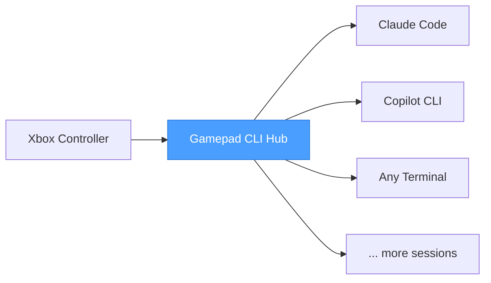

# Gamepad CLI Hub

**Your Xbox controller is now a command center for AI coding assistants.**

You're running Claude Code in one terminal, Copilot CLI in another, maybe a third session for a side project. Alt-tabbing between them is slow. Finding the right window is annoying. Typing repetitive commands is tedious.

Pick up your controller. One button spawns a new Claude Code session. Another fires up Copilot CLI. The D-pad flips between them instantly — the right window snaps to focus before you blink. Voice input lets you dictate prompts without touching the keyboard.

This is a session manager for people who run multiple AI-assisted terminals at once and got tired of the friction.

---

## What It Does

**Session Switching** — D-pad up/down cycles through your open CLI sessions. The app auto-detects running terminals, focuses the correct window, and keeps everything in sync. No manual window hunting.

**Instant Spawning** — Pull a trigger and a new CLI instance launches in your configured working directory, ready to go. Left trigger for Claude Code, right trigger for Copilot CLI — or remap to whatever tools you use.

**Voice Input** — Press B, speak your prompt, release. OpenWhisper transcribes locally (no cloud, no latency) and types it into the active session. Hands stay on the controller.

**Context-Aware Bindings** — The same button can do different things depending on which CLI is active. Press A in Claude Code and it clears the screen. Press A in Copilot CLI and it runs a different command. The app checks the active session type and dispatches accordingly.

**Profiles** — Save different button configurations for different workflows. Switch profiles with Back/Start on the controller, or from the settings screen. Deep focus session? Debugging profile? Pair programming layout? One button away.

**Full Settings UI** — Everything is configurable from the app itself. Add new CLI tools, set working directories, remap every button, manage profiles — five tabs, no YAML editing required (though the YAML files are there if you prefer).

---

## Controls

| Input | Action |
|-------|--------|
| D-Pad Up / Down | Switch between CLI sessions |
| Left Stick | Same as D-pad |
| Left / Right Bumper | Previous / next session |
| Left Trigger | Spawn new Claude Code instance |
| Right Trigger | Spawn new Copilot CLI instance |
| A | Clear screen |
| B | Voice input |
| X / Y | Custom command (per CLI type) |
| Back / Start | Previous / next profile |
| Guide | Bring hub window to foreground |

Every binding is remappable. Every action is configurable per CLI type.

---

## How It Fits Together



The app sits between your controller and your terminal windows. It reads gamepad input, resolves bindings, and sends keystrokes to whichever window should have focus. Your terminals are real, standalone windows — not embedded shells — so there are zero compatibility compromises.

Works with USB and Bluetooth Xbox controllers out of the box.

---

## Get Started

```bash
npm install
npm start
```

Plug in a controller. The app detects it automatically and you're ready to go.

---

## Built For

- Developers running multiple AI coding assistants side by side
- Anyone who uses CLI tools heavily and wants a physical control surface
- People who think keyboards are great but controllers are faster for switching context
- The kind of person who automates their automation
