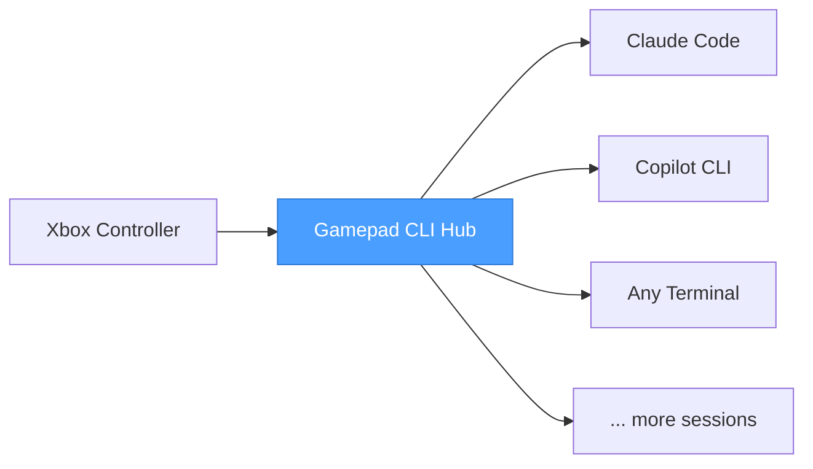

# Gamepad CLI Hub

**Your Xbox controller is now a command center for AI coding assistants.**

You're running Claude Code in one terminal, Copilot CLI in another, maybe a third session for a side project. Alt-tabbing between them is slow. Finding the right window is annoying. Typing repetitive commands is tedious.

Pick up your controller. One button spawns a new Claude Code session. Another fires up Copilot CLI. The D-pad flips between them instantly — the right window snaps to focus before you blink. Hold B to hold down a key in whichever CLI supports it — the controller just holds the key, your CLI does the rest.

This is a session manager for people who run multiple AI-assisted terminals at once and got tired of the friction.

---

## What It Does

**Session Switching** — D-pad up/down cycles through your open CLI sessions. The app auto-detects running terminals, focuses the correct window, and keeps everything in sync. No manual window hunting.

**Instant Spawning** — Pull a trigger and a new CLI instance launches in your configured working directory, ready to go. Left trigger for Claude Code, right trigger for Copilot CLI — or remap to whatever tools you use.

**Hold-Key Passthrough** — Press and hold B, and a configurable key combo is held down in the active terminal. Release B, the key releases. Your CLI handles the rest — Claude Code hears Space for voice input, any app that listens for a held key gets its expected combo. No extra dependencies, just a key held at the right time.

**Session Persistence** — Sessions survive crashes and restarts. The app saves session state to disk after every change and restores on startup. A health check periodically removes dead sessions so the list stays clean.

**HUD Overlay** — Press the Sandwich/Guide button from anywhere to pop up a floating session switcher. Navigate with D-pad, select with A, dismiss with B. Fast context switching without leaving what you're doing.

**Analog Sticks** — Left stick emulates D-pad plus sends arrow keys in cursor mode. Right stick scrolls (PageUp/PageDown). Both configurable per-profile with deadzone and repeat rate settings.

**Haptic Feedback** — Feel the controller pulse when you activate hold-key or switch sessions. Configurable in settings — turn it off if you prefer silence.

**Context-Aware Bindings** — The same button can do different things depending on which CLI is active. Press A in Claude Code and it clears the screen. Press A in Copilot CLI and it runs a different command. The app checks the active session type and dispatches accordingly.

**Profiles** — Save different button configurations for different workflows. Switch profiles with Back/Start on the controller, or from the settings screen. Deep focus session? Debugging profile? Pair programming layout? One button away.

**Full Settings UI** — Everything is configurable from the app itself. Add new CLI tools, set working directories, remap every button, manage profiles — five tabs, no YAML editing required (though the YAML files are there if you prefer).

---

## Controls

| Input | Action |
|-------|--------|
| D-Pad Up / Down | Switch between CLI sessions |
| Left Stick | D-pad emulation + arrow keys (cursor mode) |
| Right Stick | Scroll (PageUp/PageDown) |
| Left / Right Bumper | Previous / next session |
| Left Trigger | Spawn new Claude Code instance |
| Right Trigger | Spawn new Copilot CLI instance |
| A | Clear screen |
| B | Hold keys (e.g. Space for voice passthrough) |
| X / Y | Custom command (per CLI type) |
| Back / Start | Previous / next profile |
| Sandwich / Guide | Toggle HUD overlay (session quick-switch) |

Every binding is remappable. Every action is configurable per CLI type.

---

## How It Fits Together



The app sits between your controller and your terminal windows. It reads gamepad input (buttons and analog sticks), resolves bindings, and sends keystrokes to whichever window should have focus. Your terminals are real, standalone windows — not embedded shells — so there are zero compatibility compromises.

Sessions persist across restarts — if the app crashes or you reboot, it picks up where you left off and cleans up any sessions that didn't survive.

Works with USB and Bluetooth Xbox controllers out of the box.

---

## Get Started

```bash
npm install
npm start
```

Plug in a controller. The app detects it automatically and you're ready to go.

---

## Built For

- Developers running multiple AI coding assistants side by side
- Anyone who uses CLI tools heavily and wants a physical control surface
- People who think keyboards are great but controllers are faster for switching context
- The kind of person who automates their automation
