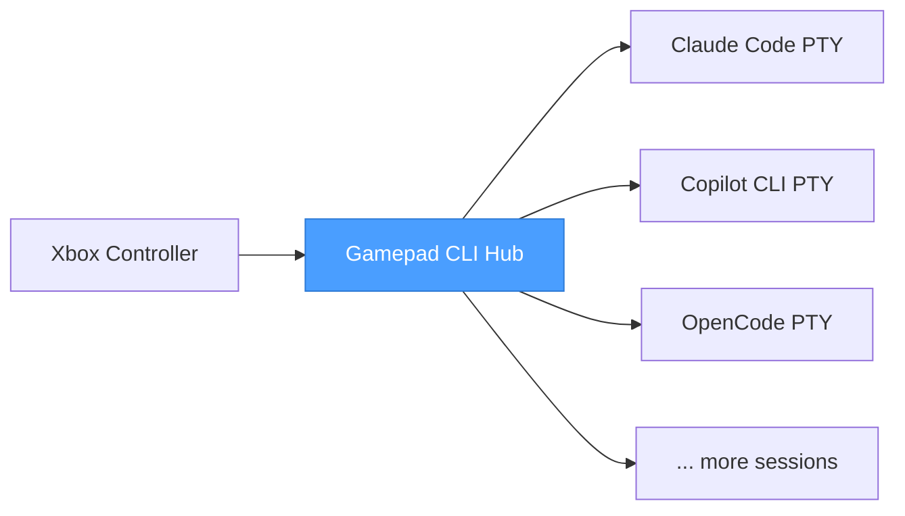

# Gamepad CLI Hub

**Your Xbox controller is now a command center for AI coding assistants.**

You're running Claude Code in one terminal, Copilot CLI in another, maybe a third session for a side project. Alt-tabbing between them is slow. Finding the right window is annoying. Typing repetitive commands is tedious.

Pick up your controller. One button spawns a new Claude Code session — it opens as an embedded terminal right inside the app. Another fires up Copilot CLI in its own tab. The D-pad flips between tabs instantly, auto-selecting the terminal so you can start typing right away. Ctrl+Tab cycles tabs from the keyboard.

This is a session manager for people who run multiple AI-assisted terminals at once and got tired of the friction.

---

## What It Does

**Session Switching** — D-pad up/down cycles through your open terminal tabs. Each session runs as an embedded terminal inside the app — no external windows to hunt for. The tab bar shows colored dots so you can see which CLI is implementing, waiting, or idle at a glance.

**Instant Spawning** — Pull a trigger and a new CLI instance launches in an embedded terminal, ready to go. Left trigger for Claude Code, right bumper for Copilot CLI — or remap to whatever tools you use. An optional initial prompt auto-types a command after spawn.

**Keystroke Sequences** — Button bindings support a `sequence` field for scripting complex input patterns. Type text, press Enter, wait, send Ctrl+C — all in one binding. Same syntax configures initial prompts for newly spawned sessions.

**Session Persistence** — Sessions survive crashes and restarts. The app saves session state to disk after every change and restores on startup. A health check periodically removes dead sessions so the list stays clean.

**Quick Access** — Press the Sandwich/Guide button from anywhere to snap back to the session list. The app lives as a slim sidebar on the edge of your screen — always visible, never in the way. D-pad navigation auto-selects the terminal — no extra button presses needed.

**Analog Sticks** — Each stick emits virtual button names (LeftStickUp, RightStickDown, etc.) that can be bound to any action. If no binding exists, right stick scrolls the terminal buffer. Both configurable per-profile with deadzone and repeat rate settings.

**Haptic Feedback** — Feel the controller pulse when you switch sessions or trigger actions. Configurable in settings — turn it off if you prefer silence.

**Context-Aware Bindings** — The same button can do different things depending on which CLI is active. Press A in Claude Code and it clears the screen. Press A in Copilot CLI and it runs a different command. The app checks the active session type and dispatches accordingly.

**Profiles** — Save different button configurations for different workflows. Switch profiles with Back/Start on the controller, or from the settings screen. Deep focus session? Debugging profile? Pair programming layout? One button away.

**Full Settings UI** — Everything is configurable from the app itself. Add new CLI tools, set working directories, remap every button, manage profiles — five tabs, no YAML editing required (though the YAML files are there if you prefer).

---

## Controls

| Input | Action |
|-------|--------|
| D-Pad Up / Down | Switch sessions (auto-selects terminal) |
| Left Stick | Same as D-pad |
| Right Stick | Scroll terminal buffer |
| A | Spawn action / configurable per-CLI binding |
| B | Back to sessions zone / configurable per-CLI binding |
| X | Close terminal |
| Y | (planned: cycle terminal state) |
| Left Trigger | Spawn Claude Code |
| Right Bumper | Spawn Copilot CLI |
| Back / Start | Previous / next profile |
| Sandwich / Guide | Focus hub + show sessions |
| Ctrl+Tab | Next terminal tab |
| Ctrl+Shift+Tab | Previous terminal tab |

Every binding is remappable. Every action is configurable per CLI type.

### Keystroke Sequences

Button bindings and initial prompts use the same **sequence parser syntax**:

```yaml
A:
  action: keyboard
  sequence: |
    /clear
    {Wait 500}
    yes{Enter}
    {Ctrl+C}
```

| Token | Effect |
|-------|--------|
| Plain text | Sent as literal characters to PTY |
| `{Enter}`, `{Tab}`, `{Escape}` | Named keys |
| `{Ctrl+C}`, `{Ctrl+Z}` | Modifier + key combos |
| `{Wait 500}` | Pause N ms (max 30000) |
| `{Ctrl Down}`, `{Ctrl Up}` | Hold/release modifier |
| `{{`, `}}` | Literal `{` and `}` |

See [Keystroke Sequences](docs/keystroke-sequences.md) for the full syntax reference.

---

## How It Fits Together



The app sits between your controller and your AI coding assistants. It reads gamepad input via the Browser Gamepad API (buttons and analog sticks), resolves bindings, and routes keystrokes to embedded terminal sessions running inside the app via PTY. Each session renders in its own xterm.js tab — a tab bar with colored state dots (🟢 implementing, 🟠 waiting, 🔵 planning, ⚪ idle) sits above the terminal area.

**D-pad navigation auto-selects terminals** — press up/down to switch sessions and the terminal activates immediately. Keyboard input always routes to the active terminal. Non-navigation buttons (XYAB, bumpers, triggers) pass through to per-CLI configurable bindings.

**State detection:** The app watches PTY output for AIAGENT-* keywords and auto-detects whether a CLI is implementing, waiting, or planning. A pipeline queue auto-dispatches work to waiting sessions.

Sessions persist across restarts — if the app crashes or you reboot, it picks up where you left off.

Works with USB and Bluetooth Xbox controllers out of the box.

---

## Get Started

```bash
npm install
npm start
```

Plug in a controller. The app detects it automatically and you're ready to go.

---

## Built For

- Developers running multiple AI coding assistants side by side
- Anyone who uses CLI tools heavily and wants a physical control surface
- People who think keyboards are great but controllers are faster for switching context
- The kind of person who automates their automation
