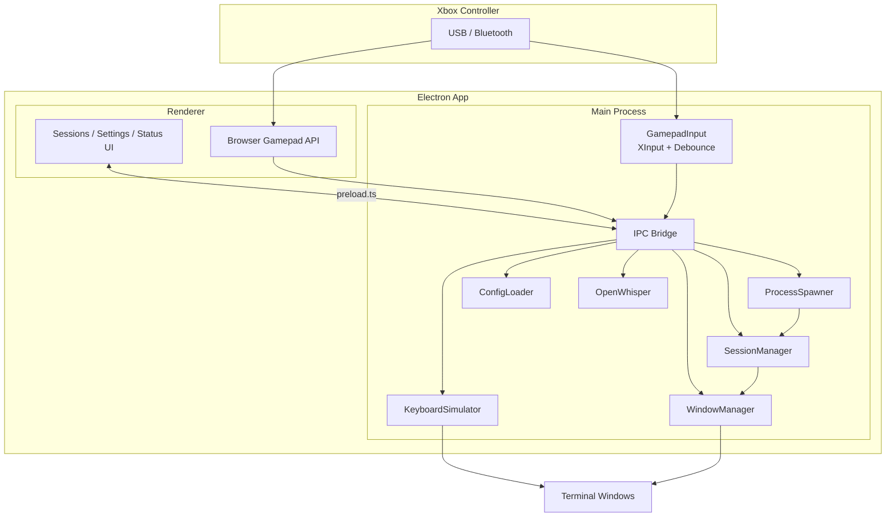

# gamepad-cli-hub

Xbox controller → multi-CLI session manager

Control multiple CLI sessions (Claude Code, Copilot CLI, etc.) with an Xbox controller. Built as an Electron desktop app on Windows.

## Features

- 🎮 Xbox controller input detection (XInput + Browser Gamepad API)
- 🔄 Switch between CLI sessions with D-pad (auto-focuses selected window)
- ⚡ Spawn new CLI instances on demand
- ⌨️ Send keyboard commands to active session
- 🎙️ Voice input via OpenWhisper transcription
- 👤 Multiple binding profiles (create/switch/delete via UI or gamepad)
- 🔧 Configurable CLI types, working directories, and per-profile bindings

## System Overview



### How It Works

1. **Gamepad input** is detected via PowerShell XInput polling (wired) or Browser Gamepad API (Bluetooth), with 600ms debounce
2. **Button presses** are resolved against the active profile's bindings — CLI-specific bindings are checked first, then global
3. **Actions execute**: send keystrokes, spawn CLI processes, switch sessions, or trigger voice transcription
4. **Window management** ensures the correct terminal window is focused before any keystroke is sent

### Modules

| Module | Purpose |
|--------|---------|
| `src/input/gamepad.ts` | XInput polling, debounce, button-press events |
| `src/output/keyboard.ts` | Keystroke simulation (@jitsi/robotjs) |
| `src/output/windows.ts` | Win32 window enumeration/focus (PowerShell) |
| `src/session/manager.ts` | Session tracking, switching (EventEmitter) |
| `src/session/spawner.ts` | Spawn detached CLI processes |
| `src/config/loader.ts` | Split YAML config + profile CRUD |
| `src/voice/openwhisper.ts` | Audio recording + whisper.cpp transcription |
| `src/input/xinput-poll.ps1` | XInput polling script (extracted from inline) |
| `src/utils/logger.ts` | Winston logger (used across all src/ modules) |
| `src/electron/ipc/handlers.ts` | 60-line orchestrator delegating to 10 domain handler files under `src/electron/ipc/` |
| `renderer/main.ts` | 230-line entry point; UI split into `state`, `utils`, `bindings`, `navigation`, `screens/{sessions,settings,status}`, `modals/{dir-picker,binding-editor}` |

### Tech Stack

| Component | Technology |
|-----------|-----------|
| Desktop shell | Electron 41 |
| Language | TypeScript (ESM) |
| Bundler | esbuild |
| Tests | Vitest |
| Gamepad | PowerShell XInput + Browser Gamepad API |
| Keyboard | @jitsi/robotjs |
| Windows | PowerShell Win32 API |
| Voice | OpenWhisper (whisper.cpp) |
| Config | YAML |
| Logging | Winston |

## Key Controls

| Input | Action |
|-------|--------|
| D-Pad Down | Switch to next CLI session (auto-focuses window) |
| D-Pad Left/Right | Available for custom bindings |
| Left Stick | D-pad replacement (same actions as D-pad) |
| Left/Right Bumper | Switch between sessions (previous/next) |
| Left Trigger | Spawn new Claude Code instance |
| Right Trigger | Spawn new Copilot CLI instance |
| A | Clear screen (per CLI type) |
| B | OpenWhisper voice input or Escape (per CLI type) |
| X/Y | Custom commands per CLI type |
| Back/Start | Switch profile (previous/next) |
| Guide (center button) | Bring hub window to foreground |

## Configuration

Config is split across multiple YAML files:

```
config/
├── settings.yaml          # Active profile name
├── tools.yaml             # CLI types (spawn commands) + OpenWhisper config
├── directories.yaml       # Working directory presets
└── profiles/
    └── default.yaml       # Button bindings (per CLI type + global)
```

### Binding Priority

When a button is pressed, CLI-specific bindings are checked first. If no CLI-specific binding exists for the active session's CLI type, the global binding is used. This means a button can have different actions depending on which CLI session is active.

Profiles, CLI tools, and working directories can also be managed from the **Settings** screen in the app (5 tabs: Profiles, Global, per-CLI, Tools, Directories).

## Usage

```bash
npm install
npm start
```
