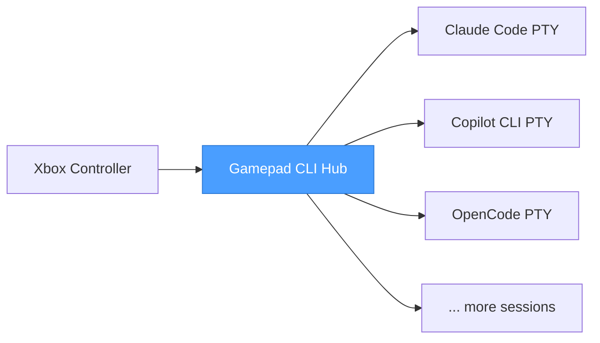

# Gamepad CLI Hub

**Your Xbox controller is now a command center for AI coding assistants.**

You're running Claude Code in one terminal, Copilot CLI in another, maybe a third session for a side project. Alt-tabbing between them is slow. Finding the right window is annoying. Typing repetitive commands is tedious.

Pick up your controller. One button spawns a new Claude Code session — it opens as an embedded terminal right inside the app. Another fires up Copilot CLI in its own tab. The D-pad flips between tabs instantly, auto-selecting the terminal so you can start typing right away.

This is a session manager for people who run multiple AI-assisted terminals at once and got tired of the friction.

---

## What Is This?

Gamepad CLI Hub is an Electron desktop app that lets you control multiple AI coding CLI sessions from a single Xbox controller. Each CLI runs as an embedded terminal (via node-pty + xterm.js) — no external windows to manage.

**Why use it?**

- **Multi-CLI workflows** — Run Claude Code, Copilot CLI, and other AI tools side-by-side
- **Voice control ready** — Designed to work with OpenWhisper for voice-to-text input
- **Physical controls** — D-pad, buttons, and analog sticks replace keyboard shortcuts
- **Always-on sidebar** — Lives as a slim frameless window on your screen edge

---

## Voice Control

The app is designed to work with **OpenWhisper** (or any voice-to-text tool that listens for a hotkey). Bind a gamepad button to simulate a keypress, and OpenWhisper starts listening. When it transcribes your speech, the text flows directly into the active terminal.

### How Voice Bindings Work

Voice bindings simulate a keypress that triggers your voice recognition software:

```yaml
LeftTrigger:
  action: voice
  key: F1
  mode: tap
```

When you press the button, the app simulates the F1 key. If OpenWhisper is configured to listen on F1, it starts capturing your voice. The transcribed text is then typed into the terminal.

### Routing Modes

Voice bindings support two routing modes:

| Mode | Description |
|------|-------------|
| **OS (default)** | Key is simulated at the OS level via robotjs — works with external apps like OpenWhisper |
| **Terminal** | Key is sent as an escape sequence to the active PTY — for terminal-resident voice tools |

To route to the terminal explicitly:

```yaml
RightBumper:
  action: voice
  key: F2
  mode: tap
  target: terminal
```

### Example OpenWhisper Workflow

1. Configure OpenWhisper to listen for F1
2. Map your controller's Left Trigger to a `voice` binding with `key: F1`
3. Press the trigger → F1 is simulated → OpenWhisper starts listening
4. Speak your command → OpenWhisper transcribes and types the text
5. The text appears in the active terminal

---

## Quick Start

```bash
npm install
npm start
```

Plug in a controller (USB or Bluetooth). The app detects it automatically.

---

## Controls

| Input | Action |
|-------|--------|
| D-Pad Up / Down | Switch sessions (auto-selects terminal) |
| D-Pad Right | Open group overview (from group header) |
| Left Stick | Same as D-pad |
| Right Stick | Scroll terminal buffer (configurable) |
| A | Configurable per-CLI binding |
| B | Back / configurable per-CLI binding |
| X | Configurable per-CLI binding |
| Y | (planned: cycle terminal state) |
| Left Trigger | Spawn Claude Code (default) |
| Right Bumper | Spawn Copilot CLI (default) |
| Left/Right Trigger | Voice activation (configure F1/F2 etc.) |
| Back / Start | Previous / next profile |
| Sandwich / Guide | Focus hub + show sessions |
| Ctrl+Tab | Next terminal tab |
| Ctrl+Shift+Tab | Previous terminal tab |

Every binding is remappable. Every action is configurable per CLI type.

---

## Sequence Syntax

Button bindings and initial prompts use a sequence parser for scripting complex input patterns:

```yaml
A:
  action: keyboard
  sequence: |
    /clear
    {Wait 500}
    yes{Enter}
    {Ctrl+C}
```

| Token | Effect |
|-------|--------|
| Plain text | Sent as literal characters to PTY |
| `{Enter}`, `{Tab}`, `{Escape}`, `{Delete}` | Named keys |
| `{Ctrl+C}`, `{Ctrl+Z}`, `{Ctrl+V}` | Modifier + key combos |
| `{Wait 500}` | Pause N ms (max 30000) |
| `{Ctrl Down}`, `{Ctrl Up}` | Hold/release modifier |
| `{{`, `}}` | Literal `{` and `}` |

### Initial Prompts

Automatically send commands when a session spawns:

```yaml
tools:
  claude-code:
    name: Claude Code
    command: claude
    initialPrompt:
      - label: "Initialize"
        sequence: "/init{Enter}"
    initialPromptDelay: 2000
```

---

## How It Fits Together



The app sits between your controller and your AI coding assistants. It reads gamepad input via the Browser Gamepad API, resolves bindings, and routes input to embedded terminal sessions via PTY.

**D-pad navigation auto-selects terminals** — press up/down to switch sessions and the terminal activates immediately. Keyboard input always routes to the active terminal.

**State detection:** The app watches PTY output for `AIAGENT-*` keywords and auto-detects whether a CLI is implementing, planning, completed, or idle. Colored dots in the tab bar show the state:

- 🟢 implementing
- 🟠 waiting
- 🔵 planning
- 🟡 completed
- ⚪ idle

**Session persistence:** Sessions survive crashes and restarts. State is saved to disk after every change.

---

## Configuration

Everything is configurable from the in-app settings UI — no YAML editing required. But the config files are there if you prefer hand-editing.

### Profiles

Profiles are self-contained YAML files storing tools, directories, bindings, stick config, and D-pad settings. Switch profiles with Back/Start or from the settings screen.

```
config/
├── settings.yaml
├── sessions.yaml
└── profiles/
    └── default.yaml
```

### Binding Actions

| Action | Description |
|--------|-------------|
| `keyboard` | Send a sequence of keystrokes to the terminal |
| `voice` | Simulate a keypress for voice recognition (OS or PTY) |
| `scroll` | Scroll the terminal buffer up/down |
| `context-menu` | Open the context menu overlay |
| `sequence-list` | Show a picker of named sequences (via group reference or inline items) |

### Per-CLI Bindings

The same button can do different things depending on which CLI is active:

```yaml
bindings:
  claude-code:
    A:
      action: keyboard
      sequence: "/clear{Enter}"
  copilot-cli:
    A:
      action: keyboard
      sequence: "git status{Enter}"
```

---

## Built For

- Developers running multiple AI coding assistants side by side
- Anyone who uses CLI tools heavily and wants a physical control surface
- People who think keyboards are great but controllers are faster for switching context
- The kind of person who automates their automation
