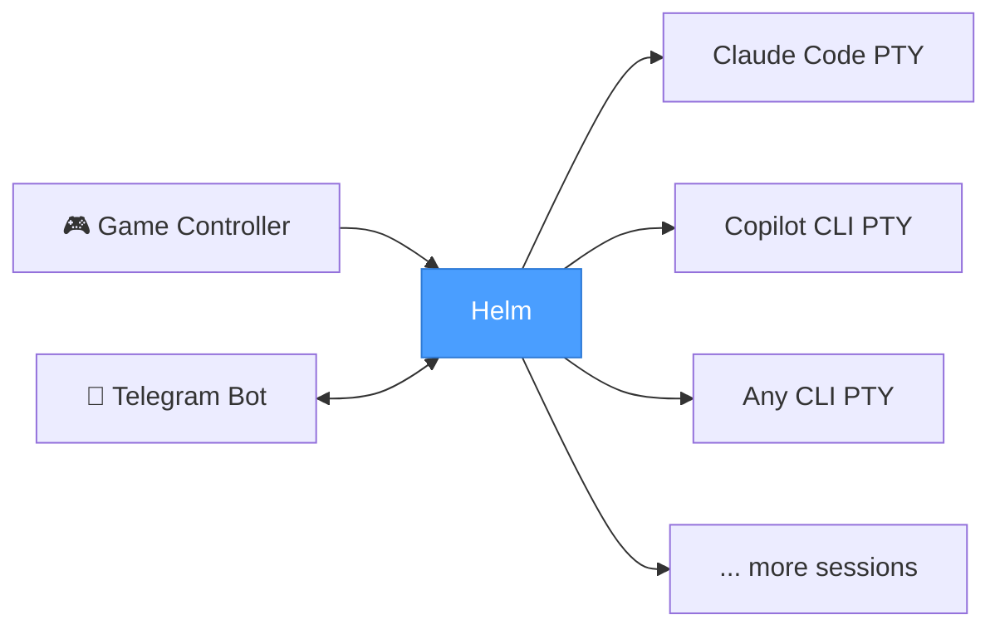

# Helm

**Helm - steer your fleet of agents**

You're running Claude Code in one terminal, Copilot CLI in another, maybe a third session for a side project. Alt-tabbing between them is slow. Finding the right window is annoying. Typing repetitive commands is tedious.

Pick up your controller. One button spawns a new Claude Code session — it opens as an embedded terminal right inside the app. Another fires up Copilot CLI in its own tab. The D-pad flips between sessions instantly, auto-selecting the terminal so you can start typing right away. Step away from your desk? Monitor and control everything from your phone via the Telegram bot.

This is a session manager for people who run multiple AI-assisted terminals at once and got tired of the friction.

---

## What Is This?

Helm is an Electron desktop app that lets you control multiple AI coding CLI sessions from a game controller. Each CLI runs as an embedded terminal (via node-pty + xterm.js) — no external windows to manage.

**Why use it?**

- **Multi-CLI workflows** — Run Claude Code, Copilot CLI, and other AI tools side-by-side in embedded terminals
- **Physical controls** — D-pad, buttons, and analog sticks replace keyboard shortcuts. Works with Xbox controllers and generic/DirectInput gamepads
- **Session groups** — Sessions grouped by working directory with collapsible headers and a live preview grid
- **Telegram bot** — Remote session control, output monitoring, and spawning from your phone
- **Voice control ready** — Designed to work with OpenWhisper for voice-to-text input
- **Session resume** — Sessions survive app crashes and restarts, with per-CLI resume commands

---

## Quick Start

```bash
npm install
npm start
```

Plug in a controller (USB or Bluetooth). The app detects it automatically — Xbox controllers and generic/DirectInput gamepads are supported.

---

## Controls

### Gamepad

| Input | Action |
|-------|--------|
| D-Pad Up / Down | Switch sessions (auto-selects terminal) |
| D-Pad Right | Open group overview (from group header) / cycle card sub-elements |
| D-Pad Left | Back one sub-element column |
| Left Stick | Same as D-pad |
| Right Stick | Scroll terminal buffer (configurable per-profile) |
| A | Confirm / configurable per-CLI binding |
| B | Back / configurable per-CLI binding |
| X | Close session / configurable per-CLI binding |
| Y | Configurable per-CLI binding |
| Left Trigger | Spawn Claude Code (default) |
| Right Bumper | Spawn Copilot CLI (default) |
| Back / Start | Previous / next profile |
| Sandwich / Guide | Focus hub window + show sessions screen |

### Keyboard

| Input | Action |
|-------|--------|
| Ctrl+Tab / Ctrl+Shift+Tab | Next / previous terminal tab |
| Arrow keys | Navigate sessions (D-pad equivalents) |
| Enter | Confirm (A button) |
| Escape | Back (B button) |
| Delete | Close (X button) |
| Ctrl+V | Paste clipboard text to active terminal |
| Ctrl+G | Open in-app Prompt Editor (textarea + recent-prompts history) — Ctrl+Enter sends to active terminal |

Every binding is remappable per CLI type. See [docs/controls.md](docs/controls.md) for the full mapping.

---

## Session Groups & Overview

Sessions are automatically grouped by working directory. Each group has a collapsible header showing the directory name and session count.

**Overview button** — A full-width "Overview" bar sits above all groups in the session list (press A or Enter when focused). Opens a global preview grid of all eye-visible sessions across every folder, with folder break marks between groups.

**Group overview** — Press D-pad Right on a group header (or click the group name) to open a per-folder preview grid showing only sessions in that directory.

Both overview modes show:
- Each card: session name, activity dot, and the last 10 lines of terminal output
- Live-updating previews (500ms throttle)
- Navigate with D-pad, A to select, X to close
- Scrollable via right stick or mouse wheel

**Eye toggle (👁 / 👁‍🗨)** — Each session card has an eye button (D-pad Right to column 3). Toggle it to hide a session from the global overview without closing it. Hidden sessions still appear in the sidebar list and their own group overview.

See [docs/group-overview.md](docs/group-overview.md) for details.

---

## Activity Monitoring

The app tracks PTY I/O timing and shows colored activity dots on session cards and tabs:

- 🟢 **Active** — producing output or receiving user input
- 🔵 **Inactive** — silent for more than 10 seconds
- ⚪ **Idle** — silent for more than 5 minutes

The app also watches for `AIAGENT-*` keywords in PTY output to detect CLI state (implementing, planning, completed, idle) — used for auto-handoff pipeline and notifications.

**Windows toast notifications** fire when a session goes inactive while implementing or planning — so you know when a long task finishes without staring at the screen.

---

## Telegram Bot

Control your sessions remotely via a Telegram bot with forum topics. Each session gets its own topic thread.

### Commands

| Command | Description |
|---------|-------------|
| `/sessions` | Browse directories → sessions with inline buttons |
| `/status` | Show all session states at a glance |
| `/spawn` | 3-step wizard: pick CLI tool → pick directory → session created |
| `/send <text>` | Send text directly to the active session's PTY |
| `/output` | Smart output summary (tests, errors, modified files, recent lines) |
| `/close` | Close the current topic's session |

### Features

- **Activity-gated output** — Terminal output streams to Telegram, but batched intelligently: buffers while the session is active, flushes when it goes quiet (>10s silence). No more wall-of-text spam during builds
- **Prompt echo** — User input sent from the app appears as `📝 typed text` in the topic
- **Session control** — Continue (Enter), Cancel (Ctrl+C), Send Prompt with confirmation
- **Command palette** — Execute preconfigured CLI sequences from inline buttons
- **Pinned dashboard** — Auto-updating message with all sessions grouped by directory
- **Topic input forwarding** — Type in a session's topic and it goes straight to the PTY

---

## Context Menu

Right-click the terminal area (or bind a button to `context-menu`) for quick actions:

| Item | Description |
|------|-------------|
| 📋 Copy | Copy terminal selection to clipboard |
| 📥 Paste | Paste clipboard to active PTY |
| ✏️ Compose in Editor | Open in-app Prompt Editor to compose prompt — sent to active PTY on send |
| ➕ New Session | Quick-spawn picker (pre-selects active CLI type & directory) |
| 📋➕ New Session with Selection | Spawn with selected text as context |
| ⏩ Prompts | Open sequence picker with preconfigured commands |

---

## Voice Control

The app works with **OpenWhisper** (or any voice-to-text tool that listens for a hotkey). Bind a gamepad button to simulate a keypress, and OpenWhisper starts listening. When it transcribes your speech, the text flows directly into the active terminal.

```yaml
LeftTrigger:
  action: voice
  key: F1
  mode: tap
```

Voice bindings support two routing modes:

| Mode | Description |
|------|-------------|
| **OS (default)** | Key simulated at the OS level via robotjs — works with external apps |
| **Terminal** | Key sent as an escape sequence to the active PTY (`target: terminal`) |

---

## Sequence Syntax

Button bindings and initial prompts use a sequence parser for scripting complex input:

```yaml
A:
  action: keyboard
  sequence: |
    /clear
    {Wait 500}
    yes{Enter}
    {Ctrl+C}
```

| Token | Effect |
|-------|--------|
| Plain text | Sent as literal characters to PTY |
| `{Enter}`, `{Tab}`, `{Escape}`, `{Delete}` | Named keys |
| `{Ctrl+C}`, `{Ctrl+Z}`, `{Ctrl+V}` | Modifier + key combos |
| `{Wait 500}` | Pause N ms (max 30000) |
| `{Ctrl Down}`, `{Ctrl Up}` | Hold/release modifier |
| `{{`, `}}` | Literal `{` and `}` |

### Chip Bar Template Expansions

Chip bar quick actions also support these `{...}` template expansions inside their sequence text:

| Template | Expands to |
|----------|------------|
| `{cwd}` | Active session working directory |
| `{cliType}` | Active session CLI type key |
| `{sessionName}` | Active session display name |
| `{inboxDir}` | Writable planner inbox path at `config/plans/incoming` |
| `{plansDir}` | Alias for `{inboxDir}` for backward compatibility |

In packaged installs, `{inboxDir}` and `{plansDir}` resolve from the app's writable config directory under the user's app-data folder, not the read-only install directory.

### Initial Prompts

Automatically send commands when a session spawns:

```yaml
tools:
  claude-code:
    name: Claude Code
    command: claude
    initialPrompt:
      - label: "Initialize"
        sequence: "/init{Enter}"
    initialPromptDelay: 2000
```

---

## How It Fits Together



The app sits between your input devices and your AI coding assistants. It reads gamepad input via the Browser Gamepad API, resolves per-CLI bindings, and routes input to embedded terminal sessions via PTY.

**D-pad navigation auto-selects terminals** — press up/down to switch sessions and the terminal activates immediately. Keyboard input always routes to the active terminal.

**Session persistence** — Sessions are saved to disk after every change and restored on startup. Dead processes are cleaned up via PTY exit events. Per-CLI resume commands reconnect to existing CLI sessions.

---

## Configuration

Everything is configurable from the in-app settings UI — Profiles, per-CLI bindings, Tools, Directories, and Telegram tabs. Config files are there if you prefer hand-editing.

### Profiles

Profiles are self-contained YAML files storing tools, directories, bindings, stick config, and D-pad settings. Switch profiles with Back/Start or from the settings screen.

```
config/
├── settings.yaml          # Active profile + feature toggles
├── sessions.yaml          # Persisted session state (auto-managed)
└── profiles/
    └── default.yaml       # Tools + dirs + bindings + sticks + dpad
```

### Binding Actions

| Action | Description |
|--------|-------------|
| `keyboard` | Send a sequence of keystrokes to the terminal |
| `voice` | Simulate a keypress for voice recognition (OS or PTY routing) |
| `scroll` | Scroll the terminal buffer up/down |
| `context-menu` | Open the context menu overlay |
| `sequence-list` | Show a picker of named sequences (reference a group or inline items) |

### Per-CLI Bindings

The same button can do different things depending on which CLI is active:

```yaml
bindings:
  claude-code:
    A:
      action: keyboard
      sequence: "/clear{Enter}"
  copilot-cli:
    A:
      action: keyboard
      sequence: "git status{Enter}"
```

### Stick Configuration

```yaml
sticks:
  left:
    mode: cursor      # cursor | scroll | disabled
    deadzone: 8000
    repeatRate: 60
  right:
    mode: scroll
    deadzone: 0.25
    repeatRate: 60
```

---

## Tech Stack

| Component | Technology |
|-----------|-----------|
| Desktop shell | Electron 41 |
| Language | TypeScript (ESM) |
| Bundler | esbuild |
| Tests | Vitest |
| Gamepad input | Browser Gamepad API |
| Terminals | node-pty + xterm.js |
| Remote control | Telegram Bot API (node-telegram-bot-api) |
| Config | YAML |
| Logging | Winston (daily rotation) |

---

## Build & Test

```bash
npm run build      # esbuild: electron + preload + renderer
npm run start      # Build and launch
npm run package    # Build + package portable Windows EXE
npm test           # Vitest suite
```

See [docs/build-and-test.md](docs/build-and-test.md) for details.

---

## Documentation

Detailed reference docs are in `docs/`:

| Document | Content |
|----------|---------|
| [modules.md](docs/modules.md) | Module reference — all modules with files and responsibilities |
| [config-system.md](docs/config-system.md) | Profile YAML, binding types, sequence parser, stick/dpad config |
| [controls.md](docs/controls.md) | Gamepad + keyboard mappings, navigation priority chain |
| [terminal-architecture.md](docs/terminal-architecture.md) | PTY stack, input/output routing, activity dots |
 | [group-overview.md](docs/group-overview.md) | Session preview grid — entry/exit, navigation, live previews |
 | [file-structure.md](docs/file-structure.md) | Complete directory tree with per-file descriptions |
 | [build-and-test.md](docs/build-and-test.md) | Build commands, output paths, tech stack details |
 | [Plans/delivery-report.html](Plans/delivery-report.html) | Delivery summary for the Helm implementation batch (Groups 1-8) |

---

## Built For

- Developers running multiple AI coding assistants side by side
- Anyone who wants physical controls for terminal workflows
- People who monitor long-running AI tasks from their phone
- The kind of person who automates their automation
