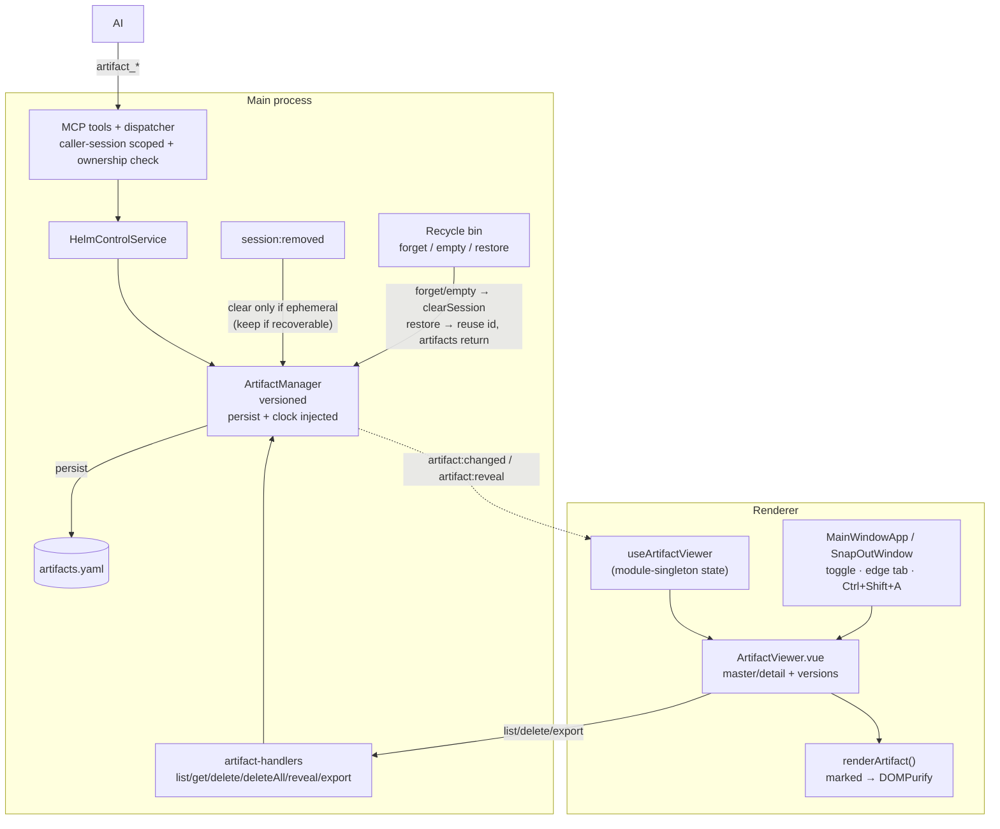

# Artifact Manager + Viewer

Per-session, **ephemeral** store of renderable outputs an AI produces for the
user to *read* — explanations, reports, analyses, results — rendered in a
dedicated in-app panel instead of making the user open a random file. Artifacts
are **markdown or HTML**, **versioned**, and **die with their session**.

Distinct from:
- **Drafts** (per-session prompt memos the user composes) — see [directory-plans.md](directory-plans.md) neighbours.
- **Plans** (per-directory DAG work items).
- **Contexts** (project knowledge nodes).

## Lifecycle — tied to the recycle bin

Artifacts belong to a single session, keyed by its hub `sessionId`. Their fate
follows the session's **recoverability**:

- **Recoverable close** (session carried a `cliSessionName` → goes to the recycle bin): the `session:removed` listener **keeps** the artifacts under the same id. They live alongside the bin entry for its 30-day window.
- **Restore** reuses the session's **original id** (exactly like startup auto-resume — `doSpawn(..., entry.sessionId)`), so the preserved artifacts come straight back attached, with no re-keying.
- **Forget** (delete one bin entry) clears that entry's artifacts; **Empty** clears every binned entry's artifacts.
- **Non-recoverable / ephemeral close** (no bin entry): the listener clears the artifacts immediately.
- **Startup reclamation**: `pruneOrphanArtifacts` drops any stored artifact whose session is neither live nor in the bin — crash orphans, or a bin entry that expired past the 30-day window.
- Nothing leaves the session except an explicit **Export** to a user-chosen file.

Persisted to `%APPDATA%/Helm/config/artifacts.yaml` (global file, keyed by session; sessions with zero artifacts are omitted on export).

## Versioning

Each artifact holds an ordered `versions[]` stack (1-based). The AI only ever
writes the newest version:
- `artifact_create` → version 1 (always a new uuid; duplicate titles allowed).
- `artifact_update(id, content)` → appends the next version and brings it forward.

The user can read any prior version in the viewer (‹ › steppers + a version
dropdown, with a "viewing older version" banner and *Jump to latest*).

## MCP surface (AI-driven)

The calling session is resolved from the MCP auth context (`authContext.sessionId`),
so the AI operates only on **its own** session's artifacts. Id-based tools
additionally verify the artifact belongs to the caller — a cross-session id
surfaces the same `Artifact not found` error (no existence leak).

| Tool | Args | Effect |
|------|------|--------|
| `artifact_create` | `title, kind('markdown'\|'html'), content` | New artifact (returns id); auto-reveals |
| `artifact_update` | `id, content` | Append a version; brings forward |
| `artifact_show` | `id` | Bring forward in the viewer (no change) |
| `artifact_delete` | `id` | Delete one |
| `artifact_delete_all` | — | Clear the caller's session |
| `artifact_list` | — | The caller's artifacts (id/title/kind/versionCount/timestamps) |
| `artifact_get` | `id, version?` | Read own content (latest, or a specific version) |

`session_info` advertises the viewer so any connected AI knows to post
user-facing reports here rather than dumping files.

## UI — master / detail panel

Right-hand, resizable dock (width persisted). Master/detail so it scales to many
artifacts:

- **Index rail** (master): scrollable list, live search, sort (newest / recently-updated / A–Z), `Today` / `Earlier` group headers, unread dots, hover-delete, collapse handle.
- **Detail pane**: sanitized render (see below), version bar (‹ › + dropdown + older-version banner + *Jump to latest*), footer with **Export… / Delete / Clear all**.

**Show / hide:** a `📄 Artifacts` toolbar toggle with a live badge, `✕` on the
panel header, and `Ctrl+Shift+A` (ignored while modal overlays / editors / plan
screen are active). Collapsed = terminal reclaims full width + a slim right
**edge tab** (📄 + badge) that pulses when a new artifact arrives.

**Snap-out follow:** the panel is bound to its session. Its `⧉` snaps the
terminal out; the `SnapOutWindow` mounts its own `ArtifactViewer` bound to that
window's session, so artifacts travel with the terminal and never render in two
windows at once.

**Security:** artifact bodies are AI-authored (untrusted). Every render path
goes through `renderArtifact()` → markdown compiled by a synchronous `marked`
instance, then **`DOMPurify.sanitize`** (HTML kind is sanitized directly). No
unsanitized markup ever reaches `v-html`.

## Data flow

## Key modules

| Module | Role |
|--------|------|
| `src/types/artifact.ts` | `Artifact`, `ArtifactVersion`, `ArtifactKind` |
| `src/session/artifact-manager.ts` | CRUD + versioning + reveal, `artifact:changed`/`artifact:reveal` events |
| `src/session/artifact-persistence.ts` | YAML save/load + type-guard sanitize |
| `src/session/artifact-orphan-prune.ts` | Pure startup reclamation of artifacts with no live/binned owner |
| `src/electron/ipc/recycle-bin-handlers.ts` | Forget/Empty clear a binned session's artifacts; restore preserves them |
| `src/electron/ipc/artifact-handlers.ts` | IPC channels incl. `artifact:export` (native save dialog) |
| `src/mcp/tools/{definitions,dispatcher,validation}.ts` | 7 MCP tools, caller-session scoping, ownership check |
| `src/mcp/helm-control-service.ts` | Service methods + `requireOwnedArtifact` guard |
| `src/mcp/guides/session-info-guide.ts` | `artifact_viewer` advert in `session_info` |
| `renderer/artifacts/render-artifact.ts` | marked + DOMPurify sanitized render |
| `renderer/composables/useArtifactViewer.ts` | Module-singleton reactive state + event subscription |
| `renderer/components/panels/ArtifactViewer.vue` | Master/detail panel |
