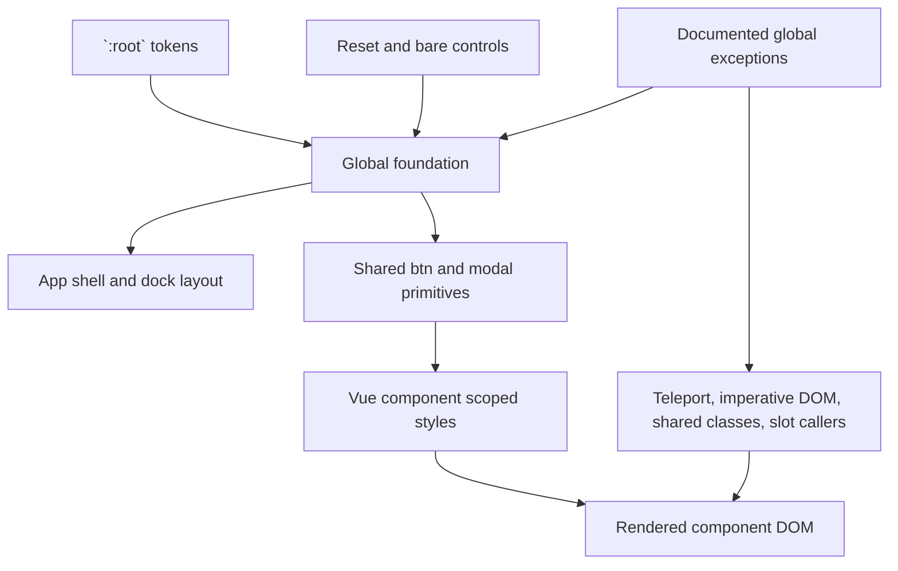

# CSS architecture

Helm has one dark visual language. The stylesheet boundary exists to keep that
language predictable as the renderer moves from imperative DOM to Vue.

## Ownership

`renderer/styles/main.css` owns the things that are truly global:

- `:root` design tokens, the reset, and bare form-control defaults;
- the application shell and recursive dock layout;
- shared `.btn*` and `.modal*` primitives; and
- documented global compatibility families whose DOM cannot safely be scoped.

A component owns its visual DOM in a `<style scoped>` block. Move a rule with
the DOM owner, not with the section heading where the rule happened to be
written. Before moving a class, search the class across `renderer/` and
`src/`, including templates, TypeScript, and DOM-building helpers.

The shared token vocabulary is:

| Purpose | Tokens |
| --- | --- |
| Surfaces | `--bg-primary`, `--bg-secondary`, `--bg-tertiary`, `--bg-hover` |
| Text | `--text-primary`, `--text-secondary`, `--text-dim` |
| Accent and focus | `--accent`, `--accent-hover`, `--accent-contrast`, `--focus` |
| Semantic state | `--danger`, `--danger-border`, `--info`, `--status-*` |
| Shape and spacing | `--radius-*`, `--spacing-*` |
| Type and effects | `--font-size-*`, `--font-mono`, `--shadow*` |

Raw hex colours are not acceptable in component CSS. Add or reuse a token in
`:root`, then consume the token from the component. Semantic status colours
remain semantic; do not replace them with the accent merely for consistency.

## Why global exceptions exist

Vue scopes `.foo` as approximately `.foo[data-v-x]`. That attribute selector
has greater specificity than global `.foo`, regardless of source order. A
move can therefore invert relationships such as hover versus selected,
disabled versus enabled, focus versus base, SVG descendants, or
`:not(.selected)`. Audit paired states together whenever a rule moves.

Four cases make a global rule safer than a superficially tidy scoped rule:

1. **Teleported DOM.** `<Teleport to="body">` moves nodes out of the normal
   component subtree. `SequencePanel.vue` teleports its modal, so a rule moved
   to `PlanScreen.vue` would stop matching. A rule may be global, or may live
   in the teleporting component itself, which still stamps its own scope onto
   its teleported children. Check for `<Teleport` before assigning an owner.

2. **Imperatively created DOM.** Nodes created with `document.createElement`
   in TypeScript do not receive a Vue `data-v` attribute. The terminal manager
   creates `.terminal-pane` at its creation sites, and `renderer/utils.ts`
   creates the sequence-help controls. Their terminal/xterm and sequence-help
   rules must remain reachable globally. The event-log output is another
   imperative DOM bridge.

3. **Genuinely shared classes.** A class rendered by multiple components has no
   single scoped owner. The context-menu family is rendered by
   `ContextMenu.vue`, `DraftSubmenu.vue`, `RuntimeGroupMoveSubmenu.vue`,
   `PromptTreeModal.vue`, `BindingEditorModal.vue`, and `AppModalHost.vue`.
   The `.tg-*` family is shared by the MCP and fleet settings components.
   The session/group navigation and common settings-list families are also
   shared by sibling components and their navigation helpers. Keep these
   global until they become a real common primitive.

4. **Slot content.** Slot content is stamped with the parent's scope id, not
   the child's. A child rule targeting DOM supplied through a slot can silently
   stop matching. The caller owns slot content and its styles. This is also why
   `plan-header__chip` remains global across `PlanScreen.vue` and `SkillsTab.vue`.

The remaining explicit compatibility families in `main.css` are the plan-chip
family (`.plan-chip` is also a plain span in `DraftEditor.vue`), terminal and
xterm classes, the teleported editor/modal families, and legacy session,
settings, picker, and overview classes that are shared across component
boundaries or queried by the navigation bridge. The structural CSS test keeps
this list explicit so a new global selector requires a deliberate rationale.

## Shared primitives

Use the primitives in `renderer/components/common/` when the DOM has a shared
visual contract:

- `PanelHeader` provides the icon/title/subtitle/action layout. Search belongs
  in its toolbar slot when the list below is filtered.
- `SearchField` provides the standard search input and clear affordance.
- `ListRow` provides the common list-row structure and focus treatment.
- `EmptyState` provides an empty/loading state with an optional action slot.
- `Chip` is display-only. It is not a button.
- `FilterChip` is the interactive tri-state control and carries `aria-pressed`.
- `PromptTextarea` owns prompt input behavior and focus handling.

Do not merge `Chip` and `FilterChip`: their accessibility and interaction
contracts are intentionally different.

## Selection language

List rows use an inset accent bar plus a subtle selected surface. The bar keeps
keyboard/gamepad focus and selection legible without overwhelming a dense
list. The canvas uses an accent outline because it selects an object on a
surface; an inset bar has no meaningful edge there. Hover must remain visibly
distinct from selected in both languages.

## Buttons

The `.btn` base supplies layout, typography, focus-visible treatment, and the
shared disabled affordance. Variants are declared once: `.btn--sm`,
`.btn--primary`, `.btn--secondary`, `.btn--danger`, and `.btn--success`.
`.btn--small` is obsolete. Primary buttons use `--accent-contrast` against
`--accent`; danger buttons use `--danger` and `--danger-border` while retaining
the established outlined/translucent appearance.

The four formerly local button systems (`PeersTab`, `BackupTab`,
`PeerPairingDialog`, and `BackupRestoreModal`) now use the shared variants.
Their scoped blocks no longer redeclare `.btn` or `.btn--*`, so scoped
specificity cannot override the global contract.

## Layering

When in doubt, identify the actual DOM owner first, then check the four
exceptions and paired-state specificity before moving the rule.

## Known visual-review note

`PlanScreen.vue` still has `stroke: var(--accent) !important` on the selected
node rectangle (currently around line 1102). It predates this cleanup. Scoped
styles may make it unnecessary, but removing it changes canvas rendering and
requires a human visual check, so it remains intentionally unchanged.
