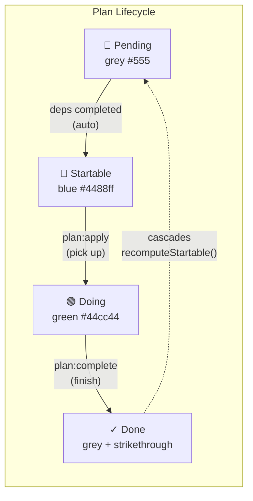
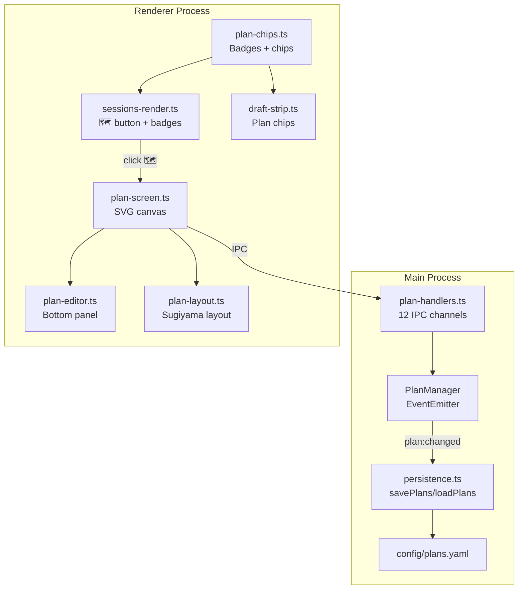
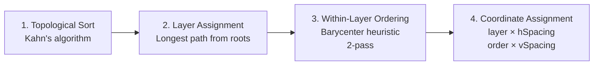

# Directory Plans (NCN — Network Connected Nodes)

Per-directory DAG of work items with dependency arrows and a 4-state lifecycle. Plans are folder-level (not session-level like drafts) and persist to `config/plans.yaml` (not per-profile).

## Overview



### Status Colors

| Status | Color | Hex | Meaning |
|--------|-------|-----|---------|
| `pending` | Grey | `#555555` | Blocked by unfinished dependencies |
| `startable` | Blue | `#4488ff` | All dependencies done, ready to pick up |
| `doing` | Green | `#44cc44` | Actively being worked on by a session |
| `done` | Grey + strikethrough | `#555555` | Completed (dashed border on node) |

## Architecture



## Data Model

### PlanItem

```typescript
interface PlanItem {
  id: string;           // UUID v4
  dirPath: string;      // Directory this plan belongs to
  title: string;        // Short title displayed on the node
  description: string;  // Longer description / prompt content
  status: PlanStatus;   // 'pending' | 'startable' | 'doing' | 'done'
  sessionId?: string;   // Set when status is 'doing' (which session picked it up)
  createdAt: number;    // Creation timestamp
  updatedAt: number;    // Last update timestamp
}
```

### PlanDependency

```typescript
interface PlanDependency {
  fromId: string;  // The blocker item ID (must be done first)
  toId: string;    // The blocked item ID (can't start until blocker is done)
}
```

### DirectoryPlan

```typescript
interface DirectoryPlan {
  dirPath: string;
  items: PlanItem[];
  dependencies: PlanDependency[];
}
```

## PlanManager (Main Process)

EventEmitter in `src/session/plan-manager.ts`. Stores items in a `Map<string, PlanItem>` and dependencies as a flat `PlanDependency[]` array.

### Operations

| Method | Description |
|--------|-------------|
| `create(dirPath, title, description)` | Create new item. No-dep items start as `startable`. |
| `update(id, { title?, description? })` | Update title and/or description. |
| `delete(id)` | Delete item + all its edges. Recomputes startable. |
| `getItem(id)` | Get a single item by ID. |
| `getForDirectory(dirPath)` | Get all items for a directory. |
| `getStartableForDirectory(dirPath)` | Get startable items for a directory. |
| `getDoingForSession(sessionId)` | Get items being worked on by a session. |
| `addDependency(fromId, toId)` | Add edge. Rejects self-loops, cross-dir, duplicates, cycles. |
| `removeDependency(fromId, toId)` | Remove edge. Recomputes startable. |
| `applyItem(id, sessionId)` | `startable` → `doing`. Associates with session. |
| `completeItem(id)` | `doing` → `done`. Cascades startable recompute. |
| `exportAll()` / `importAll(data)` | Persistence serialization. |

### DAG Validation

Cycle prevention uses DFS: before adding edge `fromId → toId`, checks whether `toId` can already reach `fromId` through existing edges. Also rejects:
- Self-loops (`fromId === toId`)
- Cross-directory edges (items must share `dirPath`)
- Duplicate edges

### Startable Computation

`recomputeStartable(dirPath)` runs after every dependency or completion change:
1. For each item in the directory that is not `doing` or `done`:
2. Find all incoming dependency edges (blockers)
3. If all blockers are `done` (or no blockers exist) → status = `startable`
4. Otherwise → status = `pending`

### Events

Emits `plan:changed` with `dirPath` on every mutation. The plan handlers listen to this event and auto-save via `savePlans()`.

## IPC Channels

12 IPC channels registered in `src/electron/ipc/plan-handlers.ts`:

| Channel | Direction | Purpose |
|---------|-----------|---------|
| `plan:list` | invoke | Get all items for a directory |
| `plan:create` | invoke | Create a new plan item |
| `plan:update` | invoke | Update item title/description |
| `plan:delete` | invoke | Delete an item and its edges |
| `plan:addDep` | invoke | Add a dependency edge |
| `plan:removeDep` | invoke | Remove a dependency edge |
| `plan:apply` | invoke | Apply a startable item to a session |
| `plan:complete` | invoke | Mark a doing item as done |
| `plan:startableForDir` | invoke | Get startable items for a directory |
| `plan:doingForSession` | invoke | Get doing items for a session |
| `plan:deps` | invoke | Get dependencies for a directory |
| `plan:getItem` | invoke | Get a single item by ID |

All channels exposed via `contextBridge` in `preload.ts` as `window.gamepadCli.plan*` methods.

## Auto-Layout Algorithm

`renderer/plans/plan-layout.ts` implements a Sugiyama-style left-to-right layered layout:



### Layout Pipeline

1. **Topological Sort** — Kahn's algorithm with alphabetical tie-breaking for deterministic output
2. **Layer Assignment** — Longest path from roots (0-indexed). Roots (no incoming edges) go to layer 0.
3. **Within-Layer Ordering** — Barycenter heuristic: forward pass (order by average position of parents) then backward pass (order by average position of children). Minimizes edge crossings.
4. **Coordinate Assignment** — `x = paddingX + layer × horizontalSpacing`, `y = paddingY + order × verticalSpacing`

### Layout Options

| Option | Default | Description |
|--------|---------|-------------|
| `horizontalSpacing` | 280px | Space between layers (left-to-right) |
| `verticalSpacing` | 140px | Space between nodes within a layer |
| `paddingX` | 60px | Horizontal padding from canvas edge |
| `paddingY` | 60px | Vertical padding from canvas edge |
| `nodeWidth` | 200px | Node width for centering |
| `nodeHeight` | 80px | Node height for centering |

### Output

```typescript
interface LayoutResult {
  nodes: LayoutNode[];  // { id, x, y, layer, order }
  width: number;        // Total canvas width
  height: number;       // Total canvas height
}
```

## SVG Canvas (Plan Screen)

`renderer/plans/plan-screen.ts` renders the plan DAG as an SVG overlay inside `#terminalArea`. It is **not** a separate screen — it's a `.plan-screen` overlay checked via `isPlanScreenVisible()` within the sessions case of the screen router.

### Entry / Exit

- **Entry:** 🗺️ Plans button on group headers (D-pad Right to column 3, or click)
- **Exit:** B button (gamepad) or ← Back button in plan header

### Canvas Features

- **Pan:** Mouse drag on empty canvas area (viewBox-based)
- **Zoom:** Mouse wheel (scale factor 0.9/1.1 per step, focal-point zoom)
- **Nodes:** SVG `<g>` elements with rounded rect (8px radius), status dot, title text, description text, right-edge connector circle
- **Arrows:** Quadratic bezier `<path>` elements with `#arrowhead` marker. Click to remove dependency.
- **Selection:** Click a node to select it (blue highlight border) and open the bottom editor panel

### Node Rendering

Each node is a 200×80px SVG group with:
- Rounded rectangle with status-colored stroke (1.5px)
- Status dot (circle, r=5, filled with status color)
- Title text (13px, bold, truncated at 22 chars)
- Description text (11px, grey, truncated at 30 chars)
- Right-edge connector circle (r=6, for dependency arrows)
- Done nodes: dashed stroke (`stroke-dasharray: 6 3`)

### Arrow Rendering

Dependency arrows use quadratic bezier curves:
- Start: right edge of source node (`fromNode.x + NODE_W, fromNode.y + NODE_H/2`)
- End: left edge of target node (`toNode.x, toNode.y + NODE_H/2`)
- Control point: midpoint X, S-curve through midpoint Y
- Stroke: `#555`, 1.5px, with `marker-end="url(#arrowhead)"`

## Editor Panel

`renderer/plans/plan-editor.ts` — bottom slide-up panel that appears when a node is selected.

### Components

| Element | Behaviour |
|---------|-----------|
| Status indicator | Shows status label (⏸ Pending / ▶ Ready / 🔄 In Progress / ✓ Done) |
| Title input | Text field, saves on blur or Enter |
| Description textarea | Multi-line text area, saves on blur |
| 🗑 Delete button | Deletes item after `window.confirm()` confirmation |
| ✓ Done button | Only shown when status is `doing`. Marks item as done. |

## Plan Badges & Chips

`renderer/plans/plan-chips.ts` provides two display modes:

### Session Card Badges

`createPlanBadge(doingCount, startableCount)` returns an element with:
- Green 🗺️ badge with doing count (when > 0)
- Blue 🗺️ badge with startable count (when > 0)
- Returns `null` when both counts are 0

Rendered on session cards in `sessions-render.ts`.

### Draft Strip Chips

`renderPlanChips(sessionId)` appends plan chips to the draft strip (`#draftStrip`):
- Doing chips: green `.plan-chip--doing` — click to complete
- Startable chips: blue `.plan-chip--startable` — click to apply to active session
- Truncated titles (max 20 chars) with 🗺️ prefix

Called at the end of `refreshDraftStrip()` in `draft-strip.ts`.

## CSS Classes

| Class | Purpose |
|-------|---------|
| `.plan-screen` | Full overlay container inside `#terminalArea` |
| `.plan-header` | Top bar with Back button, title, Add Node button |
| `.plan-canvas` | SVG canvas wrapper |
| `.plan-node` | SVG `<g>` for each plan item |
| `.plan-node--selected` | Selected node highlight |
| `.plan-node--done` | Done node styling |
| `.plan-arrow` | SVG `<path>` for dependency arrows |
| `.plan-editor` | Bottom editor panel |
| `.group-plans-btn` | 🗺️ button on group headers |
| `.plan-badge` | Plan badge on session cards |
| `.plan-badge--doing` | Green doing badge |
| `.plan-badge--startable` | Blue startable badge |
| `.plan-chip` | Plan chip in draft strip |
| `.plan-chip--doing` | Green doing chip |
| `.plan-chip--startable` | Blue startable chip |

## Persistence

Plans persist to `config/plans.yaml` via `savePlans()`/`loadPlans()` in `src/session/persistence.ts`. Auto-save fires on every `plan:changed` event. On startup, `handlers.ts` calls `planManager.importAll(loadPlans())` to restore state.

Plans are folder-level data (not per-profile) — switching profiles does not affect plans.

## Tests

| Test file | Count | Coverage |
|-----------|-------|----------|
| `plan-manager.test.ts` | 42 | PlanManager CRUD, DAG validation, cycle prevention, startable computation |
| `plan-handlers.test.ts` | 23 | IPC handler wiring, auto-save, channel responses |
| `plan-layout.test.ts` | 17 | Topological sort, layer assignment, barycenter ordering, coordinate assignment |
| `plan-screen.test.ts` | 33 | Canvas rendering, pan/zoom, node selection, add/delete, editor integration |
| `plan-chips.test.ts` | 11 | Badge rendering, chip rendering, click handlers |
| `plan-navigation.test.ts` | 4 | Navigation integration (B button exits, plan screen priority) |
