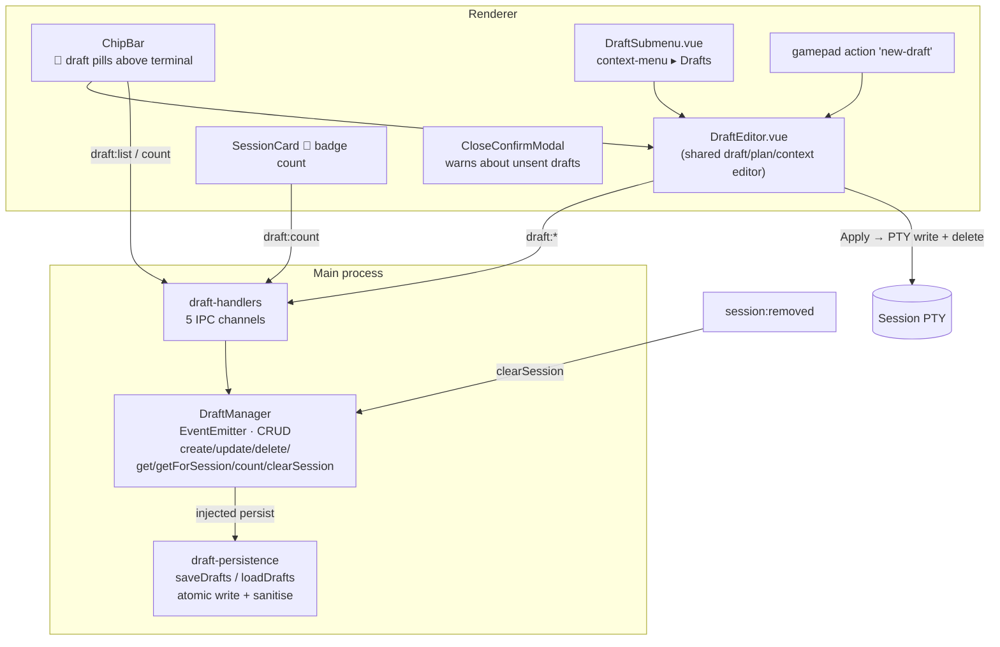

# Draft Prompts

Per-session memos for composing a prompt **while the CLI is busy**.

## Why this exists

A CLI session is frequently mid-task for minutes at a time. During that window the
user thinks of the next instruction — but typing it into the terminal would either
interrupt the running task or be swallowed by the CLI's own input handling. Drafts
give that thought a place to live: written now, attached to the session, applied
when the session is free.

Drafts are deliberately **per session, not global**. A prompt is almost always about
the thing that session is doing; keying them anywhere else would force the user to
re-establish context on every apply.

They are also deliberately **persisted separately** from sessions
(`drafts.yaml`, not `sessions.yaml`). Session state is rewritten on every add /
remove / change; unsent user prose must not be at risk from that churn, and a draft
file that fails to parse must not take the session list down with it.

## Model

```
DraftPrompt { id, sessionId, label, text, createdAt }

DraftManager: Map<sessionId, DraftPrompt[]>   (ordered by creation)
  → %APPDATA%/Helm/config/drafts.yaml   ({ drafts: { [sessionId]: [...] } })
```

`DraftManager` extends `EventEmitter` and takes its `persist` function by injection
(the same pattern as `RuntimeGroupManager` and `ArtifactManager`), so the manager is
unit-testable without touching the filesystem. Every mutation calls `markChanged`,
which persists and emits `draft:changed`.

## Architecture



## Persistence

| Aspect | Detail |
|---|---|
| File | `%APPDATA%/Helm/config/drafts.yaml` (path from `src/session/persistence-paths.ts` → `DRAFTS_FILE`) |
| Shape | `{ drafts: { "<sessionId>": [ { id, sessionId, label, text, createdAt } ] } }` |
| Write | `atomicWriteFileSync` — a crash mid-write cannot leave a half-file |
| Read | `sanitizeDrafts` validates every entry field-by-field (`isDraftPrompt`) and silently drops malformed rows and empty session buckets, so a hand-edited or partially corrupt file still loads |
| Seed | `src/config/drafts.yaml` (copied to the user dir on first launch) |
| Failure mode | Save/load errors are logged, never thrown — losing a draft must not break the app |

## IPC channels

Registered by `src/electron/ipc/draft-handlers.ts`:

| Channel | Signature |
|---|---|
| `draft:create` | `(sessionId, label, text) → DraftPrompt` |
| `draft:update` | `(draftId, { label?, text? }) → DraftPrompt \| null` |
| `draft:delete` | `(draftId) → boolean` |
| `draft:list` | `(sessionId) → DraftPrompt[]` |
| `draft:count` | `(sessionId) → number` |

Lookups by `draftId` scan every session bucket — the id is globally unique, so the
renderer never has to pass a session id alongside it.

## UI

| Element | Behaviour |
|---|---|
| **Draft strip** (`ChipBar.vue`) | A horizontal row of 📝 pills above the terminal for the active session. Clicking a pill opens the editor on that draft directly. |
| **Editor panel** (`DraftEditor.vue`) | A slide-down panel with a title and content field. It is the shared editor for drafts, plans and contexts (see `useDraftPlanContextEditor.ts`); the draft variant offers **Save**, **Apply**, **Delete**, **Cancel**. |
| **Apply** | Sends the draft text to the session's PTY **and deletes the draft** — a draft is a queued prompt, so surviving its own delivery would just accumulate stale copies. |
| **Context menu ▸ Drafts** (`DraftSubmenu.vue`) | "New Draft" plus per-draft Apply / Edit / Delete. |
| **Session card badge** | 📝 with the draft count, so a session with pending prose is visible from the sidebar. |
| **Close confirm** | Closing a session with drafts warns that they are unsent — the whole point of the feature is content the user has not delivered yet. |

## Gamepad

The `new-draft` action type (bindable to any button via `BindingEditorModal.vue`,
dispatched in `renderer/bindings.ts`) opens the editor for the active session.

Inside the editor, **D-pad Up/Down** cycles the focusable targets — Title → Content
→ Save → Apply → Delete → Cancel — **A** activates, **B** cancels. This is the same
selection-mode modal convention used elsewhere, so keyboard input is not routed to
the PTY while the editor is open.

## Lifecycle

Drafts are tied to a live session. `DraftManager.clearSession(sessionId)` is called
when a session goes away, so closed sessions do not leave orphan buckets in
`drafts.yaml`. (Unlike **artifacts**, drafts are *not* preserved for recycle-bin
restore — a draft is a short-lived intent, not a work product.)

## Distinct from

- **Prompt Templates** — a *global*, reusable library of prompt bodies with sequence
  syntax. Drafts are one-off and session-scoped.
- **Directory Plans** — per-directory DAG work items with a lifecycle. Plans describe
  *what needs doing*; drafts are literally the text you will paste.
- **Artifacts** — AI → user reports. Drafts are user → AI.
