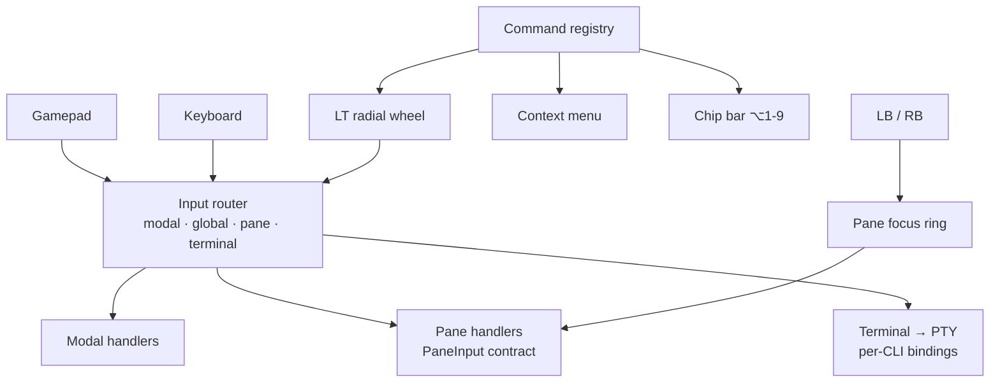

# Gamepad Input Model (proposed)

> **Status: design proposal, not implemented.** [docs/controls.md](controls.md)
> describes the shipping behaviour. This document describes the model that would
> replace it, and why. Nothing here is a commitment to a schedule.

## Why change anything

The gamepad model predates the docking workspace. It is *screen-shaped* and
*button-shaped*:

- **Screen-shaped** — navigation is a 13-step imperative priority chain in
  `renderer/screens/`, each step naming a specific modal or overlay
  (`isPlanScreenVisible()`, draft editor, quick-spawn picker, …). Adding a
  surface means editing the chain; forgetting to is the default outcome.
- **Button-shaped** — a binding is one of six action types
  (`ActionType`, `src/config/loader.ts:35`) bound to one of ten buttons. Reaching
  a new feature means spending a button or inventing an action type.

Meanwhile the app became pane-shaped. `DOCK_PANES`
(`renderer/dock-types.ts:142`) registers nine panes, and the keyboard already
routes through a single ownership chain
([docs/keyboard-routing.md](keyboard-routing.md)). The gamepad never followed.

### Coverage today

| Reachable by gamepad | Not reachable by gamepad |
|---|---|
| Session switching, session card columns | Memories pane |
| Group overview grid | Artifacts pane |
| Plan canvas (nodes, edit, add, delete) | Scheduler pane |
| Draft editor + drafts submenu | Plan Directories pane |
| Context menu, prompt-template tree | Quick Spawn as a pane |
| Terminal scroll | Recycle bin / restore |
| Two hardcoded spawns (LT, RB) | Runtime group management |
| Profile switch, window focus | Plan backup & restore |
| | Dock pane focus and layout |
| | Fleet peers, Telegram surfaces |

Roughly a third of the surface. The gap is not evenly spread — it is *exactly*
the features added after the dock landed, which is the tell that the model, not
the effort, is the problem.

Ten buttons cannot carry forty features by assignment. The fix is to change what
a button **addresses**, not to add more bindings.

## The model



Four moves. They are independent in principle but ordered by dependency.

---

### Move 1 — the gamepad addresses panes, not screens

**LB / RB cycle the focused dock pane** — the gamepad twin of the
`Ctrl+Shift+T/O/P/M/S/A` family. The pane registry is already the single source
of pane identity, and `renderer/dock-visibility-bridge.ts` already hands pane
visibility to the imperative nav; that bridge becomes a *focus ring* rather than
a visibility probe.

Consequence: the gamepad stops enumerating screens. A pane added to
`DOCK_PANES` is in the ring the day it is registered.

The ring walks panes in visible layout order (left dock → centre tabs → right
dock), skipping collapsed and closed panes, so the traversal matches what the
user can see rather than registry declaration order.

---

### Move 2 — one input contract, one router

The keyboard router (`renderer/keyboard/router.ts`) already has what the gamepad
lacks: a declared precedence policy (`SCOPE_PRECEDENCE`), eligibility via
`claims(ctx)`, and the focused-vs-visible distinction. Its own header documents
why it exists — eight competing capture-phase listeners whose priority was an
accident of import order. **The gamepad chain is the ninth listener that never
got merged.**

Gamepad events register into the same router with the same scopes. Each pane
declares one handler against a single contract:

```ts
interface PaneInput {
  up(): boolean; down(): boolean; left(): boolean; right(): boolean;
  primary(): boolean;    // A / Enter
  back(): boolean;       // B / Escape
  secondary(): boolean;  // X / Delete
  tertiary(): boolean;   // Y / F5
}
```

The existing keyboard→button mapping (Enter→A, Escape→B, Delete→X, F5→Y,
arrows→D-pad) stops being a translation layer bolted on at the edge and becomes
the definition: **both devices produce the same eight intents**, and a pane
implements them once.

The 13-step chain collapses to `modal > pane > CLI binding`. Handlers return
`false` to decline, leaving the event pristine — the invariant the keyboard
router already enforces and the reason it never suppresses a key it declines.

**Backward compatibility:** the terminal pane's handler falls through to the
per-CLI `Binding` resolution exactly as today. Existing profile YAML keeps
working unchanged; no binding is reinterpreted.

---

### Move 3 — a command registry, and a wheel over it

This is the move that makes "all features" reachable, and it is the one with
real new construction.

**There is no command registry today.** `ChipAction`
(`renderer/components/chips/ChipBar.vue:14`) is `{label, sequence, preview}` —
sequence-only and config-derived, so it can express "send text to the PTY" and
nothing else. The context menu builds its items independently. The two share no
type.

The proposal introduces one:

```ts
interface Command {
  id: string;
  label: string;
  icon?: string;
  /** Eligibility, same shape as the router's claims. */
  enabled?: (ctx: InputContext) => boolean;
  run(ctx: InputContext): void;
}
```

Three consumers render from it: the context menu, the chip bar (`Alt+1-9`), and
a new **radial wheel** — hold LT, stick or D-pad selects one of eight sectors,
release commits. Sectors fill from commands whose `enabled` passes for the
focused pane, so the wheel is contextual rather than a fixed menu.

`ChipAction` becomes a `Command` whose `run` delivers a sequence — one variant,
not a parallel system.

The payoff is structural: **registering a command grants keyboard, mouse, and
gamepad access at once.** No new `ActionType` per feature, no button spent.
Memories, artifacts, scheduler, recycle bin, group management and backup/restore
all arrive through this door.

---

### Move 4 — triggers become modifiers

Today LT and RB are hardcoded spawns: the two most expressive inputs on the pad
spent on two commands.

| Input | Proposed meaning |
|---|---|
| LB / RB | Previous / next dock pane (Move 1) |
| LT (hold) | Command wheel (Move 3) |
| RT (hold) | Shift layer — RT+D-pad reorders session or pane, RT+A confirms a destructive action, RT+face buttons are spawn slots |
| Left stick / D-pad | Pane-declared directional intent |
| Right stick | Pane-declared continuous axis: terminal scrollback, plan-canvas pan/zoom, artifact scroll, memory-graph pan |
| A / B / X / Y | Pane-declared intents; fall through to the per-CLI binding in the terminal pane |
| L3 | Session switcher HUD (currently unused) |
| R3 | Toggle overview (currently unused) |
| Back / Start | Profile switch (unchanged) |
| Guide | Focus hub window (unchanged) |

Spawning moves into the wheel and the RT layer. It loses no capability and
frees the two inputs the model most needs.

Right stick as a *declared* axis rather than a configured scroll direction is
the cheapest consistency win here: one concept covers four panes that currently
each scroll, pan, or ignore it on their own terms.

## Sequencing

Dependency-ordered, not schedule-ordered:

1. **Pane focus ring + `PaneInput` contract.** Gamepad events enter the keyboard
   router. Nothing user-visible changes except LB/RB.
2. **Migrate modals and panes off the imperative chain.** Each surface registers
   a handler; the chain shrinks step by step and is deleted when empty. This is
   the bulk of the work and the only phase that can regress existing behaviour,
   so it wants per-surface tests before each migration.
3. **Command registry + wheel.** `ChipAction` folds in; context menu re-renders
   from the registry; unreachable features register commands.
4. **Trigger re-map.**

**Do not reorder 3 and 4.** Remapping LT/RB before the wheel exists removes
spawn access with nothing replacing it.

## What this does not change

- Bindings YAML and the sequence syntax (invariant 5) — untouched.
- The Browser Gamepad API as sole input source (invariant 1) — this is a
  routing change downstream of polling, not a second source.
- xterm.js keeping imperative ownership of keys that land inside it.
- Per-CLI bindings, which survive as the terminal pane's fallthrough.

## Open questions

- **Wheel sector overflow.** Eight sectors, more than eight eligible commands.
  Paginate with the bumpers, nest a second ring, or rank by recency? Recency is
  simplest and probably right, but it makes the wheel's layout unstable, which
  is exactly what a radial menu trades on for muscle memory.
- **Whether `PaneInput` should be eight methods or one `intent` switch.** Eight
  is more discoverable and typo-proof; one is less boilerplate for panes that
  handle two intents. Leaning eight, with a helper for the sparse case.
- **Rumble as state feedback.** The activity dots (invariant 8) have no haptic
  equivalent. Plausible, out of scope here.
