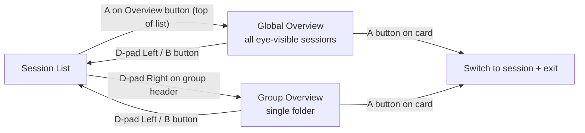
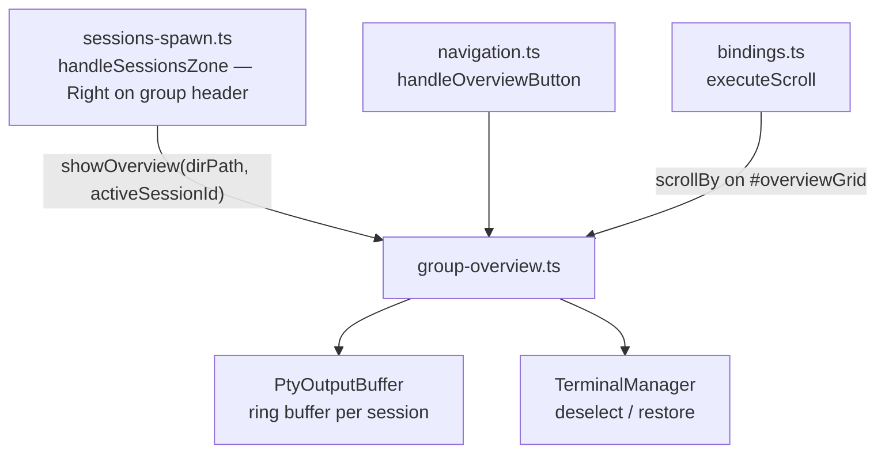

# Group Overview Mode

The group overview is a session preview grid that shows sessions at a glance with live PTY output. It has two modes:

- **Global overview** — shows all eye-visible sessions across every folder, with folder break marks between groups. Triggered by the Overview button at the top of the session list.
- **Group overview** — shows only sessions in one directory. Triggered by D-pad Right on a group header (or clicking the group name).

## Purpose

When managing many concurrent CLI sessions (e.g. multiple Claude Code or Copilot CLI instances), the sidebar session list gives a compact summary. The overview grid provides a deeper view — showing the last N lines of PTY output per session so you can see what each session is doing without switching between them one by one.

## Entry & Exit

| Action | Trigger |
|--------|---------|
| **Enter global overview** | A / Enter on the Overview button (top of session list) |
| **Enter group overview** | D-pad Right on a group header (or click group name) |
| **Exit overview (back)** | D-pad Left or B button — returns to sidebar |
| **Exit overview (flow-through)** | D-pad Up past first card or Down past last card → continues to next/previous session list item |
| **Select session** | A button — exits overview and switches to the selected session |
| **Close session** | X button — opens close confirmation for the focused card |

D-pad Up/Down skips through group headers in the sidebar without opening the overview. The overview is a **drill-in zone**: pressing Right on a group header opens the group view, pressing the Overview button opens the global view.

## Eye Toggle

Each session card has an eye button (👁 / 👁‍🗨) at column 3 (D-pad Right to reach it). Click or press to toggle whether the session appears in the global overview.

- 👁 (eye open) — session is **visible** in global overview (default)
- 👁‍🗨 (eye closed) — session is **hidden** from global overview

Hidden sessions still appear in the sidebar list, in their own group overview, and can be selected and used normally. Visibility is persisted in `settings.yaml` via `SessionGroupPrefs.overviewHidden` using the stable CLI session name as the key.

The Overview button's session count badge reflects only eye-visible sessions.

## Global Overview Layout

When activated from the Overview button, the grid spans all folders. Between sessions from different directories a **folder break mark** is rendered — a subtle divider line showing the directory path (e.g. `─────── ~/projects/foo ───────`). Sessions within each folder appear in the same order as the sidebar.

## Pre-Selection

When entering overview mode, the grid pre-selects the card matching the currently active session (if it belongs to the group). This avoids always starting at the top when you're already working in a session within that group.

If the active session doesn't belong to the group (or there is no active session), the first card is focused by default.

## Card Layout

Each card displays:
- **Header row**: state dot (colour-coded) + session name + OSC terminal title subtitle (when set) + state label (implementing/waiting/planning/idle)
- **Preview area**: last 10 lines of ANSI-stripped PTY output in a monospace font, fixed height

The CLI type label is intentionally omitted — the session name and state provide sufficient context, and the type is visible in the sidebar session card.

## Scrolling

The overview grid is scrollable when cards overflow the available space. A max-height constraint limits the visible area to approximately 5 cards (`calc(5 * 180px + 4 * var(--spacing-md))`), ensuring the grid doesn't expand infinitely and always presents a scrollable view for larger groups.

| Input | Scroll method |
|-------|---------------|
| **Mouse wheel** | Native CSS `overflow-y: auto` on the grid container |
| **Gamepad right stick** | Routes through `executeScroll()` in `bindings.ts` — detects the visible `#overviewGrid` element and calls `scrollBy()` instead of scrolling the terminal buffer |
| **Explicit scroll binding** | Same `executeScroll()` path — any button bound to a `scroll` action will scroll the overview grid when it's visible |

Scroll routing is automatic — no special configuration needed. When the overview is hidden, scroll bindings resume routing to the active terminal as normal.

## Terminal Deselection

While the overview is open, the active terminal is **deselected** (hidden, blurred). This prevents keyboard input and paste from accidentally reaching a terminal while browsing the grid. When the overview is closed:

- If a session was selected (A button), the app switches to that session
- If the overview was exited via flow-through (Up/Down past edges), the next nav item is auto-selected

## Live Updates

Preview cards update live as PTY output flows in. Updates are throttled at 500ms via `PtyOutputBuffer.onUpdate()` to avoid excessive re-renders. Only affected cards are re-rendered — the full grid is not rebuilt.

## Architecture

### Key files

| File | Role |
|------|------|
| `renderer/screens/group-overview.ts` | Grid rendering, card creation, live update subscription, show/hide lifecycle |
| `renderer/navigation.ts` | `handleOverviewButton()` — D-pad navigation with flow-through exit, Left/B to close, A/X button routing |
| `renderer/bindings.ts` | `executeScroll()` — routes gamepad scroll to overview grid when visible |
| `renderer/screens/sessions-spawn.ts` | `handleSessionsZone()` — D-pad Right on group header triggers `showOverview()` |
| `renderer/terminal/pty-output-buffer.ts` | Ring buffer providing preview data |
| `renderer/styles/main.css` | `.overview-grid`, `.overview-card`, `.overview-card-preview` styles |
| `tests/group-overview.test.ts` | Card rendering, focus navigation, pre-selection, terminal deselect/restore |
