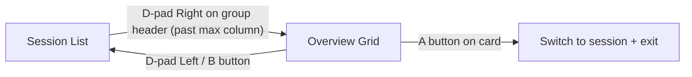
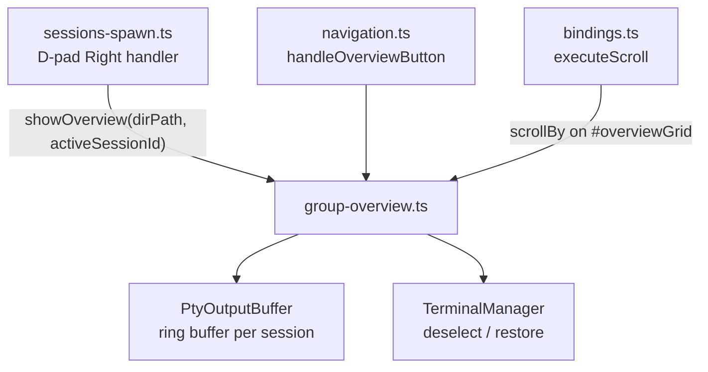

# Group Overview Mode

The group overview is a session preview grid that shows all sessions in a working directory group at a glance. It renders into the terminal area as a scrollable single-column layout with fixed-height preview cards.

## Purpose

When managing many concurrent CLI sessions (e.g. multiple Claude Code or Copilot CLI instances), the sidebar session list gives a compact summary. The overview grid provides a deeper view — showing the last N lines of PTY output per session so you can see what each session is doing without switching between them one by one.

## Entry & Exit

| Action | Trigger |
|--------|---------|
| **Enter overview** | D-pad Right from a group header (when cursor is past the last column) |
| **Exit overview** | D-pad Left from any card, or B button |
| **Select session** | A button — exits overview and switches to the selected session |
| **Close session** | X button — opens close confirmation for the focused card |

## Pre-Selection

When entering overview mode, the grid pre-selects the card matching the currently active session (if it belongs to the group). This avoids always starting at the top when you're already working in a session within that group.

If the active session doesn't belong to the group (or there is no active session), the first card is focused by default.

## Card Layout

Each card displays:
- **Header row**: state dot (colour-coded) + session name + state label (implementing/waiting/planning/idle)
- **Preview area**: last 10 lines of ANSI-stripped PTY output in a monospace font, fixed height

The CLI type label is intentionally omitted — the session name and state provide sufficient context, and the type is visible in the sidebar session card.

## Scrolling

The overview grid is scrollable when cards overflow the available space.

| Input | Scroll method |
|-------|---------------|
| **Mouse wheel** | Native CSS `overflow-y: auto` on the grid container |
| **Gamepad right stick** | Routes through `executeScroll()` in `bindings.ts` — detects the visible `#overviewGrid` element and calls `scrollBy()` instead of scrolling the terminal buffer |
| **Explicit scroll binding** | Same `executeScroll()` path — any button bound to a `scroll` action will scroll the overview grid when it's visible |

Scroll routing is automatic — no special configuration needed. When the overview is hidden, scroll bindings resume routing to the active terminal as normal.

## Terminal Deselection

While the overview is open, the active terminal is **deselected** (hidden, blurred). This prevents keyboard input and paste from accidentally reaching a terminal while browsing the grid. When the overview is closed:

- If a session was selected (A button), the app switches to that session
- If the overview was dismissed (Left/B), the previously active terminal is restored

## Live Updates

Preview cards update live as PTY output flows in. Updates are throttled at 500ms via `PtyOutputBuffer.onUpdate()` to avoid excessive re-renders. Only affected cards are re-rendered — the full grid is not rebuilt.

## Architecture

### Key files

| File | Role |
|------|------|
| `renderer/screens/group-overview.ts` | Grid rendering, card creation, live update subscription, show/hide lifecycle |
| `renderer/navigation.ts` | `handleOverviewButton()` — D-pad navigation, A/B/X button routing |
| `renderer/bindings.ts` | `executeScroll()` — routes gamepad scroll to overview grid when visible |
| `renderer/screens/sessions-spawn.ts` | Entry point — triggers `showOverview()` on D-pad Right past group header |
| `renderer/terminal/pty-output-buffer.ts` | Ring buffer providing preview data |
| `renderer/styles/main.css` | `.overview-grid`, `.overview-card`, `.overview-card-preview` styles |
| `tests/group-overview.test.ts` | Card rendering, focus navigation, pre-selection, terminal deselect/restore |
