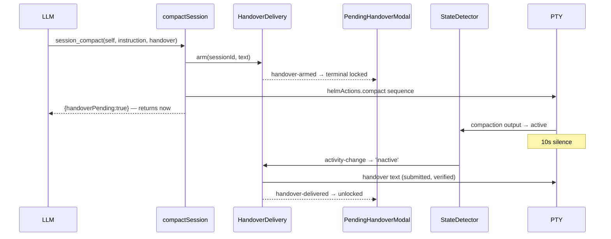

# Compaction Handover

A note a session writes to its own post-compaction self, held by Helm across the
compaction and pasted back when the session falls quiet.

## Why this exists

When a CLI compacts its own context, everything it knew goes with it. The model
that comes out the other side has a summary, not a working state: it does not
know which file it was halfway through, which approach it already ruled out, or
what the user said five minutes ago. Nothing inside the transcript can survive,
because the transcript is what is being discarded.

The fix has to live outside the context. `session_compact` therefore takes the
note *up front* — written while the context still exists — and Helm replays it
after.

The text is **opaque**. Helm never parses it, so the calling agent picks the
medium: inline prose, a file path, or an artifact reference all work equally.
That keeps Helm out of the business of deciding what a good handover looks like.

## Flow

## Three decisions worth knowing

### The call returns immediately

The caller is usually *the session being compacted*. Blocking until delivery
would leave the tool call unanswered inside the very context about to be
discarded. `session_compact` returns `handoverPending: true` and the delivery
happens asynchronously.

### Armed before the command is written, never after

The compact command's own output drives the session back to `active`, and the
delivery waits on the **next** fall to silence. Arming afterwards races that
output and can miss the edge entirely — or match a state that predates the
compaction.

### The trigger is silence, not a completion signal

`inactive` is 10 seconds of PTY quiet (`StateDetector`), the same best-effort
bet the Mess notifier makes. It is not proof the CLI finished. Two bounds
contain that:

| Bound | Default | Guards against |
|---|---|---|
| **Floor** | 15 s | A stall *before* compaction starts, which looks identical to completion. Edges inside the window are ignored. |
| **Ceiling** | 5 min | A CLI that renders a spinner forever and never falls silent. The handover is delivered anyway — an awkward moment beats total loss. |

Making this exact would require parsing per-CLI "compaction complete" banner
text, which is version-fragile in a way the silence heuristic is not.

## The terminal lock

While a handover is pending, the session's terminal is covered by a modal
offering **Cancel handover** or waiting.

This is mechanical, not decorative: user keystrokes are PTY output, and PTY
output resets the silence timer. Idly typing into a compacting session defers
its own handover indefinitely.

The dialog claims the keyboard **only while the pending session's terminal is
the focused pane** — a background session compacting must not freeze the app.
It joins the modal stack *and* registers a `scope: 'modal'` handler, because
either alone leaks keys (see [keyboard-routing.md](keyboard-routing.md)).

## Nothing is persisted

A pending handover lives only for the minutes between the compact command and
the next lull. If Helm restarts in that window the handover is lost — but so is
the compaction that produced it, so there is nothing to restore *into*.

When a handover is dropped undelivered — user cancel, session close, or a failed
write — the user is notified. The session's whole working state was riding on
it, and the context that wrote it is already gone, so silence would be worse
than the interruption.

## Key modules

| File | Role |
|------|------|
| `src/session/handover-delivery.ts` | `HandoverDelivery` — arm, floor/ceiling, idle-edge delivery, loss reporting |
| `src/mcp/services/helm-session-delivery-service.ts` | `compactSession` — arms then delivers the compact sequence; `offloadIfLarge` |
| `src/electron/ipc/handover-handlers.ts` | `handover:cancel` / `handover:pending` + event forwarding |
| `renderer/composables/useHandover.ts` | Reactive mirror of pending handovers |
| `renderer/components/modals/PendingHandoverModal.vue` | The terminal lock |

`HandoverDelivery` takes its delivery and notification sinks as injected
functions, so it has no direct dependency on `PtyManager` or
`NotificationManager` and is driven entirely from a test.

## Distinct from

- **`session_clear`'s `context`** — also a note-to-future-self, but delivered on
  a fixed settle delay after a *reset*, not held across a compaction.
- **Pattern matcher schedules** — reactive to CLI *output text*; a handover is
  armed by an explicit tool call and triggered by silence.
- **Memory / context nodes** — durable and project-scoped. A handover is
  session-scoped and lives for minutes.
