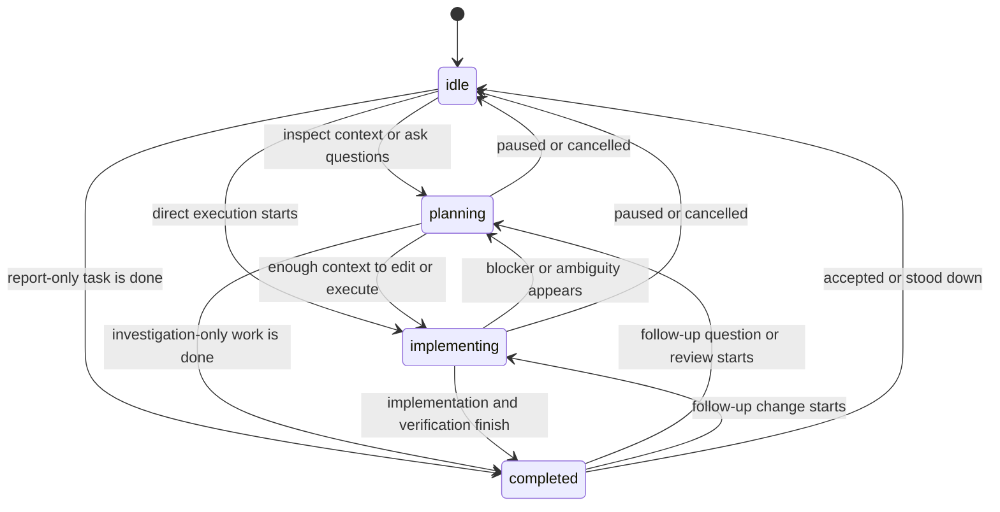

# session_info MCP Tool — AIAGENT State Registry & Endpoint Context

## Overview

The `session_info` MCP tool is an **autocall endpoint** that provides AI agents with session context, MCP connectivity information, and the canonical AIAGENT state registry. Call this tool on session startup to prime the state machine.

It is also the main place Helm teaches agents about durable memory: prefer `context_*` tools for notes that should survive this session, and treat sequence `sharedMemory` as legacy coordination text rather than the default place to accumulate new knowledge.

## Tool Definition

**Name:** `session_info`  
**Title:** Get Session Info  
**Method:** `tools/call` with `params.name='session_info'`  
**Input Schema:** Empty object `{}`  

## Response Fields

The tool returns a `SessionInfoResponse` object with these fields:

### Session Identity (Optional)

- **`sessionId`** (string, optional) — Helm session UUID if the caller authenticated with a session-scoped token (HELM_MCP_TOKEN). Undefined if using a global auth token.
- **`sessionName`** (string, optional) — Display name of the session (`HELM_SESSION_NAME` env var at session startup). Undefined for global token callers.
- **`cliType`** (string, optional) — CLI type of the session (e.g., `'claude-code'`, `'copilot-cli'`). Undefined for global token callers.
- **`workingDir`** (string, optional) — Working directory the session was spawned in. Undefined for global token callers.

### MCP Endpoint Context

- **`mcp_url`** (string) — HTTP endpoint for MCP requests: `http://127.0.0.1:PORT/mcp`. Constructed from `HELM_MCP_PORT` config (default 47373).
- **`mcp_token`** (string) — Bearer auth token for MCP requests. From Helm settings → MCP → Auth Token. Pass in request header: `Authorization: Bearer {mcp_token}`.

### AIAGENT States

Valid states for `session_set_aiagent_state`: `planning`, `implementing`, `completed`, `idle`. The tool definition is authoritative — no need to enumerate them in the response.

### Available Resources

- **`available_projects`** (ProjectInfo[]) — Compact project stubs with `{ id, name, canonicalPath }` fields. Call `projects_list` when full project directory details are needed.
- **`skills`** — Compact summaries for user and system skills applicable to the current session project. Fields: `id`, `name`, `description`, `aiAmendable`, `allProjects`, `projectIds`, `type`, `source`. Fetch full bodies with `skills_get` only when needed. System skill type identifiers: `session-send-text`, `agent-plan`, `notification`, `telegram`.

  | Type | Content |
  | --- | --- |
  | `session-send-text` | Inter-LLM handoff protocol via `session_send_text`. |
  | `agent-plan` | Plan management workflow — creating, claiming, completing, and linking Helm plans. |
  | `notification` | Notification routing — when and how to call `notify_user`; toast / bubble / Telegram routing. |

  Agents should fetch these only when the task requires the guidance, not on every startup.

## Usage Pattern

### 1. Startup Initialization

When a session starts, call `session_info` to prime the state machine:

```json
{
  "jsonrpc": "2.0",
  "id": 1,
  "method": "tools/call",
  "params": {
    "name": "session_info",
    "arguments": {}
  }
}
```

Response:
```json
{
  "jsonrpc": "2.0",
  "id": 1,
  "result": {
    "sessionId": "a1b2c3d4-e5f6-...",
    "sessionName": "Claude-Main",
    "cliType": "claude-code",
    "workingDir": "X:\\coding\\gamepad-cli-hub",
    "mcp_url": "http://127.0.0.1:47373/mcp",
    "mcp_token": "eyJhbGciOi...",
    "available_projects": [
      { "id": "543a...", "name": "gamepad-cli-hub", "canonicalPath": "x:\\coding\\gamepad-cli-hub" }
    ],
    "skills": [
      { "id": "sys-agent-plan", "name": "Agent Plan Guide", "type": "agent-plan", "source": "system" }
    ],
    "telegramCapabilities": {
      "available": true,
      "openwhisper": true,
      "openwhisperPath": "C:\\openwhispr\\OpenWhispr.exe",
      "piper": true,
      "piperPath": "C:\\piper\\piper.exe",
      "ffmpeg": false
    }
  }
}
```

### 2. State Updates

Use `session_set_aiagent_state` with states: `planning`, `implementing`, `completed`, `idle`.
Printed `AIAGENT-*` tags are optional display text; Helm state changes come from the MCP call.

```json
{
  "jsonrpc": "2.0",
  "id": 2,
  "method": "tools/call",
  "params": {
    "name": "session_set_aiagent_state",
    "arguments": { "sessionId": "a1b2c3d4-e5f6-...", "state": "planning" }
  }
}
```

### 3. Building MCP Requests

Use `mcp_url` and `mcp_token` to construct subsequent MCP requests:

```javascript
const { mcp_url, mcp_token } = await callSessionInfo();

const response = await fetch(mcp_url, {
  method: 'POST',
  headers: {
    'Content-Type': 'application/json',
    'Authorization': `Bearer ${mcp_token}`
  },
  body: JSON.stringify({
    jsonrpc: '2.0',
    id: 2,
    method: 'tools/call',
    params: {
      name: 'plans_list',
      arguments: { dirPath: workingDir }
    }
  })
});
```

### 4. Discovering Available Tools

Use the MCP `tools/list` protocol request to inspect the current tool catalog. The Helm `tools_list` tool is separate: it lists configured CLI types and spawn targets.

### 5. Creating Durable Plans

When an agent discovers follow-up work that should survive the current session, call `plan_create` with a description that includes the required sections from `agent_plan_guide.required_description_sections`. If the agent is blocked by a user question, create a separate plan titled `QUESTION: ...`, put the concrete question at the top of that plan, and link that question plan to the original blocked plan with `plan_nextplan_link` so the question must complete first.

When a user mentions `P-0035` or another `P-00xx` value, treat it as a Helm plan reference. MCP plan tools that accept a plan id also accept these human-readable IDs; use `plans_summary` when you need to map the `P-00xx` value to the canonical UUID, title, status, or dependency context.

### 6. Plan Attachments and Sequence Memory

#### Plan Attachments

`plan_get` is intentionally lightweight. It returns the plan item plus `hasAttachments: boolean` — a flag indicating whether the plan has any attached files. This design keeps raw attachment content out of routine plan reads.

**Workflow:**
1. Call `plan_get` to fetch a plan — the response includes `hasAttachments: true|false`.
2. If `hasAttachments` is true, call `plan_attachment_list` to see metadata (filename, size, content type, timestamps).
3. Call `plan_attachment_get` to retrieve a specific attachment — it is copied to a Helm temp file, and you receive the local temp path.
4. Call `plan_attachment_add` to store durable supporting artifacts (code samples, screenshots, design docs); attachments are persisted inside Helm's config-managed storage and survive session restarts.

Example:
```javascript
const plan = await mcp.callTool('plan_get', { id: 'P-0042' });
if (plan.hasAttachments) {
  const attachments = await mcp.callTool('plan_attachment_list', { planRef: 'P-0042' });
  for (const attachment of attachments) {
    const { tempPath } = await mcp.callTool('plan_attachment_get', {
      planRef: 'P-0042',
      attachmentId: attachment.id
    });
    // Read the file at tempPath...
  }
}
```

#### Sequence Memory (Shared State for Plan Groups)

A sequence is a first-class shared-memory store that groups related plans into a coordinated swimlane. Plans can optionally join a sequence to track common progress, decisions, or accumulated context.

**Key points:**
- A plan may include `sequenceId` (returned by `plan_get`), but the full sequence and its shared memory are NOT inlined.
- Call `plan_sequence_list` with `planId` to discover the sequence and see member plans, mission statement, and shared memory.
- Shared memory is common state that all member plans can read and append to.

**Workflow for reading:**
```javascript
const plan = await mcp.callTool('plan_get', { id: 'P-0042' });
if (plan.sequenceId) {
  const sequences = await mcp.callTool('plan_sequence_list', { planId: 'P-0042' });
  const sequence = sequences[0]; // The sequence this plan belongs to
  console.log('Shared Memory:', sequence.sharedMemory);
  console.log('Member Plans:', sequence.memberHumanIds);
}
```

**Workflow for writing shared memory atomically:**
When multiple agents may write concurrently, use `expectedUpdatedAt` from the last read to prevent overwrites:
```javascript
const sequences = await mcp.callTool('plan_sequence_list', { planId: 'P-0042' });
const sequence = sequences[0];

// Later, when writing:
const updated = await mcp.callTool('plan_sequence_memory_append', {
  id: sequence.id,
  text: 'Agent A completed the initial research phase.',
  expectedUpdatedAt: sequence.updatedAt  // Mutex: fails if another agent wrote first
});

// If mutex fails, re-read and retry:
// 1. Refetch the sequence with plan_sequence_list
// 2. Append with the new expectedUpdatedAt
```

Alternatively, use `plan_sequence_update` for full edits or to change mission and title.

## Environment Variables (at Session Spawn)

Helm injects these env vars into each spawned session's PTY:

- **`HELM_SESSION_ID`** — UUID v4 session identifier (matches `sessionId` in response).
- **`HELM_SESSION_NAME`** — Display name of the session (matches `sessionName` in response).
- **`HELM_MCP_TOKEN`** — Session-scoped auth token (session-specific variant of `mcp_token`). Derived from the global auth token.
- **`HELM_MCP_URL`** — MCP endpoint URL (matches `mcp_url` in response): `http://127.0.0.1:PORT/mcp`.

CLI agents can read these from `process.env` to avoid making a `session_info` call if they prefer.

## Authentication

Two auth models:

1. **Session-Scoped Token** (Preferred for inter-session communication)
   - Generated at spawn time via `mintSessionAuthToken()` — encodes `sessionId` and `sessionName`.
   - Passed in MCP request header: `Authorization: Bearer {HELM_MCP_TOKEN}`.
   - Server decodes the token and extracts `sessionId` and `sessionName` into `authContext`.
   - Useful for `session_send_text` and inter-LLM messages — proves sender identity.

2. **Global Auth Token** (Fallback for global callers)
   - Set in Helm settings → MCP → Auth Token.
   - Passed in request header: `Authorization: Bearer {authToken}`.
   - Server accepts but does not decode — `authContext` is empty.
   - Used by global tooling that doesn't have a session context.

## AIAGENT State Machine Integration

Helm tracks three independent state systems. Keep them aligned when useful, but do not treat them as aliases:

| System | Owner | Purpose |
| --- | --- | --- |
| `aiagentState` | External agents via `session_set_aiagent_state` | Durable agent-declared phase shown on session rows: planning, implementing, completed, or idle. |
| `sessionState` | Helm UI and pipeline controls | Runtime pipeline state for manual state overrides and handoff queue coordination. |
| `planState` | Helm plan tools | Durable lifecycle for a plan item: planning, ready, coding, review, blocked, or done. |

The session detector in Helm's main process tracks PTY activity timing and
question markers. It no longer turns printed `AIAGENT-*` text into state
changes, so printed tags cannot trigger hidden Telegram completion/idle
notifications.

Use `session_set_aiagent_state` to make your state transitions durable and visible in Helm. Valid states: `planning`, `implementing`, `completed`, `idle`.

The explicit state endpoint is:

```json
{
  "name": "session_set_aiagent_state",
  "arguments": {
    "sessionId": "your-session-id",
    "state": "implementing"
  }
}
```

### State Machine



### Integration Patterns

Starting implementation:

1. Call `plan_set_state` with `status: "coding"` and your `sessionId` when claiming a plan.
2. Call `session_set_working_plan` so Helm shows the plan on the session row.
3. Call `session_set_aiagent_state` with `state: "implementing"` when edits, commands, or other execution begins.

Blocked by a question:

1. Call `session_set_aiagent_state` with `state: "planning"` while deciding or asking.
2. Create a separate `QUESTION: ...` plan if the blocker should survive chat history.
3. Link the question plan to the blocked plan with `plan_nextplan_link`; set the original plan blocked when work cannot continue.

Completing work:

1. Run the relevant verification and collect concise completion notes.
2. Call `plan_complete` with changed behavior, important files, tests or review, and remaining risk.
3. Call `session_set_aiagent_state` with `state: "completed"` so the user can see the session is ready for review.

Expected errors:

- `session_set_aiagent_state` rejects values outside `planning`, `implementing`, `completed`, and `idle`.
- Unknown session references fail with `Session not found`; use `HELM_SESSION_ID` from spawned sessions where possible.
- Plan ownership calls may fail if another session already owns the plan.

## Example: Full Session Initialization

```javascript
// Step 1: Call session_info to prime the state machine
const sessionInfo = await mcp.callTool('session_info', {});
console.log(`Session: ${sessionInfo.sessionName} (${sessionInfo.sessionId})`);
// Valid states: planning, implementing, completed, idle

// Step 2: Fetch detailed workflow guidance only when needed
const planGuide = await mcp.callTool('skills_get', {
  type: 'agent-plan',
  dirPath: sessionInfo.workingDir
});

// Step 3: Start work with explicit AIAGENT state updates
await mcp.callTool('session_set_aiagent_state', { sessionId: sessionInfo.sessionId, state: 'planning' });
console.log('Researching the task...');

// Step 4: Make MCP calls as needed
const plans = await mcp.callTool('plans_summary', {
  dirPath: sessionInfo.workingDir
});

await mcp.callTool('session_set_aiagent_state', { sessionId: sessionInfo.sessionId, state: 'implementing' });
console.log('Implementing the solution...');

await mcp.callTool('session_set_aiagent_state', { sessionId: sessionInfo.sessionId, state: 'completed' });
console.log('Ready for review.');
```

## See Also

- [Helm Session Architecture](./helm-session-info.md) — How sessions are created, resumed, and managed.
- [MCP Protocol Documentation](./mcp-protocol.md) — Full MCP request/response format.
- [Config System](./config-system.md) — How to configure Helm, profiles, and MCP settings.
