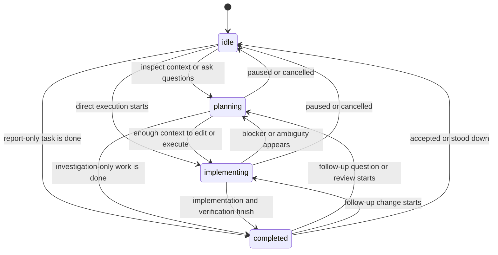

# session_info MCP Tool — AIAGENT State Registry & Endpoint Context

## Overview

The `session_info` MCP tool is an **autocall endpoint** that provides AI agents with session context, MCP connectivity information, and the canonical AIAGENT state registry. Call this tool on session startup to prime the state machine.

## Tool Definition

**Name:** `session_info`  
**Title:** Get Session Info  
**Method:** `tools/call` with `params.name='session_info'`  
**Input Schema:** Empty object `{}`  

## Response Fields

The tool returns a `SessionInfoResponse` object with these fields:

### Session Identity (Optional)

- **`sessionId`** (string, optional) — Helm session UUID if the caller authenticated with a session-scoped token (HELM_MCP_TOKEN). Undefined if using a global auth token.
- **`sessionName`** (string, optional) — Display name of the session (`HELM_SESSION_NAME` env var at session startup). Undefined for global token callers.
- **`cliType`** (string, optional) — CLI type of the session (e.g., `'claude-code'`, `'copilot-cli'`). Undefined for global token callers.
- **`workingDir`** (string, optional) — Working directory the session was spawned in. Undefined for global token callers.

### MCP Endpoint Context

- **`mcp_url`** (string) — HTTP endpoint for MCP requests: `http://127.0.0.1:PORT/mcp`. Constructed from `HELM_MCP_PORT` config (default 47373).
- **`mcp_token`** (string) — Bearer auth token for MCP requests. From Helm settings → MCP → Auth Token. Pass in request header: `Authorization: Bearer {mcp_token}`.

### AIAGENT State Registry

- **`aiagent_states`** (string[]) — Canonical list of valid AIAGENT-* state tags the session detector recognizes. Currently: `['planning', 'implementing', 'completed', 'idle']`.
  
  Use these to format the first line of response blocks:
  ```
  AIAGENT-PLANNING
  AIAGENT-IMPLEMENTING
  AIAGENT-COMPLETED
  AIAGENT-IDLE
  ```
  
  The session detector in Helm scans PTY stdout for these keywords and updates the session's visual state (activity dots) and `state` field in session info.

- **`aiagent_state_guide`** — Practical guide for the explicit AIAGENT state endpoint.
  - **`validStates`** — The values accepted by `session_set_aiagent_state`: `planning`, `implementing`, `completed`, and `idle`.
  - **`how_to_update`** — Tool name, usage example, and visual icon mapping for explicit AIAGENT state updates.
  - **`state_systems`** — Explains the difference between explicit `aiagentState`, PTY-detected `sessionState`, and durable Helm `planState`.
  - **`state_transitions`** — Advisory state-machine transitions with conditions for moving between states.
  - **`integration_patterns`** — Common workflows for starting implementation, handling blockers, and completing work.
  - **`error_scenarios`** — Expected failure modes such as invalid states, missing sessions, or plan ownership conflicts.

### Available Resources

- **`available_tools`** (McpToolSummary[]) — List of tools exposed by the MCP server with `{ name, title, description }` fields. Use this to discover what operations are available before calling tools.

- **`available_directories`** (DirectoryInfo[]) — List of configured working directories with `{ path, name }` fields. Use when spawning new sessions — pass the directory `path` to `session_create`.

### Agent Plan Guidance

- **`agent_plan_guide`** — Guidance for LLM agents that create, claim, complete, or link Helm plans.
  - **`plan_identifier_semantics`** — Values like `P-0035` are Helm human-readable plan IDs, and MCP plan tools accept either the canonical UUID or the `P-00xx` human ID.
  - **`when_to_create_plan`** — When follow-up work, blockers, or later cleanup should become durable Helm plans.
  - **`required_description_sections`** — Required plan description headings: `Problem Statement`, `User POV`, `Done Statement`, `Files / Classes Affected`, `TDD Suggestions`, and `Acceptance Criteria`.
  - **`question_plan_workflow`** — Blocking questions should become separate `QUESTION: ...` plans linked to the original task with `plan_nextplan_link`, using the question plan as the prerequisite.
  - **`completion_documentation`** — Completion notes should cover implemented behavior, changed files, tests or review, and remaining risk.

### Notification Guidance

- **`notification_guide`** — Advice for LLM agents on *when* to notify the user and *how* the notification will be routed. Lets a calling agent predict whether `notify_user` will surface as a toast, in-app bubble, Telegram message, or be suppressed entirely.
  - **`description`** — One-line summary of the field's purpose.
  - **`preferred_tool`** — Names `notify_user` as the smart router; mentions that it picks toast / bubble / telegram / none from current visibility + screen-lock state.
  - **`pre_flight`** — Pre-call checklist items, e.g. call `get_app_visibility` first to predict routing, ensure `notificationMode === 'llm'`.
  - **`when_to_notify`** — Bulleted reasons it's worth pulling the user's attention (long-running task done, blocking question, unrecoverable error, scheduled event).
  - **`when_not_to_notify`** — Bulleted suppression cases (focused on same session, routine chatter, tight loops, mode != llm).
  - **`routing_outcomes`** — Object keyed by `toast` / `bubble` / `telegram` / `none`, each with a short description of the routing path.
  - **`telegram_usage`** — Mobile-friendly content rules for Telegram-bound notifications (concise, plain text, lead with action item).
  - **`examples`** — Scenario / tool / rationale rows showing typical decisions.

## Usage Pattern

### 1. Startup Initialization

When a session starts, call `session_info` to prime the state machine:

```json
{
  "jsonrpc": "2.0",
  "id": 1,
  "method": "tools/call",
  "params": {
    "name": "session_info",
    "arguments": {}
  }
}
```

Response:
```json
{
  "jsonrpc": "2.0",
  "id": 1,
  "result": {
    "sessionId": "a1b2c3d4-e5f6-...",
    "sessionName": "Claude-Main",
    "cliType": "claude-code",
    "workingDir": "X:\\coding\\gamepad-cli-hub",
    "mcp_url": "http://127.0.0.1:47373/mcp",
    "mcp_token": "eyJhbGciOi...",
    "aiagent_states": ["planning", "implementing", "completed", "idle"],
    "available_tools": [
      { "name": "tools_list", "title": "List CLI Types", "description": "List CLI types configured in Helm..." },
      { "name": "session_info", "title": "Get Session Info", "description": "Retrieve MCP endpoint, AIAGENT state registry..." },
      ...
    ],
    "available_directories": [
      { "path": "X:\\coding\\gamepad-cli-hub", "name": "Helm" },
      { "path": "X:\\homeassistant", "name": "HomeAssistant" }
    ],
    "agent_plan_guide": {
      "plan_identifier_semantics": [
        "Values like P-0035 are Helm human-readable plan IDs..."
      ],
      "required_description_sections": [
        "Problem Statement",
        "User POV",
        "Done Statement",
        "Files / Classes Affected",
        "TDD Suggestions",
        "Acceptance Criteria"
      ],
      "question_plan_workflow": [
        "Question plans should use a title that starts with QUESTION: ..."
      ],
      "plan_attachment_guide": [
        "plan_get returns hasAttachments so agents can decide whether to call plan_attachment_list.",
        "Use plan_attachment_list for metadata, and plan_attachment_get when actual content is needed via a temp path.",
        "Use plan_attachment_add for durable supporting artifacts; attachments are stored inside Helm config-managed storage."
      ],
      "sequence_memory_guide": [
        "plan_get returns sequenceId but does not inline sequence sharedMemory; call plan_sequence_list with planId when sequence context is needed.",
        "Sequence sharedMemory is common memory for all member plans and can be read through plan_sequence_list.",
        "Use plan_sequence_memory_append for additive updates, or plan_sequence_update for full edits.",
        "Pass expectedUpdatedAt from the last read when writing to avoid overwriting concurrent changes."
      ]
    },
    "notification_guide": {
      "description": "When you need to pull the user's attention to this session, prefer notify_user...",
      "preferred_tool": "notify_user — smart router that picks toast / bubble / telegram / none from current visibility + screen-lock state.",
      "pre_flight": [
        "Call get_app_visibility first if you want to predict the routing outcome.",
        "Notifications require notificationMode === 'llm' in Helm settings; otherwise notify_user errors."
      ],
      "when_to_notify": [
        "Long-running task completed and the user likely walked away.",
        "Blocking question that needs user input before work can resume.",
        "Unrecoverable error or unexpected state worth surfacing immediately.",
        "Scheduled event or timer fired (e.g. a wait-until pattern reached its time)."
      ],
      "when_not_to_notify": [
        "App is visible-focused and activeSessionId matches this session — the user is already watching.",
        "Routine progress chatter that does not require user action.",
        "Inside a tight loop or per-token output path.",
        "notificationMode is not 'llm'."
      ],
      "routing_outcomes": {
        "toast": "Native OS toast (window hidden or background, screen unlocked).",
        "bubble": "In-app bubble in the focused window for a different session.",
        "telegram": "Telegram message (screen locked + Telegram configured).",
        "none": "Suppressed (focused on the same session, or screen locked without Telegram)."
      },
      "telegram_usage": [
        "Keep Telegram-bound content concise and mobile-friendly.",
        "Prefer plain text — no large logs, wide tables, or code blocks.",
        "Lead with the action item; the user is on a phone and may be glancing."
      ],
      "examples": [
        { "scenario": "Build finished after 8 minutes; user has minimized the window.", "tool": "notify_user", "rationale": "Long task done, app hidden → toast." },
        { "scenario": "Need a yes/no on a destructive migration.", "tool": "notify_user", "rationale": "Blocking question, surface regardless of visibility." },
        { "scenario": "Streaming routine progress every few seconds.", "tool": "(none)", "rationale": "Routine chatter — do not notify." },
        { "scenario": "Pattern matcher's wait-until just fired at 09:00.", "tool": "notify_user", "rationale": "Scheduled event the user wanted to know about." }
      ]
    }
  }
}
```

### 2. State Tagging

Use the canonical states from `aiagent_states` to tag response blocks:

```
AIAGENT-PLANNING
Analyzing the requirements...

<analysis content>

AIAGENT-IMPLEMENTING
Writing the code...

<implementation content>

AIAGENT-COMPLETED
Ready for review.
```

### 3. Building MCP Requests

Use `mcp_url` and `mcp_token` to construct subsequent MCP requests:

```javascript
const { mcp_url, mcp_token } = await callSessionInfo();

const response = await fetch(mcp_url, {
  method: 'POST',
  headers: {
    'Content-Type': 'application/json',
    'Authorization': `Bearer ${mcp_token}`
  },
  body: JSON.stringify({
    jsonrpc: '2.0',
    id: 2,
    method: 'tools/call',
    params: {
      name: 'plans_list',
      arguments: { dirPath: workingDir }
    }
  })
});
```

### 4. Discovering Available Tools

The `available_tools` array lists all MCP tools currently exposed by Helm. Use this to check what operations are available before attempting calls.

### 5. Creating Durable Plans

When an agent discovers follow-up work that should survive the current session, call `plan_create` with a description that includes the required sections from `agent_plan_guide.required_description_sections`. If the agent is blocked by a user question, create a separate plan titled `QUESTION: ...`, put the concrete question at the top of that plan, and link that question plan to the original blocked plan with `plan_nextplan_link` so the question must complete first.

When a user mentions `P-0035` or another `P-00xx` value, treat it as a Helm plan reference. MCP plan tools that accept a plan id also accept these human-readable IDs; use `plans_summary` when you need to map the `P-00xx` value to the canonical UUID, title, status, or dependency context.

### 6. Plan Attachments and Sequence Memory

#### Plan Attachments

`plan_get` is intentionally lightweight. It returns the plan item plus `hasAttachments: boolean` — a flag indicating whether the plan has any attached files. This design keeps raw attachment content out of routine plan reads.

**Workflow:**
1. Call `plan_get` to fetch a plan — the response includes `hasAttachments: true|false`.
2. If `hasAttachments` is true, call `plan_attachment_list` to see metadata (filename, size, content type, timestamps).
3. Call `plan_attachment_get` to retrieve a specific attachment — it is copied to a Helm temp file, and you receive the local temp path.
4. Call `plan_attachment_add` to store durable supporting artifacts (code samples, screenshots, design docs); attachments are persisted inside Helm's config-managed storage and survive session restarts.

Example:
```javascript
const plan = await mcp.callTool('plan_get', { id: 'P-0042' });
if (plan.hasAttachments) {
  const attachments = await mcp.callTool('plan_attachment_list', { planRef: 'P-0042' });
  for (const attachment of attachments) {
    const { tempPath } = await mcp.callTool('plan_attachment_get', {
      planRef: 'P-0042',
      attachmentId: attachment.id
    });
    // Read the file at tempPath...
  }
}
```

#### Sequence Memory (Shared State for Plan Groups)

A sequence is a first-class shared-memory store that groups related plans into a coordinated swimlane. Plans can optionally join a sequence to track common progress, decisions, or accumulated context.

**Key points:**
- A plan may include `sequenceId` (returned by `plan_get`), but the full sequence and its shared memory are NOT inlined.
- Call `plan_sequence_list` with `planId` to discover the sequence and see member plans, mission statement, and shared memory.
- Shared memory is common state that all member plans can read and append to.

**Workflow for reading:**
```javascript
const plan = await mcp.callTool('plan_get', { id: 'P-0042' });
if (plan.sequenceId) {
  const sequences = await mcp.callTool('plan_sequence_list', { planId: 'P-0042' });
  const sequence = sequences[0]; // The sequence this plan belongs to
  console.log('Shared Memory:', sequence.sharedMemory);
  console.log('Member Plans:', sequence.memberHumanIds);
}
```

**Workflow for writing shared memory atomically:**
When multiple agents may write concurrently, use `expectedUpdatedAt` from the last read to prevent overwrites:
```javascript
const sequences = await mcp.callTool('plan_sequence_list', { planId: 'P-0042' });
const sequence = sequences[0];

// Later, when writing:
const updated = await mcp.callTool('plan_sequence_memory_append', {
  id: sequence.id,
  text: 'Agent A completed the initial research phase.',
  expectedUpdatedAt: sequence.updatedAt  // Mutex: fails if another agent wrote first
});

// If mutex fails, re-read and retry:
// 1. Refetch the sequence with plan_sequence_list
// 2. Append with the new expectedUpdatedAt
```

Alternatively, use `plan_sequence_update` for full edits or to change mission and title.

## Environment Variables (at Session Spawn)

Helm injects these env vars into each spawned session's PTY:

- **`HELM_SESSION_ID`** — UUID v4 session identifier (matches `sessionId` in response).
- **`HELM_SESSION_NAME`** — Display name of the session (matches `sessionName` in response).
- **`HELM_MCP_TOKEN`** — Session-scoped auth token (session-specific variant of `mcp_token`). Derived from the global auth token.
- **`HELM_MCP_URL`** — MCP endpoint URL (matches `mcp_url` in response): `http://127.0.0.1:PORT/mcp`.

CLI agents can read these from `process.env` to avoid making a `session_info` call if they prefer.

## Authentication

Two auth models:

1. **Session-Scoped Token** (Preferred for inter-session communication)
   - Generated at spawn time via `mintSessionAuthToken()` — encodes `sessionId` and `sessionName`.
   - Passed in MCP request header: `Authorization: Bearer {HELM_MCP_TOKEN}`.
   - Server decodes the token and extracts `sessionId` and `sessionName` into `authContext`.
   - Useful for `session_send_text` and inter-LLM messages — proves sender identity.

2. **Global Auth Token** (Fallback for global callers)
   - Set in Helm settings → MCP → Auth Token.
   - Passed in request header: `Authorization: Bearer {authToken}`.
   - Server accepts but does not decode — `authContext` is empty.
   - Used by global tooling that doesn't have a session context.

## AIAGENT State Machine Integration

Helm tracks three independent state systems. Keep them aligned when useful, but do not treat them as aliases:

| System | Owner | Purpose |
| --- | --- | --- |
| `aiagentState` | External agents via `session_set_aiagent_state` | Durable agent-declared phase shown on session rows: planning, implementing, completed, or idle. |
| `sessionState` | Helm `StateDetector` | Runtime pipeline state inferred from AIAGENT-* tags in PTY output and question markers. |
| `planState` | Helm plan tools | Durable lifecycle for a plan item: planning, ready, coding, review, blocked, or done. |

The session detector in Helm's main process scans PTY output for the four AIAGENT-* keywords and:

1. Extracts the state from the first line of a response block.
2. Updates the session's `state` field (visible in session summaries and session cards).
3. Triggers activity-based transitions:
   - `state: 'idle'` on session startup (no output for 5+ minutes).
   - `state: 'waiting'` on activity (output detected, >10s silence).
   - `state: 'planning'|'implementing'|'completed'` on keyword match.

The `aiagent_states` registry from `session_info` provides the canonical list of states the detector recognizes — use these in response formatting to ensure your state transitions are recognized.

The explicit state endpoint is:

```json
{
  "name": "session_set_aiagent_state",
  "arguments": {
    "sessionId": "your-session-id",
    "state": "implementing"
  }
}
```

### State Machine



### Integration Patterns

Starting implementation:

1. Call `plan_set_state` with `status: "coding"` and your `sessionId` when claiming a plan.
2. Call `session_set_working_plan` so Helm shows the plan on the session row.
3. Call `session_set_aiagent_state` with `state: "implementing"` when edits, commands, or other execution begins.

Blocked by a question:

1. Call `session_set_aiagent_state` with `state: "planning"` while deciding or asking.
2. Create a separate `QUESTION: ...` plan if the blocker should survive chat history.
3. Link the question plan to the blocked plan with `plan_nextplan_link`; set the original plan blocked when work cannot continue.

Completing work:

1. Run the relevant verification and collect concise completion notes.
2. Call `plan_complete` with changed behavior, important files, tests or review, and remaining risk.
3. Call `session_set_aiagent_state` with `state: "completed"` so the user can see the session is ready for review.

Expected errors:

- `session_set_aiagent_state` rejects values outside `planning`, `implementing`, `completed`, and `idle`.
- Unknown session references fail with `Session not found`; use `HELM_SESSION_ID` from spawned sessions where possible.
- Plan ownership calls may fail if another session already owns the plan.

## Example: Full Session Initialization

```javascript
// Step 1: Call session_info to prime the state machine
const sessionInfo = await mcp.callTool('session_info', {});
console.log(`Session: ${sessionInfo.sessionName} (${sessionInfo.sessionId})`);
console.log(`Valid AIAGENT states: ${sessionInfo.aiagent_states.join(', ')}`);

// Step 2: Discover available tools
const tools = sessionInfo.available_tools;
console.log(`Available tools: ${tools.map(t => t.name).join(', ')}`);

// Step 3: Start work with AIAGENT state tags
console.log('AIAGENT-PLANNING');
console.log('Researching the task...');

// Step 4: Make MCP calls as needed
const plans = await mcp.callTool('plans_list', {
  dirPath: sessionInfo.workingDir
});

console.log('AIAGENT-IMPLEMENTING');
console.log('Implementing the solution...');

console.log('AIAGENT-COMPLETED');
console.log('Ready for review.');
```

## See Also

- [Helm Session Architecture](./helm-session-info.md) — How sessions are created, resumed, and managed.
- [MCP Protocol Documentation](./mcp-protocol.md) — Full MCP request/response format.
- [Config System](./config-system.md) — How to configure Helm, profiles, and MCP settings.
