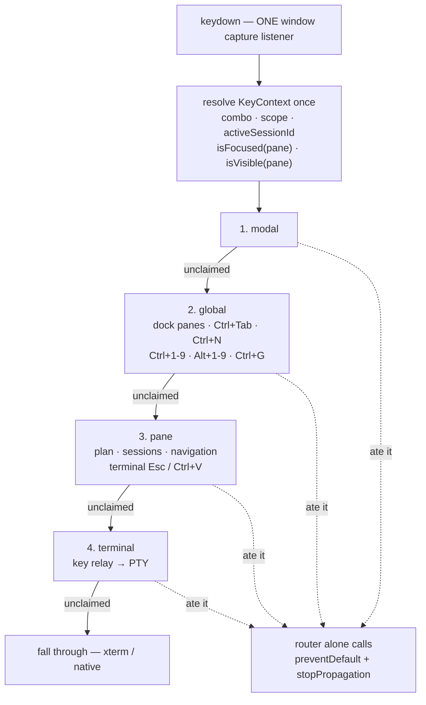
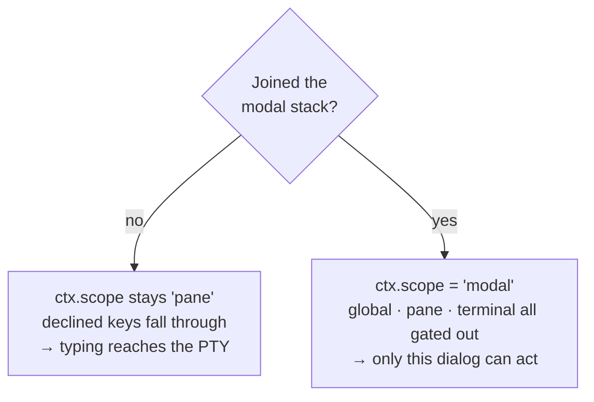
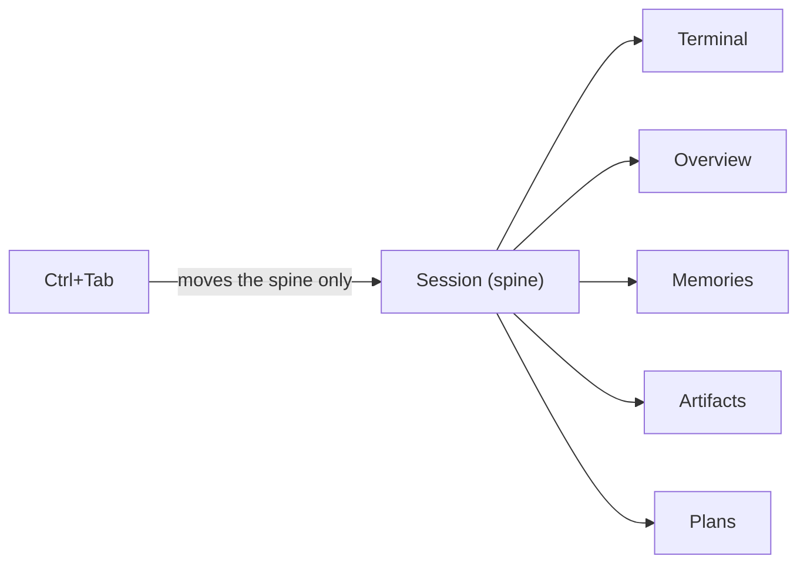

# Keyboard Routing

One capture-phase `keydown` listener owns global keyboard input. Screens register
handlers, declare a scope, and answer two questions: *am I eligible?* and *did I
eat it?* The router resolves the context once, walks the chain in declared
precedence order, and is the only code that suppresses an event.

## Why

Keyboard input used to be nine independent capture-phase listeners on
`window`/`document`. Their relative priority was an accident of module import
order, and each one re-derived its own eligibility from ad-hoc DOM probes. Two
consequences were user-visible bugs:

- **Handlers suppressed events they then declined to handle.** Escape was
  `preventDefault`ed at the top of the keyboard relay and dropped by a later
  guard, so it reached neither the PTY nor xterm.
- **The probes drifted out of sync with the dock.**
  `querySelector('.plan-screen.visible')` matches a pane that is merely
  *mounted* — dock panes use `v-show`, so inactive tabs stay in the DOM. Once the
  planner became a dock pane, that check was permanently true, which killed
  Ctrl+Tab, Ctrl+G and the managed Ctrl+V.

Four separate copies of "is this an editable field?" had also drifted apart. The
copy in the shell checked `closest('input, textarea')` *before* asking whether
the target was a terminal — and xterm.js focuses a hidden
`<textarea class="xterm-helper-textarea">`, so every Ctrl+Shift+&lt;pane&gt;
shortcut died the moment you were typing in a terminal.

## Flow



An **editable field** short-circuits the chain after `modal`: ordinary handlers
are skipped unless they opt in with `allowInEditable`. A **terminal is never an
editable field**, however much its helper textarea resembles one.

## The contract

```ts
interface KeyHandler {
  id: string;
  scope: 'modal' | 'global' | 'pane' | 'terminal';
  allowInEditable?: boolean;          // fire even while typing in a field
  claims?: (ctx: KeyContext) => boolean;   // am I eligible?
  handle: (ctx: KeyContext) => boolean;    // did I eat it?
}
```

Handlers **never** call `preventDefault` or `stopPropagation`. Returning `false`
leaves the event pristine so xterm.js and native controls still see it. That
inversion is what makes "swallowed but not handled" impossible.

Precedence is declared data in `router.ts` (`SCOPE_PRECEDENCE`), never import
order. Within one scope, registration order applies.

## Modal ownership is two-part

A handler's `scope: 'modal'` and the router's `ctx.scope === 'modal'` are
**different facts**, and a modal needs both. The handler's scope says *where I
sit in the chain*; the context's scope says *a modal currently owns the
keyboard*, and it is derived from the modal stack, not from the registry. A
dialog that registers a modal-scope handler but never joins the stack has done
half the job.

Both halves have bitten, in opposite directions:



- **Forgetting to join the stack leaks keys.** `BackupRestoreModal` registered a
  modal-scope handler but joined no registry, so `isKeyboardModalOpen()` stayed
  false and the router stayed in pane scope. Its `switch` ended in
  `default: return false`, so every key it declined carried on to the workspace
  and terminal handlers — typing behind the open dialog reached the CLI.
- **Joining the stack makes the dialog the only actor.** The ESC-protection
  dialog *did* hold modal scope, which correctly gated out the terminal
  handlers — including the confirm branch that lived there. The second Escape
  reached nothing and gamepad B was dead for the same reason.

Two rules follow:

1. **Push a `useModalStack` entry on open, pop it on close.** Then swallow
   unrecognised keys (`default: return true`) — once you own the keyboard,
   declining is not "pass it on", it is "leak it".
2. **A modal owns its own confirmation.** Never leave the confirming branch in a
   lower-scope handler, because your own modal scope is what makes it
   unreachable. Store the callback with the state that opened the dialog.

`interceptKeys` on the stack entry stays **empty** when a modal-scope handler is
already registered; handing the bridge keys to swallow would double-handle them.

## Focused vs. visible

`KeyContext` exposes both, and each screen picks the one that matches what its
key actually does:

| Question | Use | Because |
|----------|-----|---------|
| Does this key **render** something over a pane? | `isVisible(pane)` | Ctrl+G opens the prompt editor over the terminal; it works from any pane while a terminal is on screen, and no-ops when none is. |
| Does this key **send input** to a pane? | `isFocused(pane)` | Esc, Ctrl+V and the key relay write to a PTY. Typing into Memories must never reach a CLI. |

Ctrl+Shift+W follows the visible rule: you routinely close a session from the
sidebar while its terminal is on screen.

## Ownership model

Sessions are the spine; terminal, overview, memories, artifacts and plans are
aspects onto whichever session is selected.



Ctrl+Tab therefore always cycles sessions and leaves `focusedPaneId` untouched —
you keep looking at the same aspect of the next session.

## Files

| File | Responsibility |
|------|----------------|
| `renderer/keyboard/key-combo.ts` | `KeyboardEvent` → `ctrl+shift+o`. Meta folds into ctrl. Pure. |
| `renderer/keyboard/key-context.ts` | Resolves scope once per event via `input-ownership.ts` + dock state |
| `renderer/keyboard/router.ts` | Registry, declared precedence, the single listener, event suppression |
| `renderer/keyboard/install.ts` | Builds the `KeyEnvironment` for the dock window and single-pane pop-outs |
| `renderer/keyboard/handlers/workspace-keys.ts` | Dock pane shortcuts, Ctrl+Tab, spawn, close |
| `renderer/keyboard/handlers/number-keys.ts` | Ctrl+&lt;n&gt; session jump, Alt+&lt;n&gt; chip actions |
| `renderer/keyboard/handlers/terminal-keys.ts` | Ctrl+G, Esc, Ctrl+V, key relay → PTY |

Screens register their own keys next to their own code: `plans/plan-screen.ts`,
`modals/modal-base.ts`, `composables/useModalKeyboardBridge.ts`,
`components/modals/BackupRestoreModal.vue`.

## Adding a binding

1. Pick the screen that owns the key. Register from that module, not centrally.
2. Pick a scope. `global` only if it must work from any pane.
3. Write `claims` against `isFocused` or `isVisible` — never a DOM probe, and
   never `activeView`/`currentScreen`.
4. Return `true` from `handle` only when you consumed the key.
5. Unregister on unmount (`registerKeyHandler` returns the cleanup).

## What replaced what

| Was | Now |
|-----|-----|
| `MainWindowApp.vue` dock shortcut listener | `workspace-keys` (global) |
| `MainWindowApp.vue` modal bridge listener | `modal-stack-bridge` (modal) |
| `useNumberAccelerator` listener ×2 per window | `number-keys` (global) |
| `useAppBootstrap.ts` Ctrl+Tab listener | `session-cycle` (global) |
| `paste-handler.ts` keyboard relay listener | `terminal-keys` (global + pane + terminal) |
| `sessions.ts` keyboard fallback listener | `workspace-keys` + `pane-navigation` |
| `plan-screen.ts` listener + `globalThis` de-dup hack | `plan-screen` (pane) |
| `modal-base.ts` per-modal listener | `modal:*` (modal) |
| `BackupRestoreModal.vue` listener | `backup-restore-modal` (modal) |

Also deleted: four duplicate editable-target checks, the stale
`.plan-screen.visible` probes, the inline `.modal-overlay.modal--visible`
eligibility probes, and the `rename-session-request` /
`clear-session-notifications` window CustomEvents (the relay can now reach the
shell through injected collaborators).

## Related

- [docs/controls.md](controls.md) — the actual key map
- [docs/terminal-architecture.md](terminal-architecture.md) — PTY input routing
- [docs/docking.md](docking.md) — panes, focus and visibility
