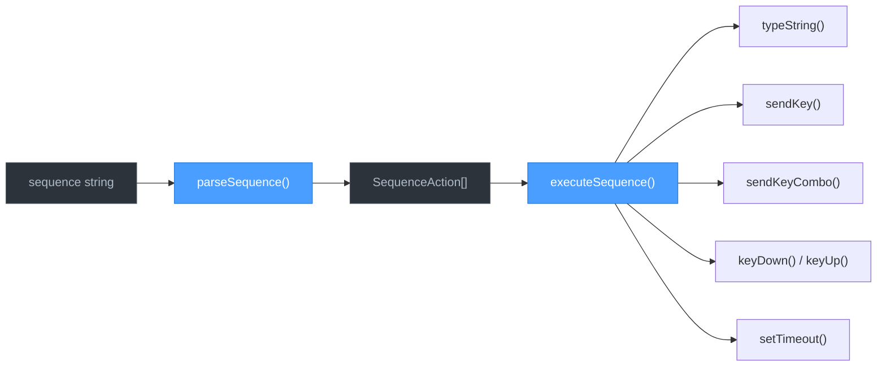
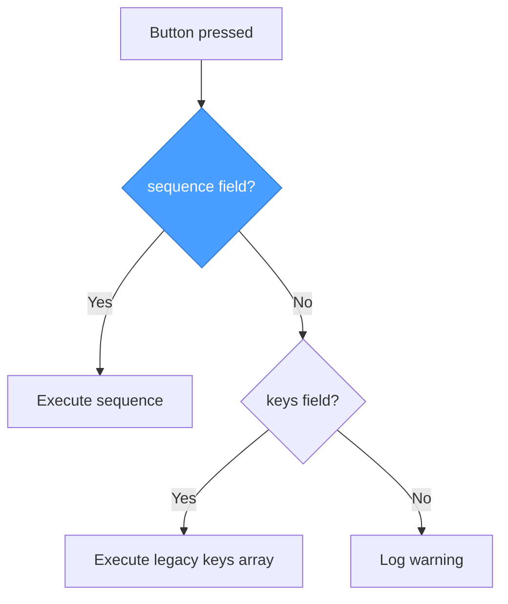

# Keystroke Sequences

## Overview

Button bindings can now use a `sequence` field to script complex keystroke patterns — multi-line text, key combos, modifier holds, and timed delays — all from a single button press.

Before sequences, typing `/compact` required eight separate entries in a `keys` array. With sequences, it's one readable string:

```yaml
# Before (keys array)
Y:
  action: keyboard
  keys: ["/", "c", "o", "m", "p", "a", "c", "t"]

# After (sequence)
Y:
  action: keyboard
  sequence: "/compact{Enter}"
```

## Quick Start

**Type a command and press Enter:**
```yaml
sequence: "/compact{Enter}"
```

**Press a key combo:**
```yaml
sequence: "{Ctrl+S}"
```

**Type text, wait, then continue:**
```yaml
sequence: |
  /clear
  {Wait 500}
  yes{Enter}
```

**Hold a modifier while typing:**
```yaml
sequence: "{Shift Down}hello{Shift Up}"
```

## Syntax Reference

| Syntax | Action | Example |
|--------|--------|---------|
| Plain text | Typed as-is | `hello world` |
| `{KeyName}` | Press and release a key | `{Enter}`, `{Tab}`, `{F5}` |
| `{Mod+Key}` | Key combination (held together) | `{Ctrl+S}`, `{Alt+F4}` |
| `{Mod+Mod+Key}` | Multi-modifier combo | `{Ctrl+Shift+P}` |
| `{Key Down}` | Press key without releasing | `{Ctrl Down}` |
| `{Key Up}` | Release a held key | `{Ctrl Up}` |
| `{Wait N}` | Pause for N milliseconds | `{Wait 500}` |
| `{{` | Literal `{` character | `{{` → types `{` |
| `}}` | Literal `}` character | `}}` → types `}` |
| Newline (in YAML `\|` block) | Converted to `{Enter}` | See [Multi-line](#multi-line-sequences) |

> **Case sensitivity:** `Wait`, `Down`, and `Up` keywords are case-insensitive. Key names are passed through as-is and normalized by the keyboard layer (also case-insensitive).

## How It Works



The parser converts a sequence string into an array of typed actions, then the executor runs them in order. Each action maps to a specific keyboard simulation call:

| Action Type | Generated By | Executor Call |
|-------------|-------------|---------------|
| `text` | Plain characters | `typeString()` — fast bulk typing |
| `key` | `{Enter}`, `{Tab}`, newlines | `sendKey()` — single key tap |
| `combo` | `{Ctrl+S}` | `sendKeyCombo()` — modifiers + key |
| `modDown` | `{Ctrl Down}` | `keyDown()` — press without release |
| `modUp` | `{Ctrl Up}` | `keyUp()` — release held key |
| `wait` | `{Wait 500}` | `setTimeout()` — pause in ms |

## Modifier Keys

| Modifier | Accepted Names | Notes |
|----------|---------------|-------|
| Control | `Ctrl`, `Control` | Most common in combos |
| Alt | `Alt` | |
| Shift | `Shift` | |
| Meta / Command | `Meta`, `Cmd` | macOS Command key |
| Windows / Super | `Win`, `Super` | Windows key |

All modifier names are case-insensitive. In combos, modifiers come before the main key: `{Ctrl+Shift+P}`.

For hold/release, use `Down` and `Up` suffixes:
```
{Shift Down}hello{Shift Up}    → types HELLO
{Ctrl Down}ac{Ctrl Up}         → Ctrl held while pressing a then c
```

## Special Key Names

### Navigation & Editing

| Key Name | Aliases |
|----------|---------|
| `Enter` | `Return` |
| `Tab` | |
| `Space` | |
| `Backspace` | |
| `Delete` | `Del` |
| `Insert` | |
| `Home` | |
| `End` | |
| `Escape` | `Esc` |

### Arrow Keys

`Up`, `Down`, `Left`, `Right`

### Function Keys

`F1` through `F12`

### Named Special Characters

Use these when a character would conflict with sequence syntax or is hard to type:

| Key Name | Character | Key Name | Character |
|----------|-----------|----------|-----------|
| `Plus` | `+` | `Minus` | `-` |
| `Equals` | `=` | `Comma` | `,` |
| `Period` | `.` | `Slash` | `/` |
| `Backslash` | `\` | `Quote` | `'` |
| `DoubleQuote` | `"` | `Backtick` | `` ` `` |
| `Tilde` | `~` | `Bang` | `!` |
| `At` | `@` | `Hash` | `#` |
| `Dollar` | `$` | `Percent` | `%` |
| `Caret` | `^` | `Ampersand` | `&` |
| `Asterisk` | `*` | `ParenLeft` | `(` |
| `ParenRight` | `)` | `Underscore` | `_` |
| `Pipe` | `\|` | `BraceLeft` | `{` |
| `BraceRight` | `}` | `BracketLeft` | `[` |
| `BracketRight` | `]` | `Colon` | `:` |
| `Semicolon` | `;` | `AngleLeft` | `<` |
| `AngleRight` | `>` | `Question` | `?` |

> **Tip:** Most printable characters can be typed as plain text. You only need these named keys when the character has special meaning in the sequence syntax (like `+` inside a combo) or when you want explicit single-key taps instead of bulk text typing.

## YAML Examples

### 1. Simple text typing
```yaml
X:
  action: keyboard
  sequence: "/compact"
```
Types `/compact` into the active terminal.

### 2. Text + Enter (submit a command)
```yaml
X:
  action: keyboard
  sequence: "/compact{Enter}"
```
Types `/compact` and presses Enter to submit.

### 3. Multi-line script (YAML `|` block)
```yaml
Y:
  action: keyboard
  sequence: |
    npm run build
    npm run test
```
The YAML `|` (literal block) preserves newlines. Each newline becomes an Enter keypress, so this types `npm run build`, presses Enter, types `npm run test`, presses Enter.

### 4. Key combination
```yaml
A:
  action: keyboard
  sequence: "{Ctrl+Shift+P}"
```
Opens the command palette in VS Code.

### 5. Modifier hold mid-text
```yaml
X:
  action: keyboard
  sequence: "{Shift Down}hello{Shift Up} world"
```
Types `HELLO world` — Shift is held during "hello" then released.

### 6. Delayed sequence
```yaml
B:
  action: keyboard
  sequence: |
    /clear
    {Wait 500}
    yes{Enter}
```
Types `/clear`, presses Enter (from the newline), waits 500ms for the CLI to respond, then types `yes` and presses Enter.

### 7. Literal braces
```yaml
X:
  action: keyboard
  sequence: "echo {{hello}}"
```
Types `echo {hello}` — double braces escape to literal brace characters.

### 8. Complex real-world example
```yaml
# Run a git workflow: stage, commit with message, push
X:
  action: keyboard
  sequence: |
    git add -A
    git commit -m "wip"
    {Wait 1000}
    git push
```

### 9. Clear screen and start fresh
```yaml
A:
  action: keyboard
  sequence: "{Ctrl+L}/clear{Enter}"
```
Sends Ctrl+L (clear shortcut), then types `/clear` and presses Enter as a fallback.

### 10. Open command palette and search
```yaml
Y:
  action: keyboard
  sequence: "{Ctrl+Shift+P}{Wait 200}format document{Enter}"
```
Opens VS Code command palette, waits for it to appear, types a command, and runs it.

## Backward Compatibility

The `sequence` field is **optional**. Existing bindings using the `keys` array continue to work unchanged.



**Priority rules:**
1. If `sequence` is present and is a string → **sequence wins**, `keys` is ignored
2. If `sequence` is absent → fall back to `keys` array (legacy behavior)
3. If neither is present → a warning is logged

You can safely add `sequence` to existing bindings without removing `keys` — the sequence takes priority and the keys array serves as a fallback if the sequence field is ever removed.

```yaml
# Both present: sequence wins
Y:
  action: keyboard
  keys: ["/", "c", "o", "m", "p", "a", "c", "t"]  # ignored
  sequence: "/compact{Enter}"                        # this runs
```

## Editing in the UI

Sequences are defined directly in your profile YAML files under `config/profiles/`. The format is a plain string — no special escaping beyond the `{{` / `}}` brace rules.

For multi-line sequences, use YAML's `|` (literal block scalar) to preserve newlines:

```yaml
sequence: |
  line one
  line two
```

The app displays a preview of sequence bindings in the settings screen (e.g., `seq: /compact{Enter}`) so you can verify your bindings at a glance.
