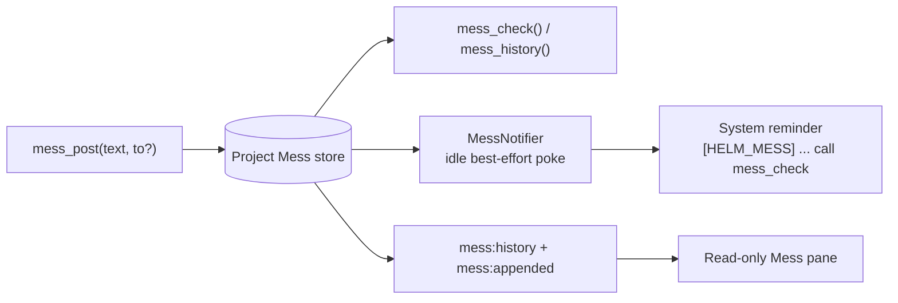

# Mess

Mess is Helm's durable, local, project-scoped conversation for coordination
between sessions. It is deliberately separate from `session_send_text`: posting
records intent for later reading, while `session_send_text` delivers an urgent
message into a live PTY.

## Why it exists

`session_send_text` combines posting, delivery, and interruption. That is useful
when a live session must act now, but it is the wrong shape for routine
coordination: the recipient may be offline, busy, or not yet created. Mess stores
bounded messages first, makes them available to future members, and optionally
issues one small best-effort reminder when a session appears idle.

Mess adds durable project history, offline queueing, batching of reminders, and a
human-readable observer pane. It does not replace plans, memories, drafts,
artifacts, Telegram, or session ownership state.

## Choosing the channel

| Situation | Use | Reason |
|---|---|---|
| A live recipient must receive and act on instructions now | `session_send_text` | It writes to the recipient PTY and is designed for urgent directed delivery. |
| Record a coordination note for the project | `mess_post(text)` | A project broadcast is durable and can be read later, including by future sessions. |
| Leave a note for one same-project session | `mess_post(text, to)` | The direct target is validated before the record is stored; it remains queued if the target is offline. |
| Read unread coordination messages | `mess_check()` | Returns an ordered, bounded delta and advances only the caller's cursor. |
| Inspect recent conversation without acknowledging anything | `mess_history(...)` | Cursor-neutral history for agents and the observer pane. |
| Ask the user to inspect a report or make a decision | Artifact or Telegram | Those are user-facing channels, not project coordination. |

Mess is social coordination only. It has no lock, claim, conflict detection, or
auto-release. A Mess message, unread badge, or idle reminder never implies that
the sender owns a task. Work ownership remains in the plan lifecycle and the
explicit plan-claim flow.

## Data flow



The MCP service is authenticated from Helm's caller context. It never accepts a
caller-supplied sender identity. Project membership is derived from the local
session's stored project identity; a direct target must resolve to a session in
that same project. Fleet proxy sessions are rejected in v1 because they have no
trusted local project membership, and a remote path or project id cannot safely
authorize access to local data.

## Wire contract

The wire uses short, human-oriented fields. `seq` is the ordering key; `t` is
display time only. The empty check response is intentionally tiny.

```json
{"new":0}
```

A populated check may look like:

```json
{"new":2,"hasMore":false,"msgs":[
  {"seq":41,"t":"09:20","from":"planner","to":"all","text":"Rewriting the resize path."},
  {"seq":42,"t":"09:22","from":"memories","to":"me","text":"Does Ctrl+C still map to 0x03?"}
]}
```

When retention has moved past the caller's cursor, `gap: true` and
`oldestSeq` make the loss explicit instead of presenting a clean empty poll:

```json
{"new":1,"gap":true,"oldestSeq":38,"msgs":[...]}
```

`mess_post` omits `to` for a broadcast. A supplied target must be same-project;
cross-project targets fail rather than creating an unreadable record. Text and
responses are bounded by the MCP service, and `mess_check` is bounded by both
entry count and total bytes.

## Ordering, retention, and joining

Each project has a monotonic `seq` counter. Cursors use `lastSeq`, never a
timestamp. Timestamps can collide within a millisecond and can move backwards
when the clock changes; timestamp comparisons would therefore lose or duplicate
messages. `createdAt` is display metadata only.

The append-only JSONL log and cursor metadata are stored under the per-user
Helm app-data directory, keyed by immutable project UUID. Writes are serialized
by the main process. This is a deliberate single-writer assumption: sharing the
same config directory between multiple Helm processes is unsafe until an
interprocess lock exists. Compaction uses a temporary file and rename, and a
malformed final JSONL line is reported without making the whole log unusable.

Retention and the join horizon solve different problems:

- Retention bounds what exists and is readable. `mess_history` can read retained
  entries without changing a cursor.
- The join horizon bounds only what arrives unread for a new session. A returning
  session keeps its cursor; a new stable session captures its baseline once.
- The horizon does not hide older retained history. A future session can still
  use `mess_history` to inspect it.

## Notifications

`IDLE IS NOT READINESS.` StateDetector idle means that PTY output has been quiet
for its configured inactivity window; it does not prove that a CLI is at a
prompt. Pokes are consequently best-effort and may be intrusive. They contain
one line only:

```text
[HELM_MESS] 3 new — call mess_check
```

The notifier checks unread visibility, idle state, whether the PTY is running,
and cooldown. It listens for both idle transitions and new appends, because a
post made while a session is already idle produces no new idle transition. A
retry timer rechecks the conditions after cooldown. Cooldown is recorded only
after successful delivery; a failed or unverified write does not acknowledge
anything.

## Observer pane

The `Mess` dock pane is a read-only observer for the active session's project.
It uses the selected session's authoritative project identity, not renderer path
inference. Switching sessions within one project leaves the transcript and
scroll position alone; switching projects reloads the transcript. With no
resolvable active project it shows an empty state.

Rows show time, live-resolved sender and target labels, body text, and a dashed
`all` broadcast marker. Closed sessions retain their stored label snapshot and
are marked as closed. A directed message whose target is busy or no longer
running may show `not picked up`; that badge is a visibility hint, never an
ownership or lock indicator. Filters cover sender, broadcast, and unread state.
The pane follows new entries unless the user has scrolled up, and `Older` reads
cursor-neutral history. There is no composer and human reads never advance an
agent cursor.

## Lifecycle and limits

Default project settings are 30 days of retention, a 24-hour new-member join
horizon, and a 15-minute poke cooldown. Project rename and path changes are safe
because records and filenames use the project UUID. Project deletion purges its
Mess data. Cursor lifetime follows session identity: recoverable close preserves
it, while ephemeral close, forget, and expiry remove it.

Fleet participation is deliberately excluded from v1. Remote peers do not have
trusted local project membership, and peer allow-lists are not project
authorization. Adding fleet Mess later requires an explicit host-project
targeting protocol rather than guessing from a proxy identity.

## Boundaries

| Boundary | Responsibility |
|---|---|
| `MessManager` | Project membership, ordered cursors, visibility, and domain events. |
| `MessPersistence` | Per-project JSONL entries plus atomic cursor/metadata persistence. |
| `HelmMessService` | Authenticated MCP validation and compact wire shapes. |
| `MessNotifier` | Best-effort idle reminders and cooldown/retry policy. |
| `mess-handlers` | Cursor-neutral renderer history and project-scoped append push. |
| `useMessPane` / `MessPane.vue` | Reactive observer projection and read-only UI. |

The canonical agent-facing tool guidance is also kept in
`src/mcp/guides/mess-guide.ts`. The preload surface is the typed `mess` domain;
renderer code does not reach the legacy broad IPC facade.
