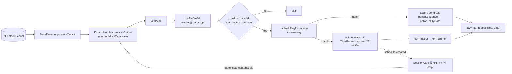

# Pattern Matcher

User-defined regex rules that watch a session's terminal output and react — either
by sending text back immediately, or by scheduling a resume for later.

## Why this exists

CLIs stall in predictable, textual ways. A rate-limited agent prints
*"resets at 3:00 PM"*; a tool prints a prompt that always wants the same answer; a
long-running job prints a banner right before it needs a nudge. Each of these is a
string the user could react to manually — if they were watching.

The pattern matcher turns "I always do X when I see Y" into configuration. Two
action types cover essentially all of it:

- **`send-text`** — the answer is immediate and constant.
- **`wait-until`** — the output tells you *when* to come back, and the delay is far
  longer than a human wants to babysit. This is the rate-limit case: parse the time
  out of the message and let the app resume the session unattended.

Rules are **per CLI type**, because the strings being matched are a property of the
tool, not of a particular session or directory.

## Architecture

## Key modules

| File | Role |
|------|------|
| `src/session/pattern-matcher.ts` | `PatternMatcher` — matching, cooldown, schedules, events |
| `src/config/loader.ts` | `PatternRule` interface + the profile YAML `patterns` array |
| `src/utils/time-parser.ts` | `parseScheduledTime()` — turns a captured time string into a `Date` |
| `src/input/sequence-parser.ts` | `parseSequence()` — sequence syntax → actions |
| `src/input/sequence-executor.ts` | `actionToPtyData()` — action → PTY escape bytes |
| `src/electron/ipc/pty-handlers.ts` | `pattern:cancelSchedule` |
| `src/electron/ipc/tools-handlers.ts` | `tools:getPatterns` / `addPattern` / `updatePattern` / `removePattern` |
| `src/electron/preload/domain-api.ts` | `patternCancelSchedule`, `toolsGetPatterns`, `toolsAddPattern`, `toolsUpdatePattern`, `toolsRemovePattern` |

`PatternMatcher` is constructed with two injected functions — `ptyWriteFn` and
`getPatternsFn(cliType)` — so it has no direct dependency on `PtyManager` or
`ConfigLoader` and can be driven entirely from a test.

## Rule shape (`PatternRule`)

| Field | Applies to | Meaning |
|---|---|---|
| `regex` | both | JavaScript regex source, no delimiters. Compiled with the `i` flag — matching is always case-insensitive. |
| `action` | both | `'send-text'` or `'wait-until'` |
| `sequence` | `send-text` | Sequence text sent to the PTY the moment the rule fires |
| `timeGroup` | `wait-until` | **1-based** capture-group index holding the scheduled time string |
| `waitMs` | `wait-until` | Fixed fallback delay, used when `timeGroup` is absent or its capture fails to parse |
| `onResume` | `wait-until` | Sequence sent when the timer fires |
| `cooldownMs` | both | Suppression window after firing. Default **300 000 ms (5 min)** (`DEFAULT_COOLDOWN_MS`). |

Rules live in the profile YAML under each CLI's `patterns` array, so switching
profiles switches the whole rule set along with everything else.

## Matching pipeline

1. **ANSI strip.** `PatternMatcher.stripAnsi()` removes CSI and OSC sequences
   (including partial OSC) so a rule author writes patterns against the text they
   can *read*, not against colour codes interleaved with it.
2. **Early exit.** No rules for this CLI type → return immediately. This runs on
   every stdout chunk, so the empty case must be free.
3. **Cooldown gate first, regex second.** `isReady()` is checked *before* the regex
   runs — a suppressed rule costs nothing.
4. **Compiled-regex cache** keyed by `cliType:index:pattern`. An invalid regex is
   cached as `null` and logged once rather than throwing per chunk.
5. On a match: record the fire time, emit `pattern-matched`, dispatch the action.

## Cooldown semantics

Cooldown is tracked **per session, per rule** (`Map<sessionId, Map<ruleIndex, ts>>`).

This granularity matters. A rule that matches a common phrase would otherwise
re-fire on every redraw of the same screen — TUI CLIs repaint constantly, so the
same line appears in dozens of consecutive chunks. Per-session scoping means one
noisy session cannot silence a rule for the others.

## Scheduling (`wait-until`)

- Time resolution order: **capture group** (`timeGroup` → `parseScheduledTime`) →
  **fixed `waitMs`**. If neither yields a time, nothing is scheduled.
- **One pending schedule per session.** A new schedule replaces any previous one for
  that session — the most recent instruction from the CLI wins.
- On fire: `onResume` is parsed as a sequence and written to the PTY, and
  `schedule-fired` is emitted.
- `cancelSchedule(sessionId)` clears the timer and emits `schedule-cancelled`.
- `removeSession(sessionId)` (session closed) cancels the schedule *and* drops the
  cooldown state.
- `dispose()` cancels every timer on shutdown — a stray `setTimeout` would keep the
  process alive.

### Sequence conversion

`sequenceToString()` flattens parsed actions into a single PTY string: `text` is
appended verbatim, `key` and `combo` go through `actionToPtyData()`. `wait` and
modifier actions are **ignored** here — this is a fire-and-forget suffix write, not
a timed playback, so there is nothing to pause between.

## Events

| Event | Payload | Emitted when |
|---|---|---|
| `pattern-matched` | `{ sessionId, cliType, ruleIndex, matchedText }` | Any rule matches |
| `schedule-created` | `{ sessionId, scheduledAt, ruleIndex }` | A `wait-until` rule scheduled a resume |
| `schedule-fired` | `{ sessionId }` | The timer fired and `onResume` was sent |
| `schedule-cancelled` | `{ sessionId }` | Cancelled by the user, session close, or replacement |

## IPC channels

| Channel | Purpose |
|---|---|
| `tools:getPatterns(cliType)` | Read the rule list for a CLI type |
| `tools:addPattern(cliType, rule)` | Append a rule |
| `tools:updatePattern(cliType, index, rule)` | Replace a rule by index |
| `tools:removePattern(cliType, index)` | Delete a rule by index |
| `pattern:cancelSchedule(sessionId)` | Cancel the session's pending resume |

Rules are addressed by **index**, matching their array position in the profile YAML
and the `ruleIndex` reported in events.

## UI

A session with a pending schedule shows a **⏰ `HH:mm` [×]** chip on its session
card. The chip exists because an unattended resume that the user has forgotten about
is a surprise — it makes the deferred action visible and one click cancellable
(`pattern:cancelSchedule`). Rule CRUD lives in the Settings tools editor.

## Distinct from

- **StateDetector** — also scans PTY output, but classifies session *state*
  (`AIAGENT-*` keywords, activity timing). PatternMatcher runs *after* it and takes
  actions instead of setting state.
- **Scheduled Tasks** — user-created, calendar/cron-driven task runs. Pattern
  schedules are *reactive*: created only because the CLI said something.
