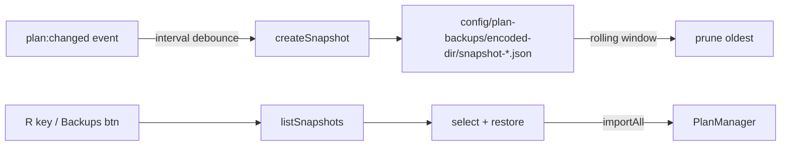

# Plan Backup & Restore System

## Overview

Per-directory rolling-window snapshots of plan data. Each backup captures all plan items and their dependency edges for a single directory. Snapshots are timestamped JSON files stored in `config/plan-backups/`.



## Storage Layout

```
config/plan-backups/
  config/plan-backups.yaml          # backup config (enabled, max, interval)
  X--coding--gamepad-cli-hub/       # encoded directory name
    snapshot-2024-04-28T09-30-00-000Z-0.json
    snapshot-2024-04-28T10-30-00-000Z-0.json
    ...
```

Directory paths are encoded as filesystem-safe names: backslashes and colons replaced with dashes/slashes, special chars replaced with underscores.

## Configuration

Stored in `config/plan-backups.yaml` (auto-created on first run):

| Field | Type | Default | Description |
|-------|------|---------|-------------|
| `enabled` | boolean | `true` | Enable automatic backups |
| `maxSnapshots` | number | `10` | Max snapshots per directory (rolling window) |
| `snapshotIntervalMs` | number | `3600000` | Min ms between auto-backups per directory |
| `excludePaths` | string[] | `[]` | Directory paths to skip |

Configurable via:
- Settings panel → 💾 Backups tab
- IPC: `plan:setBackupConfig({ enabled, maxSnapshots, snapshotIntervalMs })`

## Automatic Scheduling

Backups trigger automatically on `plan:changed` events with per-directory interval debounce:
- Each directory tracked independently with a "last backup" timestamp
- If `Date.now() - lastBackup < snapshotIntervalMs`, skip
- Manual "Backup Now" (via button or `plan:createBackupNow` IPC) bypasses interval

## Restore Workflow

1. Open plan screen for any directory
2. Press **R** or click **💾 Backups** button in the header
3. Browse dated snapshots (newest first)
4. Select a snapshot → click **Restore** (or press A)
5. Plan data is replaced via `PlanManager.importAll()`
6. Canvas reloads automatically

## Rolling Window Example

With `maxSnapshots: 10` and `snapshotIntervalMs: 3600000` (1 hour):
- Every hour (when plans change), a new snapshot is created
- After 10 snapshots, the oldest is deleted
- Always keeps the most recent 10 snapshots
- Total disk usage depends on plan count per directory

## Recovery Scenarios

| Scenario | Solution |
|----------|----------|
| Undo recent plan changes | Restore the snapshot taken before the changes |
| Restore deleted plans | Restore any snapshot that included the deleted plans |
| Fix broken dependencies | Restore a known-good snapshot, then re-edit |
| Move plans between directories | Not supported — snapshots are per-directory |

## Troubleshooting

| Issue | Fix |
|-------|-----|
| Backups not created | Check Settings → 💾 Backups tab — ensure enabled |
| Restore shows no backups | Directory must have had plans when backup ran |
| Disk usage high | Reduce `maxSnapshots` in settings |
| Snapshot file corrupt | Deleted automatically on list — manual delete via UI |
