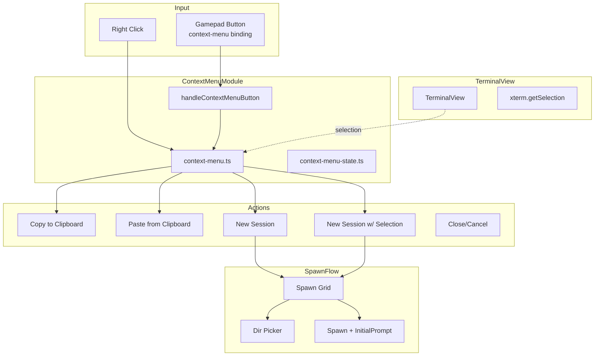
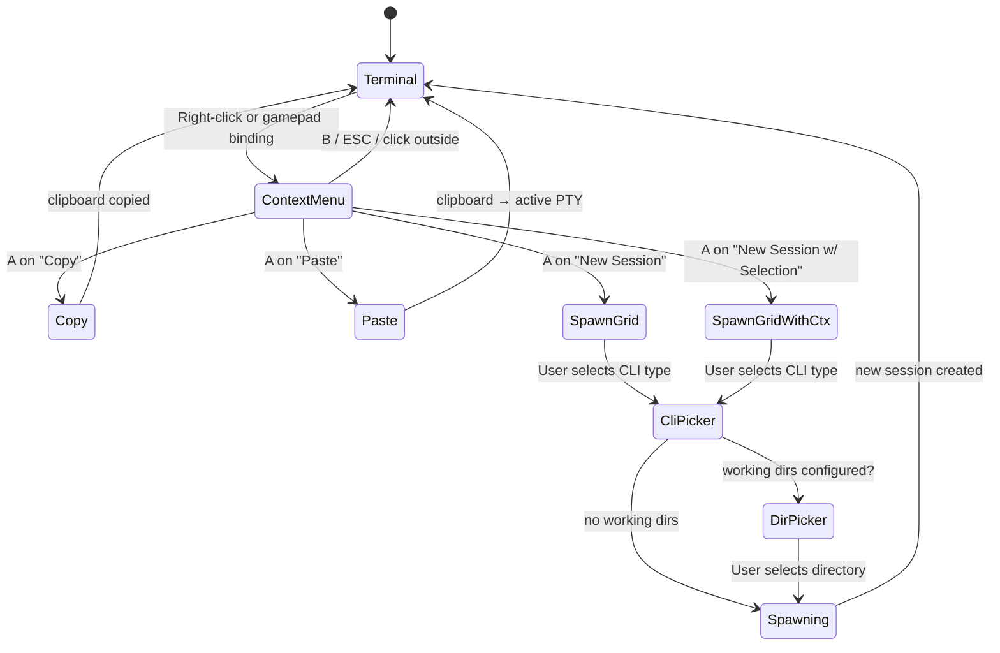

# Context Menu Overlay for CLI Display

**Date**: 2026-03-26
**Status**: Approved
**Priority**: Feature

## Overview

Add a context menu overlay to the embedded terminal display that enables:
- Copy selected text
- Paste from clipboard
- Launch new session (same CWD)
- Launch new session with selected text appended to initial prompt

**Trigger methods**:
- Right-click on terminal (mouse)
- Configurable gamepad button binding (`context-menu` action)

---

## User Stories

1. As a user, I want to highlight text in the terminal and copy it to the clipboard
2. As a user, I want to paste clipboard content into the active terminal
3. As a user, I want to spawn a new session in the same working directory as the current one
4. As a user, I want to spawn a new session with selected terminal text included as context

---

## Architecture



---

## Flow Diagram



---

## Menu Items

| # | Item | Enabled When | Action |
|---|------|--------------|--------|
| 1 | **Copy** | `hasSelection() === true` | `navigator.clipboard.writeText(selectedText)` |
| 2 | **Paste** | Always | Routes to existing paste handler → active PTY |
| 3 | **New Session** | Always | Hides menu, shows spawn grid (no context) |
| 4 | **New Session with Selection** | `hasSelection() === true` | Captures selection, hides menu, shows spawn grid with context |
| 5 | **Cancel** | Always | `hideContextMenu()` |

---

## Module Changes

### 1. Types (`src/config/loader.ts`)

Add `'context-menu'` to `BindingAction` union type:

```typescript
export type BindingAction =
  | 'keyboard'
  | 'voice'
  | 'session-switch'
  | 'spawn'
  | 'list-sessions'
  | 'profile-switch'
  | 'close-session'
  | 'scroll'
  | 'context-menu';  // NEW
```

### 2. Terminal View (`renderer/terminal/terminal-view.ts`)

Add selection API methods:

```typescript
/** Get currently selected text from terminal */
getSelection(): string {
  return this.terminal.getSelection();
}

/** Check if any text is selected */
hasSelection(): boolean {
  return this.terminal.hasSelection();
}

/** Clear the current selection */
clearSelection(): void {
  this.terminal.clearSelection();
}
```

### 3. New Module: Context Menu (`renderer/modals/context-menu.ts`)

**State interface**:

```typescript
export interface ContextMenuState {
  visible: boolean;
  x: number;
  y: number;
  selectedIndex: number;
  selectedText: string;
  hasSelection: boolean;
  sourceSessionId: string;
  mode: 'mouse' | 'gamepad';
}
```

**Key functions**:

- `showContextMenu(x, y, sessionId, mode)` - Capture selection, position, show
- `hideContextMenu()` - Close menu, reset state
- `handleContextMenuButton(button)` - D-pad navigation, A/B handling
- `renderContextMenu()` - Render items with enabled/disabled states
- `executeMenuItem(action)` - Route to action handlers

### 4. Terminal Manager (`renderer/terminal/terminal-manager.ts`)

Add right-click handler:

```typescript
// In terminal container setup
container.addEventListener('contextmenu', (e) => {
  e.preventDefault();
  const sessionId = this.activeSessionId;
  if (sessionId) {
    showContextMenu(e.clientX, e.clientY, sessionId, 'mouse');
  }
});
```

### 5. Sessions Screen (`renderer/screens/sessions.ts`)

Add spawn grid context mode:

```typescript
interface SpawnGridContext {
  contextText?: string;
  cwd?: string;
}

let spawnGridContext: SpawnGridContext | null = null;

export function showSpawnGridWithContext(context: SpawnGridContext): void {
  spawnGridContext = context;
  showScreen('sessions');
  // Focus first spawn button
}

async function doSpawn(
  cliType: string,
  workingDir?: string,
  contextText?: string  // NEW parameter
): Promise<void> {
  // ... spawn logic ...
  // contextText will be appended to initialPrompt
}
```

### 6. Bindings (`renderer/bindings.ts`)

Add `context-menu` action handler:

```typescript
case 'context-menu': {
  const tm = getTerminalManager();
  const activeId = tm?.getActiveSessionId();
  if (activeId) {
    const session = tm.getSession(activeId);
    const rect = session?.view.container?.getBoundingClientRect();
    const centerX = rect ? rect.left + rect.width / 2 : window.innerWidth / 2;
    const centerY = rect ? rect.top + rect.height / 2 : window.innerHeight / 2;
    showContextMenu(centerX, centerY, activeId, 'gamepad');
  }
  break;
}
```

### 7. Navigation (`renderer/navigation.ts`)

Add context menu routing (after existing modals):

```typescript
import { contextMenuState } from './modals/context-menu.js';
import { handleContextMenuButton } from './modals/context-menu.js';

// In handleGamepadEvent, after dirPicker and bindingEditor checks:
if (contextMenuState.visible) {
  handleContextMenuButton(event.button);
  return;
}
```

### 8. HTML (`renderer/index.html`)

Add context menu overlay:

```html
<div class="context-menu-overlay" id="contextMenuOverlay"
     role="menu" aria-label="Terminal context menu" aria-hidden="true">
  <div class="context-menu" id="contextMenu">
    <div class="context-menu-item focusable" data-action="copy">
      <span class="item-icon">📋</span>
      <span class="item-text">Copy</span>
    </div>
    <div class="context-menu-item focusable" data-action="paste">
      <span class="item-icon">📋</span>
      <span class="item-text">Paste</span>
    </div>
    <div class="context-menu-item focusable" data-action="new-session">
      <span class="item-icon">+</span>
      <span class="item-text">New Session</span>
    </div>
    <div class="context-menu-item focusable" data-action="new-session-with-selection">
      <span class="item-icon">+📋</span>
      <span class="item-text">New Session with Selection</span>
    </div>
    <div class="context-menu-item context-menu-item--cancel focusable" data-action="cancel">
      <span class="item-text">Cancel</span>
    </div>
  </div>
</div>
```

### 9. CSS (`renderer/styles/main.css`)

```css
.context-menu-overlay {
  position: fixed;
  inset: 0;
  pointer-events: none;
  z-index: 1000;
}

.context-menu-overlay.modal--visible {
  pointer-events: auto;
}

.context-menu {
  position: absolute;
  min-width: 220px;
  background: #1a1a1a;
  border: 1px solid #444;
  border-radius: 4px;
  box-shadow: 0 4px 12px rgba(0, 0, 0, 0.5);
}

/* Gamepad centered mode */
.context-menu--centered {
  position: fixed;
  top: 50%;
  left: 50%;
  transform: translate(-50%, -50%);
}

.context-menu-item {
  display: flex;
  align-items: center;
  gap: 8px;
  padding: 8px 12px;
  cursor: pointer;
  user-select: none;
}

.context-menu-item--selected {
  background: #ff6600;
  color: white;
}

.context-menu-item--disabled {
  opacity: 0.5;
  pointer-events: none;
}

.context-menu-item--cancel {
  border-top: 1px solid #444;
}
```

---

## Config Example

`config/profiles/default.yaml`:

```yaml
bindings:
  global:
    Y:
      action: context-menu

  claude-code:
    Y:
      action: keyboard
      sequence: '{Ctrl+C}'  # Override for Claude Code
```

---

## Implementation Order

1. **TerminalView selection API** (foundation)
2. **ContextMenu module** - state, render, basic show/hide
3. **Gamepad navigation** - D-pad, A/B button handling
4. **Action handlers** - Copy, Paste integration
5. **Spawn grid context** - context propagation to doSpawn
6. **Bindings integration** - context-menu action type
7. **Right-click handler** - mouse support in TerminalManager
8. **CSS styling** - positioning, states

---

## Testing

See [test-plan.md](./test-plan.md)

---

## Open Questions (Resolved)

| Question | Answer |
|----------|--------|
| Gamepad button? | Configurable per CLI via `context-menu` action |
| New Session w/ Selection behavior? | Append to initialPrompt |
| Menu positioning? | Hybrid: at cursor (mouse), centered (gamepad) |
| Menu items? | 5: Copy, Paste, New Session, New Session w/ Selection, Cancel |
| No selection state? | "New Session w/ Selection" disabled when no selection |
| CLI type selection? | Always show spawn grid (don't remember last) |
