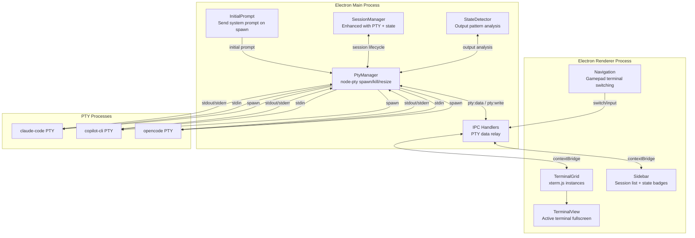

# Plan: Embedded Terminal Architecture

## Problem Statement

The current architecture spawns CLI sessions as **external terminal windows** (Windows Terminal), managing them via Win32 window focus/enumeration and sending keystrokes via robotjs. This is fragile — it depends on OS-level window management, global keystroke injection, and offers no visibility into terminal content or state.

**Goal:** Transform the app into a fullscreen Electron application that **hosts terminals internally** using PTY (pseudo-terminal) processes, pipes stdin/stdout/stderr through IPC, and renders them with xterm.js. Each terminal has a state category (implementing, waiting, planning, idle) that's auto-detected or manually overridden.

## Proposed Architecture



## Data Flow (New)

```
Gamepad Button Press
  → Navigation routes input
    → If terminal focused: IPC 'pty:write' → Main Process → PTY stdin
    → If sidebar focused: Switch active terminal / Spawn new / Change state
    
PTY stdout/stderr
  → Main Process: PtyManager receives data
    → StateDetector analyses output (TASKCOMPLETE, patterns)
    → IPC 'pty:data' → Renderer → xterm.js terminal.write()
    → State change → IPC 'session:state-changed' → Renderer sidebar update
```

## Terminal State Categories — Pipeline Workflow

The states form a **pipeline**: planning → waiting → implementing → idle. The app manages transitions both manually (user-driven) and automatically (event-driven).

| State | Badge | How Entered | Description |
|-------|-------|-------------|-------------|
| **implementing** | 🔨 | Auto (from waiting queue) or manual | CLI is actively coding/writing |
| **waiting** | ⏳ | Manual (user queues a planned session) | Plan is ready; queued to auto-start when a slot opens |
| **planning** | 🧠 | Manual or AIAGENT-PLANNING keyword | CLI is researching/thinking; NOT ready to implement |
| **idle** | 💤 | AIAGENT-IDLE keyword or no output timeout | No active task |

### Pipeline Workflow

```mermaid
graph LR
    P[🧠 Planning] -->|User: "Move to Waiting"<br/>via gamepad state menu| W[⏳ Waiting<br/>Queued]
    W -->|Auto: implementer finishes<br/>App sends: "go implement it ⏎"| I[🔨 Implementing]
    I -->|AIAGENT-QUESTION detected<br/>Task complete| Q{Done?}
    Q -->|Auto| ID[💤 Idle]
    Q -->|Triggers next| W2[⏳ Next Waiting]
    ID -->|User sends new task| P
```

### State Menu (Gamepad)
Pressing a designated button (e.g., **Y**) on the active terminal opens a **state override menu**:
- Move to Waiting (queue for implementation)
- Move to Planning
- Move to Implementing (force start)
- Move to Idle

### Question Badge [?]
When a terminal emits `AIAGENT-QUESTION`, a **[?] badge** appears on its tab header. This does **not** change the terminal's state — an implementing terminal with a question is still implementing. The badge clears automatically when the terminal emits more output (the agent continues).

### Auto-Handoff Logic
When an implementing session emits `AIAGENT-IDLE` (task complete):
1. That session transitions to **idle**
2. App checks the **waiting queue** (ordered by time entered waiting state)
3. If a waiting session exists: app writes `"go implement it"` + `Enter` to its PTY
4. That session transitions to **implementing**
5. If no waiting sessions: nothing happens, all stay idle

This creates a **worker pool** pattern — the user plans across multiple sessions, queues them up, and the app auto-dispatches work as implementers finish.

### Auto-Detection (from PTY output keywords)
| Keyword | Effect |
|---------|--------|
| `AIAGENT-IMPLEMENTING` | → implementing state |
| `AIAGENT-QUESTION` | → adds [?] badge to tab (state unchanged) |
| `AIAGENT-PLANNING` | → planning state |
| `AIAGENT-IDLE` | → idle state (+ trigger auto-handoff to next waiting) |

The [?] badge clears when the terminal emits more output after the question.


Manual override via state menu always takes precedence.

## Initial Prompt System — Pre-Loaded, Not Auto-Sent (Per CLI Type)

On each terminal spawn, after the CLI loads, the system prompt is **written into the PTY input buffer but NOT submitted** (no Enter keypress). The user sees the prompt pre-filled and can:
- **Leave it** and press Enter when ready to send
- **Edit it** before sending
- **Clear it** (Ctrl+C or similar) if they don't want it

Each CLI type has its **own initial prompt** — different CLIs may need different instructions. The prompt is wrapped in `<application-prompt>` tags:

Configurable per CLI type in `config/tools.yaml`:
```yaml
cliTypes:
  claude-code:
    name: Claude Code
    command: claude
    initialPromptDelay: 2000   # ms to wait before pre-loading
    initialPrompt: |
      <application-prompt>
      SYSTEMPROMPT: 
      - Include AIAGENT-QUESTION when done with a task.
      - Include AIAGENT-IMPLEMENTING when actively coding.
      - Include AIAGENT-PLANNING when researching.
      - Include AIAGENT-IDLE when awaiting input.
      - End responses with an open ended question with a freetype entry field.
      </application-prompt>

  copilot-cli:
    name: GitHub Copilot CLI
    command: copilot
    initialPromptDelay: 2000
    initialPrompt: |
      <application-prompt>
      SYSTEMPROMPT: 
      - Include AIAGENT-QUESTION when done with a task.
      - Include AIAGENT-IMPLEMENTING when actively coding.
      - Include AIAGENT-PLANNING when researching.
      - Include AIAGENT-IDLE when awaiting input.
      - End responses with an open ended question with a freetype entry field.
      </application-prompt>

  opencode:
    name: OpenCode
    command: opencode
    initialPromptDelay: 3000
    initialPrompt: |
      <application-prompt>
      SYSTEMPROMPT: 
      - Include AIAGENT-QUESTION when done with a task.
      - Include AIAGENT-IMPLEMENTING when actively coding.
      - Include AIAGENT-PLANNING when researching.
      - Include AIAGENT-IDLE when awaiting input.
      - End responses with an open ended question with a freetype entry field.
      </application-prompt>

  generic-terminal:
    name: Generic Terminal
    command: ""
    initialPromptDelay: 0     # no prompt for generic terminals
    initialPrompt: ""

  python:
    name: Python
    command: python
    initialPromptDelay: 0
    initialPrompt: ""
```

**Implementation:** After the `initialPromptDelay`, write the prompt text character-by-character to the PTY stdin (using the sequence parser) but do NOT append a newline/Enter. The prompt appears in the CLI's input line, ready for the user to review and submit.

**The sequence parser** (from the keystroke-sequence plan) handles both:
1. Pre-loading initial prompts to PTY stdin
2. Executing gamepad button `sequence` bindings to the active PTY

The `sequence` field on keyboard bindings replaces the old robotjs-based `keys` array:
```yaml
# Old (robotjs, global keystrokes):
A:
  action: keyboard
  keys: [/, c, l, e, a, r]

# New (PTY stdin, rich format):
A:
  action: keyboard
  sequence: |
    /clear
```

## UI Layout (Fullscreen)

```
┌─────────────────────────────────────────────────────────────┐
│ Status Bar: Profile | Gamepad Status | Terminal Count       │
├────────────┬────────────────────────────────────────────────┤
│            │                                                │
│  SIDEBAR   │         ACTIVE TERMINAL (xterm.js)             │
│            │                                                │
│ ┌────────┐ │  ┌──────────────────────────────────────────┐  │
│ │🔨 Claude│◄│  │ $ claude                                 │  │
│ │  impl   │ │  │ > I'll implement the login feature...   │  │
│ ├────────┤ │  │ > Creating src/auth/login.ts...          │  │
│ │⏳ Copilot│ │  │ > ...                                   │  │
│ │  wait   │ │  │                                          │  │
│ ├────────┤ │  │                                          │  │
│ │💤 Claude│ │  │                                          │  │
│ │  idle   │ │  └──────────────────────────────────────────┘  │
│ └────────┘ │                                                │
│            │  State: 🔨 Implementing  [Y to override]       │
│ [A] New    │                                                │
├────────────┴────────────────────────────────────────────────┤
│ Footer: D-Pad Navigate | A Select | B Back | X Close       │
└─────────────────────────────────────────────────────────────┘
```

**Gamepad controls in terminal mode:**
- D-Pad Up/Down → Switch active terminal (sidebar navigation)
- A → Focus terminal (enter text input mode)
- B → Unfocus terminal (back to sidebar navigation)
- X → Close/kill terminal
- Y → Cycle terminal state manually
- Left Trigger → Spawn new Claude Code terminal
- Right Bumper → Spawn new Copilot CLI terminal
- Start/Back → Switch profile
- Sandwich → Toggle sidebar visibility (maximize terminal)

## New Dependencies

| Package | Purpose | Notes |
|---------|---------|-------|
| `node-pty` | PTY process management (main process) | Native module, needs electron-rebuild |
| `@xterm/xterm` | Terminal emulator UI (renderer) | Pure JS, no native deps |
| `@xterm/addon-fit` | Auto-resize terminal to container | xterm addon |
| `@xterm/addon-web-links` | Clickable URLs in terminal | xterm addon |
| `@xterm/addon-search` | Search terminal buffer | xterm addon |
| `@electron/rebuild` | Rebuild native modules for Electron | Dev dependency |

## Modules to Deprecate/Remove

| Module | Reason | Replacement |
|--------|--------|-------------|
| `src/output/keyboard.ts` (robotjs) | No longer sending global keystrokes | Direct PTY stdin writes |
| `src/output/windows.ts` | No external window management | Internal terminal focus |
| `src/session/spawner.ts` | Detached process spawning | PTY-based spawner |
| `window-handlers.ts` IPC | No Win32 window calls | PTY IPC handlers |
| `keyboard-handlers.ts` IPC | No robotjs forwarding | PTY write handlers |

**Keep but modify:**
- `SessionManager` — add state + PTY reference
- `SessionInfo` type — add state field, remove windowHandle
- `tools.yaml` config — add initialPrompt field, remove terminal field
- Navigation — route input to PTY instead of robotjs

## Implementation Phases

### Phase 1: PTY Foundation + Sequence Parser
- Install `node-pty` + `@electron/rebuild`
- Create `src/session/pty-manager.ts` — spawn/kill/resize/write PTY processes
- Create `src/session/state-detector.ts` — output pattern analysis
- **Create `src/input/sequence-parser.ts`** — parse `sequence` string format into Action[] (from keystroke-sequence plan)
- Add `sequence?: string` field to `KeyboardBinding` interface in `src/config/loader.ts`
- Update `SessionInfo` type with `state` field and PTY tracking
- Add new IPC channels: `pty:spawn`, `pty:write`, `pty:resize`, `pty:data`, `pty:exit`
- Update esbuild config to external node-pty
- Write tests for PtyManager, StateDetector, and sequence parser

**Sequence parser syntax** (from keystroke-sequence plan):
- Plain text → write to PTY stdin literally
- `{Enter}`, `{Tab}`, etc. → send special key codes
- `{Ctrl+S}`, `{Ctrl+Shift+P}` → send key combos
- `{Wait N}` → pause N milliseconds
- `{{` / `}}` → literal braces
- Newlines in YAML `|` blocks → Enter key presses

This parser serves dual purpose:
1. Gamepad button `sequence` bindings → write to active terminal's PTY
2. `initialPrompt` in tools.yaml → pre-load prompt text into PTY on spawn

### Phase 2: Terminal Renderer
- Install `@xterm/xterm` + addons
- Create `renderer/terminal/terminal-view.ts` — xterm.js wrapper
- Create `renderer/terminal/terminal-manager.ts` — manage multiple xterm instances
- Update `renderer/index.html` with fullscreen terminal layout
- Wire IPC: pty:data → xterm.write(), xterm.onData → pty:write
- Update esbuild renderer build for xterm.js CSS
- Handle terminal resize (fit addon + IPC resize)
- Write tests for terminal manager

### Phase 3: Session State System + Pipeline Queue
- Implement auto-detection in StateDetector (AIAGENT-* keywords only — no timeout heuristics)
- Build **waiting queue** — ordered list of sessions waiting for an implementation slot
- Implement **auto-handoff**: when implementing session emits AIAGENT-QUESTION → pick next from waiting queue → send "go implement it" + Enter → transition to implementing
- Add state badges to tab bar + status bar
- Build **state menu** modal (gamepad Y button) — move between planning/waiting/implementing/idle
- Queue position badges on tabs (#1, #2, etc.)
- Add manual state override with state menu
- Create `src/session/pipeline-queue.ts` — FIFO queue of waiting session IDs
- Update session persistence to include state + queue position
- Wire state changes through IPC events
- Write tests for state detection, queue ordering, auto-handoff

### Phase 4: Initial Prompt & Fullscreen UI + Binding Editor
- Implement initial prompt **pre-loading** using sequence parser (write to PTY stdin without Enter)
- Prompt wrapped in `<application-prompt>...</application-prompt>` tags
- **Per CLI type** — each CLI type has its own `initialPrompt` and `initialPromptDelay` in tools.yaml
- User sees pre-filled prompt and decides when (or whether) to submit
- Make Electron window fullscreen by default
- **Update binding-editor UI** — add sequence textarea + mode toggle for keyboard bindings
- Add collapsible syntax help panel in binding editor (modifier names, special keys, examples)
- Wire sequence execution: gamepad `sequence` bindings → parse → write to active PTY stdin
- Update gamepad navigation for terminal mode
- Write tests for prompt pre-loading and sequence execution

### Phase 5: Gamepad Integration Update
- Update `navigation.ts` for terminal-focused input routing
- Implement text input mode (gamepad → PTY stdin)
- Update button bindings for new terminal controls
- Update profile YAML schema if needed
- Ensure analog sticks work for scrolling terminal buffer

### Phase 6: Cleanup & Migration
- Deprecate external window management code (`src/output/windows.ts`, `window-handlers.ts`)
- Remove `@jitsi/robotjs` dependency — all keyboard actions now go through PTY stdin
- Ensure backward compat: `keys: [...]` bindings still work (sequence parser treats them as sequential taps to PTY)
- Update CLAUDE.md with new architecture
- Update all existing tests for new architecture
- Migration path: update tools.yaml to remove `terminal: wt` field, add `initialPrompt` + `initialPromptDelay`
- Update README/config examples with new sequence format documentation

## Decisions Made

1. **No hybrid mode** — fully remove external terminal support. No external window management.
2. **Layout** — Sidebar (built in separate session) + single active terminal (this session's focus). Overview grid mode is optional bonus.
3. **robotjs** — fully removed. All input goes through PTY stdin.
4. **opencode** — new CLI type added to tools.yaml alongside claude-code, copilot-cli.
5. **State keywords** — `AIAGENT-IDLE`, `AIAGENT-QUESTION`, `AIAGENT-PLANNING`, `AIAGENT-IMPLEMENTING` (not generic names).
6. **Sidebar** — NOT part of this session's scope. Built in separate session (3932bfbd). This session focuses on terminal view area only.

## Risk Assessment

| Risk | Impact | Mitigation |
|------|--------|------------|
| node-pty Electron compatibility | High | Use @electron/rebuild, test early in Phase 1 |
| ANSI escape code rendering | Medium | xterm.js handles this natively |
| Interactive CLI features (selections, prompts) | Medium | PTY preserves full terminal behavior |
| Performance with many terminals | Low | xterm.js is GPU-accelerated via WebGL addon |
| State detection accuracy | Medium | Manual override as escape hatch |
