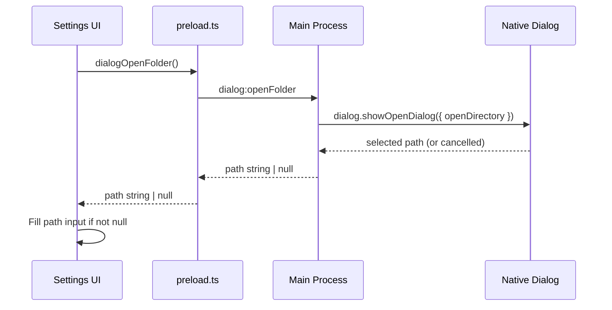

# Folder Picker Dialog — Implementation Plan

## Problem

Adding a working directory in Settings requires manually typing/pasting the full path into a text input. This is error-prone and unfriendly — especially when the user doesn't have the exact path memorized.

## Solution

Add a **"Browse…"** button next to the path input that opens a **native OS folder picker dialog** (via Electron's `dialog.showOpenDialog`). The selected folder path auto-fills the text input. Manual text entry remains available as a fallback.

## Architecture



## Tasks

### 1. `dialog-ipc-handler`

**File:** `src/electron/ipc/config-handlers.ts` (or a new `dialog-handlers.ts`)

Add IPC handler:
```typescript
ipcMain.handle('dialog:openFolder', async () => {
  const result = await dialog.showOpenDialog({
    properties: ['openDirectory'],
    title: 'Select Working Directory',
  });
  if (result.canceled || result.filePaths.length === 0) return null;
  return result.filePaths[0];
});
```

**Decision:** Add to `config-handlers.ts` since it's directory-config related, or create a minimal `dialog-handlers.ts`. Leaning towards `config-handlers.ts` to keep it simple (YAGNI).

### 2. `preload-api`

**File:** `src/electron/preload.ts`

Add:
```typescript
dialogOpenFolder: () => ipcRenderer.invoke('dialog:openFolder'),
```

### 3. `settings-browse-button`

**File:** `renderer/screens/settings.ts`

**In `showAddDirectoryForm()` (line 913):**
- Add a "Browse…" button next to the path `<input>`
- On click: `const path = await window.gamepadCli.dialogOpenFolder()`
- If path returned, set `pathInput.value = path`
- If name input is empty, auto-fill name from folder basename (e.g. `C:\projects\my-app` → `my-app`). Only auto-fill when name is empty — don't overwrite user-entered names.

**In `showEditDirectoryPrompt()` (line 969):**
- Uses `showFormModal()` from `renderer/utils.ts`
- Either add browse button support to `showFormModal()`, or convert edit to inline form like add

### 4. `form-modal-browse` (optional)

**File:** `renderer/utils.ts` — `showFormModal()`

Add a `browse?: boolean` option to the field config. When true, renders a "Browse…" button alongside the text input. On click calls the dialog and fills the input.

This makes the browse button reusable across any form modal, not just directory forms.

## UI Mockup

```
┌────────────────────────────────────┐
│ Add Directory                       │
│                                     │
│ Name:  [my-project          ]       │
│ Path:  [C:\projects\my-project ] 📁│
│                                     │
│ [Save]  [Cancel]                    │
└────────────────────────────────────┘
         └── "Browse…" button (📁) opens native OS folder dialog
```

## Notes

- `dialog.showOpenDialog` is **async** and runs in the main process — safe for IPC
- Returns an array of paths (we use `[0]` since multi-select is off)
- The text input remains editable for manual path entry or correction
- Auto-fill name from basename is a convenience — user can always change it
- Gamepad users can still navigate to the Browse button via the focusable system
