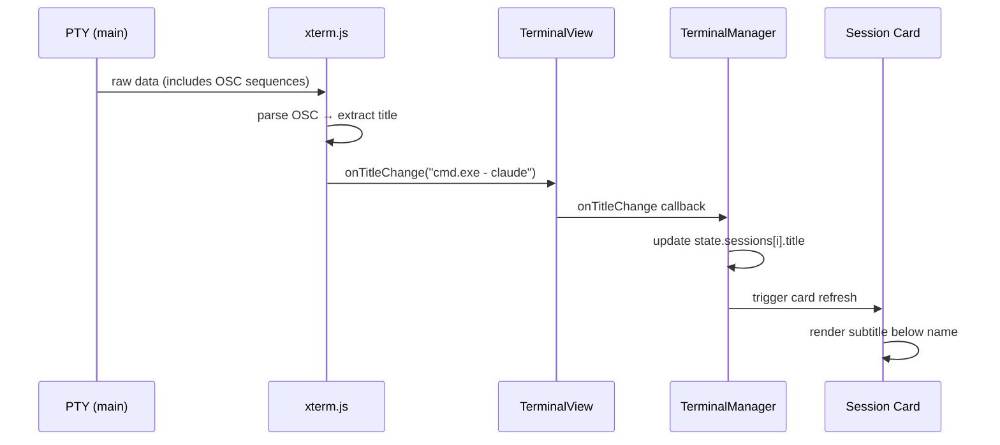

# OSC Title Detection — Implementation Plan

> **Superseded:** Original plan (2026-03-26) used a custom `OscTitleParser` in the main process. This revision uses xterm.js native `onTitleChange` — no custom parser, no IPC, no preload changes.

## Problem

CLI tools (shells, Claude Code, Copilot CLI) set terminal window titles via OSC escape sequences (`ESC]0;title BEL`). Currently:
- Titles are ignored — session cards show only the user-assigned name
- `stripAnsi()` in `state-detector.ts` only strips CSI sequences (`ESC[...`), so OSC sequences leak through as garbage in AIAGENT-* keyword detection

## Approach

Use **xterm.js native `onTitleChange`** event instead of building a custom parser. xterm.js already parses OSC title sequences — we just listen for the event in the renderer and display the title as a subtitle on session cards.



## Tasks

### 1. `fix-strip-ansi` — Strip OSC sequences from StateDetector

**File:** `src/session/state-detector.ts`

Expand `stripAnsi()` regex to also remove OSC sequences (complete + incomplete):

```typescript
function stripAnsi(text: string): string {
  return text
    .replace(/\x1b\[[0-9;]*[a-zA-Z]/g, '')              // CSI sequences
    .replace(/\x1b\][^\x07\x1b]*(?:\x07|\x1b\\)/g, '')   // Complete OSC sequences
    .replace(/\x1b\][^\x07\x1b]*/g, '');                  // Incomplete OSC (strip prefix)
}
```

**Tests:** Add OSC stripping test cases to `tests/state-detector.test.ts`.

### 2. `terminal-title-callback` — Add onTitleChange to TerminalView

**File:** `renderer/terminal/terminal-view.ts`

- Add `onTitleChange?: (title: string) => void` to `TerminalViewOptions`
- Subscribe to `this.terminal.onTitleChange` in constructor (same pattern as `onData`/`onResize`)
- Forward title string to the callback

### 3. `session-state-title` — Add title to Session type

**File:** `renderer/state.ts`

- Add `title?: string` to `Session` interface (keeps user-assigned `name` intact)

### 4. `terminal-manager-propagate` — Propagate title in TerminalManager

**File:** `renderer/terminal/terminal-manager.ts`

- Add `title?: string` to `TerminalSession` interface
- In `createTerminal()`, pass `onTitleChange` handler that stores the title and fires a callback
- Add `onTitleChange: ((sessionId: string, title: string) => void)` callback (same pattern as `onSwitch`/`onEmpty`)
- Expose `getTitle(sessionId): string | undefined` method

### 5. `session-card-subtitle` — Display title in session cards

**File:** `renderer/screens/sessions-render.ts`

- After the name line in `renderSessionCard()`, add a `.session-meta` span showing `session.title`
- CSS already exists: `.session-card .session-meta { font-size: 10px; color: var(--text-dim); }`
- Only render when title is present and different from session name
- Truncate long titles with CSS ellipsis

Wire up in `renderer/main.ts` or `renderer/screens/sessions.ts`:
- Subscribe to `TerminalManager.onTitleChange`
- Update `state.sessions[i].title` and trigger card re-render

### 6. `overview-card-title` — Display title in overview cards

**File:** `renderer/screens/group-overview.ts`

- Add a subtitle element in the card header showing the OSC title (dim, small font)
- Same pattern as session cards

## Notes

- **No custom `OscTitleParser` needed** — xterm.js handles all OSC parsing natively via `terminal.onTitleChange: IEvent<string>`
- **No IPC changes needed** — title detection is entirely in the renderer process
- **No preload changes** — no `pty:title-change` event needed
- `.session-meta` CSS class already exists (unused) — `font-size: 10px; color: var(--text-dim)`
- The `stripAnsi` fix is defensive — prevents OSC garbage from breaking AIAGENT-* keyword detection in the main process
- Both Claude Code and Copilot CLI set terminal titles via OSC sequences
- `title` is kept separate from `name` — user-assigned session names are never overwritten
