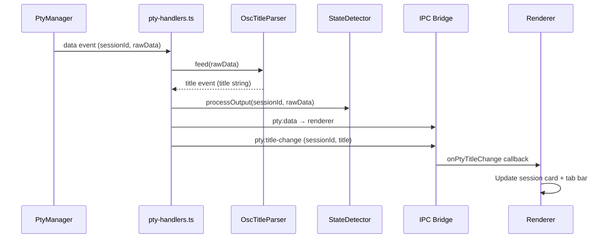

# OSC Title Detection — Implementation Plan

## Problem

Terminal programs (shells, AI CLIs) set window titles using **OSC escape sequences**:

```
ESC ] 0 ; <title> BEL     — set icon name + window title
ESC ] 2 ; <title> BEL     — set window title only
```

Currently:
- `stripAnsi()` in `state-detector.ts` only strips CSI sequences (`ESC[...`), so OSC sequences leak through as garbage in keyword detection
- Session cards and terminal tabs show the CLI type name but not the dynamic title the CLI sets
- Windows Terminal and shells actively use OSC titles — we should capture and display them

## Architecture



```
PTY Data Flow (with title detection added):
  PtyManager emits 'data' (sessionId, data)
    → pty-handlers.ts:
        1. OscTitleParser.feed(data)  →  emits 'title' if complete OSC found
        2. stateDetector.processOutput()  (existing — keyword scanning)
        3. win.webContents.send('pty:data')  (existing — xterm rendering)
    → 'title' event → pty:title-change IPC → renderer updates session card + tab
```

## Tasks

### 1. `title-parser` — Create OscTitleParser

**File:** `src/session/title-detector.ts`

Stateful parser for OSC title sequences. Must handle:
- Complete sequences in a single chunk
- Sequences split across multiple data events (partial buffer)
- Buffer overflow protection (max 1024 chars, discard on overflow)
- Both `ESC]0;` and `ESC]2;` prefixes
- Both BEL (`\x07`) and ST (`ESC\`) terminators
- Nested/malformed sequences (discard and reset)

```typescript
export class OscTitleParser {
  private buffer: string = '';
  private inSequence: boolean = false;
  private onTitle: ((title: string) => void) | null = null;

  constructor(onTitle: (title: string) => void) { ... }
  
  /** Feed raw PTY data. Calls onTitle when a complete title is found. */
  feed(data: string): void { ... }
  
  /** Reset parser state (e.g. on session close). */
  reset(): void { ... }
}
```

**Tests:** `tests/title-detector.test.ts`
- Complete OSC 0 and OSC 2 sequences
- Split across chunks (prefix in chunk 1, title+BEL in chunk 2)
- ST terminator (`ESC\`)
- Buffer overflow → discard
- Multiple titles in one chunk → last wins (or emits each)
- Malformed sequences (no terminator, wrong prefix) → discard
- Reset clears state

### 2. `fix-strip-ansi` — Strip OSC sequences from state detector

**File:** `src/session/state-detector.ts`

Update `stripAnsi()` to also remove OSC sequences:

```typescript
function stripAnsi(text: string): string {
  return text
    .replace(/\x1b\[[0-9;]*[a-zA-Z]/g, '')       // CSI sequences
    .replace(/\x1b\][^\x07\x1b]*(?:\x07|\x1b\\)/g, '')  // OSC sequences
    .replace(/\x1b\][^\x07\x1b]*/g, '');           // Incomplete OSC (strip prefix)
}
```

**Tests:** Update `tests/state-detector.test.ts` with OSC stripping cases.

### 3. `wire-title-detection` — Integrate into pty-handlers

**File:** `src/electron/ipc/pty-handlers.ts`

Changes:
- Import `OscTitleParser`
- Maintain `Map<string, OscTitleParser>` for per-session parsers
- In `pty:spawn` handler: create parser for new session
- In data event handler (line 91): call `parser.feed(data)` before stateDetector
- Parser's `onTitle` callback: update `SessionInfo.title` via `sessionManager.getSession()`, then forward `pty:title-change` IPC to renderer
- In exit handler: delete parser from map
- In kill handler: delete parser from map

### 4. `title-ipc` — Add preload subscription

**File:** `src/electron/preload.ts`

Add:
```typescript
onPtyTitleChange: (callback: (sessionId: string, title: string) => void) => {
  const listener = (_event, sessionId, title) => callback(sessionId, title);
  ipcRenderer.on('pty:title-change', listener);
  return () => ipcRenderer.removeListener('pty:title-change', listener);
},
```

### 5. `title-ui` — Display titles in renderer

**Files:** `renderer/screens/sessions.ts`, `renderer/terminal/terminal-manager.ts`

- Subscribe to `onPtyTitleChange` in main.ts or sessions.ts init
- Update session card subtitle text with the detected title
- Update terminal tab bar label with the title (truncated to ~30 chars)
- Fall back to CLI type name when no title detected

## SessionInfo Changes

**File:** `src/types/session.ts`

The `SessionInfo` interface already has a `name` field. We can either:
- **Option A:** Add a new `title?: string` field (separate from user-given name)
- **Option B:** Reuse `name` and overwrite it with OSC title

**Recommendation:** Option A — add `title?: string` to keep the user-assigned name intact.

## Notes

- OSC title parsing happens **before** state detection — the parser strips/ignores the OSC sequence, so it won't interfere with AIAGENT-* keyword scanning
- The `stripAnsi` fix (task 2) also prevents OSC garbage from reaching keyword matching
- Buffer overflow at 1024 chars is generous — most titles are <100 chars
- Both Claude Code and Copilot CLI set terminal titles via OSC sequences
- Windows Terminal respects OSC titles and shows them in its tab bar — we mirror that behavior in our own tab bar
