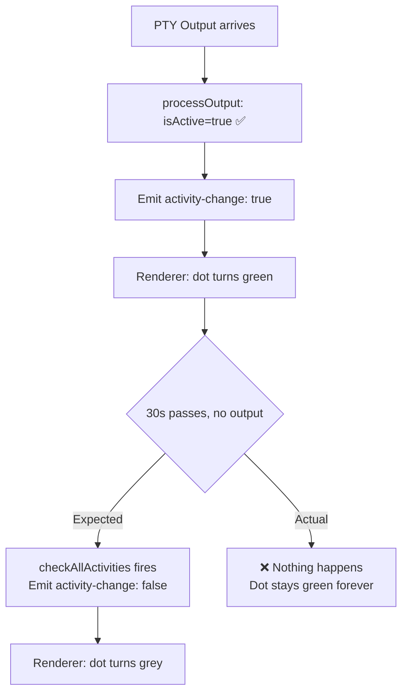
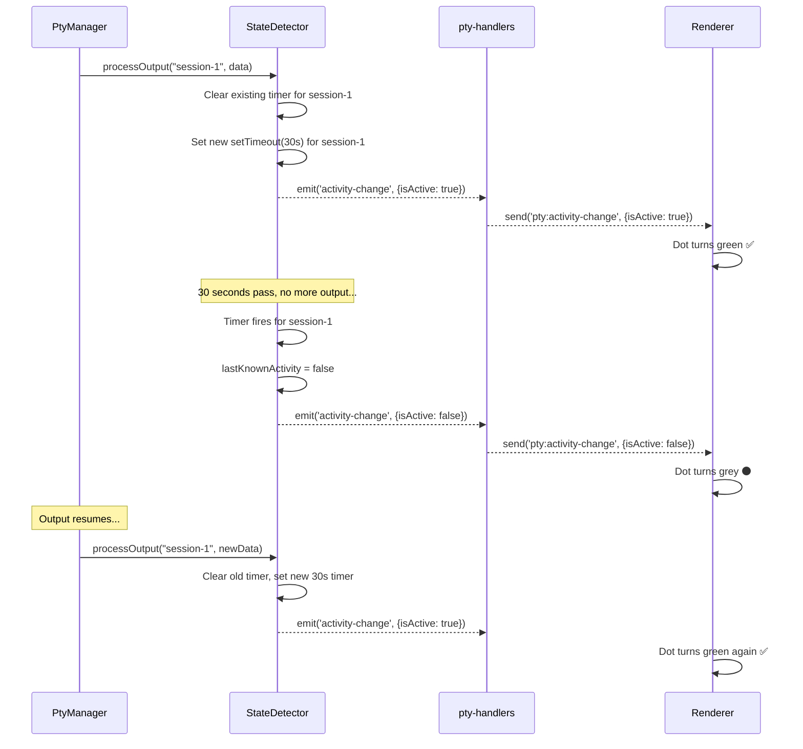

# Plan: Fix Activity Dot Stuck on Green

## Problem

The session activity dot (green `#44cc44` / grey `#555555`) in the session listing is stuck on green once a terminal produces any PTY output. It never transitions back to inactive (grey) because the timeout check is never executed.

### Root Cause

`StateDetector` has a `processOutput()` method that correctly emits `activity-change: { isActive: true }` when PTY data arrives, but the reverse transition (active → inactive after 30s of silence) requires calling `checkAllActivities()` — **which is never called from any timer or interval**. The method and the `DEFAULT_ACTIVITY_TIMEOUT_MS` constant (30s) are dead code.

## Proposed Approach: Per-Session Debounced Timeout

Instead of a global polling timer, use a per-session `setTimeout` inside `StateDetector`. Each `processOutput()` call clears and resets a 30-second timer for that session. When the timer fires (no output for 30s), emit `activity-change: { isActive: false }`.

### Why this approach over alternatives

| Approach | Verdict |
|----------|---------|
| **Global setInterval** (poll every 10s) | Works but polls unnecessarily when no sessions exist |
| **Per-session debounced timeout** ✅ | Self-managing, zero overhead when idle, fires precisely at 30s |
| **Renderer-side timeout** | Breaks "main process is source of truth" pattern |
| **Remove activity dot** | Loses useful "is terminal producing output?" signal |

## Todos

### 1. add-activity-timers
**Add per-session activity timers to StateDetector**
- Add `private activityTimers: Map<string, ReturnType<typeof setTimeout>>` to `StateDetector`
- Accept `activityTimeoutMs` as constructor parameter (default: 30000)
- In `processOutput()`: after marking active, clear existing timer and set new `setTimeout` that emits `activity-change: false` after timeout
- Only schedule timer if session transitioned to active (avoid resetting for already-inactive sessions — though debounce handles this naturally)

### 2. cleanup-timers
**Clean up timers on session removal and disposal**
- In `removeSession()`: clear timer from `activityTimers` map
- Add `dispose()` method: clear all timers (called on app shutdown)
- Update `src/electron/ipc/handlers.ts` cleanup function to call `stateDetector.dispose()`

### 3. remove-dead-polling-code
**Remove now-redundant polling methods**
- Remove `checkActivity()`, `checkAllActivities()`, `isSessionActive()` from `StateDetector`
- Remove `DEFAULT_ACTIVITY_TIMEOUT_MS` constant (replaced by constructor param)
- Keep `getLastOutputTime()` — still useful for sorting/display

### 4. add-tests
**Add tests for activity timeout transitions**
- Test: session becomes active on `processOutput()`, emits `activity-change: true`
- Test: after timeout (use `vi.advanceTimersByTime`), emits `activity-change: false`
- Test: rapid output resets the timer (dot stays green, only one inactive event after final timeout)
- Test: `removeSession()` clears the timer (no late-firing events)
- Test: `dispose()` clears all timers
- Test: custom `activityTimeoutMs` via constructor

### 5. verify-build-and-tests
**Build and run full test suite**
- `npm run build` — ensure no TypeScript errors
- `npx vitest run` — ensure all existing + new tests pass

## Files Touched

| File | Change |
|------|--------|
| `src/session/state-detector.ts` | Add timer map, debounced timeout in `processOutput()`, `dispose()`, remove dead polling methods |
| `src/electron/ipc/handlers.ts` | Call `stateDetector.dispose()` in cleanup |
| `tests/state-detector.test.ts` | Add tests for activity timeout transitions |

## Notes

- The 30s timeout is a reasonable default — AI CLIs produce output bursts during implementing/planning, then go quiet when waiting for input
- The `pty:activity-change` IPC channel and renderer wiring (`setSessionActivity()`, CSS classes) already work correctly — only the main-process emission is broken
- No changes needed in preload, renderer, or CSS
- `tab-state-dot` CSS classes are orphaned (defined but never used by JS) — out of scope for this fix
