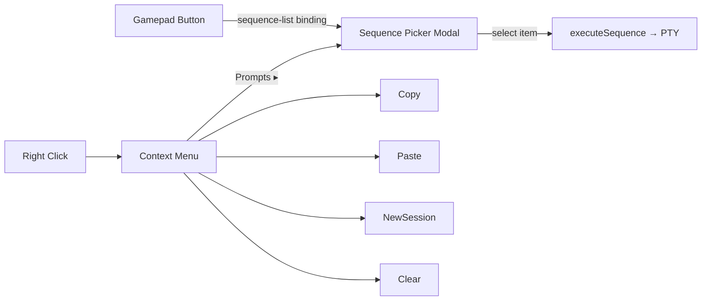

# Context Menu → Sequence Picker Chain

## Problem

The D-pad sequence selector (sequence picker modal) is only accessible via gamepad bindings. Keyboard-only users have no way to access configured sequences. The right-click context menu should have a "Prompts" item that chains to the sequence picker.

## Proposed Solution

Add a **"Prompts ▸"** item to the context menu. When selected, hide the context menu and open the existing sequence picker modal with the active CLI type's sequence items. Reuses all existing sequence picker UI (D-pad, keyboard, mouse navigation).

---

## Tasks

### 1. `add-prompts-item` — Add "Prompts" item to context menu
**Files:** `renderer/modals/context-menu.ts`, `renderer/index.html`
**Changes:**
- Add `{ action: 'sequences', label: 'Prompts', icon: '⏩', enabledWhen: () => hasSequenceItems() }` to `MENU_ITEMS` (before Cancel)
- Add matching `
` in `index.html`
- Add `hasSequenceItems()` helper: looks up `state.cliBindingsCache` for the active session's CLI type, filters for `action === 'sequence-list'`, returns true if any items exist
- Add `case 'sequences'` in `executeSelectedItem()`: collect all sequence items, hide context menu, call `showSequencePicker(items, callback)`
- Import `showSequencePicker` and `executeSequence` (or the helper that resolves sequences to PTY writes)

### 2. `test-prompts-item` — Test the Prompts context menu item
**File:** `tests/context-menu.test.ts` (new)
**Coverage:**
- "Prompts" item is enabled when active CLI has sequence-list bindings
- "Prompts" item is disabled when no sequence-list bindings exist
- Selecting "Prompts" hides context menu and opens sequence picker with correct items
- Navigation correctly skips disabled "Prompts" item

---

## Notes

- The sequence picker modal stays unchanged — fully reused
- "Prompts" is greyed out (not hidden) when no sequences configured — consistent with existing `enabledWhen` pattern (Copy is greyed when no selection)
- Cancel stays as the last item
- All changes must pass `npx vitest run` and `npm run build`
