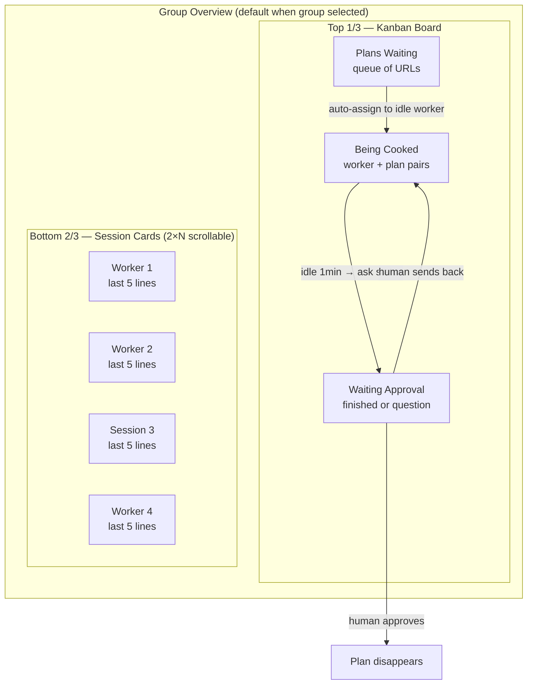
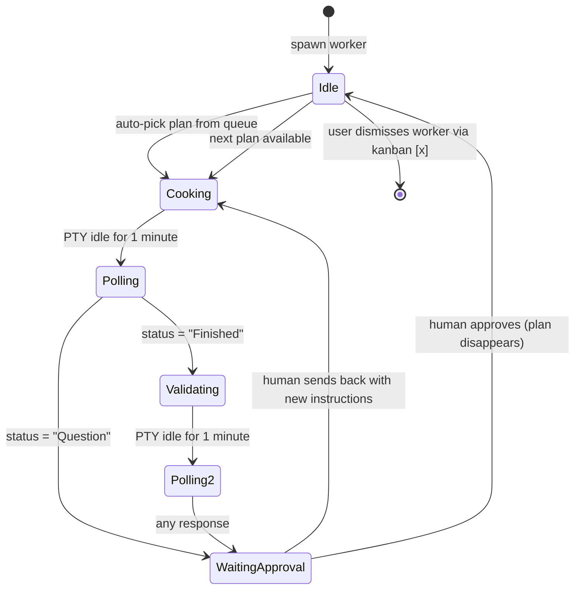
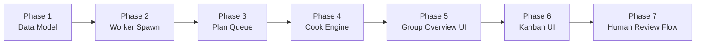

# Cooking Factory — Worker Pool & Plan Queue

## Problem

Users want to run multiple AI CLI sessions as autonomous "workers" that chew through a queue of implementation plans. Currently, sessions are individual terminals with no orchestration — no plan queue, no worker lifecycle, no validation phases. The user must manually assign work to each session.

## Vision

A **kanban-driven cooking factory** where:
- Plans are queued as URLs (GitHub issues, local files/folders)
- Workers are git-worktree-isolated CLI sessions that auto-pick plans
- Each plan goes through a 2-phase cook: **implement → validate**
- Structured status polling detects completion vs questions
- Human review gates the pipeline before moving on



---

## Spec (from Q&A)

### Session Groups
- Groups are **directory-based** (working directory = group key) — currently being implemented
- **1:1 mapping**: each session belongs to exactly one group
- Groups don't require git, but **workers require git** (worktrees)

### Group Overview Panel
- **Overview is the default view** when a group is selected
- **Click/A-button on a card → full-screen terminal** for that session
- Layout: **top 1/3 = kanban**, **bottom 2/3 = session cards**
- Cards show **last 5 lines** of PTY output, **2 columns wide**, vertically scrollable
- **Live streaming** PTY output preferred; fallback to 3-second snapshot if performance is an issue
- Cards include: session name, state dot, busy indicator. Workers have a special badge/indicator

### Kanban Board — 3 Columns

| Column | Contents |
|--------|----------|
| **Plans Waiting** | Queued plan URLs. Added manually by user. |
| **Being Cooked** | Worker + plan pair. Worker is actively implementing. |
| **Waiting Approval** | Plan is done or worker has a question. Human reviews. |

- Plans can exist in the queue **before any workers are spawned**
- **Approved plans disappear** (no archive/done column)

### Plans
- A plan is a **URL** pointing to:
  - A GitHub issue (https://...)
  - A local file (markdown, HTML, etc.) — Windows path, Linux path, or `file://`
  - A local folder containing plan files
- User adds plans manually to "Plans Waiting"

### Worker Lifecycle



**Phase 1 — Implement:**
1. Worker is idle, plan is in "Plans Waiting"
2. App assigns first plan to idle worker → moves plan to "Being Cooked"
3. App sends plan URL + **worker implementation prompt** (template 1) to the worker's PTY
4. Worker works on it (PTY is active)

**Phase 2 — Status Poll:**
5. When PTY is idle for **1 minute**, app asks the CLI: "Where are you up to?"
6. App requests a **structured response**: `Finished` or `Question`
7. If `Question` → plan moves to "Waiting Approval" (human must answer)
8. If `Finished` → proceed to validation phase

**Phase 3 — Validate:**
9. App sends the **same plan URL** + **worker validation prompt** (template 2) to the same worker
10. Worker validates and fills gaps
11. When PTY idle again → status poll → moves to "Waiting Approval"

**Phase 4 — Human Review:**
12. Human sees the plan in "Waiting Approval" with the worker's question or completion status
13. Human can:
    - **Approve** → plan disappears, worker goes idle (auto-picks next if queue has items)
    - **Send back** → plan returns to "Being Cooked" with new instructions from human

**Mandatory review toggle:** If enabled, ALL plans must be reviewed before the worker moves on. If disabled, auto-completed plans (no questions) can auto-approve and the worker picks the next plan.

### Workers

- **Spawned as free workers** — idle on creation, auto-pick from queue
- **No limit** on concurrent workers
- **Fully interactive** — user can switch to a worker's terminal and type
- **Worker = git worktree** — user picks the branch name when spawning
- Worker's prompt instructions tell the CLI to **commit before signalling done**
- **Idle workers stay alive** — wait for new plans or manual dismissal
- **Dismissed via kanban [x]** on the worker card — **with warning if branch not merged to main/master**
- **Worktree is per-worker** — cleaned up when worker is removed
- In the session list: workers show with a **special badge/indicator**, have rename/state/busy-dot, but **no session [x]** close button (only kanban [x])

### Prompt Templates

Two prompt templates needed (configurable per CLI type or globally):

**Template 1 — Implementation:**
```
Here is a plan to implement: {planUrl}
Read the plan and implement it fully. Commit your changes before reporting completion.
When done, say AIAGENT-FINISHED. If you have a question, say AIAGENT-QUESTION followed by your question.
```

**Template 2 — Validation:**
```
Here is the same plan: {planUrl}
Review what was implemented. Check for missing items, broken tests, incomplete features.
Fix anything that's missing. Commit your changes before reporting completion.
When done, say AIAGENT-FINISHED. If you have a question, say AIAGENT-QUESTION followed by your question.
```

*(Exact wording TBD — these are structural templates showing the flow)*

---

## Implementation Phases



### Phase 1: Data Model
- `Plan` type: id, url, status (waiting|cooking|validating|review|done), assignedWorkerId, humanNotes
- `Worker` type: extends SessionInfo with workerState (idle|cooking|polling|validating|review), branchName, currentPlanId, worktreePath
- `CookingFactory` module: plan queue, worker registry, state machine
- Persistence: plans + workers saved alongside sessions

### Phase 2: Worker Spawn
- "Add Worker" UI action — prompts for CLI type + branch name
- Create git worktree (`git worktree add <path> -b <branch>`)
- Spawn CLI via PtyManager in the worktree directory
- Register as worker session (special `isWorker` flag)
- Worker appears in session list with badge, no [x]

### Phase 3: Plan Queue
- "Add Plan" UI action — prompts for URL/path
- Plans stored in queue with status tracking
- Plan queue persisted to YAML/config

### Phase 4: Cook Engine
- Auto-assignment: idle worker picks first waiting plan
- Send implementation prompt (template 1) to worker PTY
- Idle detection: monitor PTY for 1-minute silence
- Status polling: send structured query, parse response
- Validation phase: send validation prompt (template 2)
- State transitions per the lifecycle state machine

### Phase 5: Group Overview UI
- Group selection → overview panel (replaces terminal)
- Top 1/3: kanban board placeholder
- Bottom 2/3: session cards (2×N grid, last 5 lines, live streaming)
- Card click → full-screen terminal

### Phase 6: Kanban UI
- 3-column kanban board in top 1/3
- Plan cards with URL, status, assigned worker
- Worker cards in "Being Cooked" with [x] dismiss
- Drag or button to move plans

### Phase 7: Human Review Flow
- "Waiting Approval" cards show worker's question or completion
- Approve button → plan disappears, worker goes idle
- "Send Back" button → input field for new instructions → plan returns to cooking
- Mandatory review toggle (global or per-plan)

---

## Open Questions (for future refinement)

1. Should the prompt templates be configurable in the UI, or hardcoded with `{planUrl}` substitution?
2. How does "idle for 1 minute" detection work when the CLI produces periodic output (spinners, progress bars)?
3. Should workers share the same PTY shell (cmd.exe), or should each worker type have its own shell config?
4. How does the kanban interact with gamepad navigation? (D-pad to move between columns/cards?)
5. Should the group overview be keyboard-navigable (Tab between kanban and cards)?

---

## Dependencies

- **Session groups** — currently being implemented (prerequisite)
- **StateDetector** — existing AIAGENT-* keyword detection can be extended for AIAGENT-FINISHED/AIAGENT-QUESTION
- **PipelineQueue** — existing auto-handoff queue may be replaced or extended by the cook engine
- **Git worktree support** — new capability needed (git CLI commands)
