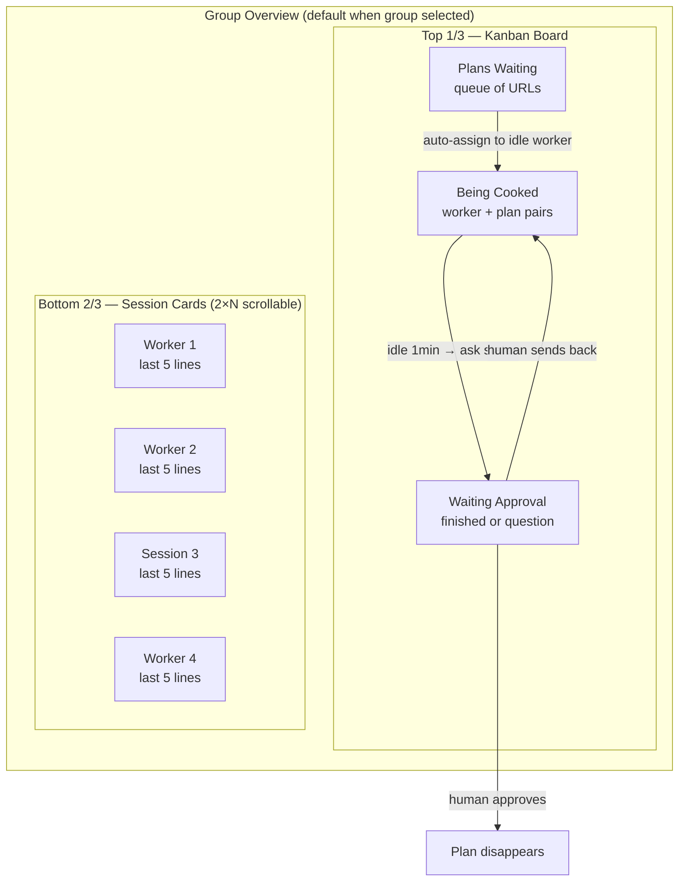
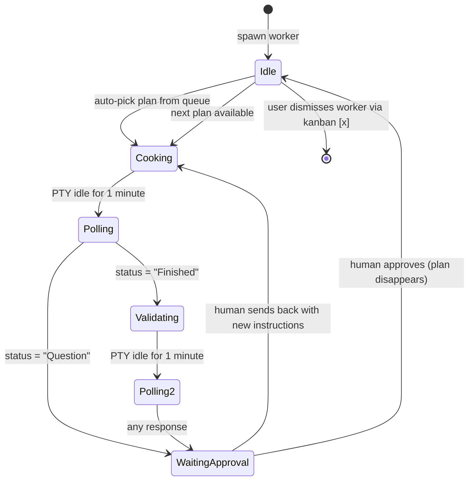
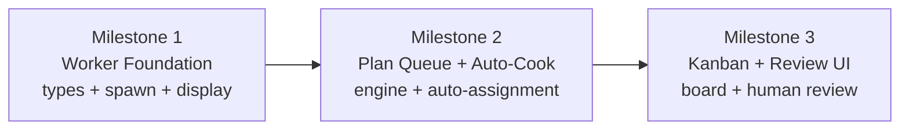

# Cooking Factory — Worker Pool & Plan Queue

> **Last reviewed:** 2026-04-03 · **Status:** 0% implemented · **Prerequisite status:** Session groups ✅, Group overview cards ✅, StateDetector ✅, PipelineQueue ✅

## Problem

Users want to run multiple AI CLI sessions as autonomous "workers" that chew through a queue of implementation plans. Currently, sessions are individual terminals with no orchestration — no plan queue, no worker lifecycle, no validation phases. The user must manually assign work to each session.

## Vision

A **kanban-driven cooking factory** where:
- Plans are queued as URLs (GitHub issues, local files/folders)
- Workers are git-worktree-isolated CLI sessions that auto-pick plans
- Each plan goes through a 2-phase cook: **implement → validate**
- Structured status polling detects completion vs questions
- Human review gates the pipeline before moving on



---

## Spec (from Q&A)

### Session Groups
- Groups are **directory-based** (working directory = group key) — currently being implemented
- **1:1 mapping**: each session belongs to exactly one group
- Groups don't require git, but **workers require git** (worktrees)

### Group Overview Panel
- **Overview is the default view** when a group is selected
- **Click/A-button on a card → full-screen terminal** for that session
- Layout: **top 1/3 = kanban**, **bottom 2/3 = session cards**
- Cards show **last 5 lines** of PTY output, **2 columns wide**, vertically scrollable
- **Live streaming** PTY output preferred; fallback to 3-second snapshot if performance is an issue
- Cards include: session name, state dot, busy indicator. Workers have a special badge/indicator

### Kanban Board — 3 Columns

| Column | Contents |
|--------|----------|
| **Plans Waiting** | Queued plan URLs. Added manually by user. |
| **Being Cooked** | Worker + plan pair. Worker is actively implementing. |
| **Waiting Approval** | Plan is done or worker has a question. Human reviews. |

- Plans can exist in the queue **before any workers are spawned**
- **Approved plans disappear** (no archive/done column)

### Plans
- A plan is a **URL** pointing to:
  - A GitHub issue (https://...)
  - A local file (markdown, HTML, etc.) — Windows path, Linux path, or `file://`
  - A local folder containing plan files
- User adds plans manually to "Plans Waiting"

### Worker Lifecycle



**Phase 1 — Implement:**
1. Worker is idle, plan is in "Plans Waiting"
2. App assigns first plan to idle worker → moves plan to "Being Cooked"
3. App sends plan URL + **worker implementation prompt** (template 1) to the worker's PTY
4. Worker works on it (PTY is active)

**Phase 2 — Status Poll:**
5. When PTY is idle for **1 minute**, app asks the CLI: "Where are you up to?"
6. App requests a **structured response**: `Finished` or `Question`
7. If `Question` → plan moves to "Waiting Approval" (human must answer)
8. If `Finished` → proceed to validation phase

**Phase 3 — Validate:**
9. App sends the **same plan URL** + **worker validation prompt** (template 2) to the same worker
10. Worker validates and fills gaps
11. When PTY idle again → status poll → moves to "Waiting Approval"

**Phase 4 — Human Review:**
12. Human sees the plan in "Waiting Approval" with the worker's question or completion status
13. Human can:
    - **Approve** → plan disappears, worker goes idle (auto-picks next if queue has items)
    - **Send back** → plan returns to "Being Cooked" with new instructions from human

**Mandatory review toggle:** If enabled, ALL plans must be reviewed before the worker moves on. If disabled, auto-completed plans (no questions) can auto-approve and the worker picks the next plan.

### Workers

- **Spawned as free workers** — idle on creation, auto-pick from queue
- **No limit** on concurrent workers
- **Fully interactive** — user can switch to a worker's terminal and type
- **Worker = git worktree** — user picks the branch name when spawning
- Worker's prompt instructions tell the CLI to **commit before signalling done**
- **Idle workers stay alive** — wait for new plans or manual dismissal
- **Dismissed via kanban [x]** on the worker card — **with warning if branch not merged to main/master**
- **Worktree is per-worker** — cleaned up when worker is removed
- In the session list: workers show with a **special badge/indicator**, have rename/state/busy-dot, but **no session [x]** close button (only kanban [x])

### Prompt Templates

Two prompt templates needed (configurable per CLI type or globally):

**Template 1 — Implementation:**
```
Here is a plan to implement: {planUrl}
Read the plan and implement it fully. Commit your changes before reporting completion.
When done, say AIAGENT-FINISHED. If you have a question, say AIAGENT-QUESTION followed by your question.
```

**Template 2 — Validation:**
```
Here is the same plan: {planUrl}
Review what was implemented. Check for missing items, broken tests, incomplete features.
Fix anything that's missing. Commit your changes before reporting completion.
When done, say AIAGENT-FINISHED. If you have a question, say AIAGENT-QUESTION followed by your question.
```

*(Exact wording TBD — these are structural templates showing the flow)*

---

## Implementation Status (as of 2026-04-03)

### ✅ Pre-existing Infrastructure (built for other features)

| Component | File | Cooking Factory Gap |
|-----------|------|---------------------|
| Group overview cards | `renderer/screens/group-overview.ts` | Missing kanban top 1/3, worker badges, plan display |
| PipelineQueue | `src/session/pipeline-queue.ts` | No plan awareness, no worker awareness, no cook phases |
| StateDetector | `src/session/state-detector.ts` | Has IMPLEMENTING/PLANNING/COMPLETED/IDLE/QUESTION — no FINISHED keyword needed (reuse COMPLETED) |
| Session persistence | `src/session/persistence.ts` | No worker fields, no plan queue persistence |
| Pipeline IPC | `src/electron/ipc/pty-handlers.ts` | pipeline:enqueue/dequeue/getQueue — no worker/plan/cook channels |
| NotificationManager | `src/session/notification-manager.ts` | Could extend for cook lifecycle events |
| Session resume | `src/electron/ipc/pty-handlers.ts` | cliSessionName UUID + resumeCommand chain — workers can resume after crash |
| Activity dots | `renderer/state-colors.ts` | Output-timing-based (active/inactive/idle) — NOT state-based |

### ❌ Not Started (all 7 planned phases)

- Data model (Worker, Plan, CookingFactory types)
- Worker spawn / git worktree integration
- Plan queue CRUD and persistence
- Cook engine (auto-assignment, idle detection, polling, validation)
- Kanban UI
- Human review flow
- Worker differentiation in session list

---

## Review Assessment

### ✅ Worth Doing — Core Problem Is Real

Automating plan-to-worker assignment is the app's highest-value feature. The manual loop (spawn → navigate → paste plan → monitor → check → repeat) should be automated.

### ⚠️ Plan Needs Updates

1. **Plan predates activity dots** — UI mockups show state-based worker dots (green=cooking, orange=waiting, yellow=approval, grey=idle). The app now uses activity-timing dots (green=active, blue=inactive, grey=idle). **Resolution:** Keep activity dots + add a separate state label/badge on worker cards.

2. **60s idle detection is fragile** — CLIs produce spinners, `npm install` pauses, streaming output. Silence-based detection may never fire or fire prematurely. **Resolution:** Use signal-only detection (`AIAGENT-COMPLETED` / `AIAGENT-QUESTION`), not silence. Drop "Where are you up to?" polling entirely.

3. **Two-phase cook doubles cycle time** — Implement → poll → validate → poll → review adds latency for marginal value. Most AI implementations either work or don't. **Resolution:** Make validation phase optional (off by default).

4. **Scope is too large for 7 sequential phases** — Monolithic feature with many moving parts. **Resolution:** Restructure into 3 shippable milestones.

5. **AIAGENT-FINISHED is unnecessary** — `AIAGENT-COMPLETED` already exists in StateDetector and serves the same purpose. **Resolution:** Reuse COMPLETED, don't add a new keyword.

### Design Decisions

| Decision | Choice | Rationale |
|----------|--------|-----------|
| Done signal | Reuse `AIAGENT-COMPLETED` | Already in StateDetector, already in CLI system prompts |
| Idle detection | Signal-only (AIAGENT-*) | Silence-based is unreliable with real CLI output |
| Validation phase | Optional (off by default) | Doubles cycle time for marginal value |
| Worker dot colors | Activity-based + state label | Consistent with current system, state shown as text badge |
| Plan URL types | Local files first, GitHub URLs later | Simpler initial scope |
| Worktree path | `.worktrees/<branch-slug>/` | Per original plan, configurable later |

---

## Revised Implementation: 3 Milestones

The original 7-phase plan is restructured into 3 shippable milestones. Each milestone delivers usable functionality.



### Milestone 1: Worker Foundation

**Goal:** Workers exist as a distinct session type with git worktree isolation.

- **Data model:** `Worker` extends `SessionInfo` with `branchName`, `workerState`, `worktreePath`, `currentPlanId`. `Plan` type with id, url, status, assignedWorkerId, humanNotes.
- **Worker spawn:** "Add Worker" modal (see `02-worker-spawn.html`) — CLI type + branch name → `git worktree add` → PtyManager spawn in worktree dir.
- **Session list:** Worker badge 🔧, no [x] close button, branch name display (see `05-session-list-workers.html`).
- **Persistence:** Worker fields saved alongside sessions in sessions.yaml.
- **Worktree cleanup:** On worker dismiss, `git worktree remove` + warning if branch not merged.
- **IPC:** worker:spawn, worker:dismiss, worker:list channels.

### Milestone 2: Plan Queue + Auto-Cook

**Goal:** Plans queue up and workers automatically pick and execute them.

- **Plan queue:** "Add Plan" action — URL/path input, FIFO queue, persisted to config.
- **Auto-assignment:** Idle worker picks first waiting plan → sends implementation prompt to PTY.
- **Completion detection:** StateDetector emits `AIAGENT-COMPLETED` → worker marks plan as done.
- **Question detection:** StateDetector emits `AIAGENT-QUESTION` → plan moves to review.
- **Worker recycling:** After plan completes, worker goes idle → auto-picks next plan.
- **Notifications:** NotificationManager extended for "plan finished" / "worker has question" events.
- **IPC:** plan:add, plan:remove, plan:list, cook:start channels.
- **No validation phase** (optional, off by default).

### Milestone 3: Kanban + Review UI

**Goal:** Visual kanban board and structured human review flow.

- **Kanban board:** 3-column board in group overview top section (see `01-group-overview.html`).
- **Plan cards:** URL, status badge, assigned worker, action buttons.
- **Review flow:** Approve / Send Back with editable textarea (see `04-review-flow.html`).
- **Mandatory review toggle:** Global setting — when on, all plans require approval.
- **Gamepad navigation:** D-pad between kanban columns + plan cards.
- **View Terminal button:** Jump from review card to worker's live terminal.

---

## Open Questions

| # | Question | Status |
|---|----------|--------|
| 1 | Should prompt templates be configurable in UI or hardcoded? | **Open** — start hardcoded with `{planUrl}` substitution, add UI later |
| 2 | How does idle detection work with spinners/progress bars? | **Resolved** — use signal-only (AIAGENT-*), not silence detection |
| 3 | Should workers share the same PTY shell? | **Resolved** — yes, use same shell config as non-worker sessions |
| 4 | How does kanban interact with gamepad D-pad? | **Open** — deferred to Milestone 3 |
| 5 | Should group overview be keyboard-navigable? | **Open** — deferred to Milestone 3 |
| 6 | How to handle CLIs that don't support AIAGENT-* signals? | **Open** — manual monitoring only, no auto-cook |
| 7 | What happens to worktrees if app crashes mid-cook? | **Open** — resume via session persistence, worktree survives crash |
| 8 | Should workers share the group directory or always use worktrees? | **Open** — always worktrees for isolation |

---

## Dependencies

| Dependency | Status |
|------------|--------|
| Session groups (directory-based) | ✅ Implemented |
| Group overview cards | ✅ Implemented (10-line PTY preview, activity dots, card focus) |
| StateDetector (AIAGENT-* keywords) | ✅ Implemented (COMPLETED + QUESTION both exist) |
| PipelineQueue (basic FIFO) | ✅ Implemented (will be extended or replaced by cook engine) |
| Session persistence | ✅ Implemented (needs schema extension for worker fields) |
| NotificationManager | ✅ Implemented (needs extension for cook events) |
| Session resume (cliSessionName) | ✅ Implemented (workers can resume after crash) |
| Git worktree support | ❌ New capability needed |

---

## HTML Mockups Reference

| File | Content | Used In |
|------|---------|---------|
| `01-group-overview.html` | Full group overview: kanban (top 1/3) + session cards (bottom 2/3) | Milestone 3 |
| `02-worker-spawn.html` | "Add Worker" modal: CLI type + branch name + worktree info | Milestone 1 |
| `03-cook-lifecycle.html` | 6-step cook lifecycle: queue → implement → poll → validate → review → done | Milestone 2 |
| `04-review-flow.html` | Human review UI: 3 scenarios (Finished, Question, Send Back) | Milestone 3 |
| `05-session-list-workers.html` | Session list sidebar: worker badge, no [x], branch info | Milestone 1 |
