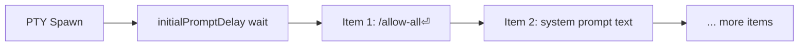

# Plan: Convert initialPrompt to Sequence List

## Problem

Each CLI tool's `initialPrompt` is currently a single string. For Copilot CLI, the user needs to send **two distinct things** on spawn: a slash command (`/allow-all{Enter}`) and a system prompt (text that stays in the buffer). The single-string model makes this awkward — Enter is always stripped, so you can't control which parts submit and which don't.

## Proposed Approach

Convert `initialPrompt` from `string` to `SequenceListItem[]` — an array of `{ label, sequence }` objects — reusing the existing type from the sequence-list binding system.

**Execution model:** All items are sent automatically on spawn, in order. Each item's sequence is fully respected (including `{Enter}`). Users control timing between items using `{Wait N}` syntax within sequences. `initialPromptDelay` remains as the delay before the first item.

**Breaking change:** `{Enter}` is no longer stripped from initial prompt sequences. This gives per-item control:
- `/allow-all{Enter}` → submits the slash command
- `<application-prompt>...` (no Enter) → stays in buffer for review

**Migration:** Existing string `initialPrompt` values are auto-migrated to `[{ label: "Prompt", sequence: "<existing string>" }]` on profile load.

## Todos

### 1. config-type-change
**Config type: `initialPrompt` → `SequenceListItem[]`**
- In `src/config/loader.ts`: Change `CliTypeConfig.initialPrompt` from `string?` to `SequenceListItem[]?`
- Reuse the existing exported `SequenceListItem` type (already has `label` + `sequence`)

### 2. config-migration
**Auto-migrate string initialPrompt to array on profile load**
- In `ConfigLoader.load()` (or a new `migrateInitialPrompts()` helper), detect when a tool's `initialPrompt` is a string and convert to `[{ label: 'Prompt', sequence: theString }]`
- Save the migrated profile to disk (follows existing `cliTypes → bindings` migration pattern)
- Handle edge cases: empty string → empty array, undefined → undefined

### 3. initial-prompt-execution
**Update `scheduleInitialPrompt` to process item arrays**
- In `src/session/initial-prompt.ts`:
  - Change `InitialPromptConfig.initialPrompt` from `string?` to `SequenceListItem[]?`
  - Iterate through items, parsing and sending each item's sequence
  - **Remove the Enter-stripping** from `actionToPtyData()` (remove the `if (action.key === 'Enter') return null` line)
  - Keep cancellation support

### 4. ipc-layer-update
**Update IPC surface for array format**
- `src/electron/ipc/tools-handlers.ts`: Change `tools:addCliType` and `tools:updateCliType` to accept `SequenceListItem[]` instead of `string`
- `src/electron/ipc/pty-handlers.ts`: Update `resolvePromptConfig()` to return `SequenceListItem[]`
- `src/electron/preload.ts`: Update `toolsAddCliType` / `toolsUpdateCliType` signatures

### 5. settings-ui
**Replace textarea with CRUD item list in Settings**
- In `renderer/screens/settings.ts`:
  - Replace the `initialPrompt` textarea field in add/edit CLI type forms with a sequence-list CRUD UI
  - Reuse the pattern from `binding-editor.ts`'s `renderSequenceListParams()`: list of items with add/edit/remove buttons using `showFormModal`
  - Keep `initialPromptDelay` field as-is (delay before first item)

### 6. default-yaml-update
**Update default.yaml to new format**
- Convert existing `initialPrompt` strings in `config/profiles/default.yaml` to array format
- Split Copilot CLI's prompt into two items: the slash command and the system prompt

### 7. tests-update
**Update all affected tests**
- `tests/initial-prompt.test.ts`: Update for array input format, update Enter-stripping tests (Enter should now pass through), test multi-item sequential execution
- `tests/config.test.ts`: Update tests that reference `initialPrompt` as string, add migration tests
- Any other affected test files

## Notes

- `SequenceListItem` is already exported from `src/config/loader.ts` — no new types needed
- The Settings UI CRUD pattern is well-established in the binding editor — we're applying the same pattern to tool config
- `initialPromptDelay` keeps its current semantics (delay before first item on spawn)
- The `{Wait N}` syntax within sequences handles all inter-item timing needs
- Auto-migration ensures existing configs work without manual editing
