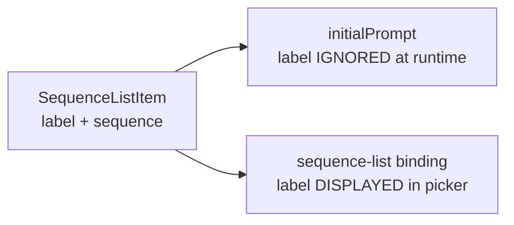

# Remove Label from Initial Prompt Config

## Problem

The tools config UI asks for both a **name** (label) and a **prompt** (sequence) when editing initial prompt items. The label is never used at runtime — `initial-prompt.ts` only reads `.sequence`. Removing it simplifies the UX to a single input field.

## Investigation

- `SequenceListItem { label, sequence }` is shared between initial prompt items and sequence-list binding items
- For **initialPrompt**: `label` is purely cosmetic — `initial-prompt.ts` never reads it, only `.sequence`
- For **sequence-list bindings**: `label` IS functional — displayed in the picker popup and logged on selection

### Where `label` appears for initialPrompt

| File | Usage |
|------|-------|
| `src/config/loader.ts:38-41` | Type definition (`SequenceListItem`) |
| `renderer/screens/settings-tools.ts:169-175` | UI: `<input>` field in editor |
| `renderer/screens/settings-tools.ts:208` | Default new item: `{ label: '', sequence: '' }` |
| `src/session/initial-prompt.ts` | **Never accessed** — only `.sequence` used |
| `config/profiles/default.yaml` | YAML entries have `label:` |
| `tests/initial-prompt.test.ts` | Test fixtures include `label` |
| `src/config/loader.ts:238` | Migration sets `label: 'Prompt'` |

## Approach: UI-only removal (minimal, YAGNI)

Remove the label input from the initial prompt editor in `settings-tools.ts`. Auto-set label to empty string when creating items. Keep the `SequenceListItem` type unchanged since sequence-list bindings still need `label`.

### Why not change the type?

- `SequenceListItem` is shared with sequence-list bindings where `label` IS functional
- Making `label` optional would require null checks in `sequence-picker.ts`
- Splitting into two types is over-engineering for removing one input field

## Todos

1. **`renderer/screens/settings-tools.ts`** — Remove the label `<input>` from the initial prompt item editor. New items default to `{ label: '', sequence: '' }`. Existing items keep their label value but it's hidden from the UI.
2. **`config/profiles/default.yaml`** — Remove `label:` lines from existing initialPrompt entries (optional — backwards compatible since label is ignored at runtime).
3. **`CLAUDE.md`** — Update tool config example to remove `label` from initialPrompt.

## Notes

- **Backwards compatible**: existing YAML with `label:` still loads fine (field is silently ignored)
- **No type changes** — `SequenceListItem.label` stays required for sequence-list bindings
- **No IPC or preload changes** needed
- Migration code in `loader.ts` can keep setting `label: 'Prompt'` — harmless
