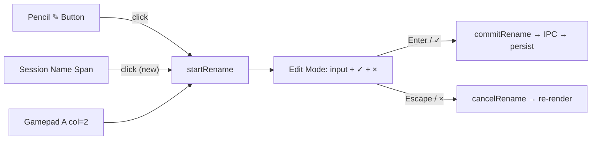

# Click Session Name to Rename

## Problem

Renaming a session requires clicking the small pencil ✎ icon (or gamepad A on column 2). Clicking the session name itself does nothing — it just activates the session card. Users naturally expect clicking a name to allow editing it.

## Proposed Solution

Add a `click` handler on the `` that triggers `startRename()` — same as the pencil icon. Add hover CSS so users know the name is interactive. Pencil icon and gamepad remain unchanged.

---

## Tasks

### 1. `name-click-handler` — Add click listener on session name span
**File:** `renderer/screens/sessions-render.ts`
**Changes:**
- In the `else` (display mode) branch (lines 305–309), add a `click` event listener on the `` element
- Must call `e.stopPropagation()` to prevent the card click at line 355 (`switchToSession`) from also firing
- Call `startRename(session.id)` — same function the pencil icon uses (line 334)

### 2. `name-hover-css` — Add hover style for clickable session name
**File:** `renderer/styles/main.css`
**Changes:**
- Add `.session-card .session-name:hover` rule — `cursor: pointer`, subtle underline or accent colour to hint interactivity
- Keep the existing truncation (`white-space: nowrap; overflow: hidden; text-overflow: ellipsis`) intact

### 3. `name-click-tests` — Add tests for click-to-rename behaviour
**File:** `tests/sessions-screen.test.ts`
**Coverage:**
- Clicking `.session-name` enters rename mode (sets `editingSessionId`, renders input)
- Clicking `.session-name` does NOT propagate to card click handler (session doesn't switch)

---

## Notes

- **No gamepad change** — D-pad column 0 (card body) already exists; click-to-rename is mouse/touch only. Gamepad rename stays on column 2.
- **No tab bar change** — tab bar has no rename; out of scope.
- **Edit mode unaffected** — when editing, `` is replaced by `<input>`, so no click conflict.
- **Minimal blast radius** — 3 files, <20 lines of production code.
- All changes must pass `npx vitest run` and `npm run build`.
