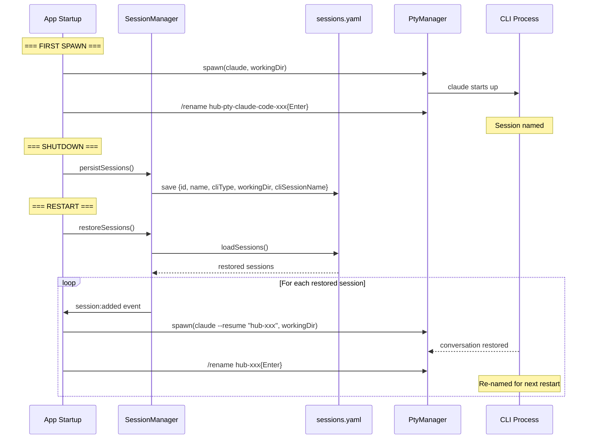
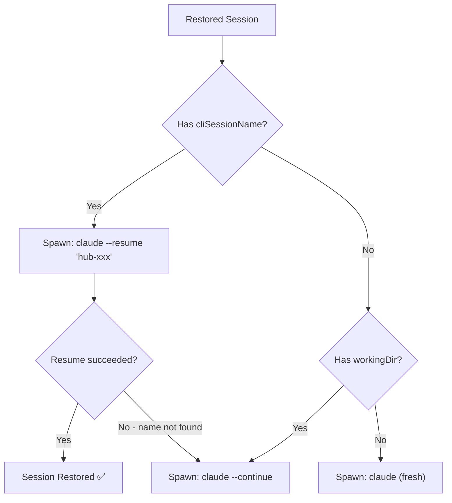

# Session Persistence & CLI Resume

## Problem

Sessions are persisted to `config/sessions.yaml` but **`restoreSessions()` is never called in production** — it's dead code. Furthermore, there's no mechanism to identify *which CLI session* was running inside a PTY, so even if we restored our session metadata, we couldn't resume the actual CLI conversation.

## Current State

### What's Persisted (sessions.yaml)

| Field | Persisted? | Notes |
|-------|-----------|-------|
| `id` | ✅ | Timestamp-based: `pty-claude-code-1719582300000` |
| `name` | ✅ | Display name |
| `cliType` | ✅ | e.g. `claude-code`, `copilot-cli` |
| `processId` | ✅ | **Stale after restart** — PID is dead |
| `workingDir` | ✅ | Only if truthy |
| `state` | ❌ | Not saved |
| `questionPending` | ❌ | Not saved |
| CLI session UUID | ❌ | **Not tracked at all** |

### Dead Code

- `SessionManager.restoreSessions()` — exists but **never called** in `main.ts` or `handlers.ts`
- `SessionManager.startHealthCheck()` — also never called in production
- Documentation claims sessions restore on startup, but the code doesn't do it

## CLI Resume Capabilities

Both Claude Code and Copilot CLI support:
- `/rename <name>` — interactive command to name a session
- `--resume <name>` — resume by session name (not just UUID)

Since we control the PTY, we can **name sessions to something predictable on startup**, then use that name to resume later. No UUID parsing needed.

| CLI | Rename Command | Resume Command | Continue Command |
|-----|---------------|----------------|-----------------|
| Claude Code | `/rename hub-{id}` | `claude --resume "hub-{id}"` | `claude --continue` |
| Copilot CLI | `/rename hub-{id}` | `copilot --resume "hub-{id}"` | `copilot --continue` |

## Architecture



### Fallback Chain



### InitialPrompt Handling on Resume

**Fresh spawn:**
```
spawn(command) → delay → initialPrompt items → onComplete → renameCommand → contextText
```

**Resume spawn:**
```
spawn(resumeCommand) → delay → renameCommand only (no initialPrompt, no contextText)
```

- `initialPrompt` is skipped — the CLI already has conversation context
- `renameCommand` is still sent — maintains name for the next restart cycle
- `contextText` is skipped — it was one-time context for the original spawn

---

## Phase 1: Wire Up Existing Persistence

**Goal:** Sessions survive app restarts. Restored sessions are re-added to SessionManager on startup.

### Changes

**`src/electron/ipc/handlers.ts`** (~2 lines)
```typescript
// After: const sessionManager = new SessionManager();
const restored = sessionManager.restoreSessions();
logger.info(`Restored ${restored.length} session(s) from previous run`);
```

Optionally activate health check to prune dead PIDs:
```typescript
sessionManager.startHealthCheck(30000); // every 30s
```

### Tests
- Verify `restoreSessions()` is called in `registerIPCHandlers()`
- Existing tests in `persistence.test.ts` already cover the restore logic

---

## Phase 2: Session Naming on Spawn

**Goal:** Name each CLI session to something predictable so we can resume by name later.

### Changes

**`src/types/session.ts`**
- Add `cliSessionName?: string` to `SessionInfo`

**`src/session/persistence.ts`**
- Persist `cliSessionName` in `saveSessions()`

**`src/config/loader.ts`**
- Add `renameCommand?: string` to `CliTypeConfig`

**`config/profiles/default.yaml`**
```yaml
claude-code:
  renameCommand: '/rename {cliSessionName}'
copilot-cli:
  renameCommand: '/rename {cliSessionName}'
```

**`src/session/initial-prompt.ts`**
- Accept optional `renameCommand` + `cliSessionName`
- After all prompt items execute, send rename command (with `{cliSessionName}` replaced)

**`src/electron/ipc/pty-handlers.ts`**
- Generate `cliSessionName = 'hub-' + sessionId`
- Set it on session object before `addSession()`
- Pass rename config to `scheduleInitialPrompt()`

### Tests
- Rename command sent to PTY after initial prompt items
- `{cliSessionName}` template replaced correctly
- `cliSessionName` persisted to sessions.yaml
- No rename sent when `renameCommand` not configured

---

## Phase 3: Resume with Named Sessions

**Goal:** On restart, spawn CLIs with `--resume <name>` instead of a fresh start.

### Changes

**`src/config/loader.ts`**
- Add `resumeCommand?: string` and `continueCommand?: string` to `CliTypeConfig`

**`config/profiles/default.yaml`**
```yaml
claude-code:
  resumeCommand: 'claude --resume "{cliSessionName}"'
  continueCommand: 'claude --continue'
copilot-cli:
  resumeCommand: 'copilot --resume "{cliSessionName}"'
  continueCommand: 'copilot --continue'
```

**`src/electron/ipc/pty-handlers.ts`**
- Modify `pty:spawn` to accept optional `resumeSessionName`
- When provided: use `resumeCommand` instead of `command`, skip `initialPrompt`
- Fallback: `resumeCommand` → `continueCommand` → `command`

**`src/electron/preload.ts`**
- Extend `ptySpawn` args for optional `resumeSessionName`

**`renderer/screens/sessions-spawn.ts`**
- Pass `cliSessionName` as `resumeSessionName` when spawning restored sessions

### Tests
- Resume uses `resumeCommand` with session name substituted
- Falls back to `continueCommand` when no `cliSessionName`
- Falls back to `command` when no `continueCommand`
- `initialPrompt` skipped on resume
- `renameCommand` still sent on resume

---

## Risk Assessment

| Risk | Likelihood | Mitigation |
|------|-----------|------------|
| `/rename` timing — CLI not ready | Medium | Use `initialPromptDelay` (2000ms). Add retry if needed. |
| CLI doesn't find session by name | Low | Fallback chain: resume → continue → fresh. |
| processId optional breaks code | Medium | Careful migration — grep all 24 references. |
| Session name collisions | Very Low | Names include full session ID with timestamp. |

## Notes
- Terminal scrollback is lost — CLI loads its own history on resume
- Generic CLIs (non-AI) can't resume — only those with session management
- StateDetector will re-detect state from fresh PTY output on resume
