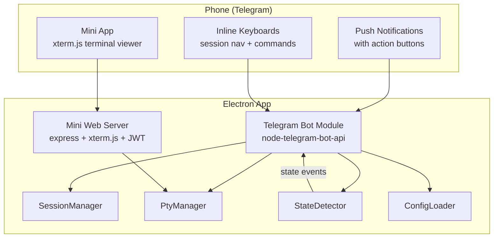
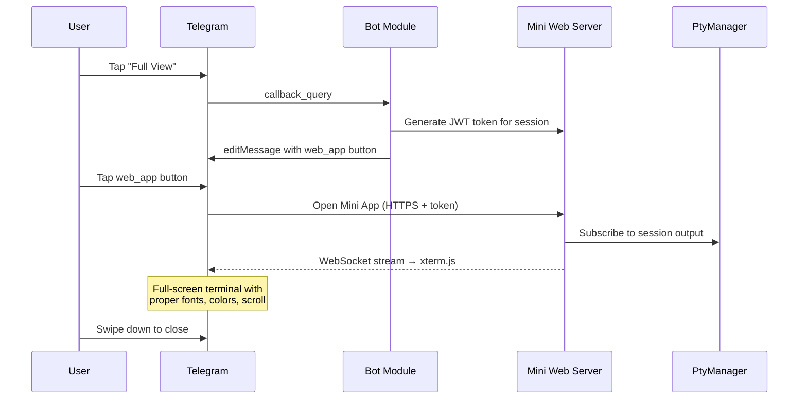

# Telegram Bot — Mobile Remote Control

> **Date:** 2026-04-04 · **Status:** 0% implemented · **Prerequisite status:** StateDetector ✅, SessionManager ✅, PtyManager ✅, PipelineQueue ✅

## Problem

Users running multiple AI CLI sessions want to monitor and control them from their phone — especially when away from the desk. Currently the only control surface is the Xbox gamepad + Electron desktop UI. Windows toast notifications fire on state changes but are not actionable (no reply/control from the notification).

**Core use case:** "Session completed → phone buzzes → tap Accept or send next prompt → pocket phone."

## Vision

A **Telegram bot** running inside the Electron main process that acts as a second controller — not a remote desktop. The bot provides **push notifications with action buttons** and **quick session controls** via inline keyboards. Full terminal output viewing is handled by a **Telegram Mini App** (embedded xterm.js web viewer), not raw text in chat.



### Design Principles

1. **Telegram = notification center + quick actions.** Don't replicate the desktop UI.
2. **Terminal viewing = web-based Mini App.** Never raw terminal text in chat.
3. **Notifications are the #1 value.** Design notification experience first, browsing second.
4. **Context-aware buttons.** Show Cancel/Accept only when implementing, Send only when idle.
5. **Destructive actions always require confirmation.** Phone-in-pocket protection.
6. **Latency-tolerant design.** 100-500ms per tap is expected — use optimistic UI, toast feedback, message edit queue.

---

## UX Specification

### Interaction Tiers

| Tier | Medium | Purpose | Latency |
|------|--------|---------|---------|
| Primary | Notifications | "Something happened, act now" | Push (instant) |
| Secondary | Inline keyboards | Session nav, commands, spawn | 300ms-1.5s per tap |
| Tertiary | Mini App | Full terminal output viewing | WebSocket (live) |
| Power user | Slash commands | Quick typed commands | Instant |

### Flow 1: Notifications (P0 — Core Value)

The bot proactively messages the user when session state changes. Every notification includes **action buttons** so the user can respond without navigating.

**When to notify:**

| Event | Message | Priority |
|-------|---------|----------|
| implementing → completed | "🎉 Session Completed" + Accept/Continue/Output buttons | P0 |
| implementing → idle | "⏸ Session Idle" + Continue/Output buttons | P0 |
| implementing → error/waiting | "⚠️ Session Needs Attention" + error summary + actions | P0 |
| PTY crashed / session died | "💀 Session Crashed" + Respawn/Remove buttons | P1 |
| All sessions in a group completed | "✅ All Done" + summary | P1 |

**When NOT to notify:**
- Activity dot changes (active → inactive after 10s) — too noisy
- Session focus changes on desktop — user is using gamepad
- Config changes — irrelevant to mobile

**Rate limiting:** 15-second dedup per session (matches existing notification-manager), max 3 messages/minute across all sessions.

**Notification format:**
```
🎉 Session Completed

"refactor auth" in gamepad-cli-hub
Claude Code — finished after 4m 23s

[📋 View Output]  [🚀 Continue]
[💬 Send Prompt]  [📂 Sessions]
```

### Flow 2: Session List — Two-Tier Navigation (P0)

Sessions grouped by working directory (mirrors desktop grouping). Two levels to keep button counts manageable.

**Level 1 — Directory overview:**
```
📂 Your Sessions (7 active)

🟢 gamepad-cli-hub (3)
   🔨 2 implementing, 🎉 1 done
🔵 stillhere (2)
   ⏳ 2 waiting
⚪ homeassistant (2)
   💤 2 idle

[gpad-hub]  [stillhere]
[homeasst]  [➕ New]  [📊 Status]
```

**Level 2 — Sessions in directory (after tap):**
```
📂 gamepad-cli-hub

🔨 "refactor auth" — Claude
🔨 "fix tests" — Copilot
🎉 "update deps" — Claude

[refactor auth]  [fix tests]
[update deps]    [🔙 Back]
```

**Design rules:**
- Aggregate state summary per directory (greenest dot wins, counts by state)
- Max 15 chars per button label (Telegram truncation limit)
- Button order matches desktop sort (from `settings.yaml` sort prefs)
- Breadcrumb in header for orientation

### Flow 3: Active Session Controls (P1)

After selecting a session, show context-aware controls. Buttons change based on StateDetector state.

**Primary controls (3 rows, 2 buttons each):**
```
✅ Claude Code — gpad-hub
Session: "refactor auth"  🔨 Implementing

[✋ Cancel]   [✅ Accept]
[📋 Output]  [📤 Send]
[⚡ Commands] [🔙 Back]
```

**Context-aware button visibility:**

| State | Show | Hide |
|-------|------|------|
| Implementing | Cancel, Accept | Send |
| Idle / Waiting | Send | Cancel, Accept |
| Completed | Continue, Send | Cancel, Accept |
| Any | Output, Commands, Back | — |

**"⚡ Commands" sub-menu** (progressive disclosure, populated from profile `sequences` config):
```
⚡ Quick Commands

[/commit]   [/compact]
[/clear]    [/plan]
[/test]     [🔙 Back]
```

### Flow 4: Text Input (P1)

Free-text input to PTY requires a **confirmation step** (phone-in-pocket protection):

```
📤 Send to PTY

You typed: "git push origin main --force"

⚠️ This will be sent directly to the active terminal.

[✅ Send]  [❌ Cancel]
```

**Safe mode option** (configurable): When enabled, only allow sequence-list commands from config, block free-text entirely. Responsible default for unattended use.

### Flow 5: Output Viewing — Hybrid Approach (P1 summary + P2 Mini App)

**Quick status in Telegram (P1):**
```
📋 Last Activity — 12s ago

> ✅ All 47 tests passed
> 📁 Modified: src/auth/jwt.ts
> ⏱ Duration: 23s

[🔄 Refresh]  [🖥 Full View]  [🔙 Back]
```

3-5 line smart summary parsed from PTY buffer:
- Last tool use result (test pass/fail counts)
- File modification mentions
- Error/warning lines
- Completion indicators

**Full terminal viewing via Mini App (P2):**

The `[🖥 Full View]` button opens a **Telegram Mini App** — a full-screen web view inside Telegram with proper xterm.js rendering:



Benefits over raw text: monospace fonts, ANSI colors, scroll, search, pinch-zoom, select+copy. User stays inside Telegram app.

### Flow 6: Spawn New Session (P2)

Wizard-style inline keyboards pulling from profile config:

```
Step 1: 🛠 Choose Tool
[Claude Code]  [Copilot CLI]  [Terminal]  [🔙 Cancel]

Step 2: 📂 Choose Directory
[gpad-hub]  [stillhere]  [homeassist]  [🔙 Back]

Step 3: ⏳ Spawning Claude Code in gamepad-cli-hub...
         ✅ Session "claude-abc123" started!
         [🎮 Go to Session]  [📂 Session List]
```

### Flow 7: Slash Commands (P3)

Power-user shortcuts via Telegram command autocomplete (registered via BotFather):

```
/status                     → Show all sessions with states
/switch <name>              → Switch active session
/send "<text>"              → Send text to active PTY (with confirm)
/close <name>               → Close session (with confirm)
/spawn <tool> <directory>   → Spawn new session
/output                     → Last 5 lines of active session
```

---

## Technical Architecture

### New Modules

| Module | File | Responsibility |
|--------|------|---------------|
| **TelegramBot** | `src/telegram/bot.ts` | Bot lifecycle, callback query routing, message edit queue, user-ID whitelist auth |
| **TelegramNotifier** | `src/telegram/notifier.ts` | Listens to StateDetector events, formats + sends notification messages with inline keyboards |
| **TelegramKeyboards** | `src/telegram/keyboards.ts` | Inline keyboard layout builders (session list, controls, commands, spawn wizard) |
| **TelegramCommands** | `src/telegram/commands.ts` | Slash command handlers (/status, /switch, /send, etc.) |
| **MiniWebServer** | `src/telegram/web-server.ts` | Express HTTPS server, JWT auth, xterm.js viewer endpoint, WebSocket relay |
| **OutputSummarizer** | `src/telegram/output-summarizer.ts` | Parses PTY buffer into 3-5 line smart summaries |

### Integration Points


### Config Changes

New section in `settings.yaml`:

```yaml
telegram:
  enabled: false
  botToken: ""           # From BotFather
  allowedUserIds: []     # Whitelist of Telegram user IDs
  safeModeDefault: true  # Block free-text input by default
  notifyOnComplete: true
  notifyOnIdle: true
  notifyOnError: true
  notifyOnCrash: true
  webViewerPort: 0       # 0 = auto-assign, or fixed port
```

### Security Model

1. **Bot token** stored in `settings.yaml` (not committed to git — already in `.gitignore`)
2. **User-ID whitelist** — only allowed Telegram user IDs can interact with the bot
3. **Messages are NOT end-to-end encrypted** (Telegram servers can read them) — acceptable risk for gamepad commands, but warn user in setup
4. **Free-text confirmation step** prevents accidental command injection
5. **Safe mode** disables free-text entirely (only config-defined sequences)
6. **JWT auth tokens** for Mini App web viewer — 30-minute expiry, session-scoped
7. **No port forwarding needed** — bot uses outbound long-polling to Telegram cloud
8. **Mini App requires HTTPS** — self-signed cert for localhost or tunnel (Cloudflare/ngrok/tailscale) for remote access

### Dependencies

| Package | Purpose | Size |
|---------|---------|------|
| `node-telegram-bot-api` | Telegram Bot API client | ~50KB |
| `express` | Mini App web server (P2) | ~200KB |
| `jsonwebtoken` | JWT for Mini App auth (P2) | ~30KB |

P0/P1 requires only `node-telegram-bot-api`. Express + JWT added in P2.

---

## UX Risk Mitigations

### Latency (300ms-1.5s per tap)

- Call `answerCallbackQuery()` immediately with toast ("Switching...", "Sending...")
- Optimistic UI: edit message text before confirming action succeeded
- Show "⏳ Working..." intermediate states for multi-step operations
- Batch information: show maximum data per message to minimize taps

### Message Edit Conflicts

- Message edit queue with 500ms debounce — never fire two edits within 500ms
- Version counter in `callback_data` (e.g. `v3:sess:abc:accept`) to detect stale callbacks
- Silently drop stale callbacks with `answerCallbackQuery({ text: "Refreshing..." })`

### Accidental Actions (phone in pocket)

- Destructive actions (Close, Cancel) always require 2-tap confirmation
- Destructive buttons in secondary menu, never on primary controls
- Safe mode blocks free-text by default

### Stale State

- Timestamp in message header: "Updated 2m ago"
- Every button tap refreshes state before presenting new view
- Proactive push: bot edits pinned status message on state changes

---

## Implementation Phases

### Phase 0 — Notifications + Session List (Low effort)

**Goal:** "Session completed → phone buzzes → tap to see sessions."

| Task | Description |
|------|-------------|
| `telegram-bot-core` | Bot lifecycle (start/stop), long-polling, user-ID whitelist, message edit queue |
| `telegram-notifier` | Subscribe to StateDetector events, format + send notifications with inline action buttons |
| `telegram-session-list` | Two-tier inline keyboard (directory groups → sessions), tap to switch active session |
| `telegram-config` | Settings UI tab for Telegram config (token, user IDs, notification prefs) |
| `telegram-ipc` | IPC handlers for Telegram settings CRUD, bot start/stop |
| `telegram-tests-p0` | Unit tests for bot, notifier, session list keyboards, config |

**Dependencies:** `node-telegram-bot-api`

### Phase 1 — Session Controls + Output Summary (Medium effort)

**Goal:** "Tap Accept, send a command, see what happened — all from phone."

| Task | Description |
|------|-------------|
| `telegram-session-controls` | Context-aware control keyboards (Cancel/Accept/Send/Continue based on state) |
| `telegram-command-palette` | "⚡ Commands" sub-menu populated from profile sequences config |
| `telegram-text-input` | Free-text input with confirmation step, safe mode toggle |
| `telegram-output-summary` | Parse PTY buffer into 3-5 line smart summary (test results, files modified, errors) |
| `telegram-slash-commands` | /status, /switch, /send, /close, /spawn, /output |
| `telegram-tests-p1` | Unit tests for controls, text input, output summarizer, slash commands |

### Phase 2 — Mini App Terminal Viewer + Spawn (High effort)

**Goal:** "Full terminal viewing with proper rendering, inside Telegram."

| Task | Description |
|------|-------------|
| `web-server-core` | Express HTTPS server with JWT auth, session-scoped tokens |
| `web-viewer-xterm` | Read-only xterm.js viewer page, WebSocket relay from PtyManager output |
| `telegram-miniapp` | Telegram Mini App integration (web_app button type, token generation) |
| `telegram-spawn-wizard` | Tool → directory → spawn wizard via inline keyboards |
| `telegram-tests-p2` | Unit tests for web server, JWT auth, WebSocket relay, spawn wizard |

**Dependencies:** `express`, `jsonwebtoken`

### Phase 3 — Polish (Low effort)

**Goal:** "Power-user speed and persistent controls."

| Task | Description |
|------|-------------|
| `telegram-reply-keyboard` | Persistent reply keyboard for most-used actions |
| `telegram-pinned-dashboard` | Auto-updating pinned message with all-sessions status |
| `telegram-voice-stt` | Voice message → Whisper API → text → PTY (experimental) |
| `telegram-tests-p3` | Unit tests for reply keyboard, pinned dashboard |

---

## Open Questions

1. **Tunnel for remote access?** Mini App needs HTTPS. Localhost works when on same network. For true remote access, need Cloudflare Tunnel, ngrok, or tailscale. Which approach?
2. **Bot token storage?** Currently proposed in `settings.yaml`. Alternative: OS keychain via `keytar` package for better security.
3. **Multi-user?** Current design is single-user (whitelist). Should the bot support multiple authorized users with different permission levels?
4. **Notification sound?** Telegram allows silent messages. Should completion notifications be noisy (default) or silent?
5. **Auto-start bot?** Should the Telegram bot start automatically with the app, or require manual activation?
