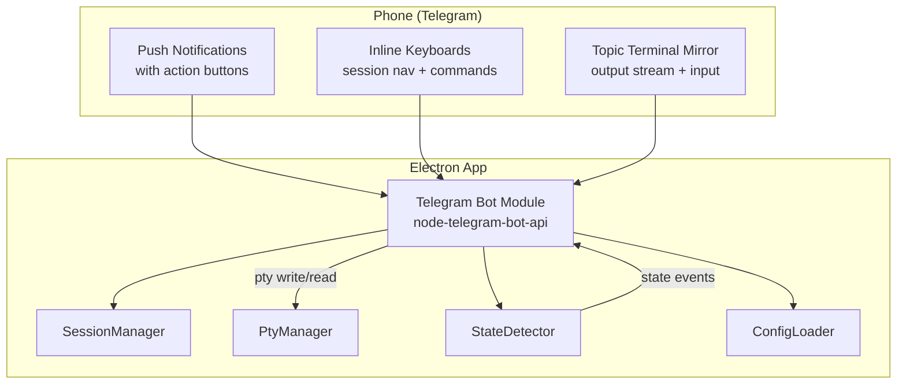
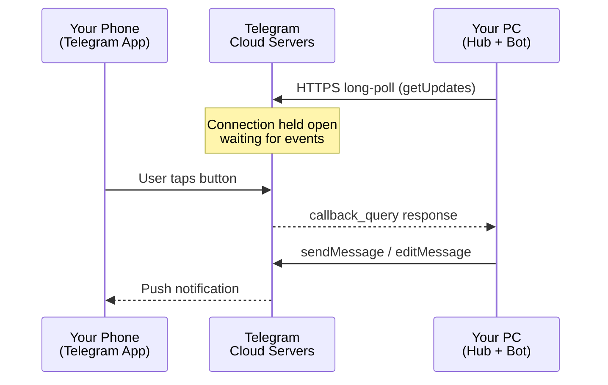
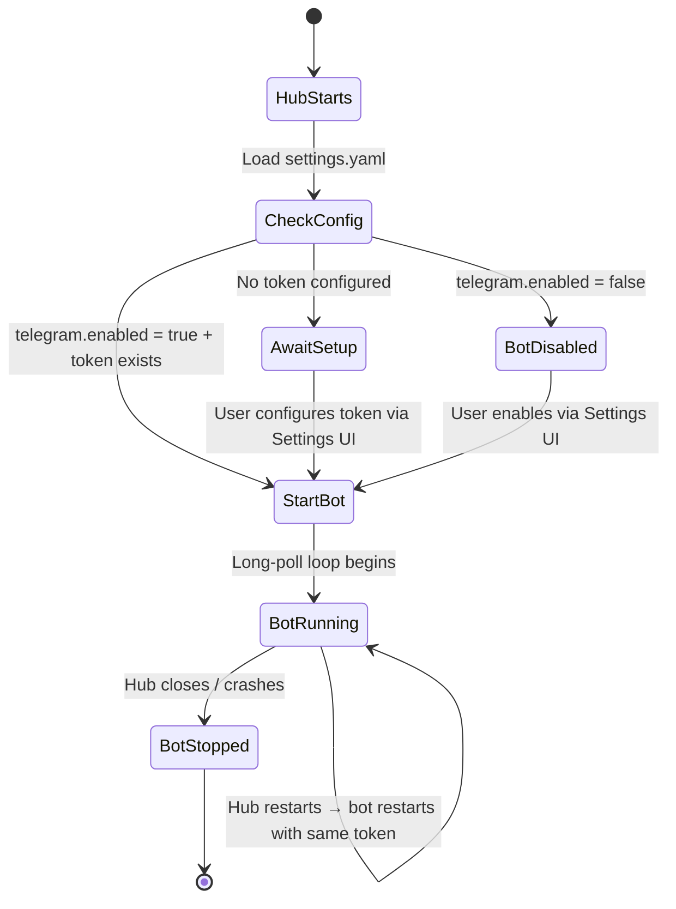
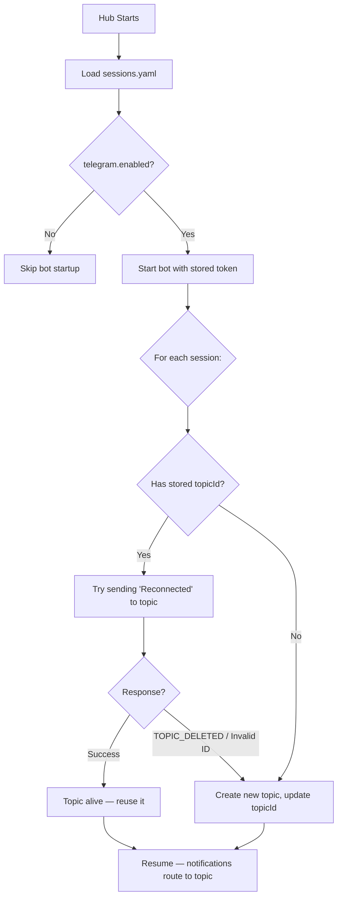
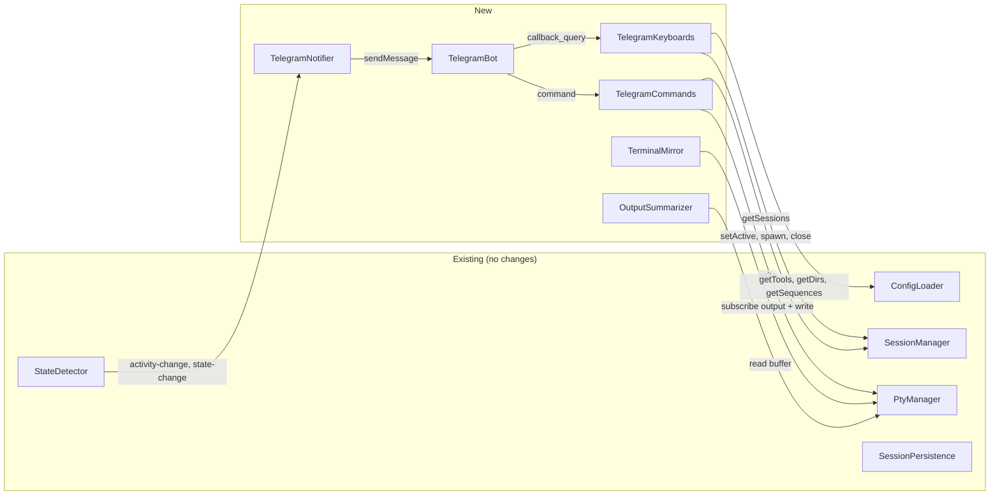

# Telegram Bot — Mobile Remote Control

> **Date:** 2026-04-04 · **Status:** 0% implemented · **Prerequisite status:** StateDetector ✅, SessionManager ✅, PtyManager ✅, PipelineQueue ✅

## Problem

Users running multiple AI CLI sessions want to monitor and control them from their phone — especially when away from the desk. Currently the only control surface is the Xbox gamepad + Electron desktop UI. Windows toast notifications fire on state changes but are not actionable (no reply/control from the notification).

**Core use case:** "Session completed → phone buzzes → tap Accept or send next prompt → pocket phone."

## Vision

A **Telegram bot** running inside the Electron main process that acts as a second controller — not a remote desktop. The bot provides **push notifications with action buttons**, **quick session controls** via inline keyboards, and **bidirectional terminal mirrors** in forum topics. Each session's topic streams PTY output as monospace code blocks and accepts typed input — no web server, no Mini App.



### Design Principles

1. **Telegram = notification center + quick actions.** Don't replicate the desktop UI.
2. **Terminal mirror in topics.** Each session's forum topic streams PTY output as monospace code blocks and accepts typed input. Buffer+edit pattern keeps topics clean (edit live message, freeze when full, start new).
3. **Notifications are the #1 value.** Design notification experience first, browsing second.
4. **Context-aware buttons.** Show Cancel/Accept only when implementing, Send only when idle.
5. **Destructive actions always require confirmation.** Phone-in-pocket protection.
6. **Latency-tolerant design.** 100-500ms per tap is expected — use optimistic UI, toast feedback, message edit queue.

---

## UX Specification

### Interaction Tiers

| Tier | Medium | Purpose | Latency |
|------|--------|---------|---------|
| Primary | Notifications | "Something happened, act now" | Push (instant) |
| Secondary | Inline keyboards | Session nav, commands, spawn | 300ms-1.5s per tap |
| Tertiary | Topic mirror | Full bidirectional terminal I/O | ~1.5s debounce |
| Power user | Slash commands | Quick typed commands | Instant |

### Flow 1: Notifications (P0 — Core Value)

The bot proactively messages the user when session state changes. Every notification includes **action buttons** so the user can respond without navigating.

**When to notify:**

| Event | Message | Priority |
|-------|---------|----------|
| implementing → completed | "🎉 Session Completed" + Accept/Continue/Output buttons | P0 |
| implementing → idle | "⏸ Session Idle" + Continue/Output buttons | P0 |
| implementing → error/waiting | "⚠️ Session Needs Attention" + error summary + actions | P0 |
| PTY crashed / session died | "💀 Session Crashed" + Respawn/Remove buttons | P1 |
| All sessions in a group completed | "✅ All Done" + summary | P1 |

**When NOT to notify:**
- Activity dot changes (active → inactive after 10s) — too noisy
- Session focus changes on desktop — user is using gamepad
- Config changes — irrelevant to mobile

**Rate limiting:** 15-second dedup per session (matches existing notification-manager), max 3 messages/minute across all sessions.

**Notification format:**
```
🎉 Session Completed

"refactor auth" in gamepad-cli-hub
Claude Code — finished after 4m 23s

[📋 View Output]  [🚀 Continue]
[💬 Send Prompt]  [📂 Sessions]
```

### Flow 2: Session List — Two-Tier Navigation (P0)

Sessions grouped by working directory (mirrors desktop grouping). Two levels to keep button counts manageable.

**Level 1 — Directory overview:**
```
📂 Your Sessions (7 active)

🟢 gamepad-cli-hub (3)
   🔨 2 implementing, 🎉 1 done
🔵 stillhere (2)
   ⏳ 2 waiting
⚪ homeassistant (2)
   💤 2 idle

[gpad-hub]  [stillhere]
[homeasst]  [➕ New]  [📊 Status]
```

**Level 2 — Sessions in directory (after tap):**
```
📂 gamepad-cli-hub

🔨 "refactor auth" — Claude
🔨 "fix tests" — Copilot
🎉 "update deps" — Claude

[refactor auth]  [fix tests]
[update deps]    [🔙 Back]
```

**Design rules:**
- Aggregate state summary per directory (greenest dot wins, counts by state)
- Max 15 chars per button label (Telegram truncation limit)
- Button order matches desktop sort (from `settings.yaml` sort prefs)
- Breadcrumb in header for orientation

### Flow 3: Active Session Controls (P1)

After selecting a session, show context-aware controls. Buttons change based on StateDetector state.

**Primary controls (3 rows, 2 buttons each):**
```
✅ Claude Code — gpad-hub
Session: "refactor auth"  🔨 Implementing

[✋ Cancel]   [✅ Accept]
[📋 Output]  [📤 Send]
[⚡ Commands] [🔙 Back]
```

**Context-aware button visibility:**

| State | Show | Hide |
|-------|------|------|
| Implementing | Cancel, Accept | Send |
| Idle / Waiting | Send | Cancel, Accept |
| Completed | Continue, Send | Cancel, Accept |
| Any | Output, Commands, Back | — |

**"⚡ Commands" sub-menu** (progressive disclosure, populated from profile `sequences` config):
```
⚡ Quick Commands

[/commit]   [/compact]
[/clear]    [/plan]
[/test]     [🔙 Back]
```

### Flow 4: Text Input (P1)

Free-text input to PTY requires a **confirmation step** (phone-in-pocket protection):

```
📤 Send to PTY

You typed: "git push origin main --force"

⚠️ This will be sent directly to the active terminal.

[✅ Send]  [❌ Cancel]
```

**Safe mode option** (configurable): When enabled, only allow sequence-list commands from config, block free-text entirely. Responsible default for unattended use.

### Flow 5: Terminal Mirror in Topics (P1)

Each forum topic doubles as a **bidirectional terminal mirror**. PTY output streams into the topic as monospace code blocks; user messages in the topic are forwarded to PTY stdin.

**Output streaming (buffer + edit pattern):**

```
┌─────────────────────────────────────────────┐
│ [Home] refactor auth                   📌   │
│─────────────────────────────────────────────│
│                                             │
│ 🤖 Gamepad Hub Bot                    14:23 │
│ ┌─────────────────────────────────────────┐ │
│ │```                                      │ │
│ │$ claude                                 │ │
│ │Claude Code v1.2.3                       │ │
│ │                                         │ │
│ │> Analyzing codebase...                  │ │
│ │> Found 12 files to refactor             │ │
│ │> Starting with src/auth/jwt.ts          │ │
│ │```                                      │ │
│ │ ✏️ Live — updated 2s ago                │ │
│ └─────────────────────────────────────────┘ │
│                                             │
│ 🤖 Gamepad Hub Bot                    14:24 │
│ ┌─────────────────────────────────────────┐ │
│ │```                                      │ │
│ │✅ All 47 tests passed                   │ │
│ │📁 Modified: src/auth/jwt.ts             │ │
│ │⏱ Duration: 23s                          │ │
│ │                                         │ │
│ │Ready for review. Shall I commit?        │ │
│ │```                                      │ │
│ │ 📋 Frozen — 3.4KB                       │ │
│ └─────────────────────────────────────────┘ │
│                                             │
│ 👤 You                                14:25 │
│ ┌─────────────────────────────────────────┐ │
│ │ yes, commit with message "refactor jwt" │ │
│ └─────────────────────────────────────────┘ │
│                                             │
│ [✅ Accept] [✋ Cancel] [⚡ Cmds] [📂 List]│
└─────────────────────────────────────────────┘
```

**How the buffer+edit pattern works:**

1. New PTY output arrives → strip ANSI codes → append to buffer
2. Debounce timer (1.5s) fires → edit the "live" message with current buffer content (wrapped in ``` code block)
3. Message footer shows "✏️ Live — updated Ns ago"
4. When buffer exceeds ~3500 chars → freeze message (footer changes to "📋 Frozen — X.XKB"), start new live message
5. Rate limit: max 20 edits/minute per topic. If exceeded, increase debounce dynamically

**Input forwarding:**

- User types a message in the topic → bot reads it
- **Safe mode ON**: Bot replies with confirmation ("Send this to PTY?") + ✅/❌ buttons
- **Safe mode OFF**: Message forwarded directly to PTY stdin via `ptyWrite()`
- Bot commands (starting with `/`) are NOT forwarded — handled as bot commands
- Empty messages and media are ignored

**Telegram API constraints:**

| Constraint | Limit | Mitigation |
|-----------|-------|------------|
| Message length | 4096 chars | Freeze at ~3500, start new message |
| No ANSI colors | Monospace only | Strip ANSI, use ``` code blocks |
| Rate limiting | ~30 msg/sec globally | 1.5s debounce, max 20 edits/min/topic |
| Message edit latency | 300ms-1s | Batch output, don't edit per-line |
| Rapid output (npm install) | Hundreds of lines/sec | Increase debounce under pressure, truncate middle lines with "... N lines omitted ..." |

### Flow 6: Spawn New Session (P2)

Wizard-style inline keyboards pulling from profile config:

```
Step 1: 🛠 Choose Tool
[Claude Code]  [Copilot CLI]  [Terminal]  [🔙 Cancel]

Step 2: 📂 Choose Directory
[gpad-hub]  [stillhere]  [homeassist]  [🔙 Back]

Step 3: ⏳ Spawning Claude Code in gamepad-cli-hub...
         ✅ Session "claude-abc123" started!
         [🎮 Go to Session]  [📂 Session List]
```

### Flow 7: Slash Commands (P3)

Power-user shortcuts via Telegram command autocomplete (registered via BotFather):

```
/status                     → Show all sessions with states
/switch <name>              → Switch active session
/send "<text>"              → Send text to active PTY (with confirm)
/close <name>               → Close session (with confirm)
/spawn <tool> <directory>   → Spawn new session
/output                     → Last 5 lines of active session
```

---

## Technical Architecture

### Network Architecture — How It Reaches Your Phone



The bot does **not** connect to your phone directly. It uses Telegram's cloud infrastructure as a relay:

1. **Bot initiates outbound connection** → `https://api.telegram.org/bot<TOKEN>/getUpdates`
2. **Telegram queues updates** for your bot (messages, button presses, callback queries)
3. **Long polling loop**: Bot asks "any new messages?" → Telegram waits with connection open → responds immediately when user interacts → bot processes, sends response

| Concern | Reality |
|---------|---------|
| LAN exposure | Not needed — bot calls OUT to Telegram cloud |
| Port forwarding | Not needed — no inbound connections |
| Static IP | Not needed — bot initiates all connections |
| Firewall | Just need outbound HTTPS (port 443) |
| Works remotely | Yes — hub at home, you anywhere with internet ✅ |


### Bot Lifecycle — Embedded in Hub Process

The bot is **not** a standalone service. It runs inside the Electron main process and follows the hub's lifecycle:



**Key behaviors:**
- Hub starts → bot starts (if enabled and token configured)
- Hub crashes → bot dies (no orphan processes)
- Hub restarts → bot reconnects using same token from `settings.yaml`
- Bot token persists across restarts — no re-authentication needed
- Telegram topics/messages persist on Telegram's servers regardless of bot uptime

### Forum Topics — Session-to-Topic Mapping

Each hub session maps to a dedicated **forum topic** thread in a Telegram supergroup. This provides per-session notification channels — no flat chat mode.

#### Bot API Capabilities (reality check)

| API Method | What it does | Available? |
|------------|-------------|------------|
| `createForumTopic` | Create new topic (name, icon color/emoji) | ✅ Yes |
| `editForumTopic` | Rename topic, change icon | ✅ Yes |
| `closeForumTopic` | Close topic (read-only) | ✅ Yes |
| `reopenForumTopic` | Reopen closed topic | ✅ Yes |
| `deleteForumTopic` | Permanently delete topic + all messages | ✅ Yes |
| `getForumTopicIconStickers` | List available emoji icons | ✅ Yes |
| `sendMessage` with `message_thread_id` | Send message to a specific topic | ✅ Yes |
| **`getForumTopics` / list topics** | **Enumerate existing topics** | ❌ **Not in Bot API** |
| **Query topic by ID** | **Check if topic exists** | ❌ **Not in Bot API** |
| **Search topics by name** | **Find topic by name** | ❌ **Not in Bot API** |

> ⚠️ **Key limitation:** The Bot API has **no way to list or query existing forum topics**. The only way to detect if a topic still exists is to attempt sending a message and catch `TOPIC_DELETED` or `Invalid message thread ID` errors. This means `topicId` stored in `sessions.yaml` is the **sole mapping mechanism** — there is no name-based topic discovery.

**Events the bot DOES receive:**
- `forum_topic_created` — service message when a topic is created (by anyone)
- `forum_topic_closed` — service message when a topic is closed
- `forum_topic_reopened` — service message when a topic is reopened

#### Restart Flow (accounting for API limitations)



> **No name-based fallback.** Unlike the earlier draft, the bot cannot scan existing topics to find matches. If `topicId` is missing from sessions.yaml (e.g. first run, or manual yaml edit), the bot always creates a new topic. This is simpler and more reliable.

#### Session Persistence Changes

`topicId` stored in `sessions.yaml`:

```yaml
# config/sessions.yaml
sessions:
  - id: abc-123
    name: "refactor auth"
    topicId: 123            # ← NEW: Telegram forum topic ID
    cliType: "claude-code"
    workingDir: "X:/coding/gamepad-cli-hub"
    pid: 12345
```

**Topic naming convention:** `[InstanceName] session-name` (e.g. `[Home] refactor auth`). Instance name configured in `settings.yaml` to distinguish multiple hubs sharing the same Telegram group.

#### Edge Cases

| Scenario | Behavior |
|----------|----------|
| Topic manually deleted in Telegram | Bot gets `TOPIC_DELETED` on next send → creates new topic, updates `topicId` |
| Session removed in hub | Bot calls `closeForumTopic` → topic becomes read-only archive |
| Hub restart, sessions.yaml intact | Bot sends probe to stored `topicId` → reuses if alive, recreates if deleted |
| Hub restart, sessions.yaml lost | All `topicId` mappings lost → bot creates fresh topics (old ones become orphans) |
| Duplicate session names | No conflict — mapping is by `topicId` (integer), not by name |
| Topic closed by user in Telegram | Bot calls `reopenForumTopic` before sending, or creates new topic |

### New Modules

| Module | File | Responsibility |
|--------|------|---------------|
| **TelegramBot** | `src/telegram/bot.ts` | Bot lifecycle, callback query routing, message edit queue, user-ID whitelist auth |
| **TelegramNotifier** | `src/telegram/notifier.ts` | Listens to StateDetector events, formats + sends notification messages with inline keyboards |
| **TelegramKeyboards** | `src/telegram/keyboards.ts` | Inline keyboard layout builders (session list, controls, commands, spawn wizard) |
| **TelegramCommands** | `src/telegram/commands.ts` | Slash command handlers (/status, /switch, /send, etc.) |
| **TelegramTerminalMirror** | `src/telegram/terminal-mirror.ts` | Bidirectional topic↔PTY bridge: buffer+edit output streaming, ANSI stripping, input forwarding, rate limiting |
| **OutputSummarizer** | `src/telegram/output-summarizer.ts` | Parses PTY buffer into 3-5 line smart summaries |

### Integration Points



### Config Changes

New section in `settings.yaml`:

```yaml
# settings.yaml
telegram:
  enabled: false
  botToken: ""              # From BotFather
  instanceName: "Home"      # Prefix for topic names, identifies this hub
  chatId: null              # Target supergroup ID (set during setup)
  allowedUserIds: []        # Whitelist of Telegram user IDs
  safeModeDefault: true     # Block free-text input by default
  notifyOnComplete: true
  notifyOnIdle: true
  notifyOnError: true
  notifyOnCrash: true
```

New field in `sessions.yaml` per session:

```yaml
# sessions.yaml — new field per session
sessions:
  - id: abc-123
    topicId: 123            # Telegram forum topic ID
    # ... existing fields ...
```

### Security Model

1. **Bot token** stored in `settings.yaml` (not committed to git — already in `.gitignore`)
2. **User-ID whitelist** — only allowed Telegram user IDs can interact with the bot
3. **Messages are NOT end-to-end encrypted** (Telegram servers can read them) — acceptable risk for gamepad commands, but warn user in setup
4. **Free-text confirmation step** prevents accidental command injection
5. **Safe mode** disables free-text entirely (only config-defined sequences)
6. **Topic isolation** — each session has its own forum topic; bot only processes messages from allowed user IDs within the correct topic
7. **No port forwarding needed** — bot uses outbound long-polling to Telegram cloud
8. **No exposed ports** — all communication via Telegram's cloud API. No web server, no open ports, no tunnel needed

### Dependencies

| Package | Purpose | Size |
|---------|---------|------|
| `node-telegram-bot-api` | Telegram Bot API client | ~50KB |

All phases require only `node-telegram-bot-api`. No additional server dependencies needed — terminal output streams natively through Telegram's message API.

---

## UX Risk Mitigations

### Latency (300ms-1.5s per tap)

- Call `answerCallbackQuery()` immediately with toast ("Switching...", "Sending...")
- Optimistic UI: edit message text before confirming action succeeded
- Show "⏳ Working..." intermediate states for multi-step operations
- Batch information: show maximum data per message to minimize taps

### Message Edit Conflicts

- Message edit queue with 500ms debounce — never fire two edits within 500ms
- Version counter in `callback_data` (e.g. `v3:sess:abc:accept`) to detect stale callbacks
- Silently drop stale callbacks with `answerCallbackQuery({ text: "Refreshing..." })`

### Accidental Actions (phone in pocket)

- Destructive actions (Close, Cancel) always require 2-tap confirmation
- Destructive buttons in secondary menu, never on primary controls
- Safe mode blocks free-text by default

### Stale State

- Timestamp in message header: "Updated 2m ago"
- Every button tap refreshes state before presenting new view
- Proactive push: bot edits pinned status message on state changes

---

## Implementation Phases

### Phase 0 — Notifications + Session List (Low effort)

**Goal:** "Session completed → phone buzzes → tap to see sessions."

| Task | Description |
|------|-------------|
| `telegram-bot-core` | Bot lifecycle (start/stop), long-polling, user-ID whitelist, message edit queue |
| `telegram-topic-manager` | Forum topic lifecycle: create on session spawn, probe on restart, recreate on `TOPIC_DELETED`, close on session remove. Stores `topicId` in sessions.yaml |
| `telegram-notifier` | Subscribe to StateDetector events, format + send notifications with inline action buttons. Routes to per-session topics via `message_thread_id` |
| `telegram-session-list` | Two-tier inline keyboard (directory groups → sessions), tap to switch active session |
| `telegram-config` | Settings UI tab for Telegram config (token, instance name, user IDs, notification prefs). See [Hub Config mockup](mockups.html#flow-hub-config) |
| `telegram-ipc` | IPC handlers for Telegram settings CRUD, bot start/stop |
| `telegram-tests-p0` | Unit tests for bot, notifier, session list keyboards, config |

**Dependencies:** `node-telegram-bot-api`

### Phase 1 — Session Controls + Output Summary (Medium effort)

**Goal:** "Tap Accept, send a command, see what happened — all from phone."

| Task | Description |
|------|-------------|
| `telegram-session-controls` | Context-aware control keyboards (Cancel/Accept/Send/Continue based on state) |
| `telegram-command-palette` | "⚡ Commands" sub-menu populated from profile sequences config |
| `telegram-text-input` | Free-text input with confirmation step, safe mode toggle |
| `telegram-output-summary` | Parse PTY buffer into 3-5 line smart summary (test results, files modified, errors) |
| `telegram-slash-commands` | /status, /switch, /send, /close, /spawn, /output |
| `telegram-tests-p1` | Unit tests for controls, text input, output summarizer, slash commands |

### Phase 2 — Terminal Mirror + Spawn (Medium effort)

**Goal:** "Full bidirectional terminal I/O in each topic, plus remote spawn."

| Task | Description |
|------|-------------|
| `telegram-terminal-mirror` | Buffer+edit output streaming: ANSI strip, 1.5s debounce, freeze at 3500 chars, rate limiting (20 edits/min/topic) |
| `telegram-topic-input` | Input forwarding: user messages in topic → PTY stdin. Safe mode confirmation. Command filtering (ignore `/` prefixed) |
| `telegram-backpressure` | Dynamic debounce under high output load, middle-line truncation ("... N lines omitted ..."), output pause/resume |
| `telegram-spawn-wizard` | Tool → directory → spawn wizard via inline keyboards, creates new topic for spawned session |
| `telegram-tests-p2` | Unit tests for terminal mirror, input forwarding, backpressure, spawn wizard |

**Dependencies:** None beyond P0's `node-telegram-bot-api`

### Phase 3 — Polish (Low effort)

**Goal:** "Power-user speed and persistent controls."

| Task | Description |
|------|-------------|
| `telegram-reply-keyboard` | Persistent reply keyboard for most-used actions |
| `telegram-pinned-dashboard` | Auto-updating pinned message with all-sessions status |
| `telegram-voice-stt` | Voice message → Whisper API → text → PTY (experimental) |
| `telegram-tests-p3` | Unit tests for reply keyboard, pinned dashboard |

---

## Open Questions

1. **Output truncation strategy?** When a session produces massive output (e.g. `npm install`, build logs), should the mirror truncate middle lines ("... 847 lines omitted ...") or split across many messages? Truncation is cleaner but loses history. Splitting preserves everything but floods the topic. Leaning toward truncation with a `/full` command to dump recent buffer.
2. **Bot token storage?** Currently proposed in `settings.yaml` (already in `.gitignore`). Alternative: OS keychain via `keytar` package. Tradeoff: keytar adds native dependency complexity vs. plain-text token in a local config file. Leaning toward `settings.yaml` for simplicity — the token only grants bot API access, not user account access.
3. **Multi-user?** Current design is single-user (whitelist). Phase 0 implements user-ID whitelist. Multi-user with permission levels (admin vs. viewer) could be a P3 extension.
4. **Notification sound?** Telegram allows silent messages (`disable_notification: true`). Default to noisy for completion/error (actionable), silent for idle (informational). Make configurable per-event-type in settings.
5. **Instance name collisions?**When multiple hubs share a Telegram group, instance names must be unique. Should the bot validate uniqueness on startup, or trust the user? Leaning toward trust + warning if duplicate `[InstanceName]` prefix found in existing topics.
