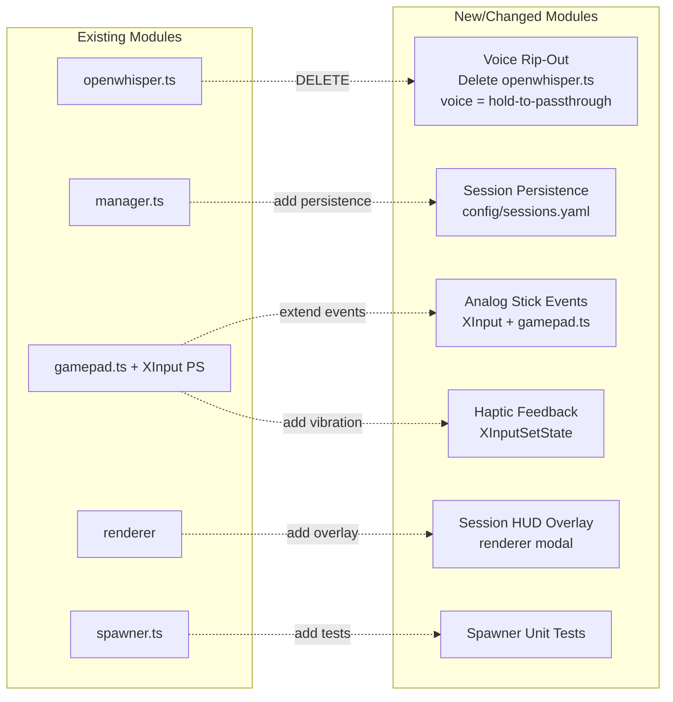
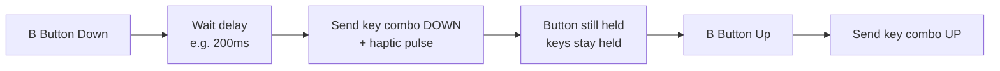
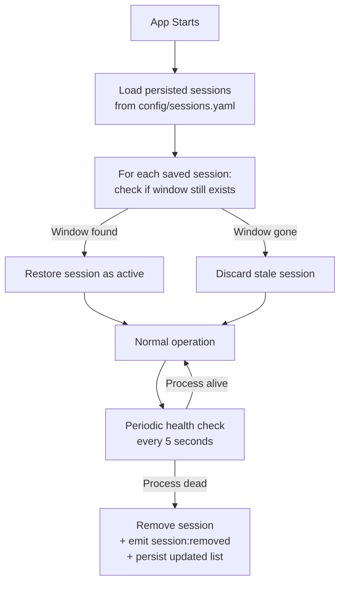
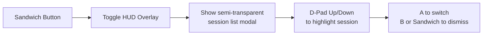
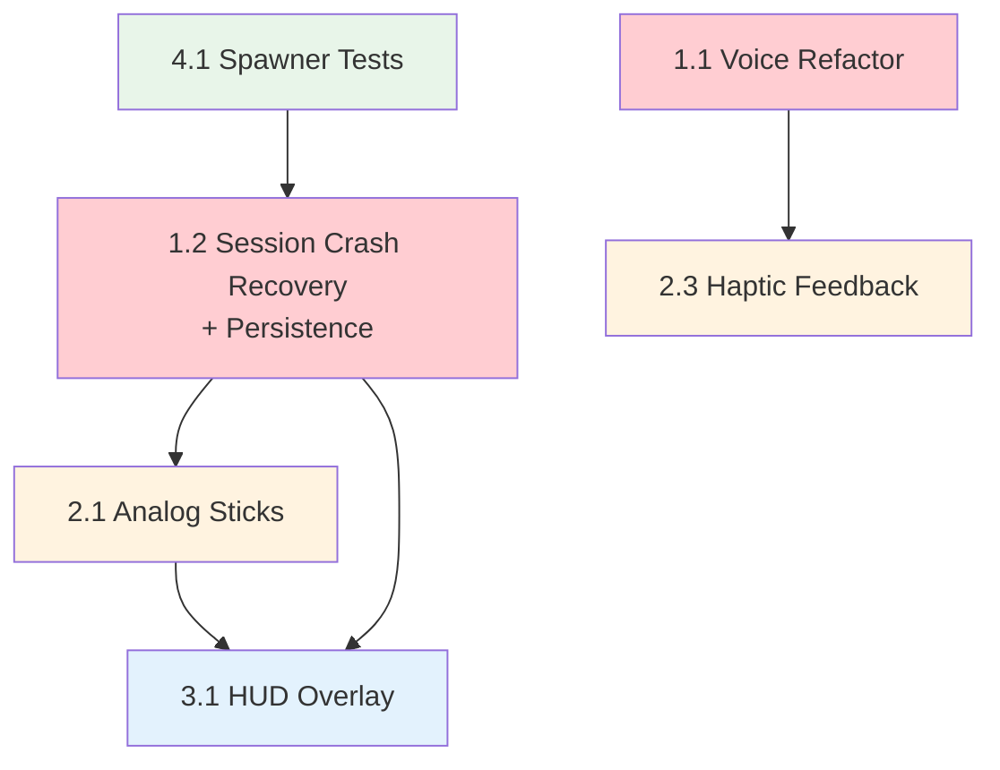

# Feature Gaps Implementation Plan

> **Created:** 2026-03-23
> **Status:** Draft — awaiting approval
> **Scope:** P0 critical fixes, P1 high-value features, P2 differentiators, and test coverage

---

## Problem Statement

The gamepad-cli-hub MVP is ~70% feature-complete. The entire `src/voice/` module is dead weight that needs ripping out, sessions are ephemeral, analog sticks are read but discarded, and key differentiating features (HUD overlay, haptic feedback) are missing. This plan addresses all gaps identified in the market assessment.

---

## Architecture Impact



---

## Implementation Phases

### Phase 1 — P0: Critical Fixes

#### 1.1 Voice Rip-Out & Hold-to-Passthrough

**Problem:** `src/voice/openwhisper.ts` contains 250+ lines of broken audio recording scaffolding (FFmpeg, Sox, PowerShell, whisper.cpp). None of it works in production. The app has no business recording audio — the target CLI app (Claude Code, OpenWhisper, etc.) handles voice natively.

**Solution:** Delete the entire `src/voice/` directory. Replace the `voice` and `openwhisper` binding action types with a single **`hold-key`** action type — a configurable hold-to-passthrough that:

1. Gamepad button pressed → start delay timer
2. After configurable delay (e.g. 200ms) → send modifier+key combo **DOWN** on the keyboard
3. Haptic pulse on activation (ties into Phase 2.3)
4. Gamepad button released → send modifier+key combo **UP** on the keyboard
5. The OS / target app handles the rest (Claude Code listens for Space hold, OpenWhisper listens for Ctrl+Alt, etc.)



The key combo is **configurable per binding** in the profile YAML:

```yaml
# config/profiles/default.yaml
cliTypes:
  claude-code:
    B:
      action: hold-key
      keys: [space]           # Claude Code voice = hold Space
      delay: 200
  copilot-cli:
    B:
      action: hold-key
      keys: [ctrl, alt]       # OpenWhisper = hold Ctrl+Alt
      delay: 200
```

**Changes:**
- **DELETE `src/voice/openwhisper.ts`** and **`src/voice/index.ts`** — rip it all out
- **`src/config/loader.ts`**: Remove `openwhisper` config type. Add `hold-key` action type with `keys` and `delay` fields.
- **`config/tools.yaml`**: Remove `openwhisper` section entirely
- **`config/profiles/default.yaml`**: Replace `voice` / `openwhisper` B-button bindings with `hold-key` action
- **`src/output/keyboard.ts`**: Add `keyDown(key)` and `keyUp(key)` methods (robotjs supports this)
- **`src/electron/ipc/handlers.ts`**: Remove openwhisper handler references. Add `hold-key` action handling (keyDown on press, keyUp on release).
- **Remove OpenWhisper imports** from `src/index.ts` and any IPC handlers

**Files touched:**
- `src/voice/openwhisper.ts` (**DELETE**)
- `src/voice/index.ts` (**DELETE**)
- `src/output/keyboard.ts` (add keyDown/keyUp)
- `src/config/loader.ts` (remove openwhisper config, add hold-key action type)
- `config/tools.yaml` (remove openwhisper section)
- `config/profiles/default.yaml` (update B bindings)
- `src/index.ts` (remove openwhisper imports)
- `src/electron/ipc/handlers.ts` (remove openwhisper refs, add hold-key)

---

#### 1.2 Session Crash Recovery & Auto-Discovery

**Problem:** Spawned processes that die leave ghost sessions. On restart, all sessions are lost. No way to rediscover existing terminal windows.

**Solution:**



**Changes:**
- **New `src/session/persistence.ts`**: `saveSessions()` / `loadSessions()` using YAML to `config/sessions.yaml`
- **`src/session/manager.ts`**: 
  - Call `saveSessions()` after every add/remove/change
  - New `restoreSessions()` method on startup — loads saved sessions, validates each window still exists via WindowManager
  - New `startHealthCheck(intervalMs)` — periodic scan that removes dead sessions
- **`src/session/spawner.ts`**: On process `exit` event, notify SessionManager to remove the session (currently only deletes from its own Map)

**Files touched:**
- `src/session/persistence.ts` (new)
- `src/session/manager.ts` (add persistence + health check)
- `src/session/spawner.ts` (notify SessionManager on exit)
- `config/sessions.yaml` (new, auto-generated)

---

### Phase 2 — P1: High-Value Features

#### 2.1 Analog Stick Exposure (Left = Cursor, Right = Scroll)

**Problem:** XInput PowerShell script reads `sThumbLX/LY` and `sThumbRX/RY` but only uses left stick for D-pad emulation. Right stick values are discarded entirely.

**Solution:**

| Stick | Direction | Action |
|-------|-----------|--------|
| Left Up | ↑ | Cursor Up key |
| Left Down | ↓ | Cursor Down key |
| Left Left | ← | Cursor Left key |
| Left Right | → | Cursor Right key |
| Right Up | ↑ | Scroll Up (Page Up or mouse wheel) |
| Right Down | ↓ | Scroll Down (Page Down or mouse wheel) |
| Right Left | ← | Scroll Left |
| Right Right | → | Scroll Right |

**Changes:**
- **XInput PowerShell script** (inline in `gamepad.ts`): Emit new `analog` event type with raw stick values
- **`src/input/gamepad.ts`**: 
  - New `AnalogEvent` interface: `{ stick: 'left' | 'right', x: number, y: number }`
  - New `analog` event emission in `processEvent()`
  - Configurable deadzone (default 8000/32767)
- **`src/electron/ipc/handlers.ts`** or action handler: Map analog events to keyboard/scroll actions based on bindings
- **`config/profiles/default.yaml`**: Add stick bindings:
  ```yaml
  sticks:
    left:
      mode: cursor    # sends arrow keys
      deadzone: 0.25
    right:
      mode: scroll    # sends Page Up/Down or mouse wheel
      deadzone: 0.25
  ```

**Files touched:**
- `src/input/gamepad.ts` (extend event types + processing)
- `src/config/loader.ts` (add stick config types)
- `config/profiles/default.yaml` (add stick bindings)
- `renderer/gamepad.ts` (forward analog events via IPC)

---

#### 2.2 Session Persistence

Covered in Phase 1.2 above — the persistence module handles both crash recovery AND restart survival.

---

#### 2.3 Haptic/Vibration Feedback

**Problem:** No physical feedback from the controller. XInputSetState is never called.

**Solution:** Add optional vibration on key events. Configurable via checkbox in Settings.

**Vibration triggers:**
| Event | Pattern |
|-------|---------|
| Hold-key activation | Short pulse (200ms, 50% intensity) |
| Hold-key release | Double pulse (100ms on, 50ms off, 100ms on) |
| Session switch | Quick tap (100ms, 30% intensity) |
| Error | Long rumble (500ms, 100% intensity) |

**Changes:**
- **XInput PowerShell script**: Add `XInputSetState` P/Invoke call. Accept vibration commands via stdin.
- **`src/input/gamepad.ts`**: New `vibrate(leftMotor, rightMotor, durationMs)` method
- **`config/tools.yaml`** or settings: `hapticFeedback: true/false` checkbox
- **Settings UI**: Add toggle in Status or Global tab

**Files touched:**
- `src/input/gamepad.ts` (add vibrate method + XInputSetState in PS script)
- `src/config/loader.ts` (add hapticFeedback setting)
- `config/settings.yaml` (add hapticFeedback field)
- `renderer/settings.ts` (add checkbox)

---

### Phase 3 — P2: Differentiating Features

#### 3.1 Session HUD Overlay

**Problem:** To switch sessions, user must navigate to the Sessions screen. No quick-glance view while working in a terminal.

**Solution:** Transparent overlay shown when Sandwich (Guide/Xbox) button is pressed, displaying session list over the current terminal window.



**Design:**
- Reuse existing renderer modal pattern (`.modal-overlay` + `.modal`)
- Semi-transparent dark background
- List of sessions with active session highlighted
- Gamepad navigable (D-Pad + A/B)
- Auto-dismiss after switch or B press

**Changes:**
- **`renderer/index.html`**: Add `#sessionHudOverlay` modal div
- **New `renderer/hud-overlay.ts`**: Toggle logic, session list rendering, gamepad navigation within overlay
- **`renderer/navigation.ts`**: Handle Sandwich button → toggle HUD
- **`renderer/styles/main.css`**: HUD overlay styling (semi-transparent, floating)

**Files touched:**
- `renderer/index.html` (add overlay HTML)
- `renderer/hud-overlay.ts` (new)
- `renderer/navigation.ts` (add Sandwich handler)
- `renderer/styles/main.css` (overlay styles)

---

### Phase 4 — Test Coverage

#### 4.1 ProcessSpawner Unit Tests

**Problem:** ProcessSpawner has zero test coverage. It's the bridge between user actions and external processes.

**Test plan:**

| Test Case | Description |
|-----------|-------------|
| `spawn returns SpawnedProcess on success` | Mock spawn + configLoader; verify return shape |
| `spawn returns null when no config found` | configLoader returns undefined |
| `spawn passes working directory` | Verify cwd option passed to child_process.spawn |
| `spawn tracks process in Map` | After spawn, getAllProcesses includes it |
| `spawn removes process on exit` | Simulate exit event; verify process removed from Map |
| `spawn removes process on error` | Simulate error event; verify process removed from Map |
| `spawn uses shell: true` | Verify spawn options include shell: true |
| `spawn unrefs process` | Verify unref() called on child process |
| `getProcess returns correct process by PID` | Add process, retrieve by PID |
| `getProcess returns undefined for unknown PID` | Query non-existent PID |
| `getProcessesByCliType filters correctly` | Spawn multiple types, filter by one |
| `kill returns true for tracked process` | Kill a spawned process |
| `kill returns false for unknown PID` | Try to kill non-existent |
| `killAll kills all and clears Map` | Spawn multiple, killAll, verify empty |

**Mocking strategy:**
- `vi.mock('node:child_process')` — return fake ChildProcess with EventEmitter
- `vi.mock('../config/loader.js')` — return controlled SpawnConfig
- `vi.mock('../utils/logger.js')` — suppress logging

**File:** `tests/spawner.test.ts`

---

## Dependency Order



**Recommended execution order:**
1. **4.1 Spawner Tests** — adds safety net before modifying spawner
2. **1.1 Voice Rip-Out** — delete src/voice/, add hold-key action
3. **1.2 Session Crash Recovery + Persistence** — foundational for HUD
4. **2.1 Analog Sticks** — extends input surface
5. **2.3 Haptic Feedback** — polish
6. **3.1 HUD Overlay** — depends on session persistence + analog sticks for navigation

---

## Files Changed Summary

| File | Phase | Change Type |
|------|-------|-------------|
| `tests/spawner.test.ts` | 4.1 | **New** |
| `src/voice/openwhisper.ts` | 1.1 | **DELETE** |
| `src/voice/index.ts` | 1.1 | **DELETE** |
| `src/output/keyboard.ts` | 1.1 | Extend (keyDown/keyUp) |
| `src/config/loader.ts` | 1.1, 2.1, 2.3 | Extend |
| `config/tools.yaml` | 1.1 | Update (remove openwhisper) |
| `src/session/persistence.ts` | 1.2 | **New** |
| `src/session/manager.ts` | 1.2 | Extend |
| `src/session/spawner.ts` | 1.2 | Extend |
| `config/sessions.yaml` | 1.2 | **New** (auto-generated) |
| `src/input/gamepad.ts` | 2.1, 2.3 | Extend |
| `config/profiles/default.yaml` | 2.1 | Update |
| `renderer/gamepad.ts` | 2.1 | Extend |
| `config/settings.yaml` | 2.3 | Update |
| `renderer/settings.ts` | 2.3 | Extend |
| `renderer/index.html` | 3.1 | Extend |
| `renderer/hud-overlay.ts` | 3.1 | **New** |
| `renderer/navigation.ts` | 3.1 | Extend |
| `renderer/styles/main.css` | 3.1 | Extend |

**New files: 3** | **Modified files: 14**
