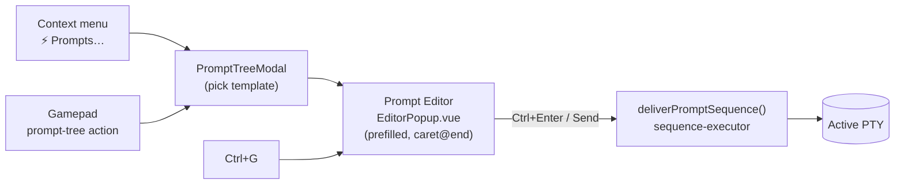
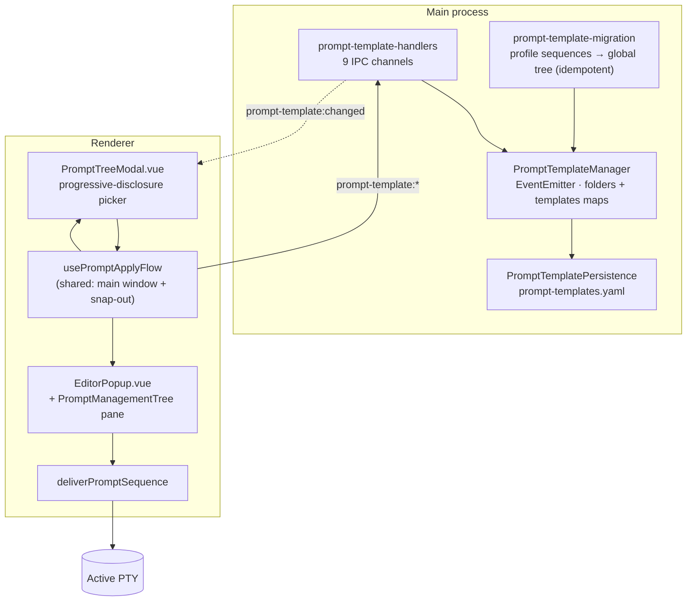

# Prompt Templates (global nested library)

A single **global** tree of folders and template leaves, replacing the old per-CLI
`sequences` groups. Picking a template never sends it — it opens the Prompt Editor
prefilled, so the user always gets a chance to amend before delivery.

## Why this exists

The predecessor was a flat list of "sequences" defined **per CLI type**, inside each
profile. Three things were wrong with that:

1. **Wrong scope.** A useful prompt ("summarise what changed and why") is about the
   work, not about which CLI binary is running. Duplicating it per CLI type — and
   again per profile — meant editing it in N places or letting the copies drift.
2. **No structure.** A flat list does not survive growth. Arbitrary folder nesting
   lets the library be organised by topic, project or phase.
3. **Fire-and-forget was dangerous.** The old picker sent the sequence straight to
   the PTY. A template is a *starting point* — the useful version almost always needs
   a filename, a branch, a constraint added. Sending on pick meant either
   over-generic templates or a wrong prompt already delivered.

So: **global** library, **nested** tree, and **pick → edit → send** as the only path.

## Flow



## Data model

```
PromptFolder   { id, name, parentId: string | null, order }
PromptTemplate { id, name, body, parentId: string | null, order }
PromptNode = PromptFolder | PromptTemplate
```

- `parentId: null` means root level. Folders nest arbitrarily; **templates are always
  leaves** — a node with a `body` cannot contain children (`isFolder()` is exactly
  `'body' in node === false`).
- `order` determines sibling display order and is assigned by `nextOrder(parentId)`.
- `body` is still **sequence syntax** — `{Enter}`, `{Wait 500}`, `{Ctrl+C}`, plain
  text — and is delivered through the unchanged `deliverPromptSequence()` /
  `sequence-executor` path. Nothing about the delivery mechanism changed; only where
  the text comes from and who gets to edit it first.

`PromptTemplateManager` keeps two `Map`s (folders, templates) and emits
`prompt-template:changed` on every successful mutation. Creating under a non-existent
`parentId` throws rather than silently rooting the node.

## Architecture



## Persistence

| Aspect | Detail |
|---|---|
| Runtime file | `%APPDATA%/Helm/config/prompt-templates.yaml` — **global, not per-profile** |
| Seed stub | `src/config/prompt-templates.yaml` (copied on first launch by `seedConfigIfNeeded`) |
| Migration input | Per-profile `sequences` groups — read-only, the same pattern as the old `plans.yaml` |

**Migration** (`prompt-template-migration.ts` → `migrateSequencesToTemplates`) runs
once at startup, *after* config seeding so the seeded profiles exist. It is
**idempotent**: it no-ops (returning 0/0) once the global file already holds migrated
content, so repeated boots never duplicate the library. The config directory is an
injectable parameter for tests.

## IPC channels

Registered by `src/electron/ipc/prompt-template-handlers.ts`:

| Channel | Purpose |
|---|---|
| `prompt-template:list` | Whole tree (`manager.getTree()`) |
| `prompt-template:getNode(id)` | One node — used to fetch a picked template's `body` |
| `prompt-template:createFolder(name, parentId?)` | New folder |
| `prompt-template:createTemplate(name, body, parentId?)` | New leaf |
| `prompt-template:update(id, changes)` | Edit name and/or body |
| `prompt-template:rename(id, name)` | Rename folder or template |
| `prompt-template:delete(ids)` | Delete (accepts a list) |
| `prompt-template:move(id, newParentId?)` | Reparent |
| `prompt-template:reorder(id, newOrder)` | Reposition among siblings |

## The apply flow

Centralised in `renderer/composables/usePromptApplyFlow.ts` so the **main window and
the snap-out (popout) window share one code path** — a second copy would drift.

1. `openPromptPicker()` → `showPromptTree(onSelect)`.
2. On pick, `openEditorForTemplate(templateId)` fetches the node via
   `promptTemplateGetNode` and reads its `body`. **If the IPC fails, the editor opens
   empty rather than aborting** — losing the prefill is better than losing the
   gesture.
3. `showEditorPopup(send, body, templateId, hasPrefill = true)`. The `hasPrefill`
   flag exists because the body is an *explicit* prefill and must override any saved
   Ctrl+G draft — **even when the body is `''`** (empty template, or a failed
   lookup); without the flag an empty string would be indistinguishable from "no
   prefill" and the stale draft would win.
4. Only **Ctrl+Enter / Send** calls `deliverPromptSequence(sessionId, text)`.
5. `handlePromptTreeSelect` captures the registered callback **before** calling
   `hidePromptTree()`, because hiding clears it.

## Picker UI (`PromptTreeModal.vue`)

Progressive disclosure — the tree is flattened to a **visible-nodes list** derived
from an `expandedFolders` set, so navigation only ever walks what is on screen.

| Input | Effect |
|---|---|
| D-pad / arrow Up-Down | Cycle visible nodes |
| Right | Expand folder |
| Left | Collapse folder (selection stays on the collapsed folder) |
| A | Template → select; folder → toggle |
| B | Cancel |
| `1-9`, `0`, then `a-z` | Accelerator indexing the visible nodes |

Root-level folders auto-expand on open, so a small library needs no expanding at all.

## Editor UI (`EditorPopup.vue`)

A multi-line textarea with:

- a **recent-prompts** history list,
- a **`PromptManagementTree`** left pane — the library itself, for browsing and CRUD
  without leaving the editor,
- caret placed at the **end** of the prefilled body (the common case is appending
  specifics to a generic opener).

Entry points: context menu **"⚡ Prompts…"**, the **`prompt-tree`** gamepad action
(renamed from `sequence-list`), and **Ctrl+G** (opens the editor directly, no
picker). Ctrl+G is blocked during modal overlays, the draft editor, and the plan
screen.

## Key modules

| File | Role |
|------|------|
| `src/session/prompt-template-types.ts` | `PromptFolder`, `PromptTemplate`, `PromptNode`, `isFolder` |
| `src/session/prompt-template-manager.ts` | Tree manager (EventEmitter), folder/template CRUD, move/reorder |
| `src/session/prompt-template-persistence.ts` | YAML load/save + `migrateSequencesToTemplates` |
| `src/session/prompt-template-migration.ts` | Startup migration wrapper (idempotent, injectable config dir) |
| `src/electron/ipc/prompt-template-handlers.ts` | 9 IPC channels |
| `renderer/composables/usePromptApplyFlow.ts` | The single apply path (main + snap-out) |
| `renderer/components/modals/PromptTreeModal.vue` | Picker |
| `renderer/components/modals/EditorPopup.vue` | Prompt Editor |
| `renderer/components/panels/PromptManagementTree.vue` | Library pane inside the editor |
| `renderer/editor/editor-popup.ts` | `showEditorPopup` bridge |
| `renderer/sequence-delivery.ts` | `deliverPromptSequence` |
| `src/input/sequence-parser.ts`, `src/input/sequence-executor.ts` | Unchanged sequence syntax → PTY bytes |

## Removed in PT-7

The legacy `SequencePicker` modal, the `sequence-list` gamepad action, and the
per-CLI sequence settings UI were all removed.

> Note: `renderer/components/panels/SequencePanel.vue` is **unrelated** — it edits
> *plan sequences* (`PlanSequence`, part of Directory Plans), not prompt templates.
> The template library's management surface is `PromptManagementTree.vue`.

## Distinct from

- **Drafts** — per-session, one-off memos. Templates are global and reusable.
- **Initial prompts** — profile config that fires automatically on spawn.
- **Pattern Matcher `send-text`** — automatic, output-triggered sends with no human
  in the loop.
